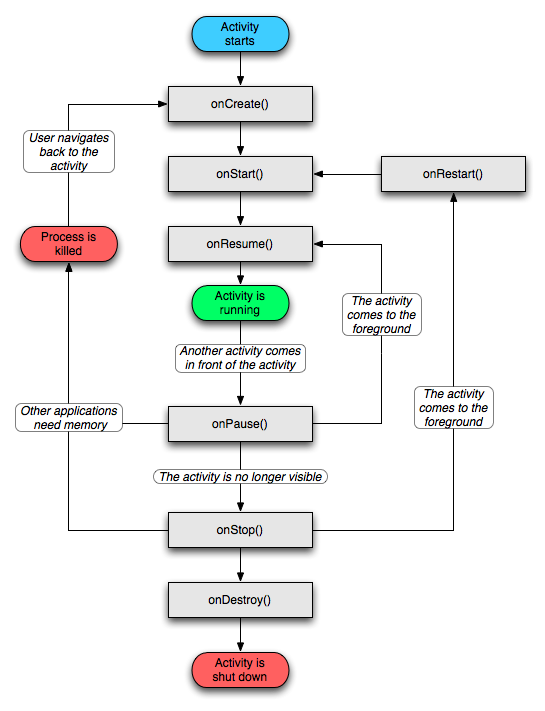

Activity生命周期

Activity生命周期

可见原则是优先把目标 activity 尽快展示出来，等目标 activity 展现出来后，再在后台执行自身的 onStop，或者以及 onDestroy。而并不是先执行完自己的 onStop/onDestroy 再去执行目标 activity 的 onCreate/onRestart。

常见操作	回调步骤
跳转	FirstActivity：onPause()
SecondActivity： → onCreate() → onStart() → onResume
FirstActivity: → onStop()
返回键	OnPause() → onStop() → onDestory()
Home键	onPause → onSaveInstanceState() → onStop()
再启动	onRestart() → onStart() → onResume
横竖屏	销毁重建。即onPause → onDestory → onCreate → onResume。
网上有说横 → 竖：会执行两次。
我用vivoX6Plus-Android5.1.1测试，只会执行一次流程。
不同手机、Android版本应该有不同的回调方式。
锁屏	onPause → onSaveInstanceState → onStop()
再启动	onRestart() → onStart() → onResume
补充
当前Activity产生事件弹出Toast和AlertDialog的时候Activity的生命周期不会有改变
Activity运行时按下HOME键(跟被完全覆盖是一样的)：onSaveInstanceState -->
onPause --> onStop onRestart -->onStart--->onResume
Activity未被完全覆盖只是失去焦点：onPause--->onResume

面试相关问题：
1、屏幕横竖屏切换时的生命周期变化
1）启动Activity
onCreate -->
onStart -->
onResume

2）切换为横屏
onSaveInstanceState -->
onPause -->
onStop -->
onDestroy-->
onCreate -->
onStart -->
onRestoreInstanceState -->
onResume

3）再次切换为竖屏，执行了两次
onSaveInstanceState-->
onPause-->
onStop-->
onDestroy-->
onCreate-->
onStart-->
onRestoreInstanceState-->
onResume-->

onSaveInstanceState-->
onPause-->
onStop-->
onDestroy-->
onCreate-->
onStart-->
onRestoreInstanceState-->
onResume

4）修改AndroidManifest.xml，给该Activity添加
android:configChanges="orientation"
然后切换为横屏
onSaveInstanceState-->
onPause-->
onStop-->
onDestroy-->
onCreate-->
onStart-->
onRestoreInstanceState-->
onResume

5）再切换为竖屏，此时不会执行两次生命周期，但是多了一个onConfigurationChanged
onSaveInstanceState-->
onPause-->
onStop-->
onDestroy-->
onCreate-->
onStart-->
onRestoreInstanceState-->
onResume-->
onConfigurationChanged

总结：
1、不设置Activity的android:configChanges时，切屏会重新调用各个生命周期，
切横屏时会执行一次，切竖屏时会执行两次
2、设置Activity的android:configChanges="orientation"时，切屏还是会重新调
用各个生命周期，切横、竖屏时只会执行一次
3、设置Activity的android:configChanges="orientation|keyboardHidden"时，
切屏不会重新调用各个生命周期，只会执行onConfigurationChanged方法

2、一个 A Activity 跳到一个 B Activity中，生命周期的走动，点击Back返回呢。如果一个 A Activity是透明的呢？如果 B Activity是一个Dialog呢？横竖屏切换生命周期走动，以及是否了解onConfigurationChanged。
1）一个 A Activity 跳到一个 B Activity中，生命周期的走动
A：onPause
B：onCreate，onStart，onResume
A：onStop

2）点击Back返回
B：onPause
A：onRestart，onStart，onResume
B：onStop，onDestroy

3）如果B Activity是透明的
A：onPause
B：onCreate，onStart，onResume
A没有onStop了。

此时，返回键Back回到A：
B：onPause
A：onResume
B：onStop，onDestroy

4）如果 B Activity是一个Dialog
A：onPause()
B：onCreate()->onStart()->onResume()
A没有onStop了。

此时，返回键Back回到A：
B：onPause
A：onResume
B：onStop，onDestroy

注：如果是弹出一个非Activity的Dialog，是不会走onPause的。

小结：1）中A被完全覆盖，会有onStop；3）、4）中A被部分覆盖，不会有onStop。

5）横竖屏切换生命周期走动
见问题1。
