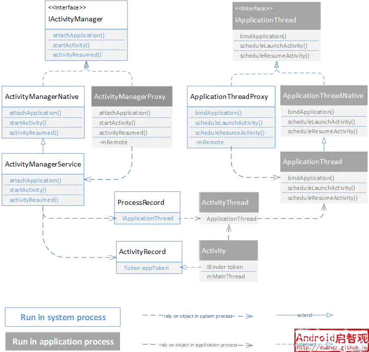

Android应用启动流程分析

[原地址](https://juejin.cn/post/6844904116561379341)
网上看过很多Activity启动过程的源码解析，很多文章会贴上一大段代码，然后从`startActivity()`函数开始深究整个源码的调用栈。个人感觉这类文章代码细节太多，反而容易迷失在源码调用之中，从而忽略了Activity启动过程的本质。所以本文就简单地定性地对Activity启动过程进行描述，不会贴上大篇幅的源码，同时梳理一下相关的经典问题。也是对以前的所学做一个复习总结。

Activity启动过程中，一般会牵涉到应用启动的流程。应用启动又分为冷启动和热启动。

1.  冷启动：点击桌面图标，手机系统不存在该应用进程，这时系统会重新fork一个子进程来加载Application并启动Activity，这个启动方式就是冷启动。
2.  热启动：应用的热启动比冷启动简单得多，开销也更低。在热启动中，因为**系统里已有该应用的进程**，所以系统的所有工作就是将您的 Activity 带到前台。 冷启动是应用完全从0开始启动，涉及到更多的内容，所以就应用冷启动的过程展开讨论。

一般来说，冷启动包括了以下内容：

1.  启动进程 点击图标发生在Launcher应用的进程，startActivity()函数最终是由Instrumentation通过Android的Binder跨进程通信机制 发送消息给 system\_server 进程； 在 system\_server 中，启动进程的操作由ActivityManagerService 通过 socket 通信告知 Zygote 进程 fork 子进程（app进程）
2.  开启主线程 app 进程启动后，首先是实例化 ActivityThread，并执行其main()函数：创建 ApplicationThread，Looper，Handler 对象，并开启主线程消息循环`Looper.loop()`。
3.  创建并初始化 Application和Activity ActivityThread的main()调用 `ActivityThread#attach(false)`方法进行 Binder 通信，通知system_server进程执行 `ActivityManagerService#attachApplication(mAppThread)`方法，用于初始化Application和Activity。 在system_server进程中，`ActivityManagerService#attachApplication(mAppThread)`里依次初始化了Application和Activity，分别有2个关键函数： - `thread#bindApplication()`方法通知主线程Handler 创建 Application 对象、绑定 Context 、执行 Application#onCreate() 生命周期 - `mStackSupervisor#attachApplicationLocked()`方法中调用 `ActivityThread#ApplicationThread#scheduleLaunchActivity()`方法，进而通过主线程Handler消息通知创建 Activity 对象，然后再调用 `mInstrumentation#callActivityOnCreate()`执行 Activity#onCreate() 生命周期
4.  布局&绘制 源码流程可以参考[Android View 的绘制流程分析及其源码调用追踪](https://www.jianshu.com/p/d3be5def8398)

至此，应用启动流程完成。

其中1、2、3的源码流程可以参考[Android Application 启动流程分析及其源码调用探究](https://www.jianshu.com/p/03ec8203919e)，但代码细节不是本篇重点。

下面说说上述流程中的几个关键角色，以及其作用：

## 3.1 zygote进程

这里稍微说下Android系统下的进程机制，每个应用运行时都是：

1.  一个单独的dalvik虚拟机（DVM） java代码在编译后需要运行在JVM上，同样android中使用了java语言，也需要运行在一个VM上。所以谷歌针对手机处理器和内存等硬件资源不足而研究出来DVM，为android运行提供环境。 参考[JVM与DVM的关系](https://www.jianshu.com/p/78c0d173df62)
2.  一个单独的进程 每个应用启动都运行一个单独的DVM，每个DVM单独占用一个Linux进程。独立的进程可以防止在虚拟机崩溃的时候所有程序都被关闭。 dalvik进程管理是依赖于linux的进程体系结构的，如要为应用程序创建一个进程，它会使用linux的fork机制来复制一个进程。

众所周知，Android是基于Linux系统的，在Linux中所有的进程都是由init进程直接或者是间接fork出来的。fork进程往往比创建进程效率更高。在Android中，所有的应用的进程都是由zygote进程fork出来的。

提到zygote进程，就不得不介绍下Android开机流程：

1.  Android手机开机Linux内核启动后，会加载system/core/init/init.rc文件，启动**init进程**。这个进程是Android系统特有的初始化程序，简单介绍下它的工作：
    
    - 各种复杂工作
    - 负责开关机画面
    - 文件系统的创建和挂载
    - 启动Zygote(孵化器)进程
    - 启动ServiceManager，它是Binder服务管理器，管理所有Android系统服务
2.  在系统启动后init进程会fork **Zygote进程**，Zygote作为孵化器进程，它的main函数会创建好自己的环境准备孵化子进程，并开始等待孵化请求：
    
    - 创建一个server端的socket， name为zynote，用于和客户端进程通信
    - 预加载类和资源，提高应用启动速度
    - 启动SystemServer进程
    - 监听socket，当有一个应用程序启动时，就会向它发出请求，然后zygote进程fock自己来创建的一个新的子进程。
3.  Zygote进程首先会fork自己孵化出**SystemServer进程**，它的main函数主要负责：
    
    - 启动binder线程池，这是SystemServer与其他进程通信的基础
    - 初始化Looper
    - 创建了SystemServiceManager对象，它会启动Android中的各种服务。包括AMS、PMS、WMS
    - 启动桌面进程，这样才能让用户见到手机的界面。
    - 开启loop循环，开启消息循环，SystemServer进程一直运行，保障其他应用程序的正常运行。
4.  当系统里面的zygote进程运行之后，后续启动APP，就相当于开启一个新的进程。而Android为了实现资源共用和更快的启动速度，子进程都是通过zygote进程fork出来的。所以说，除了init进程fork出来的第一个进程zygote，其他应用进程都是zygote的子进程，也不难理解为何这个孵化器进程的英文名叫zygote（受精卵），因为所有的应用进程都是由它孵化诞生。
    

## 3.2 SystemServer进程

SystemServer是由zygote进程fork出来的第一个进程，SystemServer和Zygote是Android Framework最重要的2个进程。 系统里面重要的服务都是在这个进程里面开启的，比如ActivityManagerService、PackageManagerService、WindowManagerService。

应用启动流程基本是围绕着ActivityManagerService和ActivityThread展开。

## 3.3 Android系统里的Client/Server模式

平时我们所熟知的前端（Web\\Android\\iOS）通过网络与服务器通信是客户端-服务端模式的体现，而在Android Framework中，四大组件的创建、生命周期也是通过这样的模式进行通信：

1.  服务器端(server)指的就是SystemServer进程，这个进程提供了很多服务 比如AMS、PMS、WMS等等，所有的App进程都可以与其通信。
2.  客户端(client)指的就是各个独立的App进程。

Android开发者都应该知道，通过包名和Activity类名就可以打开一个APP。实际上，项目里的业务代码startActivity()方法并不是直接创建进程、拉起APP的。而是通过一系列的调用，把请求传递给SystemServer的AMS。AMS收到来自客户端的请求后，再通知zygote进程来fork一个新进程，来开启我们的目标App的。 这就像是在浏览器里打开一个网页，浏览器把url和参数发送到服务器，然后还是服务器处理请求，并返回相应的html并展示在浏览器上。

这个过程涉及到3个进程：App进程、AMS(SystemServer进程)、zygote进程。

1.  App进程与AMS通过Binder机制进行跨进程通信
2.  AMS(SystemServer进程)与zygote通过Socket进行跨进程通信。

在Android系统中，任何一个Activity的启动都是由AMS和App进程（主要是ActivityThread）相互配合来完成的。AMS服务统一调度系统中所有进程的Activity启动，而每个Activity的启动过程则由其所属的进程具体来完成。

## 3.4 Android Binder机制

我们知道AMS与ActivityThread的交互主要是通过进程间通信 (IPC) 。跨进程通信的机制就是将方法调用及其数据分解至操作系统可识别的程度，并将其从本地进程和地址空间传输至远程进程和地址空间，然后在远程进程中重新组装并执行该调用。 Android 提供了执行这些 IPC 事务的方案——Binder机制，因此我们只需关心接口定义和实现 RPC 编程接口。

而App进程与SystemServer进程也是通过Binder机制进行进程间通信，Android为此设计了两个Binder接口：

1.  IApplicationThread: 作为系统进程请求应用进程的接口;
2.  IActivityManager: 作为应用进程请求系统进程的接口。

对于一个Binder接口，在客户端和服务端各有一个实现：Proxy和Native，它们之间的通信主要是通过transact和onTransact触发。一般从命名上可以区分：xxxNative是在本进程内的Binder代理类，xxxProxy是在对方进程的Binder代理类。

> 多说一句，这些Binder都由ServiceManager统一管理：
> 
> 1.  ServiceManager管理所有的Android系统服务，有人把ServiceManager比喻成Binder机制中的DNS服务器，client端应用如果要使用系统服务，调用getSystemService接口，ServiceManager就会通过字符串形式的Binder名称找到并返回对应的服务的Binder对象。
> 2.  它是一个系统服务进程，在native层启动，它在system/core/rootdir/init.rc脚本中描述并由init进程启动。
> 3.  ServiceManager启动后，会通过循环等待来处理Client进程的通信请求。

App进程与SystemServer进程的Binder接口如下图：



### 3.4.1 服务端 IActivityManager——ActivityManagerNative——ActivityManagerService

1.  ActivityManagerNative作为服务端的“桩(Stub)”，其主要职责就是对远程传递过来的数据进行”反序列化(unparcel)”;
2.  ActivityManagerProxy作为服务的“代理(Proxy)”，运行在客户端，其主要职责就是将数据进行“序列化(parcel)”，再传递给远程的“桩(Stub)”，App使用AMS提供的功能，比如startActivity，是通过AMS在客户端的代理ActivityManagerProxy发起的。
3.  最下面一层是桩(Stub)的具体实现——AMS(ActivityManagerService)，负责系统中四大组件的启动、切换、调度及应用进程的管理和调度等工作，非常复杂。

AMS是一个系统服务，在SystemServer进程启动后完成初始化。在应用启动流程中，充当着服务端的角色。 App中Activity的生命周期由AMS管理，它决定着什么时候该调用onCreate、onResume这些生命周期函数，把Activity放在哪个栈里，上下文之间的关系是怎样的等等。

比如：

1.  startActivity 最终调用了AMS的 startActivity 系列方法，实现了Activity的启动；Activity的生命周期回调，也在AMS中完成；
2.  startService,bindService 最终调用到AMS的startService和bindService方法；
3.  动态广播的注册和接收在 AMS 中完成（静态广播在 PMS 中完成）
4.  getContentResolver 最终从 AMS 的 getContentProvider 获取到ContentProvider

### 3.4.2 客户端 IApplicationThread——ApplicationThreadNative——ActivityThread

1.  桩(Stub)：ApplicationThreadNative
2.  代理(Proxy)：ApplicationThreadProxy，App在客户端进程中实现了实例化Activity、调用onCreate等生命周期函数的功能，因为跨进程也不能被AMS直接调用，而是AMS通过客户端的代理ApplicationThreadProxy来处理。
3.  最下面一层是桩(Stub)的具体实现——ApplicationThread，它是ActivityThread的一个内部类，ApplicationThread负责响应系统进程发起的请求，而实际触发的业务逻辑是在ActivityThread中。与一般的代理模式不同，它不是直接持有ActivityThead的一个引用，而是把处理的请求发到ActivityThread内部的一个Handler上。

和服务端的AMS相对应，ActivityThread在应用启动的Client/Server模式中，是作为客户端那一边的具体实现。它并不是一个线程，但它包含了一个应用进程的主线程运作的全部机制：

1.  启动应用的主线程，并开启消息循环
2.  提供了一个IActivityThread接口作为与AMS的通讯接口，通过该接口AMS可以将Activity的状态变化传递到客户端的Activity对象

## 3.5 启动一个Activity的通信过程

我们已经知道应用进程创建以后，App进程的ActivityThread与SystemServer进程的AMS通过Binder进行通信。 在文章前面【2 应用启动流程】提到，在ActivityThread的main方法中，调用 `ActivityThread#attach(false)`方法进行 Binder 通信，通知system_server进程执行 `ActivityManagerService#attachApplication(mAppThread)`方法，用于初始化Application和Activity。

可以结合源码流程，稍微总结一下这个通信过程。

### 3.5.1 Application的初始化

#### 从应用进程到系统进程

在ActivityThread创建的时候，会将自己的ApplicationThread绑定到AMS中：

```
ActivityThread.main()
└── ActivityThread.attach()
    └── IActivityManager.attachApplication(mAppThread)
        └── Binder.transact()
```

应用进程作为客户端，通过IAcitivtyManager接口发起了跨进程调用，跨进程传递的参数mAppThread就是IApplicationThread的实例，执行流程从应用进程进入到系统进程：

```
ActivityManagerService.onTransact()
└── ActivityManagerService.attachApplication(IApplicationThread thread)
```

AMS作为IActivityManager接口的服务端实现，会响应客户端的请求，最终AMS.attachApplication()函数会被执行，该函数接收跨进程传递过来的IApplicationThread实例，将存在系统进程维护的ProcessRecord中。 具体细节可以看AMS的源码，我们只需要知道AMS中维护了所有进程运行时的信息(ProcessRecord)，一旦发生了应用进程的绑定请求，ProcessRecord.thread就被赋值成应用进程的IApplicationThread实例，这样一来，**在AMS中就能通过该IApplicationThread实例发起向应用进程的调用**。

#### 从系统进程到应用进程

在AMS.attachApplication()的过程中，会有一些信息要传递给应用进程，以便应用进程的初始化，系统进程会发起如下函数调用：

```
ActivityManagerService.attachApplication()
└── ActivityManagerService.attachApplicationLocked()
    └── IApplicationThread.bindApplication(processName, appInfo ...)
        └── Binder.transact()

```

此时，AMS会反转角色，即系统进程作为客户端，通过IApplicationThread接口向应用进程发起调用。

1.  **AMS通过ProcessRecord来维护进程运行时的状态信息，需要将应用进程绑定到ProcessRecord才能开始一个Application的构建;**
2.  AMS维护的ProcessRecord这个数据结构，包含了进程运行时的信息，譬如应用进程的名称processName、解析AndroidManifest.xml得到的数据结构ApplicationInfo等，其中，要传递给应用进程的数据都是Parcelable类型的实例。

应用进程响应请求的调用关系如下所示：

```
ApplicationThread.onTransact()
└── ApplicationThread.bindApplication()
    └── ActivityThread.H.handleMessage(BIND_APPLICATION)
        └── ActivityThread.handleBindApplication()
            └── Application.onCreate()
```

ApplicationThread作为IApplicationThread接口的服务端实现，运行在应用进程中，然后ApplicationThread.bindApplication()会被执行，完成一些简单的数据封装(AppBindData)后，通过Handler抛出BIND_APPLICATION消息。这一抛，就抛到了主线程上，ActivityThread.handleBindApplication()会被执行，终于创建了Application 对象，然后调用 Application#attach(context) 来绑定 Context，并调用Application.onCreate()函数。**历经应用进程和系统进程之间的一个来回，总算是创建了一个应用程序。**

> Android源码里有较统一的函数命名方式，在AMS中与Activity管理相关很多函数都会带有Locked后缀，表示这些函数的调用都需要多线程同步操作(synchronized)，它们会读/写一些多线程共享的数据

### 3.5.2 Activity的初始化

前面提到在system_server进程中，`ActivityManagerService#attachApplication(mAppThread)`里依次初始化了Application和Activity，其中的`mStackSupervisor#attachApplicationLocked(ProcessRecord)`里进行了Activity的初始化。

1.  **AMS通过ActivityRecord来维护Activity运行时的状态信息，需要将Activity绑定到AMS中的ActivityRecord能开始Activity的生命周期。**
2.  在Activity类中有一个IBinder类型的属性：`private IBinder mToken;`，IBinder类型表示这个属性是一个远程对象的引用，Token持有了一个ActivityRecord实例的弱引用。在创建一个ActivityRecord的时候，就会创建了一个Token类型的对象。

在启动一个新的Activity时，AMS会将ActivityRecord的Token传递给应用进程，调用关系如下所示：

```
ActivityStackSupervisor.realStartActivityLocked(ActivityRecord, ...)
└── IApplicationThread.scheduleLaunchActivity(...token, ...)
    
    └── Binder.transact()

```

ActivityStackSupervisor.realStartActivityLocked()表示要启动一个Activity实例，ActivityRecord作为参数。从ActivityRecord中提取出Token对象，作为跨进程调用的参数，通过IApplicationThread.scheduleLaunchActivity()传递到应用进程。

在应用进程这一侧，会收到启动Activity的跨进程调用，触发以下函数的调用：

```
ApplicationThread.onTransact()
└── ApplicationThread.scheduleLaunchActivity(...token, ...)
    
    └── ActivityThread.H.handleMessage()
        └── ActivityThread.handleLaunchActivity(LAUNCH_ACTIVITY)
            └── ActivityThread.performLaunchActivity(ActivityClientRecord, ...)
                
                └── Activity.attch(...token, ...)
```

标准的Binder服务端处理流程，收到AMS传递过来的Token对象，进行一下数据封装(ActivityClientRecord)，然后通过Handler抛出一个LAUNCH_ACTIVITY消息。这个消息显然也是抛到了应用进程的主线程去执行，所以ActivityThread.performLaunchActivity()函数会在主线程上执行，该函数从封装的数据结构ActivityClientRecord中取出Token对象，调用Activity.attach()函数，将其绑定到Activity上，如此一来，就建立应用进程的Activity与系统进程中ActivityRecord的关联。

**系统进程维护的是ActivityRecord，应用进程维护的是Activity，两者之间的映射关系就是利用Token来维系的**。应用进程的Activity在创建的时候，就被赋予了一个Token，拿着这个Token才能完成后续与系统进程的通信。在发生Activity切换时，应用进程会将上一个Activity的Token(AMS.startActivity()的输入参数resultTo)传递给系统进程，系统进程会根据这个Token找到ActivityRecord，对其完成调度后，再通知应用进程：Activity状态发生了变化。

### 3.5.3 Instrumentation

每个Activity都持有Instrumentation对象的一个引用，但是整个应用程序进程只会存在一个Instrumentation对象。 Instrumentation可以理解为应用进程的管家，ActivityThread要创建或暂停某个Activity时，都需要通过Instrumentation来进行具体的操作。

Instrumentation这个类就是完成对Application和Activity初始化和生命周期的工具类。

前面提到，App和AMS是通过Binder传递信息的，ActivityThread接受AMS的命令，然后就是通过Instrumentation真正地创建Activity以及调用Activity的生命周期函数。 比如ApplicationThread接受AMS命令创建Acitivity，最后执行到ActivityThread，通过Instrumentation创建Activity并调用onCreate()生命周期。

```

ActivityThread.performLaunchActivity()
└──  mInstrumentation.newActivity(appContext.getClassLoader(), component.getClassName(), activityClientRecord.intent)
	└── return (Activity)cl.loadClass(className).newInstance()
		
└── mInstrumentation.callActivityOnCreate(activity, r.state)
	└── activity.performCreate()
		└── activity.onCreate(Bundle)
复制代码
```

前面知道应用启动以及Activity启动是一个跨进程通信的过程，这是因为： 每个应用都是一个独立的进程，Activity的生命周期本来就会在不同进程之间互相影响，所以需要一个系统进程对所有Activity进行统一管理。 在一个应用程序安装时，系统会解析出APK中所有Activity的信息，当显示APK中的用户界面时，就需要调度Activity的生命周期函数了。 系统进程(SystemServer)中维护了所有Activity的状态，管理中枢就是ActivityManagerService。

## 系统进程怎么管理Activity？

在应用进程这边，Activity的生命周期都是发生在本进程的主线程里，由ActivityThread调用Instrumentation完成。 而在系统进程（SystemServer）这头，则是由AMS维护ActivityRecord等数据结构来进行调度。 Activity管理的数据结构包括： ActivityRecord TaskRecord ActivityStack ActivityDisplay ActivityStackSupervisor ProcessRecord 这些数据结构都属于JAVA实体类，它们的构建和销毁都在系统进程中完成。

它们之间的联系可以参考下图：


图中的方框可以理解为一个包含关系：譬如一个TaskRecord中包含多个ActivityRecord; 图中的连接线可以理解为等价关系，譬如同一个ActivityRecord会被TaskRecord和ProcessRecord引用，两者是从不同维度来管理ActivityRecord。

1.  ActivityRecord是Activity管理的最小单位，它对应着应用进程的一个Activity;
2.  TaskRecord也是一个栈式管理结构，每一个TaskRecord都可能存在一个或多个ActivityRecord，栈顶的ActivityRecord表示当前可见的界面;
3.  ActivityStack是一个栈式管理结构，每一个ActivityStack都可能存在一个或多个TaskRecord，栈顶的TaskRecord表示当前可见的任务;
4.  ActivityStackSupervisor管理着多个ActivityStack，但当前只会有一个获取焦点(Focused)的ActivityStack;
5.  ProcessRecord记录着属于一个进程的所有ActivityRecord，运行在不同TaskRecord中的ActivityRecord可能是属于同一个 ProcessRecord。

> [每种数据结构的属性和行为](https://duanqz.github.io/2016-02-01-Activity-Maintenance#31-%E8%AE%BE%E8%AE%A1%E6%80%9D%E6%83%B3)

前面知道应用进程与AMS通过Binder进行了跨进程通信，那么Binder究竟是如何运作的：

1.  一个进程空间分为 用户空间 & 内核空间（Kernel），即把进程内 用户 & 内核 隔离开来。
2.  为了保证 安全性 & 独立性，一个进程 不能直接操作或者访问另一个进程，即Android的进程是相互独立、隔离的。
3.  跨进程间通信的原理
    - 先通过 进程间 的内核空间进行 数据交互
    - 再通过 进程内 的用户空间 & 内核空间进行 数据交互，从而实现 进程间的用户空间 的数据交互
    - Binder，就是充当 连接 两个进程（内核空间）的通道。

下面简单说说Binder机制 在Android中的具体实现：

### 5.1 注册服务

Server进程 创建 一个 Binder 对象，并向 ServiceManager 注册服务。

### 5.2 获取服务

Client进程 需要使用 Server进程的服务时，须 通过Binder驱动 向 ServiceManager进程 获取相应的Service信息。ServiceManager会返回Server进程的Binder代理对象

### 5.3 使用服务

1.  client进程的请求数据通过代理binder对象的transact方法，发送到内核空间（Binder驱动？），当前线程被挂起
2.  Binder驱动通过client进程所使用的代理对象找到 对应server进程的真身binder对象，并将数据发送到server进程
3.  server进程收到binder驱动通知，在线程池中进行数据反序列化&调用目标方法(onTransact)，并将执行结果发送到Binder驱动（内核空间？）
4.  Binder驱动将server进程的目标方法执行结果，拷贝到client进程的内核空间
5.  Binder驱动通知client进程，之前挂起的线程被唤醒，并收到返回结果

1.  在Android中，所有的应用都是一个独立的进程。
2.  每个应用进程都是由zygote进程fork出来的。
3.  应用启动是一个跨进程的复杂工作，应用启动流程基本是围绕着SystemServer的ActivityManagerService和应用进程的ActivityThread展开。

1.  [Android源码学习目录](https://www.jianshu.com/p/bc786c9c4011)
2.  [应用进程与系统进程的通信(IActivityManager & IApplicationThread）](http://duanqz.github.io/2016-01-29-Activity-IPC)
3.  [图文详解 Android Binder跨进程通信机制 原理](https://www.cnblogs.com/xinmengwuheng/p/7070167.html)