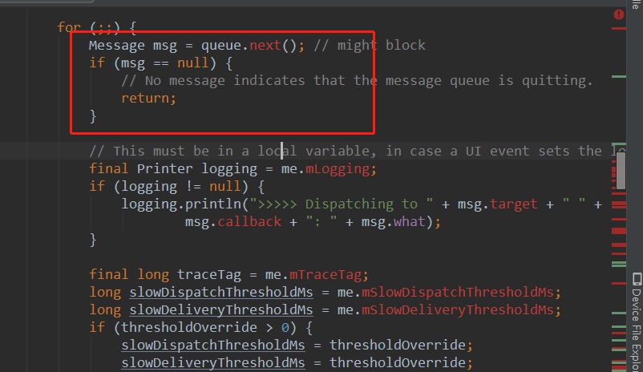

Handler的相关学习

Handler的相关学习

> 在主线程中Android默认已经调用了Looper.preperMainLooper方法，调用该方法的目的是在Looper中创建MessageQueue成员变量,并把Looper对象绑定到当前线程中（ThreadLocal）。当调用Handler的sendMessage方法的时候，就将Message对象添加到了Looper创建的MessageQueue队列中，同时给Message指定了target对象，其实这个target对象就是Handler对象。主线程默认执行了Looper.looper()方法，该方法从Looper的成员变量MessageQueue队列中调用Message的target对象的dispatchMessage方法(也就是msg.target.dispatchMessage方法)取出Message，然后在dispatchMessage方法中调用Message的target对象的handleMessage()方法(也就是msg.target.handleMessag)，这样就完成了整个消息机制。

首先有几个主要的类需要先学习一下：
ThreadLocal：每个线程只有一个，通过这个对象创建的数据，只能在线程内部使用，不会被共享。
Looper：每个线程只有一个，与ThreadLoal绑定了。
在Looper类中：
```
static final ThreadLocal<Looper> sThreadLocal = new ThreadLocal<Looper>();
private static void prepare(boolean quitAllowed) {
    if (sThreadLocal.get() != null){

        throw new RuntimeException("Only one Looper may be created per thread");

    }
    sThreadLocal.set(new Looper(quitAllowed));
}
```
MessageQueue: 每个线程只有一个，在Looper初始化的时候初始化。这边Looper构造方法的私有化，也说明了Looper每个线程只有一个。
private Looper(boolean quitAllowed) {
    mQueue = new MessageQueue(quitAllowed);
    mThread = Thread.currentThread();
}

在调用handler.sendMessage();时，会调用msg.target=this;也就是把处理消息的方法（handler与消息本身结合了）。每一个现存只有一个ThreadLocal来保存线程中的唯一变量。Looper就保存在这个里面，也就保证了每个线程中Looper的唯一性。每个线程中都维持了一个MessageQueue，以变量形式保存在Looper当中（looper.mqueue）,handler变量也会持有一个这个的副本。在sendMessage的时候，会把message塞到queue里面。

调用looper.loop时，会从queue当中取出消息，并通过msg去用handler去处理消息:下面是Looper.loop()方法。


```
Looper.prepare();
------------>>>>>>>>>>>>>>>
static final ThreadLocal<Looper> sThreadLocal = new ThreadLocal<Looper>();

//创建当前线程的Looper对象
private static void prepare(boolean quitAllowed) {
        if (sThreadLocal.get() != null) {

                throw new RuntimeException("Only one Looper may be created per thread");

        }
        sThreadLocal.set(new Looper(quitAllowed));
        ------------>>>>>>>>>>>>>>>
                private Looper(boolean quitAllowed) {
                        //quitAllowed,是否允许MessageQueue没有消息时销毁
                        mQueue = new MessageQueue(quitAllowed);
                        mThread = Thread.currentThread();
                }
        <<<<<<<<<<<<<<--------------
}
//获取当前线程的Looper对象
public static @Nullable Looper myLooper() {
        return sThreadLocal.get();
}
<<<<<<<<<<<<<<--------------

Handler handler = new Handler();
------------>>>>>>>>>>>>>>>
    public Handler(Callback callback, boolean async) {
        //获取Looper对象
        mLooper = Looper.myLooper();
        if (mLooper == null) {
            throw new RuntimeException(

            "Can't create handler inside thread that has not called Looper.prepare()");

        }
        //获取Looper对象的mQueue属性，mQueue 就是MessageQueue对象。
        mQueue = mLooper.mQueue;
        mCallback = callback;
        mAsynchronous = async;
    }
<<<<<<<<<<<<<<--------------

handler.sendMessage();
------------>>>>>>>>>>>>>>>
//最终调用这个方法：

private boolean enqueueMessage(MessageQueue queue, Message msg, long uptimeMillis) {

    //把this赋值给msg的target属性，this就是Handler对象。
    msg.target = this;
    if (mAsynchronous) {
        msg.setAsynchronous(true);
    }
    //把消息存放到MessageQueue
    return queue.enqueueMessage(msg, uptimeMillis);
}
<<<<<<<<<<<<<<--------------

Looper.loop()
------------>>>>>>>>>>>>>>>
public static void loop() {

    final MessageQueue queue = me.mQueue;
    //一个死循环
    for (;;) {
        //从MessageQueue中取出一条消息
        Message msg = queue.next();
        if (msg == null) {
            // No message indicates that the message queue is quitting.
            ------------>>>>>>>>>>>>>>>
                //以下这种情况才会进入到这个判断里面。Looper的调用。
                public void quit() {
                    mQueue.quit(false);
                }
                public void quitSafely() {
                    mQueue.quit(true);
                }
            <<<<<<<<<<<<<<--------------
            return;
        }
    //把消息交给Handler处理。
    msg.target.dispatchMessage(msg);
    }
}
<<<<<<<<<<<<<<--------------

handler.dispatchMessage()
------------>>>>>>>>>>>>>>>
public void dispatchMessage(Message msg) {
    //如果Message有自己的callback，就由Message的callback处理
    if (msg.callback != null) {
        handleCallback(msg);
    } else {
        //如果Handler有自己的mCallback，就由Handler的mCallback处理
        if (mCallback != null) {
            if (mCallback.handleMessage(msg)) {
                return;
            }
        }
        //默认的处理消息的方法
        handleMessage(msg);
    }
}
<<<<<<<<<<<<<<--------------
```
正确使用方法：
```
public class MainActivity extends AppCompatActivity {

    private final String TAG = "MainActivity";
    private Handler handler;
    private WeakReference<MainActivity> mActivity;

    @Override
    protected void onCreate(Bundle savedInstanceState) {
        super.onCreate(savedInstanceState);
        setContentView(R.layout.activity_main);
        mActivity = new WeakReference<>(this);
        new Thread(new Runnable() {
            @Override
            public void run() {
                Looper.prepare();
                handler = new UIHandler(mActivity.get());
                Message msg = new Message();
                msg.what = 12;
                //查看处理消息流程。Looper.loop()后还会处理消息吗。
                handler.sendMessage(msg);
//                不能重复塞消息。
//                handler.sendMessage(msg);
//                不重新new的话，会报错，消息已经在对列中。
                msg = new Message();
                msg.what = 14;
                handler.sendMessage(msg);
                //下面的方法没有调用的话，是不会从MessageQueue的取消息的。
                Looper.loop();
                msg = new Message();
                msg.what = 16;
//              不会到处理消息的地方。在上面loop()方法中，一旦发现messagequeue中的消息为空了，就会退出死循环不等待。
                handler.sendMessage(msg);
            }
        }).start();
    }

    private void printLog() {
        Log.d(TAG, "printLog: loglogloglog");
    }

    private static class UIHandler extends Handler {
        private final String TAG = "UIHandler";

//      下面会调用到Activity中的方法。所以需要持有Activity的引用。
//      防止这个类的实例对象还存在，然后Activity已经没用了，
//      但由于还持有他的引用，所以不能释放内存导致内存泄漏。所以这里用了弱引用。
        WeakReference<MainActivity> mActivity;

        public UIHandler(MainActivity activity) {
            mActivity = new WeakReference<MainActivity>(activity);
        }

        @Override
        public void handleMessage(Message msg) {
            super.handleMessage(msg);

            mActivity.get().printLog();
        }
    }

    @Override
    protected void onDestroy() {
        super.onDestroy();
//    这里容易被忽略，但一定要加上，要不然还是会引起内存泄漏
        handler.removeCallbacksAndMessages(null);
    }
}
```
sThreadLocal是一个Looper类的静态属性。开始的时候就会创建。

Looper  是循环从MessageQueue当中去消息的类。在调用静态方法prepare时（Looper.prepare()），会初始化Looper和MessageQueue，MessageQueue 是Looper的一个属性。并把Looper实例设置到ThreadLocal当中去。

Handler在初始化的时候，会通过Looper.myLooper拿到Looper对象，然后通过mLooper.mQueue当中拿到MessageQueue供后面处理。
```

public final class  Looper {

    final static ThreadLocal<Looper> sThreadLocal = new ThreadLocal<Looper>();

    final MessageQueue mQueue;
    final Thread mThread;
    ...

    private Looper(boolean quitAllowed) {
        mQueue = new MessageQueue(quitAllowed);
        mThread = Thread.currentThread();
    }
    ....

    public static void prepare(boolean quitAllowed) {
    //Looper looper = sThreadLocal.get()
        if(sThreadLocal.get() != null) {

            throw new RuntimeException("Only one Looper may be created per thread");

        }
        sThreadLocal.set(new Looper(quitAllowed));
    }

    public static void loop() {

        final MessageQueue queue = me.mQueue;
        //一个死循环，循环取消息
        for (;;) {
            //从MessageQueue中取出一条消息
            Message msg = queue.next();
            if (msg == null) {
                // No message indicates that the message queue is quitting.
                ------------>>>>>>>>>>>>>>>
                    //以上这种情况才会进入到这个判断里面。Looper的调用。
                    public void quit() {
                        mQueue.quit(false);
                    }
                    public void quitSafely() {
                        mQueue.quit(true);
                    }
                <<<<<<<<<<<<<<--------------
                return;
            }
        //把消息交给Handler处理。与下面蓝色字体对应
        msg.target.dispatchMessage(msg);
        }
    }

    ...
}

public class Handler {
....
     public Handler(Callback callback, boolean async) {
        if (FIND_POTENTIAL_LEAKS) {
            final Class<? extends Handler> klass = getClass();

            if ((klass.isAnonymousClass() || klass.isMemberClass() || klass.isLocalClass()) &&

                    (klass.getModifiers() & Modifier.STATIC) == 0) {

                Log.w(TAG, "The following Handler class should be static or leaks might occur: " +

                    klass.getCanonicalName());
            }
        }

        mLooper = Looper.myLooper();
        if (mLooper == null) {
            throw new RuntimeException(

                "Can't create handler inside thread " + Thread.currentThread()

                        + " that has not called Looper.prepare()");
        }
        mQueue = mLooper.mQueue;
        mCallback = callback;
        mAsynchronous = async;
    }

    public final boolean sendMessage(Message msg)
    {
        return sendMessageDelayed(msg, 0);
    }

    public final boolean sendMessageDelayed(Message msg, long delayMillis)

    {
        if (delayMillis < 0) {
            delayMillis = 0;
        }

        return sendMessageAtTime(msg, SystemClock.uptimeMillis() + delayMillis);

    }
    
    public boolean sendMessageAtTime(Message msg, long uptimeMillis) {
        MessageQueue queue = mQueue;
        if (queue == null) {
            RuntimeException e = new RuntimeException(
                    this + " sendMessageAtTime() called with no mQueue");
            Log.w("Looper", e.getMessage(), e);
            return false;
        }
        return enqueueMessage(queue, msg, uptimeMillis);

    }

    private boolean enqueueMessage(MessageQueue queue, Message msg, long uptimeMillis) {

        msg.target = this;
        if (mAsynchronous) {
            msg.setAsynchronous(true);
        }
        return queue.enqueueMessage(msg, uptimeMillis);

    }
    
....
}
    
```