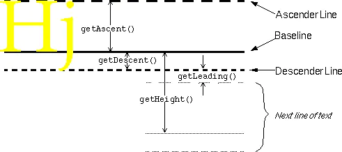

ImageSpan 图居中

ImageSpan 图居中

## 1. 代码使用
```
public class MyImageSpan extends ImageSpan {

    public static final int ALIGN_CENTER = 2;

    public MyImageSpan(Drawable drawable, int verticalAlignment) {
        super(drawable, verticalAlignment);
    }

    public MyImageSpan(Context context, Bitmap bitmap, int verticalAlignment) {
        super(context, bitmap, verticalAlignment);
    }

    @Override
    public void draw(Canvas canvas, CharSequence text, int start, int end, float x, int top, int y, int bottom, Paint paint) {
        if (mVerticalAlignment == ALIGN_CENTER) {
            Drawable drawable = getDrawable();
            Paint.FontMetricsInt fontMetricsInt = paint.getFontMetricsInt();
            int transY = (y + fontMetricsInt.descent + y + fontMetricsInt.ascent) / 2 - drawable.getBounds().bottom / 2;
            canvas.save();
            canvas.translate(x, transY);
            drawable.draw(canvas);
            canvas.restore();
        } else {
            super.draw(canvas, text, start, end, x, top, y, bottom, paint);
        }
    }
}

//使用如下：
    public static SpannableString getReplaceImgContent(Context context, String text, int drawableId, boolean alignBottom) {
        int replaceIndex = text.indexOf("*");
        SpannableString spannedString = new SpannableString(text);
        Bitmap bitmap = BitmapFactory.decodeResource(context.getResources(), drawableId);
        MyImageSpan imageSpan = new MyImageSpan(context, bitmap, MyImageSpan.ALIGN_CENTER);
        try {
            spannedString.setSpan(imageSpan, replaceIndex, replaceIndex + 1, Spanned.SPAN_INCLUSIVE_EXCLUSIVE);
        } catch (IndexOutOfBoundsException e) {
            e.printStackTrace();
        }
        return spannedString;
    }
    
    
    SpannableString replaceImgContent = StringUtil.getReplaceImgContent(getContext(), getString(R.string.no_contact_tip),
                            R.drawable.blue_button, true);
    mTextView.setText(replaceImgContent);

```

## 2. 先学习字体属性Paint.FontMetrics。



通过上面的示意图，再看下`FontMetrics` 类：
```
 public static class FontMetrics {
        /**
         * The maximum distance above the baseline for the tallest glyph in
         * the font at a given text size.
         */
        public float   top;//最高字符到baseline的值，即ascent的最大值
        /**
         * The recommended distance above the baseline for singled spaced text.
         */
        public float   ascent;//系统建议的，绘制单个字符时，baseline至字符最高处的距离
        /**
         * The recommended distance below the baseline for singled spaced text.
         */
        public float   descent;//系统建议的，绘制单个字符时，baseline至字符最低处的距离
        /**
         * The maximum distance below the baseline for the lowest glyph in
         * the font at a given text size.
         */
        public float   bottom;//最低字符到baseline的值
        /**
         * The recommended additional space to add between lines of text.
         */
        public float   leading;//上一行字符的descent到下一行字符ascent之间的距离，行间距
    }
```
> ascent线Y坐标 = baseline线的y坐标 + fontMetric.ascent；
> descent线Y坐标 = baseline线的y坐标 + fontMetric.descent；
> top线Y坐标 = baseline线的y坐标 + fontMetric.top；
> bottom线Y坐标 = baseline线的y坐标 + fontMetric.bottom；

## 3. ImageSpan
在ImageSpan的构造函数中有一个对齐方式的参数，但只提供了 ALIGN_BASELINE（顶部对齐）、ALIGN_BOTTOM （底部对齐）两种对齐方式，没有居中对齐的方式， 所以只能重写ImageSpan实现图片的居中。
`public void draw(Canvas canvas, CharSequence text,int start, int end, float x, int top, int y, int bottom, Paint paint)`
> 参数解析：
> x:要绘制的image的左边框到textview左边框的距离。
y:替换文字的基线坐标。
top:替换改行文字的最顶部位置。
bottom:替换改行文字的最底部位置，行间距属于上一行，因而bottom是行间距的底部位置。

## 重写draw()

然后重写draw()方法即可实现图片居中，实现方式如下：
```
@Override
    public void draw(Canvas canvas, CharSequence text, int start, int end, float x, int top, int y, int bottom, Paint paint) {
        if (mVerticalAlignment == ALIGN_CENTER) {
            Drawable drawable = getDrawable();
            Paint.FontMetricsInt fontMetricsInt = paint.getFontMetricsInt();
            int transY = (y + fontMetricsInt.descent + y + fontMetricsInt.ascent) / 2 - drawable.getBounds().bottom / 2;
            canvas.save();
            canvas.translate(x, transY);
            drawable.draw(canvas);
            canvas.restore();
        } else {
            super.draw(canvas, text, start, end, x, top, y, bottom, paint);
        }
    }
```


