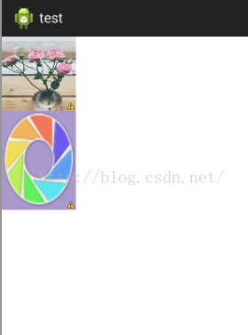

ImageView ScaleType

*参考：https://blog.csdn.net/larryl2003/article/details/6919513*

# **matrix**

matrix 表示原图从 ImageView 的左上角开始绘制，如果原图大于 ImageView，那么多余的部分则剪裁掉，如果原图小于ImageView，那么对原图不做任何处理。比如我的两张大小不同的图片，分别显示在 96dp×96dp 的 ImageView 上，会有不同的效果。

# **fitXY**

fitXY 的目标是填充整个 ImageView，为了完成这个目标，它需要对图片进行一些缩放操作，在缩放的过程中，它不会按照原图的比例来缩放。

#

# fitStart

将图片按比例缩放至 View 的宽度或者高度（取宽和高的最小值），然后居上或者居左显示（与前面缩放至宽还是高有关），我们来看下面一个例

big 图片是缩放至 ImageView 的宽度，然后居上显示，small 图片是缩放至 ImageView 的高度，然后居左显示。

#

# fitCenter

# fitCenter 和 fitStart 基本一样，唯一不同的是 fitCenter 将图片按比例缩放之后是居中显示，看下面一个例子：

#

# fitEnd

fitEnd 和 fitStart 也基本一样，唯一不同的是 fitEnd 将图片按比例缩放之后是居右或者居下显示，比如下面一个 Demo：

#

# center

center 表示将原图按照原来的大小居中显示，如果原图的大小超过了 ImageView 的大小，那么剪裁掉多余部分，只显示中间一部分图像，比如下面一个 Demo：

#

# centerCrop

centerCrop 的目标是将 ImageView 填充满，故按比例缩放原图，使得可以将 ImageView 填充满，同时将多余的宽或者高剪裁掉, 比如下面一个 Demo :

#

# centerInside

centerInside 的目标是将原图完整的显示出来，故按比例缩放原图，使得 ImageView 可以将原图完整显示，比如下面一个 Demo：
