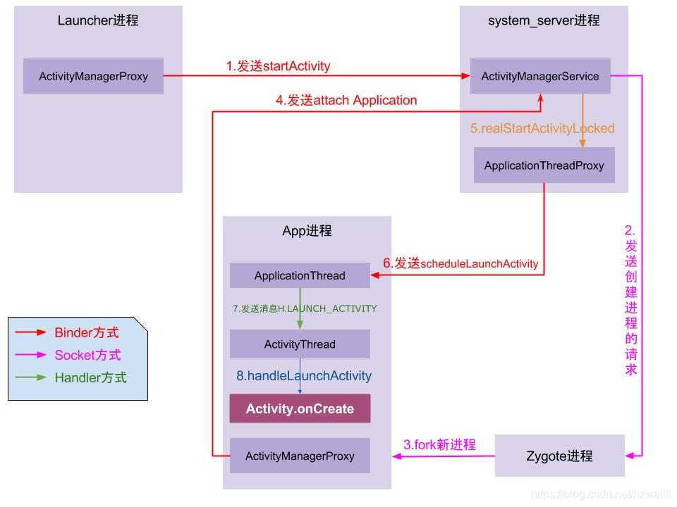

ActivityThread的理解和APP的启动过程_小河的博客-CSDN博客_activitythread

ActivityThread就是我们常说的主线程或UI线程，ActivityThread的main方法是整个APP的入口，本篇深入学习下ActivityThread，顺便了解下APP和Activity的启动过程。

## <a id="t2"></a><a id="t2"></a><a id="ActivityThread_6"></a>ActivityThread的初始化

ActivityThread即Android的主线程，也就是UI线程，ActivityThread的main方法是一个APP的真正入口，MainLooper在它的main方法中被创建。

```
    
    public static void main(String[] args) {
        ...
        Looper.prepareMainLooper();
        ActivityThread thread = new ActivityThread();
        
        thread.attach(false);

        if (sMainThreadHandler == null) {
            sMainThreadHandler = thread.getHandler();
        }
        ...
        Looper.loop();
        throw new RuntimeException("Main thread loop unexpectedly exited");
    }

```

接下来从主线程Looper的初始化和ApplicationThread及Activity的创建启动两方面，通过源码了解学习下大致的流程。

## <a id="t3"></a><a id="t3"></a><a id="Looper_28"></a>主线程Looper的初始化

Looper.prepareMainLooper();相关的代码如下

```
    主线程Looper的初始化
    public static void prepareMainLooper() {
        prepare(false);
        synchronized (Looper.class) {
            if (sMainLooper != null) {
                throw new IllegalStateException("The main Looper has already been prepared.");
            }
            sMainLooper = myLooper();
        }
    }
    
    普通线程Looper的初始化
    public static void prepare() {
        prepare(true);
    }

    private static void prepare(boolean quitAllowed) {
        if (sThreadLocal.get() != null) {
            throw new RuntimeException("Only one Looper may be created per thread");
        }
        sThreadLocal.set(new Looper(quitAllowed));
    }

```

看过Handler源码就知道，主线程Looper的初始化和普通线程Looper的初始化很相似，但还是有以下几个区别

1.  普通线程的Prepare()默认quitAllowed参数为true，表示允许退出，而主线程也就是ActivityThread的Looper参数为false，不允许退出。这里的quitAllowed参数，最终会传递给MessageQueue，当调用MessageQueue的quit方法时，会判断这个参数，如果是主线程，也就是quitAllowed参数为false时，会抛出异常。
    
    ```
        Looper的退时会判断quitAllowed
        void quit(boolean safe) {
            if (!mQuitAllowed) {
                throw new IllegalStateException("Main thread not allowed to quit.");
            }
            synchronized (this) {
                ...
            }
        }
    
    ```
    
2.  我们注意到主线程Looper初始化之后，赋值给了成员变量sMainLooper，这个成员的作用就是向其他线程提供主线程的Looper对象。这下我们就应该知道为什么Looper.getMainLooper()方法能获取主线程的Looper对象了
    
    ```
        public static Looper getMainLooper() {
            synchronized (Looper.class) {
                return sMainLooper;
            }
        }
    
    ```
    

## <a id="t4"></a><a id="t4"></a><a id="Handler_78"></a>主线程Handler的初始化

在ActivityThread的main方法中我们注意到一行代码：

```
    ActivityThread thread = new ActivityThread();
    thread.attach(false);
    if (sMainThreadHandler == null) {
        sMainThreadHandler = thread.getHandler();
    }

```

见名知意，这是获取主线程的Handler，那么主线程的Handler是在什么时候初始化的呢？

```
    与之相关的代码如下：
    ActivityThread的成员变量
    final H mH = new H();
    
    final Handler getHandler() {
        return mH;
    }

```

从以上代码中可以看到，主线程的Handler作为ActivityThread的成员变量，是在ActivityThread的main方法被执行，ActivityThread被创建时而初始化，而接下来要说的ApplicationThread中的方法执行以及Activity的创建都依赖于主线程Handler。至此我们也就明白了，主线程（ActivityThread）的初始化是在它的main方法中，主线程的Handler以及MainLooper的初始化时机都是在ActivityThread创建的时候。

## <a id="t5"></a><a id="t5"></a><a id="ApplicationThreadActivity_102"></a>ApplicationThread及Activity的创建和启动

以上的代码和流程，就是对 MainLooper 和 ActivityThread 的初始化，我们接下来看一下 ActivityThread 的初始化及其对应的 attach 方法，在thread.attach方法中，ActivityManagerService通过attachApplication方法，将ApplicationThread对象绑定到ActivityManagerService，ApplicationThread是ActivityThread的私有内部类，实现了IBinder接口，用于ActivityThread和ActivityManagerService的所在进程间通信。

```
    ActivityThread的attach方法：
    private void attach(boolean system) {
        ...
        if (!system) {
            final IActivityManager mgr = ActivityManager.getService();
            try {
                mgr.attachApplication(mAppThread);
            } catch (RemoteException ex) {
                throw ex.rethrowFromSystemServer();
            }else{
                ...
            }
        }
    }
    
    ActivityManagerService中的方法：
    public final void attachApplication(IApplicationThread thread) {
        synchronized (this) {
            int callingPid = Binder.getCallingPid();
            final long origId = Binder.clearCallingIdentity();
            attachApplicationLocked(thread, callingPid);
            Binder.restoreCallingIdentity(origId);
        }
    }
    
    这里的个人理解是：在每个ActivityThread（APP）被创建的时候，
    都需要向ActivityManagerService绑定（或者说是向远程服务AMS注册自己），
    用于AMS管理ActivityThread中的所有四大组件的生命周期。

```

上述AMS的代码中attachApplicationLocked方法比较复杂，主要功能有两个，详见注释，这里忽略了很多代码细节，具体的流程可以看源码

```
    AMS中的方法，主要功能有以下两步
    private final boolean attachApplicationLocked(IApplicationThread thread, int pid) {
        ...
        主要用于创建Application，用调用onCreate方法
		thread.bindApplication(...);
		...
		主要用于创建Activity
        if (mStackSupervisor.attachApplicationLocked(app)) {
            ...
        }
    }

```

1.  thread.bindApplication：主要用于创建Application，这里的thread对象是ApplicationThread在AMS中的代理对象，所以这里的bindApplication方法最终会调用ApplicationThread.bindApplication()方法，该方法会向ActivityThread的消息对应发送BIND_APPLICATION的消息，消息的处理最终会调用Application.onCreate()方法，这也说明Application.onCreate()方法的执行时机比任何Activity.onCreate()方法都早。
    
    ```
        ActivityThread中的bindApplication方法
        public final void bindApplication(...) {
            ...
            该消息的处理，会调用handleBindApplication方法
            sendMessage(H.BIND_APPLICATION, data);
        }
        ActivityThread中的handleBindApplication方法
        private void handleBindApplication(AppBindData data) {
            ...
            try {
                Application app = data.info.makeApplication(data.restrictedBackupMode, null);
                mInitialApplication = app;
                ...
                try {
                    mInstrumentation.callApplicationOnCreate(app);
                } catch (Exception e) {
                }
            } finally {
            }
        }
            
        LoadedApk中的方法，用于创建Application
        public Application makeApplication(boolean forceDefaultAppClass, Instrumentation instrumentation) {
            如果存在Application的实例，则直接返回，这也说明Application是个单例
            if (mApplication != null) {
                return mApplication;
            }
    
            Application app = null;
            ...这里通过反射初始化Application
    
            if (instrumentation != null) {
                try {
                    调用Application的onCreate方法
                    instrumentation.callApplicationOnCreate(app);
                } catch (Exception e) {
                }
            }
            return app;
        }
    
    ```
    
2.  mStackSupervisor.attachApplicationLocked(app)：用于创建Activity，mStackSupervisor是AMS的成员变量，为Activity堆栈管理辅助类实例，该方法最终会调用ApplicationThread类的scheduleLaunchActivity方法，该方法也是类似于第一步，向ActivityThread的消息队列发送创建Activity的消息，最终在ActivityThread中完成创建Activity的操作。
    
    ```
        boolean attachApplicationLocked(ProcessRecord app) throws RemoteException {
            ...
            if (realStartActivityLocked(hr, app, true, true)) {
                ...
            }          
            ...
        }
    
        final boolean realStartActivityLocked(ActivityRecord r, ProcessRecord app,
                boolean andResume, boolean checkConfig) throws RemoteException {
            ...
            try {
                调用ApplicationThread的scheduleLaunchActivity用于启动一个Activity
                app.thread.scheduleLaunchActivity(...);
            } catch (RemoteException e) {
            }
        }
    
        ApplicationThread的scheduleLaunchActivity方法会向ActivityThread发送LAUNCH_ACTIVITY信息，用于启动一个Activity，该消息的处理会调用ActivityThread的handleLaunchActivity方法，最终启动一个Activity
    
    ```
    

以上就是从ActivityThread的main方法执行到Activity的创建之间的流程，至于ActivityThread的main方法执行时机，以及执行前的流程和Activity的具体创建过程，可以接着看APP的启动过程

## <a id="t7"></a><a id="t7"></a><a id="_225"></a>系统的启动过程

在学习APP的启动之前先简单了解下系统的启动，有助于我们更好的学习APP的启动。系统的启动过程很复杂，这里简单化，只关心大致流程和涉及到的一些名词以及相关类的作用  
APP的启动可以简单总结为一下几个流程：

> 加载BootLoader --> 初始化内核 --> 启动init进程 --> init进程fork出Zygote进程 --> Zygote进程fork出SystemServer进程


- 系统中的所有经常进程都是由Zygote进程fork出来的
- SystemServer进程是系统进程，很多系统服务，例如ActivityManagerService、PackageManagerService、WindowManagerService…都是存在该进程被创建后启动
- ActivityManagerServices（AMS）：是一个服务端对象，负责所有的Activity的生命周期，AMS通过Binder与Activity通信，而AMS与Zygote之间是通过Socket通信
- ActivityThread：本篇的主角，UI线程/主线程，它的main()方法是APP的真正入口
- ApplicationThread：一个实现了IBinder接口的ActivityThread内部类，用于ActivityThread和AMS的所在进程间通信
- Instrumentation：可以理解为ActivityThread的一个工具类，在ActivityThread中初始化，一个进程只存在一个Instrumentation对象，在每个Activity初始化时，会通过Activity的Attach方法，将该引用传递给Activity。Activity所有生命周期的方法都有该类来执行

## <a id="t8"></a><a id="t8"></a><a id="APP_241"></a>APP的启动过程

APP的启动，我们使用一张图来说明这个启动过程，顺便也总结下上面所说的ActivityThread的main方法执行到Activity的创建之间的流程。图是从网上盗的…  


1.  点击桌面APP图标时，Launcher的startActivity()方法，通过Binder通信，调用system_server进程中AMS服务的startActivity方法，发起启动请求
2.  system_server进程接收到请求后，向Zygote进程发送创建进程的请求
3.  Zygote进程fork出App进程，并执行ActivityThread的main方法，创建ActivityThread线程，初始化MainLooper，主线程Handler，同时初始化ApplicationThread用于和AMS通信交互
4.  App进程，通过Binder向sytem\_server进程发起attachApplication请求，这里实际上就是APP进程通过Binder调用sytem\_server进程中AMS的attachApplication方法，上面我们已经分析过，AMS的attachApplication方法的作用是将ApplicationThread对象与AMS绑定
5.  system_server进程在收到attachApplication的请求，进行一些准备工作后，再通过binder IPC向App进程发送handleBindApplication请求（初始化Application并调用onCreate方法）和scheduleLaunchActivity请求（创建启动Activity）
6.  App进程的binder线程（ApplicationThread）在收到请求后，通过handler向主线程发送BIND\_APPLICATION和LAUNCH\_ACTIVITY消息，这里注意的是AMS和主线程并不直接通信，而是AMS和主线程的内部类ApplicationThread通过Binder通信，ApplicationThread再和主线程通过Handler消息交互。 ( *这里猜测这样的设计意图可能是为了统一管理主线程与AMS的通信，并且不向AMS暴露主线程中的其他公开方法，大神可以来解析下*)
7.  主线程在收到Message后，创建Application并调用onCreate方法，再通过反射机制创建目标Activity，并回调Activity.onCreate()等方法
8.  到此，App便正式启动，开始进入Activity生命周期，执行完onCreate/onStart/onResume方法，UI渲染后显示APP主界面

## <a id="t9"></a><a id="t9"></a><a id="APP_255"></a>APP启动过程的部分代码思考

在上面学习APP的启动过程中，看源码的同时注意到一个代码，就是主线程Handler在接收到LAUNCH_ACTIVITY创建Activity的消息后，创建Activity的部分代码如下：

```
    主线程Handler接收到创建Activity的消息LAUNCH_ACTIVITY后，最终会调用performLaunchActivity方法
    performLaunchActivity方法会通过反射去创建一个Activity，然后会调用Activity的各个生命周期方法
    private Activity performLaunchActivity(ActivityClientRecord r, Intent customIntent) {
        ...
        ContextImpl appContext = createBaseContextForActivity(r);
        Activity activity = null;
        try {
            这里是反射创建Activity
            java.lang.ClassLoader cl = appContext.getClassLoader();
            activity = mInstrumentation.newActivity(
                    cl, component.getClassName(), r.intent);
            StrictMode.incrementExpectedActivityCount(activity.getClass());
            r.intent.setExtrasClassLoader(cl);
            r.intent.prepareToEnterProcess();
            if (r.state != null) {
                r.state.setClassLoader(cl);
            }
        }

        try {
            这里注意，又调用了一次Application的创建方法，但是前面分析过，Application是个单例，所以这里的实际上是获取Application实例，但是这里为什么会再次调用创建Application的方法呢？
            
            Application app = r.packageInfo.makeApplication(false, mInstrumentation);
            ...
        } 
        ...
        return activity;
    }

```

在上面的代码中，简单注释了一下在Activity的创建方法中，会再次调用Application的创建方法（第一次调用是在接收到BIND_APPLICATION消息的时候），个人觉得这里再次调用Application的创建方法，除了获取已经存在的Application实例这种情况，另外一种情况还有可能是要创建的这个Activity属于另外一个进程，当去启动这个新进程中的Activity时，会先去创建新进程和Application实例，因为我们知道一个常识：

1.  APP中有几个进程，Application会被创建几次
2.  新进程中所有变量和单例会失效，因为新进程有一块新的内存区域

那么这两点的关系就是，因为新进程中Application实例会为空，所以会再次去创建Application实例，这也就是第一点中我们所说的常识：APP中有几个进程，Application会被创建几次

```
    创建Application的方法
    public Application makeApplication(boolean forceDefaultAppClass, Instrumentation instrumentation) {
        如果存在Application的实例，则直接返回，这也说明Application是个单例
        if (mApplication != null) {
            return mApplication;
        }

        Application app = null;
        ...创建Application
        return app;
    }

```

那么依次类推，Service作为四大组件之一，类似于Activity的创建和启动，创建Service的方法中会不会也调用了创建Application的方法（makeApplication方法），答案是肯定的！和Activity的创建类似，当我们调用startService的时候，也是通过Binder向AMS发送创建Service的请求，AMS准备后再向APP进程发送scheduleCreateService的请求，然后主线程handle收到CREATE_SERVICE的消息，调用handleCreateService创建Service的方法。在创建Service的方法handleCreateService中也调用了创建Application的方法，具体代码看源码吧。所以我们也彻底明白了为什么APP中有几个进程，Application会被创建几次，以及Application为什么是个单例。

APP的启动过程很复杂，代码错综交横，这里分析了大概流程，学习这部分的过程中还是有很多收获，例如知道了AMS与主线程的关系，主线程main方法中就是APP的入口，Binder通信机制和handler消息机制在这个过程中的重要作用，Application的创建时机以及Application为什么是单例，为什么有几个进程就创建几个Application…等等，看源码真的能涨知识 >…< 。

新年快乐！希望2019年越来越好！加油加油！