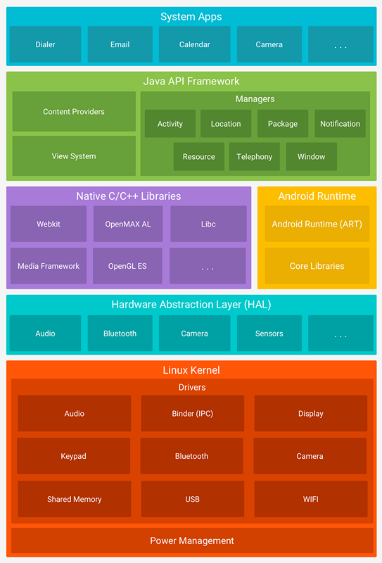
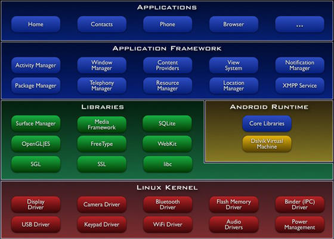
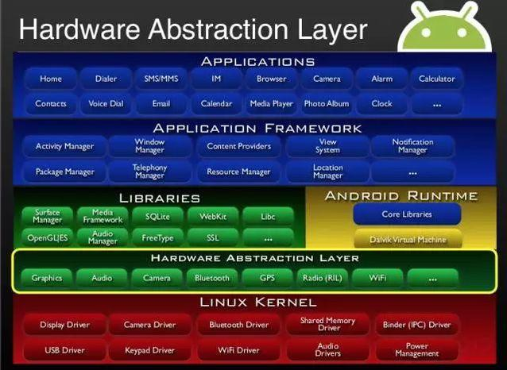

Android 6.0 架构变化（TODO-1）

一、Android 当前的架构
1 Linux Kernel (Linux内核)：内存管理，进程管理，网络协议和各种驱动等
2 Hardware Abstraction Layer (硬件抽象层) 对Linux内核驱动程序的封装，向上提供接口，屏蔽底层的实现细节。
3 Libraries (Android系统运行库层 )

- Libraries 系统库( c/c++库)

系统库提供了系统功能通过Android应用程序框架层为开发者提供服务，其类库的内容主要包含数据库、2D/3D图形处理引擎、多媒体库、数据传输服务等。另外，Android NDK（Android Native Development Kit,Android原生库）也为开发者提供了直接使用Android系统资源的能力。

- Android Runtime ( Android运行时)

Android运行时包含核心库与虚拟机运行环境2部分。

（1）核心库提供了Java SE API 的绝大多数功能，并提供Android的核心API，如android.os、[android.net](http://android.net/)、android.util、android.meida等。

（2）虚拟机运行环境，完成对生命周期的管理、堆栈的管理、线程的管理、安全和异常的管理以及垃圾回收等重要功能
4 Application Framework (开发框架包 )：activity manager、window manager、资源管理器、位置管理器等
5 Applications (应用程序)：google服务、日历、邮件、地图、音乐播放、视频播放等应用软件

二、旧版的Android的架构（HAL层是Android 5.0之后新增的）

                    旧版

                    新版

三、虚拟机模式变化

- Dalvik ：Dalvik Virtul Machine ， 从Android5.0以后被ART取代
- ART ：Android Runtime，Android运行时,Android 运行环境 从Android4.4开始发布

Dalvik（Dalvik Virtul Machine）设计用于Android平台的Java虚拟机，运行压缩转换 .class为.dex(即Dalvik Executable)格式的Java应用程序，运行时编译。特点：即时编译会拖慢应用的运行效率

ART Android Runtime，安装时编译。特点：应用启动、运行快、体验更流畅、触感反馈更及时、减少了手机的电量消耗，但是耗费更多存储空间，安装时间长，"空间换时间"。

自我总结：
Dalvik 是运行时编译，启动慢，安装快
Android Runtime 是安装时编译，启动快，安装慢，消耗存储空间