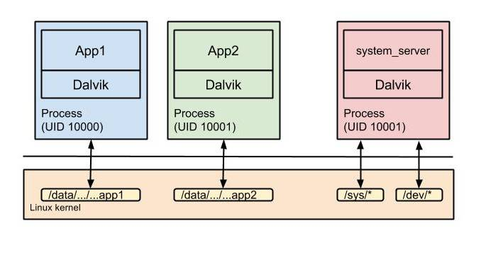
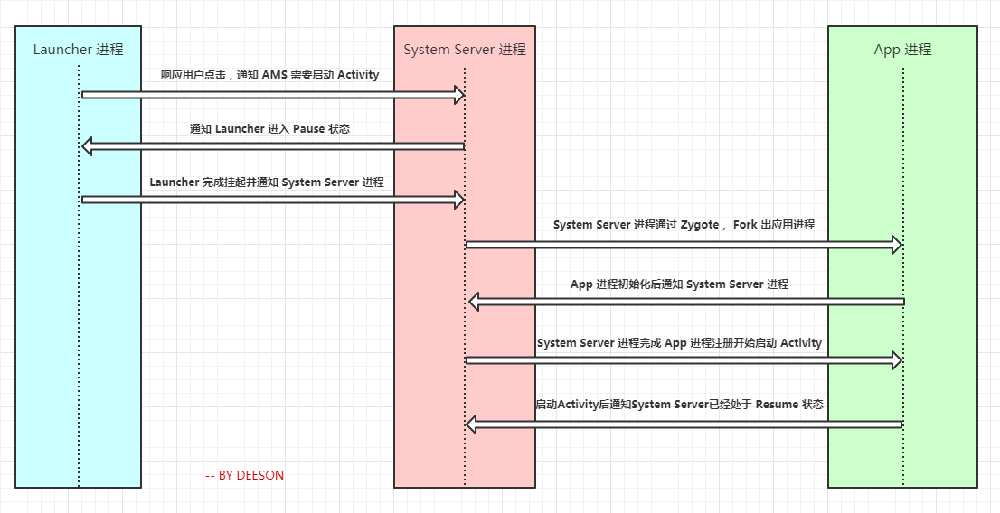
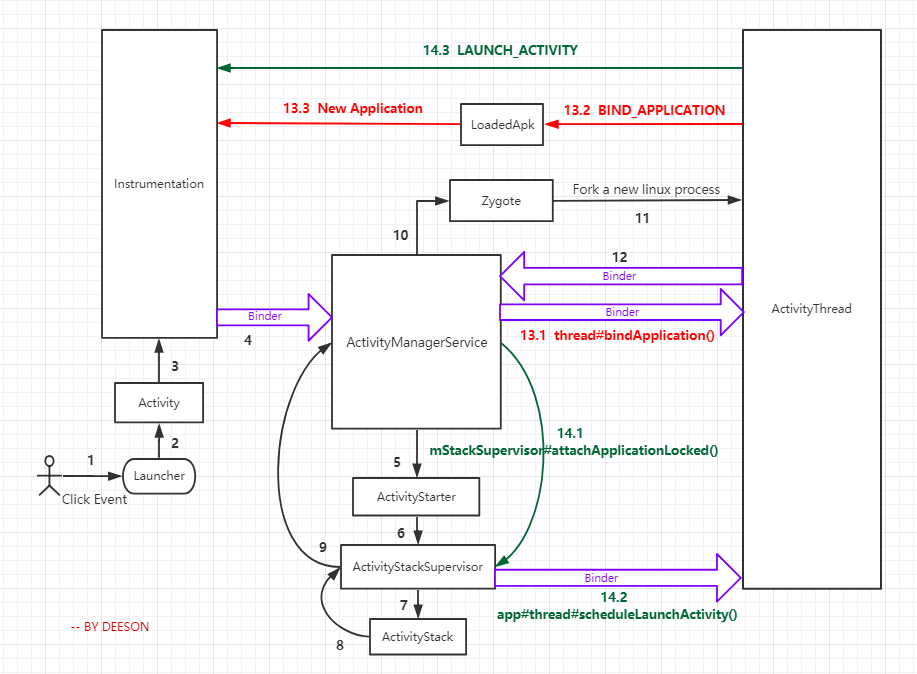

Android Application 启动流程分析及其源码调用探究

[](https://www.jianshu.com/u/f3d75e90904a)

12020.02.20 18:08:35字数 2,080阅读 1,187

### 一、写在前面

> 在开始之前，你需要知道下面几点：
> 
> - **有一份编译好的 Android 源码，现在的 AS 基本能满足，动手跟着步骤走，理解更深刻**
> - **对 Binder 机制有一定的了解**
> - **本文基于 API 26，用什么版本的源码并不重要，大体的流程并无本质上的区别**
> - **从用户手指触摸点击桌面图标到 Activity 启动**

> 关键类简介
> 
> - **ActivityManagerService**：AMS 是 Android 中最核心的服务之一，主要负责系统中四大组件的启动、切换、调度及应用进程的管理和调度等工作，其职责与操作系统中的进程管理和调度模块相类似，它本身也是一个 Binder 的实现类，应用进程能通过 Binder 机制调用系统服务。
> - **ActivityThread**：应用的入口类，系统通过调用main函数，开启消息循环队列。ActivityThread 所在线程被称为应用的主线程（UI 线程）。
> - **Instrumentation**：工具类，它用来监控应用程序和系统的交互，包装了 ActivityManagerService 的调用，一些插件化方案就是通过 hook 该类实现的。
> - **ActivityStarter**：Activity 启动的工具类，处理启动 Activity 的各种 flag 。
> - **ActivityStackSupervisor**：管理所有应用的 Activity 的栈，其中 mFocusedStack 就是当前应用的 Activity 栈。

> 应用进程介绍
> 
> - 在大多数情况下，每个 Android 应用都在各自的 Linux 进程中运行。当需要运行应用的一些代码时，系统会为应用创建此进程，并使其保持运行，直到不再需要它且系统需要回收其内存以供其他应用使用。
> - 应用进程的生命周期并不由应用本身直接控制，而是由系统综合多种因素来确定的，比如系统所知道的正在运行的应用部分、这些内容对用户的重要程度，以及系统中可用的总内存量。这是 Android 非常独特的一个基本功能。
> - 当应用组件启动且该应用未运行任何其他组件时，Android 系统会使用单个执行线程为应用启动新的 Linux 进程。默认情况下，同一应用的所有组件会在相同的进程和线程（称为“主”线程）中运行。如果某个应用组件启动且该应用已存在进程（因为存在该应用的其他组件），则该组件会在此进程内启动并使用相同的执行线程。但是，您可以安排应用中的其他组件在单独的进程中运行，并为任何进程创建额外的线程。
> - 每个应用进程都相当于一个 Sandbox 沙箱，Android 通过对每一个应用分配一个 UID，注意这里的 UID 不同于 Linux 系统的 User ID，可以将每个应用理解为一个 User ，只能对其目录下的内容具有访问和读写权限。
> - Android 利用远程过程调用 (RPC) 提供了一种进程间通信 (IPC) 机制，在此机制中，系统会（在其他进程中）远程执行由 Activity 或其他应用组件调用的方法，并将所有结果返回给调用方。因此，您需将方法调用及其数据分解至操作系统可识别的程度，并将其从本地进程和地址空间传输至远程进程和地址空间，然后在远程进程中重新组装并执行该调用。然后，返回值将沿相反方向传输回来。Android 提供执行这些 IPC 事务所需的全部代码，因此您只需集中精力定义和实现 RPC 编程接口。

下面这张图可以补充理解一下进程的概念：

  



进程隔离及通信

### 二、流程分析

先来一张流程简图：

  



app 启动流程简图

下面是流程详细图，带你看完整个启动流程及其所涉及到的类：

  



app 启动流程详细图

下面补充一张 Gityuan 大神的系统启动架构图帮助理解，其实只要看看这张图的上半部分就足够了：

  


android-boot

### 三、概述

简单地讲，从 **用户手指触摸点击桌面图标到 Activity启动** 可以用下面 4 步概括：

> 1.  当点击桌面 App 的时候，发起进程就是 Launcher 所在的进程，启动远程进程，利用 Binder 发送消息给 system_server 进程；

> 2.  在 system_server 中，启动进程的操作会先调用  
>     `ActivityManagerService#startProcessLocked()` 方法，该方法内部调用 `Process.start(android.app.ActivityThread)`；而后通过 socket 通信告知 Zygote 进程 fork 子进程，即 app 进程。进程创建后将 ActivityThread 加载进去，执行 `ActivityThread#main()`方法；

> 3.  在 app 进程中，`main()` 方法会实例化 ActivityThread，同时创建 ApplicationThread，Looper，Handler 对象，调用 `ActivityThread#attach(false)` 方法进行 Binder 通信，方法里面调用 `ActivityManagerService#attachApplication(mAppThread)` 方法，将 thread 信息告知 ActivityManagerService ， 接着 Looper 启动循环；

> 4.  回到 system_server 中，`ActivityManagerService#attachApplication(mAppThread)` 方法内部调用了 `thread#bindApplication()` 和 `mStackSupervisor#attachApplicationLocked()` 我们依次讲解这两个方法；  
>     4.1 `thread#bindApplication()` 方法调用了 `ActivityThread#sendMessage(H.BIND_APPLICATION, data)` 方法，最终走到了 `ActivityThread#handleBindApplication()`，进而创建 Application 对象，然后调用 `Application#attach(context)` 来绑定 Context ，创建完 Application 对象后便是调用 `mInstrumentation#callApplicationOnCreate()` 执行 `Application#onCreate()` 生命周期；  
>     4.2 `mStackSupervisor#attachApplicationLocked()` 方法中调用 `app#thread#scheduleLaunchActivity()` 即 `ActivityThread#ApplicationThread#scheduleLaunchActivity()` 方法，进而通过 `ActivityThread#sendMessage(H.LAUNCH_ACTIVITY, r)` 方法，最终走到了 `ActivityThread#handleLaunchActivity()` ，进而创建 Activity 对象，然后调用 `activity.attach()` 方法，再调用 `mInstrumentation#callActivityOnCreate()` 执行 `Activity#onCreate()` 生命周期；

### 四、源码调用探究

对应本文第一张流程图的每一个步骤，下面逐步来看看源码是怎么调用的：

#### STEP 1

用户点击 app 图标；

#### STEP 2

Launcher 捕获点击事件，调用 `Activity#startActivity()`；

#### STEP 3

`Activity#startActivity()` 调用 Instrumentation；

> Activity.java

```
    @Override
    public void startActivity(Intent intent) {
        this.startActivity(intent, null);
    }

    @Override
    public void startActivity(Intent intent, @Nullable Bundle options) {
        if (options != null) {
            startActivityForResult(intent, -1, options);
        } else {
            
            
            startActivityForResult(intent, -1);
        }
    }

    public void startActivityForResult(@RequiresPermission Intent intent, int requestCode,
            @Nullable Bundle options) {
        if (mParent == null) {
            options = transferSpringboardActivityOptions(options);
            Instrumentation.ActivityResult ar =
                mInstrumentation.execStartActivity(
                    this, mMainThread.getApplicationThread(), mToken, this,
                    intent, requestCode, options);
            ···
        } else {
            ···
        }
    }


```

#### STEP 4

Instrumentation 通过 Binder 通信发送消息给 system_server 进程，具体 调用 `ActivityManager#getService()#startActivity()` ，`ActivityManager#getService()` 的具体实现是 ActivityManagerService ；

> Instrumentation.java

```
    public ActivityResult execStartActivity(
            Context who, IBinder contextThread, IBinder token, Activity target,
            Intent intent, int requestCode, Bundle options) {
        ···
        try {
            intent.migrateExtraStreamToClipData();
            intent.prepareToLeaveProcess(who);
            int result = ActivityManager.getService()
                .startActivity(whoThread, who.getBasePackageName(), intent,
                        intent.resolveTypeIfNeeded(who.getContentResolver()),
                        token, target != null ? target.mEmbeddedID : null,
                        requestCode, 0, null, options);
            checkStartActivityResult(result, intent);
        } catch (RemoteException e) {
            throw new RuntimeException("Failure from system", e);
        }
        return null;
    }

```

> ActivityManager.java

```
    public static IActivityManager getService() {
        return IActivityManagerSingleton.get();
    }

    private static final Singleton<IActivityManager> IActivityManagerSingleton =
            new Singleton<IActivityManager>() {
                @Override
                protected IActivityManager create() {
                    final IBinder b = ServiceManager.getService(Context.ACTIVITY_SERVICE);
                    final IActivityManager am = IActivityManager.Stub.asInterface(b);
                    return am;
                }
            };

```

#### STEP 5

ActivityManagerService 调用 ActivityStarter；

> ActivityManagerService.java

```
    @Override
    public final int startActivity(IApplicationThread caller, String callingPackage,
            Intent intent, String resolvedType, IBinder resultTo, String resultWho, int requestCode,
            int startFlags, ProfilerInfo profilerInfo, Bundle bOptions) {
        return startActivityAsUser(caller, callingPackage, intent, resolvedType, resultTo,
                resultWho, requestCode, startFlags, profilerInfo, bOptions,
                UserHandle.getCallingUserId());
    }

    @Override
    public final int startActivityAsUser(IApplicationThread caller, String callingPackage,
            Intent intent, String resolvedType, IBinder resultTo, String resultWho, int requestCode,
            int startFlags, ProfilerInfo profilerInfo, Bundle bOptions, int userId) {
        enforceNotIsolatedCaller("startActivity");
        userId = mUserController.handleIncomingUser(Binder.getCallingPid(), Binder.getCallingUid(),
                userId, false, ALLOW_FULL_ONLY, "startActivity", null);
        
        return mActivityStarter.startActivityMayWait(caller, -1, callingPackage, intent,
                resolvedType, null, null, resultTo, resultWho, requestCode, startFlags,
                profilerInfo, null, null, bOptions, false, userId, null, null,
                "startActivityAsUser");
    }


```

#### STEP 6

ActivityStarter 调用 ActivityStackSupervisor；

```
    final int startActivityMayWait(IApplicationThread caller, int callingUid,
            String callingPackage, Intent intent, String resolvedType,
            IVoiceInteractionSession voiceSession, IVoiceInteractor voiceInteractor,
            IBinder resultTo, String resultWho, int requestCode, int startFlags,
            ProfilerInfo profilerInfo, WaitResult outResult,
            Configuration globalConfig, Bundle bOptions, boolean ignoreTargetSecurity, int userId,
            IActivityContainer iContainer, TaskRecord inTask, String reason) {
        ···
            int res = startActivityLocked(caller, intent, ephemeralIntent, resolvedType,
                    aInfo, rInfo, voiceSession, voiceInteractor,
                    resultTo, resultWho, requestCode, callingPid,
                    callingUid, callingPackage, realCallingPid, realCallingUid, startFlags,
                    options, ignoreTargetSecurity, componentSpecified, outRecord, container,
                    inTask, reason);

        ···
    }

    int startActivityLocked(IApplicationThread caller, Intent intent, Intent ephemeralIntent,
            String resolvedType, ActivityInfo aInfo, ResolveInfo rInfo,
            IVoiceInteractionSession voiceSession, IVoiceInteractor voiceInteractor,
            IBinder resultTo, String resultWho, int requestCode, int callingPid, int callingUid,
            String callingPackage, int realCallingPid, int realCallingUid, int startFlags,
            ActivityOptions options, boolean ignoreTargetSecurity, boolean componentSpecified,
            ActivityRecord[] outActivity, ActivityStackSupervisor.ActivityContainer container,
            TaskRecord inTask, String reason) {

        ···

        mLastStartActivityResult = startActivity(caller, intent, ephemeralIntent, resolvedType,
                aInfo, rInfo, voiceSession, voiceInteractor, resultTo, resultWho, requestCode,
                callingPid, callingUid, callingPackage, realCallingPid, realCallingUid, startFlags,
                options, ignoreTargetSecurity, componentSpecified, mLastStartActivityRecord,
                container, inTask);

       ···
        return mLastStartActivityResult;
    }

    private int startActivity(IApplicationThread caller, Intent intent, Intent ephemeralIntent,
            String resolvedType, ActivityInfo aInfo, ResolveInfo rInfo,
            IVoiceInteractionSession voiceSession, IVoiceInteractor voiceInteractor,
            IBinder resultTo, String resultWho, int requestCode, int callingPid, int callingUid,
            String callingPackage, int realCallingPid, int realCallingUid, int startFlags,
            ActivityOptions options, boolean ignoreTargetSecurity, boolean componentSpecified,
            ActivityRecord[] outActivity, ActivityStackSupervisor.ActivityContainer container,
            TaskRecord inTask) {
        ···

        return startActivity(r, sourceRecord, voiceSession, voiceInteractor, startFlags, true,
                options, inTask, outActivity);
    }

    private int startActivity(final ActivityRecord r, ActivityRecord sourceRecord,
            IVoiceInteractionSession voiceSession, IVoiceInteractor voiceInteractor,
            int startFlags, boolean doResume, ActivityOptions options, TaskRecord inTask,
            ActivityRecord[] outActivity) {
        ···
        try {
            mService.mWindowManager.deferSurfaceLayout();
            result = startActivityUnchecked(r, sourceRecord, voiceSession, voiceInteractor,
                    startFlags, doResume, options, inTask, outActivity);
        } finally {
           ···
        }
        ···
    }

    private int startActivityUnchecked(final ActivityRecord r, ActivityRecord sourceRecord,
            IVoiceInteractionSession voiceSession, IVoiceInteractor voiceInteractor,
            int startFlags, boolean doResume, ActivityOptions options, TaskRecord inTask,
            ActivityRecord[] outActivity) {

        ···
        if (mDoResume) {
            final ActivityRecord topTaskActivity =
                    mStartActivity.getTask().topRunningActivityLocked();
            if (!mTargetStack.isFocusable()
                    || (topTaskActivity != null && topTaskActivity.mTaskOverlay
                    && mStartActivity != topTaskActivity)) {
                ···
            } else {
               ···
                mSupervisor.resumeFocusedStackTopActivityLocked(mTargetStack, mStartActivity,
                        mOptions);
            }
        } else {
            ···
        }
        ···
    }


```

#### STEP 7

ActivityStackSupervisor 调用 ActivityStack；

```
    boolean resumeFocusedStackTopActivityLocked(
            ActivityStack targetStack, ActivityRecord target, ActivityOptions targetOptions) {
        if (targetStack != null && isFocusedStack(targetStack)) {
            return targetStack.resumeTopActivityUncheckedLocked(target, targetOptions);
        }
       ···
        return false;
    }


```

#### STEP 8

ActivityStack 回调到 ActivityStackSupervisor ；

```
    boolean resumeTopActivityUncheckedLocked(ActivityRecord prev, ActivityOptions options) {
       ···
        try {
            ···
            result = resumeTopActivityInnerLocked(prev, options);
        } finally {
            ···
        }
        ···
        return result;
    }

    private boolean resumeTopActivityInnerLocked(ActivityRecord prev, ActivityOptions options) {
     
        ···
        if (next.app != null && next.app.thread != null) {
           ···
        } else {
            ···
            mStackSupervisor.startSpecificActivityLocked(next, true, true);
        }
        ···
    }


```

#### STEP 9

ActivityStackSupervisor 回调到 ActivityManagerService，这里会判断要启动 App 的进程是否存在，存在则通知进程启动 Activity，否则就先将进程创建出来；

```
    void startSpecificActivityLocked(ActivityRecord r,
            boolean andResume, boolean checkConfig) {
       ···
        if (app != null && app.thread != null) {
            try {
               ···
                
                realStartActivityLocked(r, app, andResume, checkConfig);
                return;
            } catch (RemoteException e) {
                ···
            }
        }
        
        mService.startProcessLocked(r.processName, r.info.applicationInfo, true, 0,
                "activity", r.intent.getComponent(), false, false, true);
    }


```

#### STEP 10

接着我们来看看进程尚未创建的情况，我们看到这里最终调用的是 `Process#start()` 来启动进程；

> ActivityManagerService.java

```
    final ProcessRecord startProcessLocked(String processName,
            ApplicationInfo info, boolean knownToBeDead, int intentFlags,
            String hostingType, ComponentName hostingName, boolean allowWhileBooting,
            boolean isolated, boolean keepIfLarge) {
        return startProcessLocked(processName, info, knownToBeDead, intentFlags, hostingType,
                hostingName, allowWhileBooting, isolated, 0 , keepIfLarge,
                null , null , null ,
                null );
    }

    final ProcessRecord startProcessLocked(String processName, ApplicationInfo info,
            boolean knownToBeDead, int intentFlags, String hostingType, ComponentName hostingName,
            boolean allowWhileBooting, boolean isolated, int isolatedUid, boolean keepIfLarge,
            String abiOverride, String entryPoint, String[] entryPointArgs, Runnable crashHandler) {
        ···
        startProcessLocked(
                app, hostingType, hostingNameStr, abiOverride, entryPoint, entryPointArgs);
        ···
    }

    private final void startProcessLocked(ProcessRecord app, String hostingType,
            String hostingNameStr, String abiOverride, String entryPoint, String[] entryPointArgs) {
        ···
            if (entryPoint == null) entryPoint = "android.app.ActivityThread";
            Trace.traceBegin(Trace.TRACE_TAG_ACTIVITY_MANAGER, "Start proc: " +
                    app.processName);
            checkTime(startTime, "startProcess: asking zygote to start proc");
            ProcessStartResult startResult;
            if (hostingType.equals("webview_service")) {
                ···
            } else {
                startResult = Process.start(entryPoint,
                        app.processName, uid, uid, gids, debugFlags, mountExternal,
                        app.info.targetSdkVersion, seInfo, requiredAbi, instructionSet,
                        app.info.dataDir, invokeWith, entryPointArgs);
            }
            ···
    }


```

#### STEP 11

ActivityManagerService 通过 socket 通信告知 Zygote 进程 fork 子进程，即 app 进程；

#### STEP 12

进程创建后将 ActivityThread 加载进去，执行 `ActivityThread#main()` 方法，实例化 ActivityThread，同时创建 ApplicationThread，Looper，Hander 对象，调用 ActivityThread#attach(false) 方法进行 Binder 通信， 接着 Looper 启动循环；

> ActivityThread.java

```
   public static void main(String[] args) {
       ···
        Looper.prepareMainLooper();

        ActivityThread thread = new ActivityThread();
        thread.attach(false);

        if (sMainThreadHandler == null) {
            sMainThreadHandler = thread.getHandler();
        }
        ···
        Looper.loop();
        ···
    }


    private void attach(boolean system) {
        ···
        if (!system) {
            ···
            final IActivityManager mgr = ActivityManager.getService();
            try {
                mgr.attachApplication(mAppThread);
            } catch (RemoteException ex) {
                throw ex.rethrowFromSystemServer();
            }
            ···
        } else {
           ···
        }
        ···
    }


```

回到 system_server 中，`ActivityManagerService#attachApplication(mAppThread)` 方法内部调用了 `thread#bindApplication()` 和 `mStackSupervisor#attachApplicationLocked()` 这两个方法。

#### STEP 13

其中，`thread#bindApplication()` 方法调用了 `ActivityThread#sendMessage(H.BIND_APPLICATION, data)` 方法，最终走到了 `ActivityThread#handleBindApplication()`，进而创建 Application 对象，然后调用 `Application#attach(context)` 来绑定 Context ，创建完 Application 对象后便是调用 `mInstrumentation#callApplicationOnCreate()` 执行 `Application#onCreate()` 生命周期；

> ActivityManagerService.java

```
    @Override
    public final void attachApplication(IApplicationThread thread) {
        synchronized (this) {
            ···
            attachApplicationLocked(thread, callingPid);
            ···
        }
    }

    private final boolean attachApplicationLocked(IApplicationThread thread,
            int pid) {
        ···
        try {
            ···
            if (app.instr != null) {
                thread.bindApplication(processName, appInfo, providers,
                        app.instr.mClass,
                        profilerInfo, app.instr.mArguments,
                        app.instr.mWatcher,
                        app.instr.mUiAutomationConnection, testMode,
                        mBinderTransactionTrackingEnabled, enableTrackAllocation,
                        isRestrictedBackupMode || !normalMode, app.persistent,
                        new Configuration(getGlobalConfiguration()), app.compat,
                        getCommonServicesLocked(app.isolated),
                        mCoreSettingsObserver.getCoreSettingsLocked(),
                        buildSerial);
            } else {
                thread.bindApplication(processName, appInfo, providers, null, profilerInfo,
                        null, null, null, testMode,
                        mBinderTransactionTrackingEnabled, enableTrackAllocation,
                        isRestrictedBackupMode || !normalMode, app.persistent,
                        new Configuration(getGlobalConfiguration()), app.compat,
                        getCommonServicesLocked(app.isolated),
                        mCoreSettingsObserver.getCoreSettingsLocked(),
                        buildSerial);
            }
            ···
        } catch (Exception e) {
            ···
        }
        ···
        
        if (normalMode) {
            try {
                if (mStackSupervisor.attachApplicationLocked(app)) {
                    didSomething = true;
                }
            } catch (Exception e) {
                ···
            }
        }
        ···
    }

```

> ActivityThread#ApplicationThread.java

```
        public final void bindApplication(String processName, ApplicationInfo appInfo,
            ···
            sendMessage(H.BIND_APPLICATION, data);
        }


```

> ActivityThread.java

```
    private void sendMessage(int what, Object obj) {
        sendMessage(what, obj, 0, 0, false);
    }

    private void sendMessage(int what, Object obj, int arg1, int arg2, boolean async) {
        ···
        mH.sendMessage(msg);
    }


```

我们来看看这个 mH 的 `handleMessage()` 方法；

> ActivityThread#H.java

```
        public void handleMessage(Message msg) {
            ···
            switch (msg.what) {
                ···
                case BIND_APPLICATION:
                    Trace.traceBegin(Trace.TRACE_TAG_ACTIVITY_MANAGER, "bindApplication");
                    AppBindData data = (AppBindData)msg.obj;
                    handleBindApplication(data);
                    Trace.traceEnd(Trace.TRACE_TAG_ACTIVITY_MANAGER);
                    break;
                ···
            }
            ···
        }

```

创建 mInstrumentation 对象，调用 data#info#makeApplication 来创建 Application 对象；

> ActivityThread.java

```
    private void handleBindApplication(AppBindData data) {
        ···
        try {
            
            Application app = data.info.makeApplication(data.restrictedBackupMode, null);
            mInitialApplication = app;
            ···
            try {
                mInstrumentation.callApplicationOnCreate(app);
            } catch (Exception e) {
                ···
            }
        } finally {
            ···
        }
        ···
    }


```

> LoadedApk.java

```
    public Application makeApplication(boolean forceDefaultAppClass,
            Instrumentation instrumentation) {
        if (mApplication != null) {
            return mApplication;
        }
        ···
        Application app = null;
        ···
        try {
            ···
            app = mActivityThread.mInstrumentation.newApplication(
                    cl, appClass, appContext);
            ···
        } catch (Exception e) {
            ···
        }
        ···
        if (instrumentation != null) {
            try {
                
                instrumentation.callApplicationOnCreate(app);
            } catch (Exception e) {
                ···
            }
        }
        ···
        return app;
    }


```

#### STEP 14

`mStackSupervisor#attachApplicationLocked()` 方法中调用 `app#thread#scheduleLaunchActivity()` 即 `ActivityThread#ApplicationThread#scheduleLaunchActivity()` 方法，进而通过 `ActivityThread#sendMessage(H.LAUNCH_ACTIVITY, r)` 方法，最终走到了 `ActivityThread#handleLaunchActivity()` ，进而创建 Activity 对象，然后调用 `activity.attach()` 方法，再调用 `mInstrumentation#callActivityOnCreate()` 执行 `Activity#onCreate()` 生命周期；

> ActivityStackSupervisor.java

```
    boolean attachApplicationLocked(ProcessRecord app) throws RemoteException {
      
        for (int displayNdx = mActivityDisplays.size() - 1; displayNdx >= 0; --displayNdx) {
            ···
            for (int stackNdx = stacks.size() - 1; stackNdx >= 0; --stackNdx) {
                ···
                if (hr != null) {
                    if (hr.app == null && app.uid == hr.info.applicationInfo.uid
                            && processName.equals(hr.processName)) {
                        try {
                            if (realStartActivityLocked(hr, app, true, true)) {
                                didSomething = true;
                            }
                        } catch (RemoteException e) {
                            ···
                        }
                    }
                }
            }
        }
        ···
    }

    final boolean realStartActivityLocked(ActivityRecord r, ProcessRecord app,
            boolean andResume, boolean checkConfig) throws RemoteException {
        ···
        try {
            ···
            app.thread.scheduleLaunchActivity(new Intent(r.intent), r.appToken,
                    System.identityHashCode(r), r.info,
                    
                    
                    mergedConfiguration.getGlobalConfiguration(),
                    mergedConfiguration.getOverrideConfiguration(), r.compat,
                    r.launchedFromPackage, task.voiceInteractor, app.repProcState, r.icicle,
                    r.persistentState, results, newIntents, !andResume,
                    mService.isNextTransitionForward(), profilerInfo);
             ···
        } catch (RemoteException e) {
            ···
        }
        ···
    }


```

> ActivityThread#ApplicationThread.java

```
        @Override
        public final void scheduleLaunchActivity(Intent intent, IBinder token, int ident,
                ActivityInfo info, Configuration curConfig, Configuration overrideConfig,
                CompatibilityInfo compatInfo, String referrer, IVoiceInteractor voiceInteractor,
                int procState, Bundle state, PersistableBundle persistentState,
                List<ResultInfo> pendingResults, List<ReferrerIntent> pendingNewIntents,
                boolean notResumed, boolean isForward, ProfilerInfo profilerInfo) {
            ···
            sendMessage(H.LAUNCH_ACTIVITY, r);
        }


```

> ActivityThread.java

```
    private void sendMessage(int what, Object obj) {
        sendMessage(what, obj, 0, 0, false);
    }

    private void sendMessage(int what, Object obj, int arg1, int arg2, boolean async) {
        ···
        mH.sendMessage(msg);
    }


```

我们同样来看看这个 mH 的 `handleMessage()` 方法；

> ActivityThread#H.java

```
        public void handleMessage(Message msg) {
            if (DEBUG_MESSAGES) Slog.v(TAG, ">>> handling: " + codeToString(msg.what));
            switch (msg.what) {
                case LAUNCH_ACTIVITY: {
                    ···
                    handleLaunchActivity(r, null, "LAUNCH_ACTIVITY");
                    ···
                } break;
                ···
            }
            ···
        }


```

> ActivityThread.java

```
    private void handleLaunchActivity(ActivityClientRecord r, Intent customIntent, String reason) {
        ···
        Activity a = performLaunchActivity(r, customIntent);
        ···
    }

    private Activity performLaunchActivity(ActivityClientRecord r, Intent customIntent) {
        ···
        Activity activity = null;
        try {
            
            java.lang.ClassLoader cl = appContext.getClassLoader();
            activity = mInstrumentation.newActivity(
                    cl, component.getClassName(), r.intent);
           ···
        } catch (Exception e) {
            ···
        }

        try {
            ···

            if (activity != null) {
                ···
                activity.attach(appContext, this, getInstrumentation(), r.token,
                        r.ident, app, r.intent, r.activityInfo, title, r.parent,
                        r.embeddedID, r.lastNonConfigurationInstances, config,
                        r.referrer, r.voiceInteractor, window, r.configCallback);

                ···
                
                if (r.isPersistable()) {
                    mInstrumentation.callActivityOnCreate(activity, r.state, r.persistentState);
                } else {
                    mInstrumentation.callActivityOnCreate(activity, r.state);
                }
                ···
            }
            ···
        } catch (SuperNotCalledException e) {
            ···
        } catch (Exception e) {
            ···
    }


```

**到这里，整个 app 启动流程以及源码调用皆已分析完毕**。

"小禮物走一走，來簡書關注我"

还没有人赞赏，支持一下

[](https://www.jianshu.com/u/f3d75e90904a)

[涤生_Woo](https://www.jianshu.com/u/f3d75e90904a "涤生_Woo")[](https://www.jianshu.com/mobile/creator)Android工程师。中南大学。原创文章，如需转载，烦请注明作者和原出处。我的微信号：Dees...

总资产315 (约27.90元)共写了5.9W字获得2,086个赞共1,384个粉丝

### 被以下专题收入，发现更多相似内容

### 推荐阅读[更多精彩内容](https://www.jianshu.com/)

- dumpsys命令功能很强大，能dump系统服务的各种状态，非常有必要熟悉该命令的用法以及含义。 一、 概述\[ht...
    
- 前言 回顾一下自己这段时间的经历，三月份的时候，疫情原因公司通知了裁员，我匆匆忙忙地出去面了几家，但最终都没有拿到...
    
    [](https://www.jianshu.com/p/95dacea50488)
- 作者：RicardoMJiang 在下2017届毕业生，一名普通的211硕士，目前从事android开发工作已经3...
    
    [](https://www.jianshu.com/p/3680f00aaa8f)
- 1\. 安卓系统启动：安卓系统在第一个用户进程Init进程启动时，会解析init.rc脚本，启动zygote进程（执...
    
- EventBus原理，主要是通过注解和反射实现，将方法保存在公共队列中供其调用，首先在register()的时候，...
    
    [牧云风羽](https://www.jianshu.com/u/21120583a7e0)阅读 110评论 0赞 1