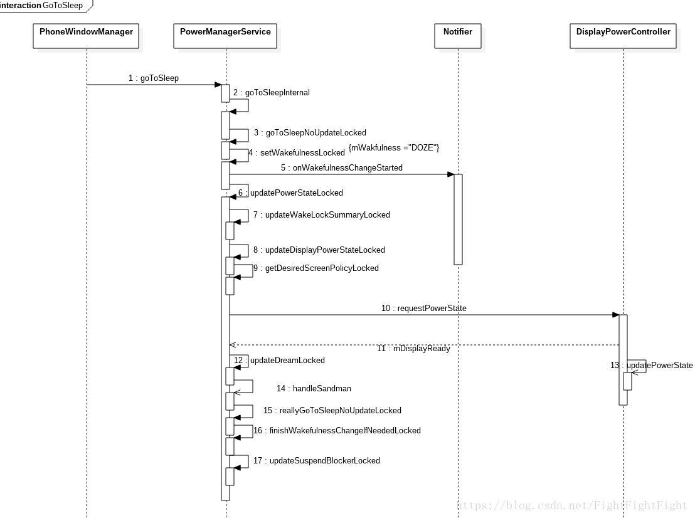
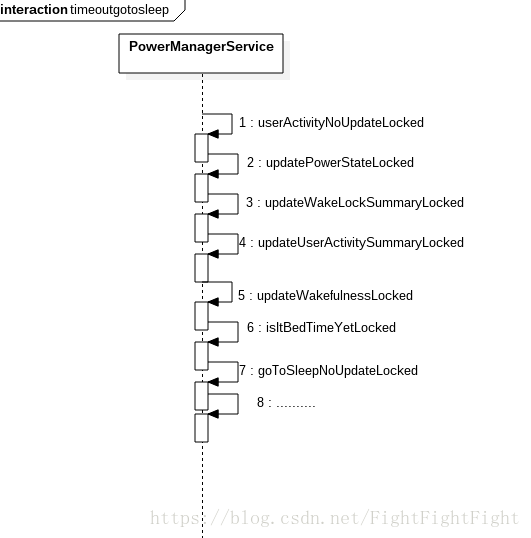

Android 手机灭屏流程分析详解

[](https://www.jianshu.com/u/ea1bd4a0705b)

0.9192019.01.14 17:54:48字数 2,674阅读 6,869

本篇文章主要介绍 `Android` 开发中的部分知识点，通过阅读本篇文章，您将收获以下内容:

> 1.前言  
> 2.Power键灭屏  
> 3.超时灭屏  
> 4.PSensor灭屏


  
**PowerManagerService** 之前系列文章请参考如下  
1.[PowerManagerService分析(一)之PMS启动](https://links.jianshu.com/go?to=https%3A%2F%2Fmp.weixin.qq.com%2Fs%2FMgi1W9mmrCUPkASTp3LPrA)  
2.[PowerManagerService分析(二)之updatePowerStateLocked()核心](https://links.jianshu.com/go?to=https%3A%2F%2Fmp.weixin.qq.com%2Fs%2FP3IvBrYt7afEa4XyEd3BQg)  
3.[PowerManagerService分析(三)之WakeLock机制](https://links.jianshu.com/go?to=https%3A%2F%2Fmp.weixin.qq.com%2Fs%2Fq3NLI_o3db7wRZ8ThKW3cQ)  
4.[Android手机亮屏流程分析](https://links.jianshu.com/go?to=https%3A%2F%2Fmp.weixin.qq.com%2Fs%2FErdSuXNeLGt81s5cBocaJQ)

#### 前言

在之前的`PMS`文章分析中知道，`PMS`中定义了四种屏幕状态：

- Awake状态：表示唤醒状态
- Dream状态：表示处于屏保状态
- Doze状态：表示处于Doze状态
- Asleep状态：表示处于休眠状态

#### Power键灭屏

当`power`键灭屏时，会在`PhoneWindowManager`中处理按键事件后，调用到`PMS`的`gotoSleep()`进行灭屏处理，下面直接看看`PhoneWindowManger`中对`Power`键灭屏的处理以及和`PMS`的交互。

在按`power`后，`PWS`中如下：

```
case KeyEvent.KEYCODE_POWER: {
    .......
    if (down) {
        
        interceptPowerKeyDown(event, interactive);
    } else 
        
        interceptPowerKeyUp(event, interactive, canceled);
    }
    break;
}


```

在处理`Power`键`interceptPowerKeyUp`抬起事件时，开始了灭屏流程：

```
    private void interceptPowerKeyUp(KeyEvent event, boolean interactive, boolean canceled) {
   
    .......
        if (!handled) {
          
            
            powerPress(eventTime, interactive, mPowerKeyPressCounter);
        }

        
        finishPowerKeyPress();
    }

```

`powerPress`灭屏流程

```
private void powerPress(long eventTime, boolean interactive, int count) {
    if (mScreenOnEarly && !mScreenOnFully) {
        Slog.i(TAG, "Suppressed redundant power key press while "
                + "already in the process of turning the screen on.");
        return;
    }
    if (count == 2) {
       ......
    } else if (interactive && !mBeganFromNonInteractive) {
        switch (mShortPressOnPowerBehavior) {
            
            case SHORT_PRESS_POWER_GO_TO_SLEEP:
                goToSleep(eventTime, PowerManager.GO_TO_SLEEP_REASON_POWER_BUTTON, 0);
                break;
            
            case SHORT_PRESS_POWER_REALLY_GO_TO_SLEEP:
                goToSleep(eventTime, PowerManager.GO_TO_SLEEP_REASON_POWER_BUTTON,
                        PowerManager.GO_TO_SLEEP_FLAG_NO_DOZE);
                break;
                } else {
                    shortPressPowerGoHome();
                }
                break;
            }
        }
    }
}


```

在这里调用了`goToSleep()`方法，该方法如下：

```
private void goToSleep(long eventTime, int reason, int flags) {
    mRequestedOrGoingToSleep = true;
    mPowerManager.goToSleep(eventTime, reason, flags);
}


```

最终，`PhoneWindowManager`中调用了`PowerManager`的`goToSleep()`方法来灭屏。

现在我们进入到`PowerManager.goToSleep()`方法：

```
public void goToSleep(long time, int reason, int flags) {
    try {
        mService.goToSleep(time, reason, flags);
    } catch (RemoteException e) {
        throw e.rethrowFromSystemServer();
    }
}


```

可以看到，在`PowerManger`中开始向下调用到了`PoweManagerService`(以下简称PMS)中的`goToSleep()`中。  
我们进`入PMS`中，就需要详细分析其中的方法了，先来看看`goToSleep()`方法：

```

@Override 
public void goToSleep(long eventTime, int reason, int flags) {
    if (eventTime > SystemClock.uptimeMillis()) {
        throw new IllegalArgumentException("event time must not be in the future");
    }
    
    mContext.enforceCallingOrSelfPermission(
            android.Manifest.permission.DEVICE_POWER, null);

    final int uid = Binder.getCallingUid();
    final long ident = Binder.clearCallingIdentity();
    try {
        
        goToSleepInternal(eventTime, reason, flags, uid);
    } finally {
        Binder.restoreCallingIdentity(ident);
    }
}


```

这个方法的参数和`PowerManager,PhoneWindowManager`中的同名方法对应，需要注意的是第二个参数和第三个参数；  
第二个参数：表示灭屏原因，在PowerManager中定义了一些常量值来表示；  
第三个参数：是一个标识，用来表示是否直接进入灭屏，一般的灭屏流程，都会先进入Doze状态，然后才会进入Sleep状态，如果将flag设置为1，则将会直接进入Sleep状态，这部分会在下文中逐渐分析到。

在`goToSleep()`方法中，检查权限之后，开始调用了`goToSleepInternal()`方法，该方法如下：

```
private void goToSleepInternal(long eventTime, int reason, int flags, int uid) {
    synchronized (mLock) {
        if (goToSleepNoUpdateLocked(eventTime, reason, flags, uid)) {
            updatePowerStateLocked();
        }
    }
}


```

这个方法逻辑很简单，首先是调用了`goToSleepNoUpdateLocked()`方法，并根据该方法返回值来决定是否调用`updatePowerStateLocked()`方法。

一般来说，`goToSleepNoUpdateLocked()`都会返回true，现在看看该方法：

```
@SuppressWarnings("deprecation")
private boolean goToSleepNoUpdateLocked(long eventTime, int reason, int flags, int uid) {

    if (eventTime < mLastWakeTime
            || mWakefulness == WAKEFULNESS_ASLEEP
            || mWakefulness == WAKEFULNESS_DOZING
            || !mBootCompleted || !mSystemReady) {
        return false;
    }
    try {
        switch (reason) {
            case PowerManager.GO_TO_SLEEP_REASON_DEVICE_ADMIN:
                Slog.i(TAG, "Going to sleep due to device administration policy "
                        + "(uid " + uid +")...");
                break;
            case PowerManager.GO_TO_SLEEP_REASON_TIMEOUT:
                Slog.i(TAG, "Going to sleep due to screen timeout (uid " + uid +")...");
                break;
            case PowerManager.GO_TO_SLEEP_REASON_LID_SWITCH:
                Slog.i(TAG, "Going to sleep due to lid switch (uid " + uid +")...");
                break;
            case PowerManager.GO_TO_SLEEP_REASON_POWER_BUTTON:
                Slog.i(TAG, "Going to sleep due to power button (uid " + uid +")...");
                break;
            case PowerManager.GO_TO_SLEEP_REASON_SLEEP_BUTTON:
                Slog.i(TAG, "Going to sleep due to sleep button (uid " + uid +")...");
                break;
            case PowerManager.GO_TO_SLEEP_REASON_HDMI:
                Slog.i(TAG, "Going to sleep due to HDMI standby (uid " + uid +")...");
                break;
            case PowerManager.GO_TO_SLEEP_REASON_ACCESSIBILITY:
                Slog.i(TAG, "Going to sleep by an accessibility service request (uid "
                        + uid +")...");
                break;
            default:
                Slog.i(TAG, "Going to sleep by application request (uid " + uid +")...");
                reason = PowerManager.GO_TO_SLEEP_REASON_APPLICATION;
                break;
        }
        
        mLastSleepTime = eventTime;
        
        mSandmanSummoned = true;
        
        setWakefulnessLocked(WAKEFULNESS_DOZING, reason);

        
        
        int numWakeLocksCleared = 0;
        final int numWakeLocks = mWakeLocks.size();
        for (int i = 0; i < numWakeLocks; i++) {
            final WakeLock wakeLock = mWakeLocks.get(i);
            switch (wakeLock.mFlags & PowerManager.WAKE_LOCK_LEVEL_MASK) {
                case PowerManager.FULL_WAKE_LOCK:
                case PowerManager.SCREEN_BRIGHT_WAKE_LOCK:
                case PowerManager.SCREEN_DIM_WAKE_LOCK:
                    numWakeLocksCleared += 1;
                    break;
            }
        }
        
        
        if ((flags & PowerManager.GO_TO_SLEEP_FLAG_NO_DOZE) != 0) {
            
            reallyGoToSleepNoUpdateLocked(eventTime, uid);
        }
    } finally {
        Trace.traceEnd(Trace.TRACE_TAG_POWER);
    }
    return true;
}


```

在这个方法中：  
首先，是判断调用该方法的原因并打印log，该log在日常分析问题时非常有用；  
然后，通过`setWakefulnessLocked()`将当前`wakefulness`设置为`Doze`状态；  
最后，通过flag判断，如果flag为1,则调用`reallyGoToSleepNoUpdateLocked()`方法直接进入`Sleep`状态。  
因此，系统其他模块在调用`PM.goToSleep()`灭屏时，在除指定flag为`PowerManager.GO_TO_SLEEP_FLAG_NO_DOZE`的情况外，都会首先进入`Doze`，再由Doze进入Sleep。

`setWakefulnessLocked()`方法用来设置`wakefulness`值，同时将会调用`Notifier`中`wakefulness`相关的逻辑，这部分在之前的流程分析中也分析过，这里再来看下：

```
@VisibleForTesting
void setWakefulnessLocked(int wakefulness, int reason) {
    if (mWakefulness != wakefulness) {
        
        mWakefulness = wakefulness;
        mWakefulnessChanging = true;
        mDirty |= DIRTY_WAKEFULNESS;
        if (mNotifier != null) {
            
            mNotifier.onWakefulnessChangeStarted(wakefulness, reason);
        }
    }
}


```

我们跟着执行流程来进行分析，`Notifier`是`PMS`模块中用于进行“通知”的一个组件类，比如发送亮灭屏广播就是它来负责，具体详细的分析请[点击这里](https://links.jianshu.com/go?to=https%3A%2F%2Fmp.weixin.qq.com%2Fs%2FErdSuXNeLGt81s5cBocaJQ) 查看。这里针对于灭屏场景，再来看下其中的逻辑：

```
public void onWakefulnessChangeStarted(final int wakefulness, int reason) {
    
    final boolean interactive = PowerManagerInternal.isInteractive(wakefulness);
    
    
    
    if (mInteractive != interactive) {
        
        if (mInteractiveChanging) {
            handleLateInteractiveChange();
        }
        
        mInteractive = interactive;
        mInteractiveChangeReason = reason;
        mInteractiveChanging = true;
        
        handleEarlyInteractiveChange();
    }
}


```

在这个方法中，首先根据`wakefulness`值判断了系统当前的交互状态，如果是处于`Awake`状态和`Dream`状态，则表示可交互；如果处于`Doze`和`Asleep`状态，则表示不可交互；  
由于在`setWakefulnessLocked()`中已经设置了`wakefulness为DOZE`状态，因此此时处于不可交互状态，接下来开始执行`handleEarlyInteractiveChange()`方法：

```
private void handleEarlyInteractiveChange() {
    synchronized (mLock) {
        
        if (mInteractive) {
            
            mHandler.post(new Runnable() {
                @Override
                public void run() {
                    
                    mPolicy.startedWakingUp();
                }
            });
            
            mPendingInteractiveState = INTERACTIVE_STATE_AWAKE;
            mPendingWakeUpBroadcast = true;
            updatePendingBroadcastLocked();
        } else {
            final int why = translateOffReason(mInteractiveChangeReason);
            mHandler.post(new Runnable() {
                @Override
                public void run() {
                    
                    mPolicy.startedGoingToSleep(why);
                }
            });
        }
    }
}


```

在这个方法中，将调用`mPolicy.startedGoingToSleep(why)`进行锁屏流程(Keyguard的绘制)。

回到`PMS`中，在处理完`setWakefulnessLocked()`方法后，由于没有`PowerManager.GO_TO_SLEEP_FLAG_NO_DOZE`，所以不会立即执行`reallyGoToSleepNoUpdateLocked()`方法，此时`goToSleepNoUpdateLocked()`方法完毕并返回true。

之后开始执行`updatePowerStateLocked()`方法了，这个方法对于熟悉PMS模块的人来说再熟悉不过了，它是整个PMS的核心，详细的分析请[点击这里](https://links.jianshu.com/go?to=PowerManagerService%25E5%2588%2586%25E6%259E%2590%28%25E4%25BA%258C%29%25E4%25B9%258BupdatePowerStateLocked%28%29%25E6%25A0%25B8%25E5%25BF%2583) , 在这里我们只看其灭屏时的一些处理。

在`updatePowerStateLocked()`方法中，和灭屏直接相关的有如下部分：

```

boolean displayBecameReady = updateDisplayPowerStateLocked(dirtyPhase2);

updateDreamLocked(dirtyPhase2, displayBecameReady);

finishWakefulnessChangeIfNeededLocked();

updateSuspendBlockerLocked();


```

- `updateDisplayPowerStateLocked()`将会向`DisplayPowerController`请求新的屏幕状态，完成屏幕的更新；
    
- `updateDreamLocked()`方法用来更新屏保信息，除此之外还有一个任务  
    调用`reallyGoToSleep()`方法进入休眠，即由DOZE状态进入Sleep状态。
    
- `finishWakefulnessChangeIfNeededLocked()`方法用来做最后的收尾工作，当然，在这里会调用到`Notifier`中进行收尾。
    
- `updateSuspendBlockerLocked()`方法将用来更新`SuspendBlocker`锁，会根据当前的`WakeLock`类型以及屏幕状态来决定是否需要申请`SuspendBlocker`锁。
    

在`updateDreamLocked()`中更新屏保状态时，如果此时处于Doze状态且没有进行屏保，则将调用`reallyGoToSleepNoUpdateLocked()`方法，将`wakefulness`值设置为了`Sleep`,部分代码如下：

```
else if (wakefulness == WAKEFULNESS_DOZING) {
                if (isDreaming) {
                    return; 
                }

                
                reallyGoToSleepNoUpdateLocked(SystemClock.uptimeMillis(), Process.SYSTEM_UID);
                updatePowerStateLocked();
            }


```

再来看看该方法：

```
private boolean reallyGoToSleepNoUpdateLocked(long eventTime, int uid) {
    if (eventTime < mLastWakeTime || mWakefulness == WAKEFULNESS_ASLEEP
            || !mBootCompleted || !mSystemReady) {
        return false;
    }

    try {
        
        setWakefulnessLocked(WAKEFULNESS_ASLEEP, 
                  PowerManager.GO_TO_SLEEP_REASON_TIMEOUT);
    } finally {
        Trace.traceEnd(Trace.TRACE_TAG_POWER);
    }
    return true;
}


```

以上就是整个`Power`键灭屏`PMS`部分的流程，其时序图如下：  



#### 超时灭屏

经过上面的分析，我们知道了`Power键灭屏`由`PhoneWindowManager`发起了`goToSleep`，现在来看看超时灭屏是如何实现的。

超时灭屏主要有`两个影响因素`：`休眠时间`和`用户活动`。休眠时间在`Settings`中进行设置，用户活动是指当手机处于亮屏状态，都会调用`userActivityNoUpdateLocked()`方法去更新用户活动时间。接下来我们就从`userActivityNoUpdateLocked()`方法开始分析其超时灭屏的流程。

首先来看该方法：

```
    private boolean userActivityNoUpdateLocked(long eventTime, int event, int flags, int uid) {

        if (eventTime < mLastSleepTime || eventTime < mLastWakeTime
                || !mBootCompleted || !mSystemReady) {
            return false;
        }

            mNotifier.onUserActivity(event, uid);
           
            if (mUserInactiveOverrideFromWindowManager) {
                mUserInactiveOverrideFromWindowManager = false;
                mOverriddenTimeout = -1;
            }
            
            if (mWakefulness == WAKEFULNESS_ASLEEP
                    || mWakefulness == WAKEFULNESS_DOZING
                    || (flags & PowerManager.USER_ACTIVITY_FLAG_INDIRECT) != 0) {
                return false;
            }
            
            if ((flags & PowerManager.USER_ACTIVITY_FLAG_NO_CHANGE_LIGHTS) != 0) {
                if (eventTime > mLastUserActivityTimeNoChangeLights
                        && eventTime > mLastUserActivityTime) {
                    
                    mLastUserActivityTimeNoChangeLights = eventTime;
                    mDirty |= DIRTY_USER_ACTIVITY;
                    if (event == PowerManager.USER_ACTIVITY_EVENT_BUTTON) {
                        mDirty |= DIRTY_QUIESCENT;
                    }

                    return true;
                }
            } else {
                if (eventTime > mLastUserActivityTime) {
                    
                    mLastUserActivityTime = eventTime;
                    mDirty |= DIRTY_USER_ACTIVITY;
                    if (event == PowerManager.USER_ACTIVITY_EVENT_BUTTON) {
                        mDirty |= DIRTY_QUIESCENT;
                    }
                    return true;
                }
            }
        } finally {
            Trace.traceEnd(Trace.TRACE_TAG_POWER);
        }
        return false;
    }


```

在这个方法中，如果传入的参数flag为`PowerManager.USER_ACTIVITY_FLAG_NO_CHANGE_LIGHTS`，则将事件时间赋值给`mLastUserActivityTimeNoChangeLights`,否则将事件时间赋值给`mLastUserActivityTime`。这个flag标志用于延长亮屏或Dim的时长一小会儿。

当这个方法执行之后，就得到了`mLastUserActivityTime`或者`mLastUserActivityTimeNoChangeLights`的值，然后经过一些调用后，又会进入`updatePowerStateLocked()`方法中。在这个方法中，和超市灭屏直接相关的就是for循环部分：

```
            for (;;) {
                int dirtyPhase1 = mDirty;
                dirtyPhase2 |= dirtyPhase1;
                mDirty = 0;

                updateWakeLockSummaryLocked(dirtyPhase1);
                updateUserActivitySummaryLocked(now, dirtyPhase1);
                if (!updateWakefulnessLocked(dirtyPhase1)) {
                    break;
                }
            }


```

其中`updateWakeLockSummaryLocked()`用来统计`WakeLock`，这里就不分析该方法了，详细的分析请[点击这里](https://links.jianshu.com/go?to=https%3A%2F%2Fmp.weixin.qq.com%2Fs%2FP3IvBrYt7afEa4XyEd3BQg)，现在从`updateUserActivitySummaryLocked()`方法开始分析，该方法如下：

```
    private void updateUserActivitySummaryLocked(long now, int dirty) {
        
        if ((dirty & (DIRTY_WAKE_LOCKS | DIRTY_USER_ACTIVITY
                | DIRTY_WAKEFULNESS | DIRTY_SETTINGS)) != 0) {
            mHandler.removeMessages(MSG_USER_ACTIVITY_TIMEOUT);

            long nextTimeout = 0;
            if (mWakefulness == WAKEFULNESS_AWAKE
                    || mWakefulness == WAKEFULNESS_DREAMING
                    || mWakefulness == WAKEFULNESS_DOZING) {
                
                
                final int sleepTimeout = getSleepTimeoutLocked();
                
                final int screenOffTimeout = getScreenOffTimeoutLocked(sleepTimeout);
                
                final int screenDimDuration = getScreenDimDurationLocked(screenOffTimeout);
                
                final boolean userInactiveOverride = mUserInactiveOverrideFromWindowManager;
                
                mUserActivitySummary = 0;
                
                if (mLastUserActivityTime >= mLastWakeTime) {
                    
                    nextTimeout = mLastUserActivityTime
                            + screenOffTimeout - screenDimDuration;
                    
                    if (now < nextTimeout) {
                        mUserActivitySummary = USER_ACTIVITY_SCREEN_BRIGHT;
                    } else {
                        
                        
                        
                        nextTimeout = mLastUserActivityTime + screenOffTimeout;
                        if (now < nextTimeout) {
                            mUserActivitySummary = USER_ACTIVITY_SCREEN_DIM;
                        }
                    }
                }
                
                if (mUserActivitySummary == 0
                        && mLastUserActivityTimeNoChangeLights >= mLastWakeTime) {
                    
                    nextTimeout = mLastUserActivityTimeNoChangeLights + screenOffTimeout;
                    
                    if (now < nextTimeout) {
                        if (mDisplayPowerRequest.policy == DisplayPowerRequest.POLICY_BRIGHT
                                || mDisplayPowerRequest.policy == DisplayPowerRequest.POLICY_VR) {
                            mUserActivitySummary = USER_ACTIVITY_SCREEN_BRIGHT;
                        } else if (mDisplayPowerRequest.policy == DisplayPowerRequest.POLICY_DIM) {
                            mUserActivitySummary = USER_ACTIVITY_SCREEN_DIM;
                        }
                    }
                }
                
                
                if (mUserActivitySummary == 0) {
                    if (sleepTimeout >= 0) {
                        
                        final long anyUserActivity = Math.max(mLastUserActivityTime,
                                mLastUserActivityTimeNoChangeLights);
                        if (anyUserActivity >= mLastWakeTime) {
                            nextTimeout = anyUserActivity + sleepTimeout;
                            
                            if (now < nextTimeout) {
                                mUserActivitySummary = USER_ACTIVITY_SCREEN_DREAM;
                            }
                        }
                    } else {
                        
                        mUserActivitySummary = USER_ACTIVITY_SCREEN_DREAM;
                        nextTimeout = -1;
                    }
                }

                if (mUserActivitySummary != USER_ACTIVITY_SCREEN_DREAM && userInactiveOverride) {
                    if ((mUserActivitySummary &
                            (USER_ACTIVITY_SCREEN_BRIGHT | USER_ACTIVITY_SCREEN_DIM)) != 0) {
                        
                        if (nextTimeout >= now && mOverriddenTimeout == -1) {
                            
                            mOverriddenTimeout = nextTimeout;
                        }
                    }
                    mUserActivitySummary = USER_ACTIVITY_SCREEN_DREAM;
                    nextTimeout = -1;
                }
                if (mUserActivitySummary != 0 && nextTimeout >= 0) {
                    
                    Message msg = mHandler.obtainMessage(MSG_USER_ACTIVITY_TIMEOUT);
                    msg.setAsynchronous(true);
                    mHandler.sendMessageAtTime(msg, nextTimeout);
                }
            } else {
                mUserActivitySummary = 0;
            }
        }
    }


```

该方法用来更新用户活动状态，其中细节在代码中都进行了注释，该方法中来看，通过`Handler`多次再此进入`updatePowerStateLocked（）`从而调用`updateUserActivitySummaryLocked()`方法，直到`nextTime=-1`和`mUserActivitySummary=0`时将不再发送`Handler`，从而完成了`mUserActivitySummary`的更新。根据流程来看，当设备从亮屏到休眠时间到达灭屏，`mUserActivitySummary`的值的变化应为：  
`USER_ACTIVITY_SCREEN_BRIGHT—>USER_ACTIVITY_SCREEN_DIM—>USER_ACTIVITY_SCREEN_DREAM—>0.`  
Handler的调用处理逻辑如下：

```
        @Override
        public void handleMessage(Message msg) {
            switch (msg.what) {
                case MSG_USER_ACTIVITY_TIMEOUT:
                    handleUserActivityTimeout();
                    break;
            }
        }

    private void handleUserActivityTimeout() { 
        synchronized (mLock) {
            mDirty |= DIRTY_USER_ACTIVITY;
            updatePowerStateLocked();
        }
    }


```

当执行到这个方法后，现在就统计得到了`mWakeLockSummary和mUserActivitySummary`的值，现在我们看下一个方法——`updateWakefulnessLocked（）`，在for循环中，会根据该方法返回值来决定是否进行循环，为何会如此设计呢？在分析完该方法后，就会有答案了，如下：

```
    private boolean updateWakefulnessLocked(int dirty) {
        boolean changed = false;
        if ((dirty & (DIRTY_WAKE_LOCKS | DIRTY_USER_ACTIVITY | DIRTY_BOOT_COMPLETED
                | DIRTY_WAKEFULNESS | DIRTY_STAY_ON | DIRTY_PROXIMITY_POSITIVE
                | DIRTY_DOCK_STATE)) != 0) {
            
            if (mWakefulness == WAKEFULNESS_AWAKE && isItBedTimeYetLocked()) {
                final long time = SystemClock.uptimeMillis();
                if (shouldNapAtBedTimeLocked()) {
                    changed = napNoUpdateLocked(time, Process.SYSTEM_UID);
                } else {
                    changed = goToSleepNoUpdateLocked(time,
                            PowerManager.GO_TO_SLEEP_REASON_TIMEOUT, 0, Process.SYSTEM_UID);
                }
            }
        }
        return changed;
    }


```

这个方法中可以看到，首先根据isItBedTimeYetLocked()和mWakefulness来决定是否执行，然后根据`shouldNapAtBedTimeLocked（）`决定进入屏保还是休眠。  
该方法如果返回值为true，则说明此时屏幕状态发生改变(在`goToSleepNoUpdateLocked()`和`napNoUpdateLocked()`中会分别设置`mWakefulness`为DREAM和ASLEEP)，因此将不会跳出for循环，再次进行一次循环。这就是为何会设置一个死循环的目的，同时也说明只有超时灭屏才会循环两次，其他情况下都会只执行一次for循环就退出。

回到该方法中，我们继续看看`isItBedTimeYetLocked（）：`

```
    private boolean isItBedTimeYetLocked() {
        return mBootCompleted && !isBeingKeptAwakeLocked();
    }

    private boolean isBeingKeptAwakeLocked() {
        return mStayOn
                || mProximityPositive
                || (mWakeLockSummary & WAKE_LOCK_STAY_AWAKE) != 0
                || (mUserActivitySummary & (USER_ACTIVITY_SCREEN_BRIGHT
                        | USER_ACTIVITY_SCREEN_DIM)) != 0
                || mScreenBrightnessBoostInProgress;
    }


```

以上代码可以看出，如果有任意一个条件为true，那么就不能进入休眠或者屏保状态，因此只有全部为false时，才会返回false，从而说明需要“睡觉”了。

仔细看这个方法，这里正是`mWakeLockSummary`和`mUserActivitySummary`的作用体现之一。

在平时分析问题时，如果存在无法超时灭屏问题，就需要查看`mWakeLockSummary`和`mUserActivitySummary`的值了。前者查看是否存在亮屏锁，后者查看用户活动是否已经处于0了。  
现在继续分析`updateWakfulnessLocked()`方法中的下一个逻辑，当进入if语句后，就开始判断是要进入屏保呢？还是要直接休眠呢？

如果`shouldNapAtBedTimeLocked（）`返回true，则开始屏保，否则直接休眠，这里对于屏保相关就不再分析了，以后的时间中如果有机会，会单独进行分析。

当开始休眠时，直接调用了`goToSleepNoUpdateLocked()`方法中了，于是开始走休眠流程，之后的逻辑和`Power键灭屏`一样了。

整个超时灭屏的流程分析就到这里了，从以上流程中可以看到，`mWakeLockSummary`和`mUserActivitySummayr`的作用相当重要，我之前在android4.4手机上遇到过一个问题就是到达休眠时间后不会灭屏，分析后发现有一个应用申请了一个`PowerManager.SCREEN_BRIGHT_WAKE_LOCK`锁，该锁导致`mWakeLockSummary & WAKE_LOCK_STAY_AWAKE) != 0`，从而没有灭屏。  
整个超时灭屏流程的时序图如下：



#### PSensor灭屏

**什么是PSensor灭屏呢？**  
`Proximity Sensor`，即距离传感器，当通话或微信时，如果脸部靠近屏幕，将会灭屏，这就是通过`PSenso`r灭屏的。  
**为何会有PSensor灭屏呢？**  
为了防止脸部误触，有更好的用户体验。

在原生的`Android`系统中，`PSensor灭屏`不同于`Power键灭屏`和`超时灭屏`，前者仅仅是设置屏幕的状态和关闭背光，而后两者在设置屏幕的状态和关闭背光后，让CPU也进入了休眠状态`(如果不持有PowerManger.PARTIAL_WAKE_LOCK)。`

`PSensor`灭屏涉及到更多的是`DisplayPowerController`中的内容，因此，将会在之后的文章中进行分析。


  
**友情推荐：**  
[Android 干货分享](https://links.jianshu.com/go?to=https%3A%2F%2Fmp.weixin.qq.com%2Fs%2FzOTO6z7bvHGhN0lhTMvR8w)

至此，本篇已结束，如有不对的地方，欢迎您的建议与指正。同时期待您的关注，感谢您的阅读，谢谢！


[](https://www.jianshu.com/u/ea1bd4a0705b)

[程序员Android1](https://www.jianshu.com/u/ea1bd4a0705b "程序员Android1")和您一起终身学习，这里是程序员Android。 这是一个专注提供 Java Androi...

总资产148 (约6.35元)共写了39.1W字获得875个赞共564个粉丝

### 被以下专题收入，发现更多相似内容

### 推荐阅读[更多精彩内容](https://www.jianshu.com/)

- 和您一起终身学习，这里是程序员Android PowerManagerService 之前系列文章请参考如下1.P...
    
    [](https://www.jianshu.com/p/961207f442f9)
- 我们按下电源键就会灭屏，再按一下就会唤醒屏幕，这个是怎样的过程呢。 电源键有许多额外功能，为了能让这个主题更加清晰...
    
- Android的平台上，耗电量的问题一直被人所诟病。从Lollipop开始，Google也一直非常重视对于省电模式...
    
    [猿氏物语](https://www.jianshu.com/u/cecbae773735)阅读 1,323评论 0赞 3
    
    [](https://www.jianshu.com/p/095bd974c925)
- 和您一起终身学习，这里是程序员Android 概述 PowerManagerService 是负责管理、协调设备电...
    
    [](https://www.jianshu.com/p/b797ebd11c92)
- Android 优化目录 Android 5.0 后用 Battery Historian 工具分析电量。 耗电因...
    
    [七适散人](https://www.jianshu.com/u/de895f0d5942)阅读 1,650评论 0赞 3