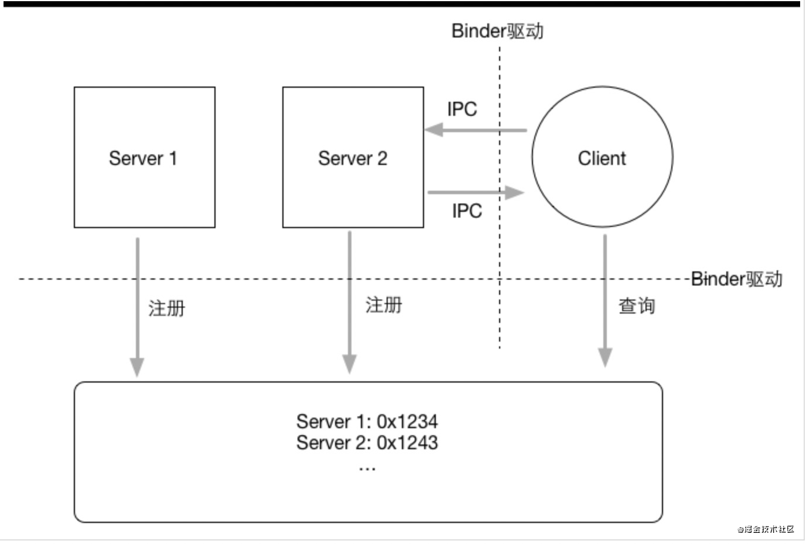
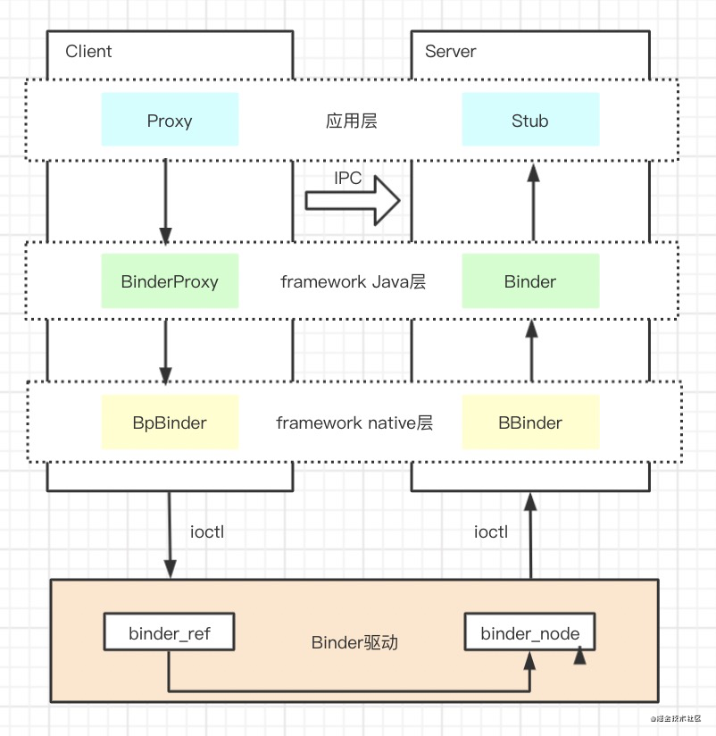
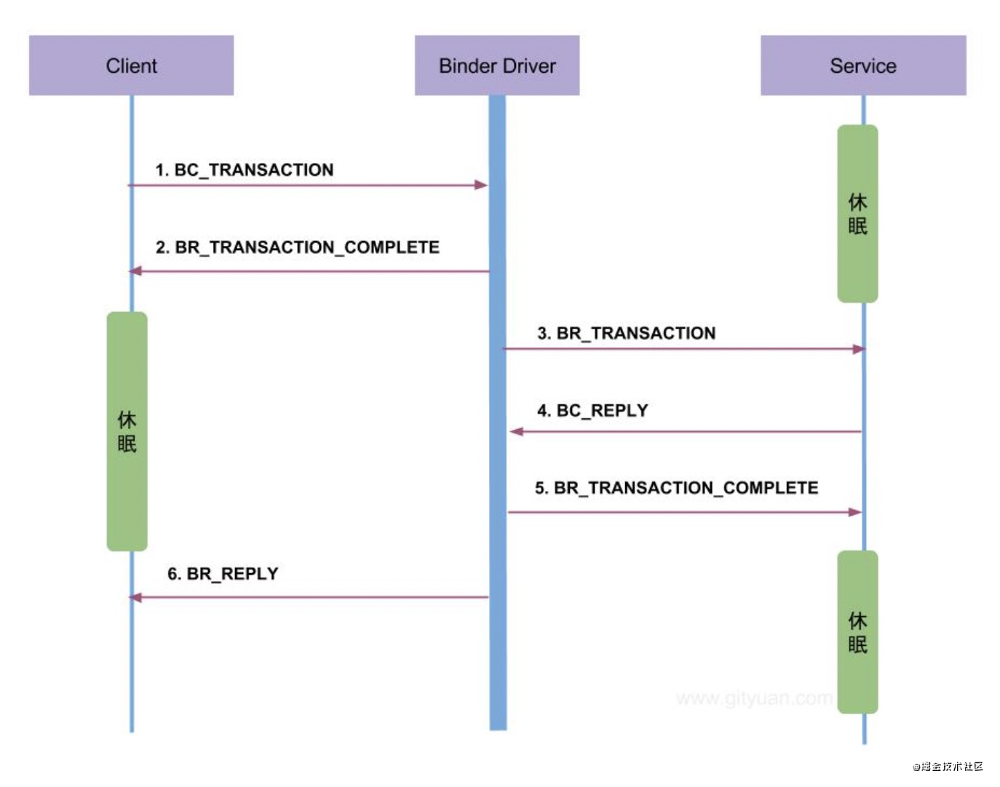
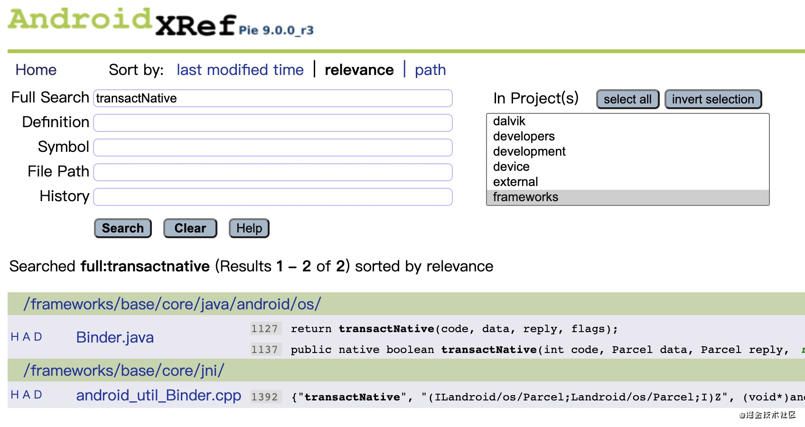
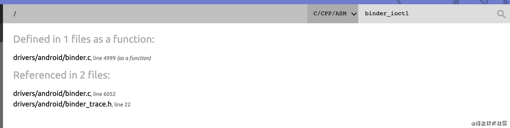

Binder 初探

Binder 翻译为粘合剂，确实它也配得上这个词，可以说整个Android系统组件都是通过Binder进行通信的。

阅读本文前推荐先学习 AIDL 相关的知识。[AIDL介绍](https://www.yuque.com/kakasi/xlzyhv/lqgpiy)

## 背景知识

Binder 是一个很庞大的模块， 贯穿了整个 Android 系统，而Android系统又是基于Linux内核，因此需要了解一些必要的前置知识。

**进程隔离**

> 进程隔离是为保护操作系统中进程互不干扰而设计的一组不同硬件和软件的技术。这个技术是为了避免进程A写入进程B的情况发生。 进程的隔离实现，使用了虚拟地址空间。进程A的虚拟地址和进程B的虚拟地址不同，这样就防止进程A将数据信息写入进程B。

Android系统每个应用都是一个独立的进程，进程之间数据不共享，互相之间不知道对方的存在。

**用户空间/内核空间**

普通进程就属于用户空间，而内核空间指的是Linux内核所处的空间。内核空间是受保护的，用户空间没有权限去访问内核空间，因为Linux内核是操作系统的核心，是高安全级别的。用户空间只能通过内核空间开放的口子去访问一些受许可的资源。

**系统调用/内核态/用户态**

系统调用就是上小节说的内核空间会开放一些口子给用户空间去获取资源，如访问文件。用户空间能访问内核空间的唯一方式也只能是系统调用了，在Binder一文里会出现一些系统调用，如 open, ioctl, mmap 等。

当用户进程执行代码通过系统调用陷入内核代码，此时叫做内核态。

当用户进程执行应用程序代码，此时叫做用户态。

## Binder 概览

**Binder是Android系统的跨进程通信机制。**

### 为什么使用Binder？

Linux 内核支持多种跨进程通信机制，如 Socket、管道、消息队列、共享内存等，而选用Binder的原因主要是性能、安全、稳定性方面。

对于跨进程通信而言，肯定会涉及到数据的拷贝，Socket/管道/消息队列需要2次数据拷贝，而 Binder 只需要1次数据拷贝， 性能大大提升。但共享内存其实是 0 次数据拷贝，为什么不选择共享内存呢？我们平时做过多线程开发就会发现，处理一些共享变量是需要谨慎的控制锁，写大量的复杂逻辑， 而共享内存也是同理，为了使用便捷采用Binder机制我们就不需要考虑这些问题了。

Android 为每个安装好的应用程序分配了一个UID，UID是鉴别进程身份的重要标记，而这种标记是能被内核模块添加的，这样Binder通信过程中就能进行进程UID的校验，从而保证安全性。而其他方式如socket，它是无法保证整数据不被篡改，因为ip是开放的，即使在数据包里写入 UID/PID，也无法阻止恶意程序拦截篡改数据。

### Binder通信模型

Binder通信模型是典型的C/S模型，表面上看起来就是 Client 和 Server 端直接IPC，其实内部有非常复杂的逻辑来支撑。先上一张好图：



整个通信过程有四个重要角色：Client, Server, ServiceManager, Binder驱动，大致通信步骤：

1.  系统启动时ServiceManager所在的守护进程先向Binder驱动申请作为通讯录，其实它也是一个Server端的Binder，内部会有一张表用来管理剩余的所有Server端句柄，而它自身的句柄是 0，Binder驱动可以直接获取它。
2.  有很多的Server端通过系统调用，经过Binder驱动，然后注册到这个ServiceManager中，表的key是Binder的全限定类名，value是在Binder中的句柄。
3.  Client端要调用Server端的方法，首先获取到ServiceManager代理类，通过Binder驱动找到ServiceManager实体获取到Server端的句柄，使用这个句柄在Binder驱动中传输数据，最后走到Server端Java层Binder实体执行真正的逻辑。

可以看到每个步骤都会经过Binder驱动，它是整个通信的核心。 文字描述可能有些点并不理解，这里看懂图中的流程即可。

## 手写 Binder 跨进程通信

本文重在对Binder的整体流程以及应用层方面的理解，虽然 [AIDL](https://www.yuque.com/kakasi/xlzyhv/lqgpiy) 已经帮助我们简化了Binder的模板代码，但是我们依然需要去熟悉怎么去实现一个Binder应用层通信代码，接着再去深入就更有意义了。

```
public interface IUserBinder extends IInterface {

    String getUserInfo(User user) throws RemoteException;

    abstract class Stub extends Binder implements IUserBinder {

        private static final String DESCRIPTOR = "com.example.service.binder.IUserBinder";
        private static final int TRANSACTION_getUserInfo = FIRST_CALL_TRANSACTION + 0;

        public Stub() {
            // 把本进程的Binder实例和描述符保存起来
            this.attachInterface(this, DESCRIPTOR);
        }

        public static IUserBinder asInterface(IBinder obj) {
            if(obj == null) {
                return null;
            }
            // 先根据描述符来尝试获取本地的Binder实例，如果是同进程调用就会有这个实例，那么直接返回；
            // 否则obj是一个Binder代理，需要远程调用对应的方法，于是用代理模式封装成一个看似直接调用接口方法的代理类。
            IInterface iin = obj.queryLocalInterface(DESCRIPTOR);
            if(iin != null && iin instanceof IUserBinder) {
                return (IUserBinder) obj;
            }
            return new Proxy(obj);
        }

        @Override
        public IBinder asBinder() {
            return this;
        }

        /**
         * 这个方法是服务端的入口，接收来自客户端IPC从而调用真正的方法。
         * @param code
         * @param data
         * @param reply
         * @param flags
         * @return
         * @throws RemoteException
         */
        @Override
        protected boolean onTransact(int code, @NonNull Parcel data, @Nullable Parcel reply, int flags) throws RemoteException {
            switch (code) {
                case INTERFACE_TRANSACTION: {
                    // 写入接口描述符，用于客户端校验
                    reply.writeString(DESCRIPTOR);
                    return true;
                }
                // 与客户端写入的code匹配，表示调用了getUserInfo方法。
                // code默认是从FIRST_CALL_TRANSACTION依次递增。
                case TRANSACTION_getUserInfo: {
                    data.enforceInterface(DESCRIPTOR);
                    User _user;
                    // data是客户端传来的数据，若有则反序列化转成对象
                    if(0 != data.readInt()) {
                        _user = User.CREATOR.createFromParcel(data);
                    }else {
                        _user = null;
                    }
                    // 执行真正的方法，并返回结果。
                    String _result = this.getUserInfo(_user);
                    reply.writeNoException();
                    // 结果写入响应数据，待客户端接收。
                    reply.writeString(_result);
                    return true;
                }
                default: {
                    return super.onTransact(code, data, reply, flags);
                }
            }
        }

        /**
         * 代理类就是供客户端使用的
         */
        private static class Proxy implements IUserBinder {

            private IBinder mRemote;
            public static IUserBinder sDefaultImpl;

            public Proxy(IBinder remote) {
                // mRemote就是Binder远程代理类
                this.mRemote = remote;
            }
            @Override
            public String getUserInfo(User user) throws RemoteException {
                // 从对象池获取空的可序列化对象。
                // _data是客户端传给服务端的对象，_reply是服务端响应客户端的对象
                Parcel _data = Parcel.obtain();
                Parcel _reply = Parcel.obtain();
                String _result;
                try {
                    // 写入Binder的描述符，用于身份校验
                    _data.writeInterfaceToken(DESCRIPTOR);
                    if(user != null) {
                        // 头部写入1，表示客户端有数据传到服务端。
                        // 正好对应了服务端接收时readInt校验不等于0
                        _data.writeInt(1);
                        // 把user写到_data
                        user.writeToParcel(_data, 0);
                    }else {
                        _data.writeInt(0);
                    }
                    // 代理类会走到native层然后走驱动再走服务端，最终返回是否成功调用
                    boolean _status = mRemote.transact(Stub.TRANSACTION_getUserInfo, _data, _reply, 0);
                    if(!_status && getsDefaultImpl() != null) {
                        // 如果调用不成功，则进入兜底方法。
                        return getsDefaultImpl().getUserInfo(user);
                    }
                    _reply.readException();
                    // 读取调用结果
                    _result = _reply.readString();
                }finally {
                    _reply.recycle();
                    _data.recycle();
                }
                return _result;
            }

            @Override
            public IBinder asBinder() {
                return mRemote;
            }

            public String getInterfaceDescriptor() {
                return DESCRIPTOR;
            }

            public static boolean setDefaultImpl(IUserBinder impl) {
                if(Proxy.sDefaultImpl != null) {
                    throw new IllegalStateException("setDefaultImpl() called twice");
                }
                if(impl != null) {
                    sDefaultImpl = impl;
                    return true;
                }
                return false;
            }

            public static IUserBinder getsDefaultImpl() {
                return sDefaultImpl;
            }
        }
    }

}
复制代码
```

直接上完整的代码，注释也已经在代码中。服务端和客户端都需要有 IUserBinder 接口和 User 类。唯一不同的是，服务端需要实现 Stub 抽象类，并实现 getUserInfo 方法，以及需要声明一个 Service 类，在 onBind 方法里返回 binder。客户端需要做的是绑定这个 Service，并获取到这个binder的代理类，然后就可以自由的调用接口方法了。具体实现代码就不贴出了，可以在 [AIDL介绍](https://www.yuque.com/kakasi/xlzyhv/lqgpiy) 中看到完整的实现。

**IInterface**

Binder接口的基类。定义新接口时，必须从IInterface派生它。

通俗来讲，我们去自定义跨进程通信的接口方法时都必须要实现 IInterface 接口，IInterface 唯一的接口方法 asBinder 关联了 Binder 对象（本地Binder实例或Binder代理）。

**Parcel**

可以通过IBinder发送消息（数据和对象引用）的容器。一个Parcel既可以包含将在IPC的另一侧进行扁平化的数据（基本类型、通用的Parcelable接口），还可以包含对IBinder实体对象的代理引用，这就让两端的IBinder关联了起来。

**IBinder**

它代表了**一种跨进程传输的能力**；只要实现了这个接口，就能将这个对象进行跨进程传递；这是驱动底层支持的；在跨进程数据流经驱动的时候，驱动会识别IBinder类型的数据，从而自动完成不同进程Binder本地对象以及Binder代理对象的转换。

可远程对象的基本接口，轻量级远程过程调用机制的核心部分，旨在在执行进程内和跨进程调用时实现高性能。该接口描述了与可远程对象进行交互的抽象协议。不要直接实现此接口，而应继承Binder抽象类。

IBinder 接口中最关键的两个方法是 transact 和 onTransact。前者是发送调用事务，后者是接受前者发送的调用。这两个方法是同步的，从 A 进程 transact 远程调用到 B 进程的 onTransact 方法后，需等待 onTransact 方法执行完成后才会继续执行 A 进程后续的代码。当然也可以用 oneway 实现异步调用 。

通过 transact 发送的数据是一个 Parcel 对象，这是数据的通用缓冲区，还维护一些有关其内容的元数据。元数据用于管理缓冲区中的 IBinder 对象引用，以便在缓冲区跨进程移动时可以维护这些引用。这种机制确保当将IBinder 写到 Parcel 对象中并发送到另一个进程时，如果该另一个进程将对同一 IBinder 的引用发送回原始进程，则原始进程将返回相同的 IBinder 对象。这些语义允许将 IBinder / Binder 对象用作可以跨进程管理的唯一标识（用作令牌或用于其他目的）。

系统在运行的每个进程中维护一个事务线程池。这些线程用于分派来自其他进程的所有IPC。例如，当从进程A到进程B创建IPC时，A中的调用线程在将事务发送到进程B时阻塞了transact。B中的下一个可用池线程接收到传入的事务，调用 onTransact 方法并返回 Parcel 结果。接收到其结果后，进程A中的线程将返回以允许其执行继续。所以 B 进程执行在异步线程中，这个线程不需要你自己创建。

有几种监听到 Binder 不再可用的方法：

- transact 方法抛出 RemoteException 异常。
- 调用 pingBinder 方法，返回false表示Binder已被销毁。
- 调用 linkToDeath 方法，注册一个 DeathRecipient 对象，可以监听到 Binder 何时被销毁的。

**Binder**

实现了IBinder接口，代表Binder本地对象。

**BinderProxy**

实现了IBinder接口，代表Binder代理对象。

写一个Binder类并不难，每个步骤都还是挺清晰的，而且都是模板代码，所以才会有AIDL的出现。但Binder的原理是非常复杂的，接下来就看下Binder的通信流程。

## 一次 Binder 通信流程

其实在大多数Binder的应用场景是匿名Binder(匿名Binder的意思是没有在ServiceManager内注册过)，并不会涉及到ServiceManager， 比如本章节通过绑定Service来获取Binder的方式就是匿名Binder，所以我们只分析这种情况，暂时不管ServiceManager原理。在 [Binder通信模型](#Binder%E9%80%9A%E4%BF%A1%E6%A8%A1%E5%9E%8B) 章节里已有图解体现了四大角色 Client, Server, ServiceManager, Binder驱动通信流程。 现在从更细的角度看下流程中角色的转换。



从应用层到Java层已经介绍的比较清楚了。再总结下，BinderProxy 是 Server 端 Binder 实体的代理类，Proxy 代理实现了功能接口并持有BinderProxy远程代理，让客户端使用起来像是直接调用远程Binder；Binder和BinderProxy都是IBinder的实现类，他们可以跨进程传输，Stub 抽象类继承了 Binder 并实现了功能接口，要求Server端对功能接口做具体的实现。

当 A 进程发起 bindService 时，我们会在 ServiceConnection 的 onServiceConnected 方法获取 B 进程 Service 的 onBind 方法返回的Binder对应的远程代理对象。由于本节的重点在于我们自定义的Binder通信流程，所以这边简单用文字总结下：

**当 A 进程发起 bindService 后，实际上会走到 ContextImpl 的 bindService 方法，然后通过 ServiceManager 查找到 ActivityManagerService(下面简写AMS) 的代理对象紧接着调用其 bindService 方法，此时代码已经处于系统进程内。在系统进程会根据传入的包名、类名去找到Service对应的进程，如果进程未启动则启动进程，接着 AMS 会通过 ApplicationThread 代理远程调用 B 进程的 scheduleCreateService 方法，此时代码处于 B 进程，创建完了之后继续远程调用回到系统进程，系统进程又会调用 scheduleBindService 走到 B 进程去绑定服务，这个时候就把我们自定义的Binder拿到了。然后又把我们的Binder传到系统进程，最后再通过远程调用回到 A 进程并拿到 Binder。**

对我们应用来说就几句代码，然而整个过程经历了数次 Binder 跨进程通信，你说Binder重不重要？还是那句话这里的重点不是系统的ServiceManager, AMS 等组件，我们先走一遍日常应用场景下的 Binder 流程。在此之前，先放一张图大致了解流程的走向，记住图中的命令都是很重要的。



继上一节的 \[手写 Binder 跨进程通信\](#手写 Binder 跨进程通信) 客户端进程获得了 BinderProxy 代理对象然后调用了 transact 方法，马上我们就会发现它直接调用了native方法 transactNative 直接走到了 c++ 层了。以上 Java 层的源码分析我们都能随便在一个项目里用 AS 查看。但到了 native 层就不行了，除了自己编译 Android 源码之外，我推荐用直接看网上源码 [androidxref](http://androidxref.com/)，可以搜文件、搜内容等，挺方便的。



### Client端与Binder驱动通信

transactNative 在 native 层对应的是 android\_os\_BinderProxy_transact 函数。

```
// android_util_Binder.app
static jboolean android_os_BinderProxy_transact(JNIEnv* env, jobject obj,
        jint code, jobject dataObj, jobject replyObj, jint flags) // throws RemoteException
{
		// ......
		// java层传入的data和reply转为c++层的parcel对象
    Parcel* data = parcelForJavaObject(env, dataObj);
    Parcel* reply = parcelForJavaObject(env, replyObj);
    // java层的BinderProxy对象转换成native层的BpBinder对象
    IBinder* target = getBPNativeData(env, obj)->mObject.get();
    // 调用了 BpBinder.transact 函数
    status_t err = target->transact(code, *data, reply, flags);
    // ......
}
复制代码
```

系统源码会省略很多，我们只看关键代码。调用了 BpBinder.transact 后实际上马上就调用了 IPCThreadState 的 transact 函数。

```
// IPCThreadState.cpp
status_t IPCThreadState::transact(int32_t handle,
                                  uint32_t code, const Parcel& data,
                                  Parcel* reply, uint32_t flags)
{
    status_t err;
    // 主要是把BpBinder对象指针、code、data写到 binder_transaction_data 数据结构里
    err = writeTransactionData(BC_TRANSACTION, flags, handle, code, data, NULL);
    // 这里区分 ONE_WAY 的逻辑，同步or异步
    if ((flags & TF_ONE_WAY) == 0) {
        if (reply) {
            err = waitForResponse(reply);
        } else {
            Parcel fakeReply;
            err = waitForResponse(&fakeReply);
        }
    } else {
        err = waitForResponse(NULL, NULL);
    }
    return err;
}
复制代码
```

**这里出现的“命令”比较重要，BC前缀表示用户进程往Binder驱动发消息，BR前缀表示Binder驱动往用户进程发消息。** 记住这里写入了 BC\_TRANSATION 命令。再关注下binder\_transaction\_data结构体，我们把它称作数据包，它是会贯穿整个Binder驱动数据传输流程的，最后writeTransactionData把命令和binder\_transaction\_data写入mOut对象内，等待之后一起写入binder\_write_read结构里。然后走到 waitForResponse 看看。

```
// IPCThreadState.cpp
status_t IPCThreadState::waitForResponse(Parcel *reply, status_t *acquireResult)
{
    uint32_t cmd;
    int32_t err;
    while (1) {
        if ((err=talkWithDriver()) < NO_ERROR) break;
        // 这部分代码也非常关键，晚点回来再分析
        // ......
    }
}
复制代码
```

继续跟 talkWithDriver 函数：

```
// IPCThreadState.cpp
status_t IPCThreadState::talkWithDriver(bool doReceive)
{
    if (mProcess->mDriverFD <= 0) {
        return -EBADF;
    }
    binder_write_read bwr;
    const bool needRead = mIn.dataPosition() >= mIn.dataSize();
    const size_t outAvail = (!doReceive || needRead) ? mOut.dataSize() : 0;
    // 把 mOut 对象内的数据写到 binder_write_read 对象的写缓冲区
    bwr.write_size = outAvail;
    bwr.write_buffer = (uintptr_t)mOut.data();
    if (doReceive && needRead) {
        bwr.read_size = mIn.dataCapacity();
        bwr.read_buffer = (uintptr_t)mIn.data();
    } else {
        bwr.read_size = 0;
        bwr.read_buffer = 0;
    }
    status_t err;
    do {
    		// ioctl是系统调用，BINDER_WRITE_READ也是一个内核的命令
        if (ioctl(mProcess->mDriverFD, BINDER_WRITE_READ, &bwr) >= 0)
            err = NO_ERROR;
    } while (err == -EINTR);
    return err;
}
复制代码
```

可以看到这里又出现了个 binder\_write\_read 数据结构，主要是保存写数据和读数据的，最后走了非常关键的一步，那就是ioctl系统调用，这个时候我们就要进入内核态了。BINDER\_WRITE\_READ 命令很常用。该命令的参数包括两部分数据：一部分是向Binder写入的数据，一部分是要从Binder读出的数据，驱动程序先处理写部分再处理读部分。这样安排的好处是应用程序可以很灵活地处理命令的同步或异步。例如若要发送异步命令可以只填入写部分而将read\_size置成0；若要只从Binder获得数据可以将写部分置空即write\_size置成0；若要发送请求并同步等待返回数据可以将两部分都置上。

这部分我们得去Linux源码看看了，依然推荐一个线上源码网站 [Linux Source Code](https://elixir.bootlin.com/linux/latest/source) 。



注意走到 Linux 源码后，函数名是 binder_ioctl ：

```
// drivers/android/binder.c
static long binder_ioctl(struct file *filp, unsigned int cmd, unsigned long arg)
{
	int ret;
	switch (cmd) {
	case BINDER_WRITE_READ:
		ret = binder_ioctl_write_read(filp, cmd, arg, thread);
		if (ret)
			goto err;
		break;
	return ret;
}
复制代码
```

继续跟进 binder\_ioctl\_write_read 函数：

```
// drivers/android/binder.c
static int binder_ioctl_write_read(struct file *filp,
				unsigned int cmd, unsigned long arg,
				struct binder_thread *thread)
{
	int ret = 0;
	void __user *ubuf = (void __user *)arg;
	struct binder_write_read bwr;
	// 用户空间缓存区中的bwr拷贝至内核空间缓存区中的bwr
	if (copy_from_user(&bwr, ubuf, sizeof(bwr))) {
		ret = -EFAULT;
		goto out;
	}
	if (bwr.write_size > 0) {
		ret = binder_thread_write(proc, thread,
					  bwr.write_buffer,
					  bwr.write_size,
					  &bwr.write_consumed);
	}
	if (bwr.read_size > 0) {
		ret = binder_thread_read(proc, thread, bwr.read_buffer,
					 bwr.read_size,
					 &bwr.read_consumed,
					 filp->f_flags & O_NONBLOCK);
	}
out:
	return ret;
}
复制代码
```

这里又出现了系统调用 copy\_from\_user 函数，与其对应的是 copy\_to\_user(内核空间拷贝至用户空间)。如果从 A 进程的用户空间缓存区拷贝至内核空间缓存区，然后从内核空间缓存区拷贝至 B 进程，那么就不是Binder赖以成名的一次拷贝了，所以这里涉及到 mmap 来映射内核空间缓存区与用户空间缓存区，从而使得只用一次 copy\_from\_user 拷贝就好了，这里不展开来讲，本文主要是走一遍流程。好了，现在 bwr 对象就是内核空间的内存了，之前提到过的 binder\_write\_read 对象其实还是在用户进程的内存中的。我们这里先不看 binder\_thread\_read 函数，这个会在后面的章节涉及，先看 write 部分，进到 binder\_thread\_write 函数：

```
// drivers/android/binder.c
static int binder_thread_write(struct binder_proc *proc,
			struct binder_thread *thread,
			binder_uintptr_t binder_buffer, size_t size,
			binder_size_t *consumed)
{
	uint32_t cmd;
	// buffer可以理解为之前写入bwr.write_buffer的mOut.data数据，包括命令和binder_transaction_data
	void __user *buffer = (void __user *)(uintptr_t)binder_buffer;
	// 未使用的缓存区buffer内存的偏移量
	void __user *ptr = buffer + *consumed;
	// 缓存区buffer内存结束位置
	void __user *end = buffer + size;
	while (ptr < end && thread->return_error.cmd == BR_OK) {
		int ret;
		// 从buffer读取cmd命令，都是最开始的32位
		if (get_user(cmd, (uint32_t __user *)ptr))
			return -EFAULT;
		// 每次读取指针要偏移
		ptr += sizeof(uint32_t);
		switch (cmd) {
		// 这是两个最重要的命令
		case BC_TRANSACTION:
		case BC_REPLY: {
			struct binder_transaction_data tr;
			// 拷贝出写缓存区内 binder_transaction_data 结构的一段内存，个人理解这里已经是内核空间的拷贝了，应该不会消耗太多性能
			if (copy_from_user(&tr, ptr, sizeof(tr)))
				return -EFAULT;
			// 每次都要计算偏移位置
			ptr += sizeof(tr);
			binder_transaction(proc, thread, &tr,
					   cmd == BC_REPLY, 0);
			break;
		}
		*consumed = ptr - buffer;
	}
	return 0;
}
复制代码
```

代码中已有注释，继续跟进 binder_transaction 函数：

```
// drivers/android/binder.c
static void binder_transaction(struct binder_proc *proc,
			       struct binder_thread *thread,
			       struct binder_transaction_data *tr, int reply,
			       binder_size_t extra_buffers_size)
{
	int ret;
	struct binder_transaction *t;
  struct binder_work *tcomplete;
	binder_size_t buffer_offset = 0;
	binder_size_t off_start_offset, off_end_offset;
	struct binder_proc *target_proc = NULL;
	struct binder_thread *target_thread = NULL;
	struct binder_node *target_node = NULL;

  // 读写都在这个函数里了，先看写的部分
	if (reply) {
		// ......
	} else {
    // handle之前提到过就是Binder代理对象在用户空间的指针
		if (tr->target.handle) {
			struct binder_ref *ref;
			// 在这个节点上必须已经有一个强引用。如果是，则对该节点执行强递增操作，以确保该节点在事务完成之前存活。
			binder_proc_lock(proc);
      // 获取在进程中保存着的bind_ref对象
			ref = binder_get_ref_olocked(proc, tr->target.handle,
						     true);
			if (ref) {
        // 实际上binder_ref引用内就保存着binder_node实体的地址
				target_node = binder_get_node_refs_for_txn(
						ref->node, &target_proc,
						&return_error);
			} else {
				binder_user_error("%d:%d got transaction to invalid handle\n",
						  proc->pid, thread->pid);
				return_error = BR_FAILED_REPLY;
			}
			binder_proc_unlock(proc);
		} else {
			// ...
		}

		if (!(tr->flags & TF_ONE_WAY) && thread->transaction_stack) {
			struct binder_transaction *tmp;
			tmp = thread->transaction_stack;
      // 这段逻辑是为了优化，在同步调用的情况下假设A进程的T线程调用了B进程，
      // 结果还未返回B进程又调用了A进程，其实A进程的T线程只是在阻塞等待B进程返回，
      // 此时A进程不会在线程池里随机选择线程执行B进程的请求，而是只是利用T线程。
			while (tmp) {
				struct binder_thread *from;

				spin_lock(&tmp->lock);
				from = tmp->from;
				if (from && from->proc == target_proc) {
					atomic_inc(&from->tmp_ref);
					target_thread = from;
					spin_unlock(&tmp->lock);
					break;
				}
				spin_unlock(&tmp->lock);
				tmp = tmp->from_parent;
			}
		}
		binder_inner_proc_unlock(proc);
	}
  // t作为事务，可以添加到进程的事务队列(todo队列)
  // 因此把数据包内的有效数据都拿出来放进去或经过转换后放进去
	t->debug_id = t_debug_id;
	if (!reply && !(tr->flags & TF_ONE_WAY))
		t->from = thread;
	else
		t->from = NULL;
	t->sender_euid = task_euid(proc->tsk);
  // 保存好目标进程和线程就有了目的地了
	t->to_proc = target_proc;
	t->to_thread = target_thread;
	t->code = tr->code;
	t->flags = tr->flags;
	t->priority = task_nice(current);
	t->buffer = binder_alloc_new_buf(&target_proc->alloc, tr->data_size,
		tr->offsets_size, extra_buffers_size,
		!reply && (t->flags & TF_ONE_WAY), current->tgid);
	t->buffer->debug_id = t->debug_id;
	t->buffer->transaction = t;
	t->buffer->target_node = target_node;
	t->buffer->clear_on_free = !!(t->flags & TF_CLEAR_BUF);
	// 赋值上层传输的数据给t->buffer
	if (binder_alloc_copy_user_to_buffer(
				&target_proc->alloc,
				t->buffer, 0,
				(const void __user *)
					(uintptr_t)tr->data.ptr.buffer,
				tr->data_size)) {
	}
	//赋值binder相关数据的偏移量
	if (binder_alloc_copy_user_to_buffer(
				&target_proc->alloc,
				t->buffer,
				ALIGN(tr->data_size, sizeof(void *)),
				(const void __user *)
					(uintptr_t)tr->data.ptr.offsets,
				tr->offsets_size)) {
	}
	off_start_offset = ALIGN(tr->data_size, sizeof(void *));
	buffer_offset = off_start_offset;
	off_end_offset = off_start_offset + tr->offsets_size;
  // 遍历读取传输过来的数据包内含有Binder实体或引用的数据
	for (buffer_offset = off_start_offset; buffer_offset < off_end_offset;
	     buffer_offset += sizeof(binder_size_t)) {
		struct binder_object_header *hdr;
		size_t object_size;
		struct binder_object object;
		binder_size_t object_offset;
		object_size = binder_get_object(target_proc, t->buffer,
						object_offset, &object);
		hdr = &object.hdr;
		switch (hdr->type) {
    // Binder实体对象
		case BINDER_TYPE_BINDER:
		case BINDER_TYPE_WEAK_BINDER: {
      // 无论是Binder实体还是Binder引用，在数据包传输的过程都是flat_binder_object结构
			struct flat_binder_object *fp;
			fp = to_flat_binder_object(hdr);
			// 如果是Binder实体，要先翻译成Binder引用
			ret = binder_translate_binder(fp, t, thread);
		} break;
    // Binder引用
		case BINDER_TYPE_HANDLE:
		case BINDER_TYPE_WEAK_HANDLE: {
      // 无论是Binder实体还是Binder引用，在数据包传输的过程都是flat_binder_object结构
			struct flat_binder_object *fp;
			fp = to_flat_binder_object(hdr);
			// 如果是Binder引用，要先翻译成Binder实体
			ret = binder_translate_handle(fp, t, thread);
		} break;
	}
	tcomplete->type = BINDER_WORK_TRANSACTION_COMPLETE;
	t->work.type = BINDER_WORK_TRANSACTION;
	if (reply) {
		// ...
	} else if (!(t->flags & TF_ONE_WAY)) { // 同步调用
		binder_inner_proc_lock(proc);
    // 推迟了TRANSACTION_COMPLETE命令，不会马上返回到用户空间；
    // 允许目标进程马上执行事务，减少延迟。当目标响应后我们将会返回TRANSACTION_COMPLETE命令
		binder_enqueue_deferred_thread_work_ilocked(thread, tcomplete);
    // 同步调用肯定需要结果返回
		t->need_reply = 1;
		t->from_parent = thread->transaction_stack;
		thread->transaction_stack = t;
		binder_inner_proc_unlock(proc);
		if (!binder_proc_transaction(t, target_proc, target_thread)) {
			binder_inner_proc_lock(proc);
			binder_pop_transaction_ilocked(thread, t);
			binder_inner_proc_unlock(proc);
			goto err_dead_proc_or_thread;
		}
	} else {  // 异步调用
    // 直接返回TRANSACTION_COMPLETE命令，用户空间并不需要等到事务执行完毕。
		binder_enqueue_thread_work(thread, tcomplete);
		if (!binder_proc_transaction(t, target_proc, NULL))
			goto err_dead_proc_or_thread;
	}
}
复制代码
```

这个函数的代码非常多，我筛选了关键部分并加了注释，我们目前只看写数据部分。

binder\_ref 是保存Binder引用和其他信息的结构体，与之对应的Binder实体相关信息的结构体是binder\_node。

我们重点看下 binder\_get\_ref_olocked 这个函数，实际上进程保存着以**用户空间的指针为key，以内核空间的bind_ref对象为value的红黑树**，本文的例子中执行了 bindService 之后其实用户空间和内核空间的引用都已经存在并保存，用户空间的指针在本进程中肯定是唯一的，所以不会出现重复key。

hdr->type 是 BINDER\_TYPE\_BINDER 时表示传输的数据是Binder实体。同理，BINDER\_TYPE\_HANDLE表示传输的数据是Binder代理对象，此时无论是Binder实体还是Binder引用都是flat\_binder\_object结构。如果是Binder实体，驱动会使用binder\_translate\_binder函数翻译成Binder引用，并赋值给flat\_binder\_object的handle变量，这是因为数据流马上就要流入接收方(Client端)了，而接收方需要的是Binder引用。如果是Binder引用，驱动会使用binder\_translate\_handle函数翻译成Binder实体，并赋值给flat\_binder\_object的binder变量。这块逻辑说明了Binder跨进程机制是支持Binder传递的。其实在本文的例子中，AMS和注册Service且在onBind返回了Binder实体的进程会走这样的逻辑，但在Client端用Binder代理对象调用方法时传输的数据是不存在Binder实体或代理的。

好了，继续跟进 binder\_proc\_transaction 函数，我们即将到达Server端了。

```
// drivers/android/binder.c
static bool binder_proc_transaction(struct binder_transaction *t,
				    struct binder_proc *proc,
				    struct binder_thread *thread)
{
	struct binder_node *node = t->buffer->target_node;
	bool oneway = !!(t->flags & TF_ONE_WAY);
	bool pending_async = false;
	// 很清楚，oneway标志位决定到底是同步还是异步
	if (oneway) {
		if (node->has_async_transaction)
			pending_async = true;
		else
			node->has_async_transaction = true;
	}
	// 在上一段代码就已提及的，是Binder的优化
	if (thread)
		binder_enqueue_thread_work_ilocked(thread, &t->work);
	// 同步则把事务加入到todo事务队列
	else if (!pending_async)
		binder_enqueue_work_ilocked(&t->work, &proc->todo);
	// 异步则把事务加入到async_todo队列
	else
		binder_enqueue_work_ilocked(&t->work, &node->async_todo);
	if (!pending_async)
		binder_wakeup_thread_ilocked(proc, thread, !oneway /* sync */);

	return true;
}
复制代码
```

这里对异步事务进行了限流，这是由于同步的话客户端会阻塞一直等待服务端返回结果，必须要优先执行不能等太久，而异步不会有这个问题，反正客户端并没有在阻塞等着，所以如果有一个异步事务已经在todo队列的话，接下来过来的异步事务都只能添加到async\_todo队列，等待那个异步事务被执行了，async\_todo队列才能添加一个事务到todo队列。binder\_wakeup\_thread_ilocked 函数就不需要再跟进去了，我们就可以理解为唤醒了接收端进程的某个线程去执行事务。这里的流程就断了，我们有必要去理解下Binder驱动是怎么管理线程的。

### 线程管理

在进程启动的时候会初始化一个线程池创建一些线程后进入休眠状态，这些线程在Binder驱动内也会以binder\_thread的结构保存一份。不过线程池也不能是无限大的，所以会有一个阈值来控制。当某个线程被唤醒时，最终会执行 binder\_thread\_read 函数。这一切都要从native层的ProcessState.cpp说起，每个进程只有一个ProcessState对象。在初始化 ProcessState 时会调用 open\_driver 函数：

```
// ProcessState.cpp
#define DEFAULT_MAX_BINDER_THREADS 15
static int open_driver(const char *driver)
{
  size_t maxThreads = DEFAULT_MAX_BINDER_THREADS;
  result = ioctl(fd, BINDER_SET_MAX_THREADS, &maxThreads);
  // ......
}
复制代码
```

可以看到默认的线程池大小上限是15个，native层还是通过ioctl系统调用用BINDER\_SET\_MAX_THREADS命令通知到Binder驱动该进程的binder线程池大小，告知Binder驱动线程池的最大值是为了让驱动发现接收端进程的线程数达到该值时不要再命令接收端启动新的线程。

Binder驱动知道接收端线程都处于忙碌状态后且没有达到上限，就会通过 BR\_SPAWN\_LOOPER 命令让接收端进程创建线程：

```
// ProcessState.cpp
void ProcessState::spawnPooledThread(bool isMain)
{
    if (mThreadPoolStarted) {
        sp<Thread> t = new PoolThread(isMain);
        t->run(name.string());
    }
}
复制代码
```

线程真正的执行起来了！线程会进入 threadLoop 函数：

```
// ProcessState.cpp
virtual bool threadLoop(){
    IPCThreadState::self()->joinThreadPool(mIsMain);
    return false;
}
复制代码
```

```
// IPCThreadState.cpp
void IPCThreadState::joinThreadPool(bool isMain){
    mOut.writeInt32(isMain ? BC_ENTER_LOOPER : BC_REGISTER_LOOPER);
    status_t result;
    do {
        result = getAndExecuteCommand();
    } while (result != -ECONNREFUSED && result != -EBADF);
}
复制代码
```

可以看到 mOut 对象又写入了命令，BC\_ENTER\_LOOPER 表示通知驱动线程已进入循环，BC\_REGISTER\_LOOPER 表示通知驱动已创建线程。然后继续看 getAndExecuteCommand 函数：

```
// IPCThreadState.cpp
status_t IPCThreadState::getAndExecuteCommand()
{
    status_t result;
    int32_t cmd;
    result = talkWithDriver();
    if (result >= NO_ERROR) {
        size_t IN = mIn.dataAvail();
        cmd = mIn.readInt32();
        result = executeCommand(cmd);
    }
    return result;
}
复制代码
```

又看到熟悉的朋友 talkWithDriver 了，那么此时在执行的Server端线程会通过ioctl系统调用陷入内核态，接着调用之前提到过的 binder\_ioctl\_write\_read 函数，此时是支持 read 的，所以会进入 binder\_thread\_read 函数，就是我们之前分析时省略的读部分。而Server端线程会调用 binder\_wait\_for\_work 函数挂起线程，等待唤醒。而唤醒就是我们之前分析过的，当进程的todo队列添加事务后，进程就会找到一个挂起的线程然后唤醒它进行工作。

还记得之前我们分析过在唤醒线程之际，给了客户端线程一个 BINDER\_WORK\_TRANSACTION\_COMPLETE 命令的事务，给了服务端线程一个 BINDER\_WORK_TRANSACTION 命令的事务。代码再贴一次：

```
// drivers/android/binder.c 的 binder_thread_write 函数
// 客户端的事务
tcomplete->type = BINDER_WORK_TRANSACTION_COMPLETE;
// 服务端的事务
t->work.type = BINDER_WORK_TRANSACTION;
复制代码
```

简单说下客户端接收到 BINDER\_WORK\_TRANSACTION_COMPLETE 命令后其实线程会进入休眠状态等待唤醒，和之前服务端线程进入休眠的逻辑差不多。

### Binder驱动与Server端通信

现在我们就来看下接收端线程被唤醒后是在哪里开始工作和读数据的。直接看代码片段，在binder\_thread\_read 有这样一段代码：

```
// drivers/android/binder.c
static int binder_thread_read(struct binder_proc *proc,
			      struct binder_thread *thread,
			      binder_uintptr_t binder_buffer, size_t size,
			      binder_size_t *consumed, int non_block){
	// 这里就是之前线程休眠的地方，所以被唤醒后就会继续执行下面的代码了
	ret = binder_wait_for_work(thread, wait_for_proc_work); 
	switch (w->type) {
		// 这个命令非常简单，就是把事务binder_transaction拿出来，然后看后面的逻辑
		case BINDER_WORK_TRANSACTION: {
			binder_inner_proc_unlock(proc);
			t = container_of(w, struct binder_transaction, work);
		} break;
	}
	// 有binder实体，说明驱动马上要发BR命令给Server端了
  if (t->buffer->target_node) {
    cmd = BR_TRANSACTION;
  } 
  // 把cmd命令放到ptr头部，即bwr.read_buffer缓存区内
  if (put_user(cmd, (uint32_t __user *)ptr)) {
			//...
	}
  return 0;
}
复制代码
```

在接收端线程被唤醒处理事务的时候，target\_node 肯定是存在的，因此cmd被转换成BR\_TRANSATION命令后放入buffer，记住这是驱动给接收端发的消息，所以是BR前缀啊。最后返回0代表就是正常执行结束。结束之后我们就会回到framework native层的talkWithDriver 函数，发现是 NO_ERROR 状态就退出了循环，还记得接收端创建完线程之后是从getAndExecuteCommand 内调用 talkWithDriver 函数的：

```
// IPCThreadState.cpp
status_t IPCThreadState::getAndExecuteCommand(){
    status_t result;
    int32_t cmd;
    result = talkWithDriver();
    if (result >= NO_ERROR) {
        cmd = mIn.readInt32();
        result = executeCommand(cmd);
    }
    return result;
}
复制代码
```

从 mIn 里读出来的 cmd 就是在内核空间赋值的 BR_TRANSATION 命令，继续跟进：

```
// IPCThreadState.cpp
status_t IPCThreadState::executeCommand(int32_t cmd){
    status_t result = NO_ERROR;
    switch ((uint32_t)cmd) {
    case BR_TRANSACTION:
        {
            Parcel reply;
            // target.ptr是接收端用户空间的Binder实体的内存指针
            if (tr.target.ptr) {
                if (reinterpret_cast<RefBase::weakref_type*>(
                        tr.target.ptr)->attemptIncStrong(this)) {
                    // 这里是将Binder实体转成BBinder类型
                    error = reinterpret_cast<BBinder*>(tr.cookie)->transact(tr.code, buffer,
                            &reply, tr.flags);
                    reinterpret_cast<BBinder*>(tr.cookie)->decStrong(this);
                } 
            }
            if ((tr.flags & TF_ONE_WAY) == 0) {
                sendReply(reply, 0);
            } 
        }
        break;
    }
    return result;
}
复制代码
```

将Binder实体转换成BBinder后调用其 transact 方法：

```
// Binder.cpp
status_t BBinder::transact(
    uint32_t code, const Parcel& data, Parcel* reply, uint32_t flags){
    data.setDataPosition(0);
    status_t err = NO_ERROR;
    switch (code) {
        default:
        		// onTransact方法会走到android_util_Binder.cpp内
            err = onTransact(code, data, reply, flags);
            break;
    }
    return err;
}

// android_util_Binder.cpp
virtual status_t onTransact(uint32_t code, const Parcel& data, Parcel* reply, uint32_t flags = 0){
      JNIEnv* env = javavm_to_jnienv(mVM);
      // 真正调用Java层的Binder实体
      jboolean res = env->CallBooleanMethod(mObject, gBinderOffsets.mExecTransact,
          code, reinterpret_cast<jlong>(&data), reinterpret_cast<jlong>(reply), flags);

}
复制代码
```

可能看到真正调用Java层的Binder实体会不那么容易看懂，这涉及到jni的native调Java层的知识点， 其实 gBinderOffsets.mExecTransact 是已经被注册的函数。

```
// android_util_Binder.cpp
static int int_register_android_os_Binder(JNIEnv* env){
    jclass clazz = FindClassOrDie(env, kBinderPathName);
    gBinderOffsets.mClass = MakeGlobalRefOrDie(env, clazz);
    gBinderOffsets.mExecTransact = GetMethodIDOrDie(env, clazz, "execTransact", "(IJJI)Z");
    gBinderOffsets.mObject = GetFieldIDOrDie(env, clazz, "mObject", "J");
    return RegisterMethodsOrDie(
        env, kBinderPathName,
        gBinderMethods, NELEM(gBinderMethods));
}
复制代码
```

可以看到Class对象、实体对象、方法名都保存到了gBinderOffsets对象内，保存的方法名是execTransact，那么在真正调用Java层时就会回到Binder类的execTransact方法，我们现在终于回到Java层了。

```
// Binder.java
private boolean execTransact(int code, long dataObj, long replyObj,
            int flags) {
      Parcel data = Parcel.obtain(dataObj);
      Parcel reply = Parcel.obtain(replyObj);
      res = onTransact(code, data, reply, flags);
      return res;
}
复制代码
```

把输入数据内存地址和输出数据的内存地址转换成序列化Parcel对象，最后调用 onTransact 方法就是调用了我们Stub内重写的方法，此时从Client端到Binder驱动，Binder驱动到Server端的整条流程已经成功打通了！这时reply内存储的是Server端要返回给Client端的数据。接下来我们加快分析的脚步！代码会回到native层的executeCommand函数，紧接着就调用sendReply函数将reply数据发送回去。

```
// IPCThreadState.cpp
status_t IPCThreadState::sendReply(const Parcel& reply, uint32_t flags)
{
    status_t err;
    status_t statusBuffer;
    err = writeTransactionData(BC_REPLY, flags, -1, 0, reply, &statusBuffer);
    return waitForResponse(NULL, NULL);
}
复制代码
```

最终又是把数据包装成 binder\_transaction\_data 结构，写入 BC\_REPLY 命令后调用 waitForResponse 函数，这和我们之前分析的流程一模一样，继续调用 talkWithDriver 函数，继续通过ioctl进入内核态，只是现在的命令变成BC\_REPLY了，而且BC\_REPLY命令和BC\_TRANSATION命令逻辑大都一样，目标线程就是客户端线程，它早已经被保存到事务队列内了，我们把事务添加到休眠中的客户端线程并唤醒它。同时在服务端线程也会添加一个BINDER\_WORK\_TRANSACTION\_COMPLETE命令的事务，和之前的逻辑一样，服务端完成它的工作后就会进入休眠。唤醒客户端线程之后又是会走到binder\_thread\_read函数去读取Server端给Client端传递的命令和数据，逻辑都已经在之前解释过了，一来一回走的内核态代码非常相似，很容易迷失，但总算是走出来了！接着由于是Server端回调Client端了，所以buffer内已经没有target\_node了所以给cmd赋予了BR_REPLY。紧接着代码就走出ioctl函数回到native层的talkWithDriver函数内，再回到waitForResponse函数内，释放了在整条流程的缓存，结束了waitForResponse函数内的循环。接下来的也不再分析了，函数会一层层的出栈回到Java层的Proxy的getUserInfo方法并获取到reply响应数据。

至此一遍Binder通信流程就完成了，最后用时序图总结下：

 ps：实线箭头是处于Client端进程的调用，虚线箭头是Server端进程。

## 总结

本文了解了Binder概念，用手写Binder去熟悉Binder在应用层的使用，并且从应用层到Framework层再到Linux源码走了一遍流程。其中会涉及到很多的c/c++代码，即使对c++并没有那么熟悉但配合资料去阅读主流程的代码还是没问题。但很多流程中的细节还没有深入，待下一篇Binder文章继续深入。

最后用一段文字总结下全文内容：

**Binder是Android系统跨进程通信机制。Binder兼备一次拷贝内存的高性能、UID校验的安全性和Binder驱动模块的稳定性。Binder在系统中无处不在，如AMS, PMS, WMS等重要的组件都需要通过Binder与用户app通信，应用层通常会使用AIDL来进行跨进程通信，AIDL的底层原理也还是Binder。Binder通信模型有四个重要的角色，Client、Server、ServiceManager和Binder驱动，ServiceManager是一个通讯录用来记录Binder引用，Client需要使用Server端Binder实体的功能时需要从ServiceManager内获取引用，用这个引用在Binder驱动中传输数据。文中介绍了一次Binder跨进程通信，我在分析的时候主要是从三个角度入手：一个是Binder在不同层角色的变化，从BinderProxy->BpBinder->binder\_ref这属于Binder引用，Binder->BBinder->binder\_node是Binder实体；二是命令的变化，BC前缀表示用户进程向驱动发送消息，BR前缀表示驱动向用户进程发送消息，最重要的命令是BC(R)\_TRASACTION和BC(R)\_REPLY。三是Binder驱动对线程的管理，每个进程的线程池是有上限的，默认是15个，Binder驱动管理了用户进程的休眠和唤醒来处理事务。**

## 参考

[Binder|Android Developers](https://developer.android.com/reference/android/os/Binder)

[Binder学习指南](http://weishu.me/2016/01/12/binder-index-for-newer/)

[Binder设计与实现](https://blog.csdn.net/universus/article/details/6211589)

[罗升阳的Binder文章](https://blog.csdn.net/luoshengyang/article/details/6618363)

[Binder系列2—Binder Driver再探](http://gityuan.com/2015/11/02/binder-driver-2/)