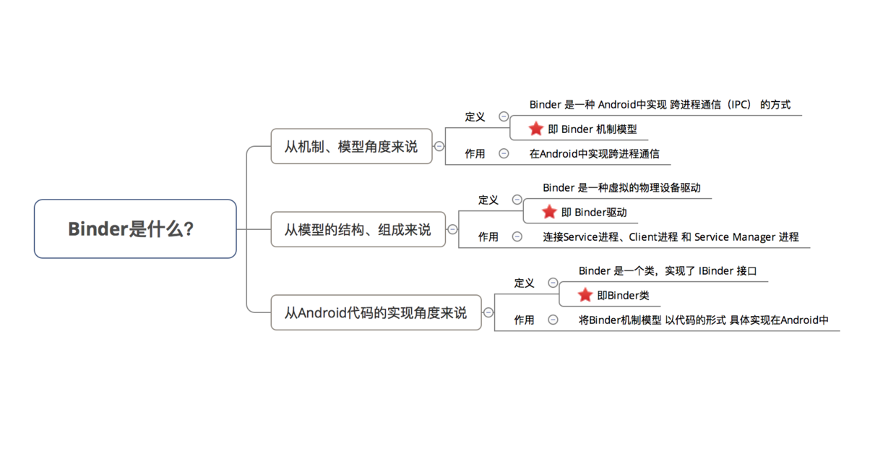
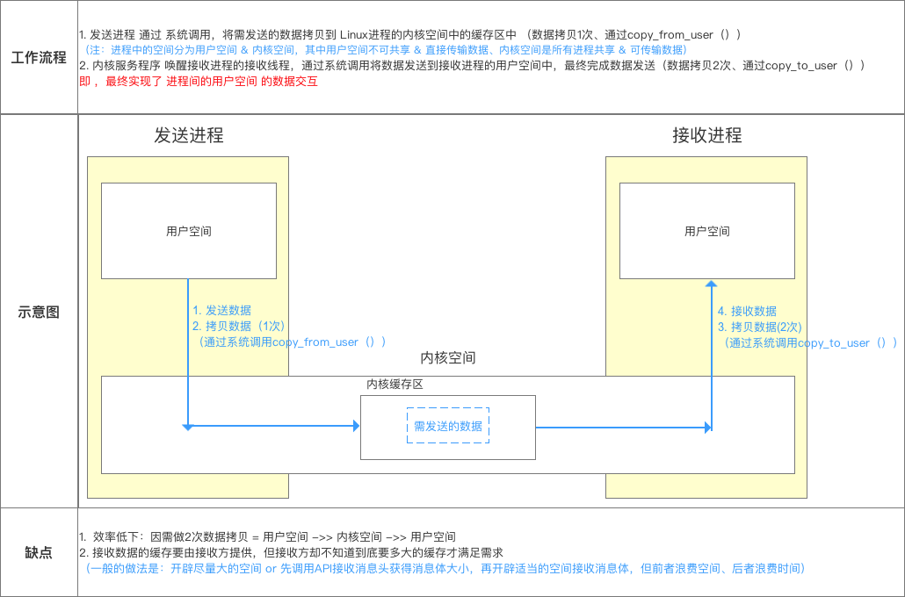
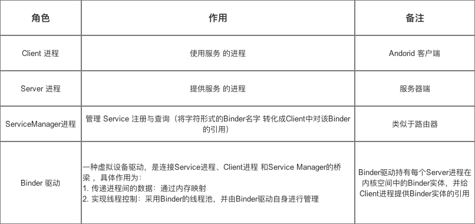
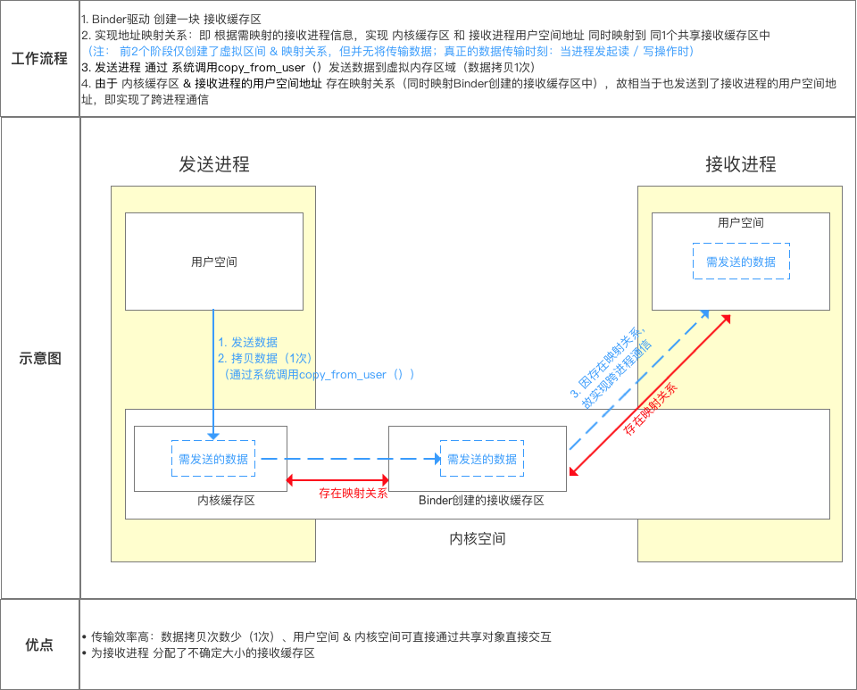
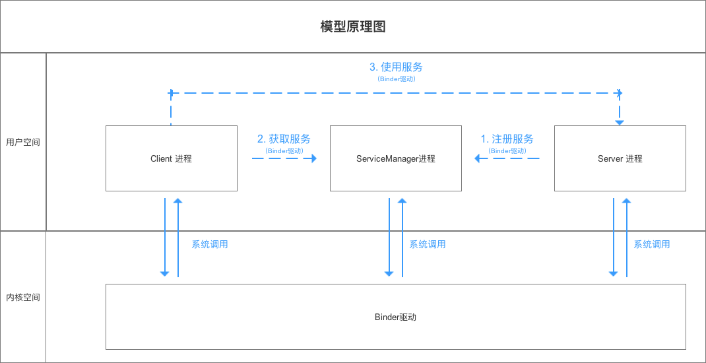
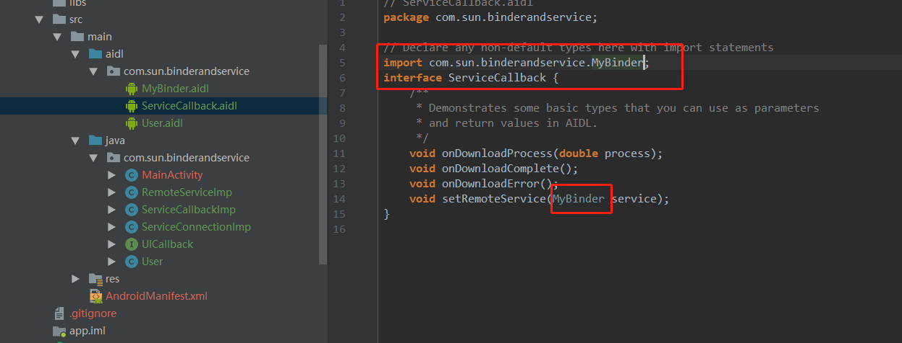
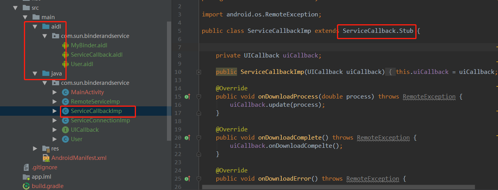
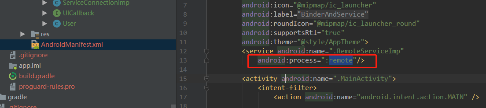

Binder

Binder

参考：
https://blog.csdn.net/carson_ho/article/details/73560642

1、Binder的定义


2、Linux 进程划分：
    一个进程空间分为 用户空间 & 内核空间（Kernel），即把进程内 用户 & 内核 隔离开来

    二者区别：
        （1）进程间，用户空间的数据不可共享，所以用户空间 = 不可共享空间
        （2）进程间，内核空间的数据可共享，所以内核空间 = 可共享空间
所有进程共用 1 个内核空间

进程内 用户空间 & 内核空间 进行交互 需通过 系统调用，主要通过函数：

（1）copy_from_user（）：将用户空间的数据拷贝到内核空间
（2）copy_to_user（）：将内核空间的数据拷贝到用户空间


3、跨进程通信原理（一般情况下的原理）


4、Binder机制下的进程间通信
**4.1 原理（注意箭头颜色的匹配）：**


**4.2 角色说明：**


**4.3 核心原理**


**4.4 模型原理步骤说明：**


**4.5 各个进程所属空间**


**Binder的具体使用查看AndroidExample的BinderAndService。**





从上面的图看出几点：

1、aidl文件定义的是一个接口，（图一）
2、在aidl文件中每一个在里面使用过的自定义的类，都需要通过import关键字导入（图一）
3、aidl是一个和java并列的文件夹，下面带上包名。（图二）

4、在自己的类中真正需要去实现的应该是定义的接口中的Stub类。AndroidStudio  会以你在aidl中定义的名称生存相关的类。而Stub是这个类的内部类。具体路径：项目名\app\build\generated\source\aidl\debug\包名\类名。（图二）

5、第三个图片，生成的是aidl中定义的MyBinder的实例，在其他地方通过这个实例去调用service（另一个进程）内部方法。（图三）
6、通过AndroidManifest.xml文件将service 定义到另外一个进程。
7、B进程想要启动A进程中的Service，需要指明准确的action，packagename，class name
```
    Intent intent = new Intent("com.xiangsun.BIND_SERVICE");
    String packageName = "com.grandstream.myapplication";
    String serviceClassName = "com.grandstream.myapplication12.XSService";
    intent.setComponent(new ComponentName(packageName, serviceClassName));
```
**在 Android Studio 里面我们的 getPackageName 对应的是 applicationId , 而manifest的那个package，在这里的作用其实是为了引用内部资源文件，以及保证 Activity 等源文件的路径正确而已，所以，在 Studio中修改发布程序包名，则只需要在 build 文件中修改 applicationId 就可以了**
**class name需要把完整的包名加上**