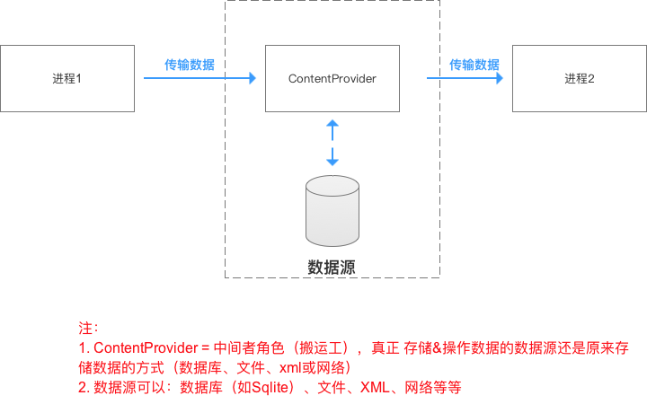
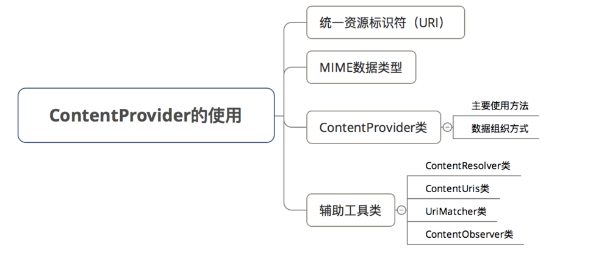
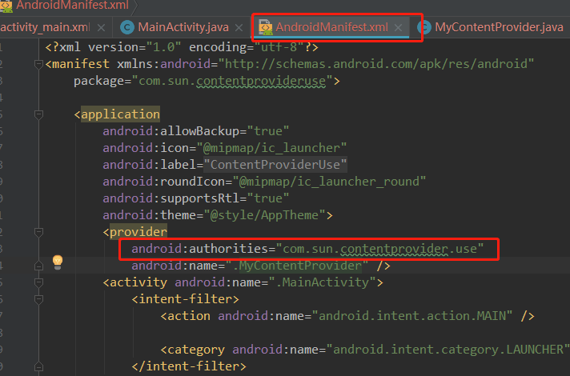
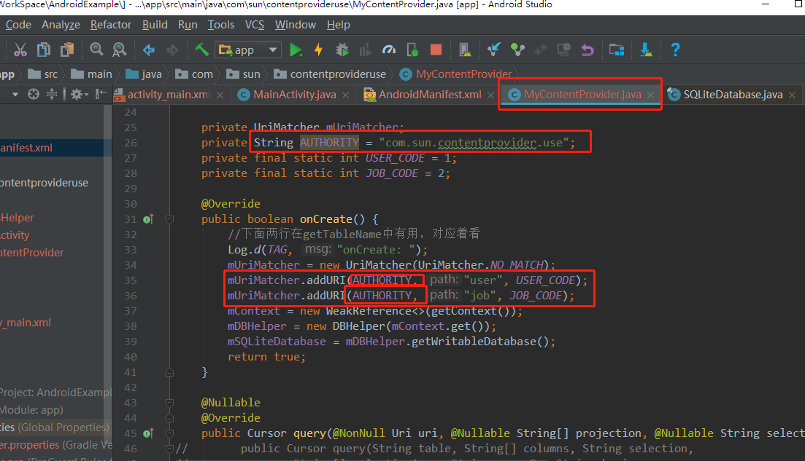

ContentProvider（TODO-6）

ContentProvider（TODO-6）

参考：https://blog.csdn.net/carson_ho/article/details/76101093

**1、作用**
进程间 进行数据交互 & 共享，即跨进程通信

**2、原理**
ContentProvider的‘’底层是采用 Android中的Binder机制。

**3、具体使用**

**3.1统一资源标识符（URI）**
定义：Uniform Resource Identifier，即统一资源标识符
作用：唯一标识 ContentProvider & 其中的数据
> 外界进程通过>  > URI>  > 找到对应的> ContentProvider>  > & 其中的数据，再进行数据操作

**具体使用 **
URI分为 系统预置 & 自定义，分别对应系统内置的数据（如通讯录、日程表等等）和自定义数据库
1. 关于 系统预置URI 此处不作过多讲解，需要的同学可自行查看
2. 此处主要讲解 自定义URI

// 设置URI
Uri uri = Uri.parse("content://com.carson.provider/User/1")

// 上述URI指向的资源是：名为 `com.carson.provider`的`ContentProvider` 中表名 为`User` 中的 `id`为1的数据

// 特别注意：URI模式存在匹配通配符* & ＃

// *：匹配任意长度的任何有效字符的字符串
// 以下的URI 表示 匹配provider的任何内容
content://com.example.app.provider/*

// ＃：匹配任意长度的数字字符的字符串
// 以下的URI 表示 匹配provider中的table表的所有行
content://com.example.app.provider/table/#
**3.2 ContentProvider类**

### **3.2.1 组织数据方式**

**ContentProvider****主要以 ****表格的形式**** 组织数据 **
**> 同时也支持文件数据，只是表格形式用得比较多**

**每个表格中包含多张表，每张表包含行 & 列，分别对应记录 & 字段 ****同数据库**

### ****3.2.2** ****主要方法**

**进程间共享数据的本质是：添加、删除、获取 & 修改（更新）数据**
**所以****ContentProvider****的核心方法也主要是上述4个作用**
**<--**  **4****个核心方法 -->**
**public**  **Uri insert(Uri uri, ContentValues values)**
**// 外部进程向 ContentProvider 中添加数据**

**public**  **int delete(Uri uri,**  **String**  **selection,**  **String****[] selectionArgs)**

**// 外部进程 删除 ContentProvider 中的数据**

**public**  **int update(Uri uri, ContentValues values,**  **String**  **selection,**  **String****[] selectionArgs)**

**// 外部进程更新 ContentProvider 中的数据**

**public**  **Cursor query(Uri uri,**  **String****[] projection,**  **String**  **selection,**  **String****[] selectionArgs,**  **String**  **sortOrder)　**

**// 外部应用 获取 ContentProvider 中的数据**

**// 注：**
**// 1. 上述4个方法由外部进程回调，并运行在ContentProvider进程的Binder线程池中（不是主线程）**
**// 2. 存在多线程并发访问，需要实现线程同步**

**// a. 若ContentProvider的数据存储方式是使用SQLite & 一个，则不需要，因为SQLite内部实现好了线程同步，若是多个SQLite则需要，因为SQL对象之间无法进行线程同步**

**// b. 若ContentProvider的数据存储方式是内存，则需要自己实现线程同步**

**<--**  **2****个其他方法 -->**
**public**  **boolean onCreate()**
**// ContentProvider创建后 或 打开系统后其它进程第一次访问该ContentProvider时 由系统进行调用**
**// 注：运行在ContentProvider进程的主线程，故不能做耗时操作**

**public**  **String**  **getType(Uri uri)**
**// 得到数据类型，即返回当前 Url 所代表数据的MIME类型**

**Android****为常见的数据（如通讯录、日程表等）提供了内置了默认的****ContentProvider**
**但也可根据需求自定义****ContentProvider****，但上述6个方法必须重写 **
**> 本文主要讲解自定义****> ContentProvider**

**ContentProvider****类并不会直接与外部进程交互，而是通过****ContentResolver**** ****类**

**3.3 ContentResolver类**
**ContentResolver**** ****类提供了与****ContentProvider****类相同名字 & 作用的4个方法**

**// 外部进程向 ContentProvider 中添加数据****public**  **Uri insert(Uri uri, ContentValues values)　**

**// 外部进程 删除 ContentProvider 中的数据****public**  **int delete(Uri uri,**  **String**  **selection,**  **String****[] selectionArgs)**

**// 外部进程更新 ContentProvider 中的数据****public**  **int update(Uri uri, ContentValues values,**  **String**  **selection,**  **String****[] selectionArgs)　**

**// 外部应用 获取 ContentProvider 中的数据****public**  **Cursor query(Uri uri,**  **String****[] projection,**  **String**  **selection,**  **String****[] selectionArgs,**  **String**  **sortOrder)**

**实例说明**

**// 使用ContentResolver前，需要先获取ContentResolver****// 可通过在所有继承Context的类中 通过调用getContentResolver()来获得ContentResolver**

**ContentResolver resolver = getContentResolver();**

**// 设置ContentProvider的URI**
**Uri uri = Uri.parse(****"**content://cn.scu.myprovider/user**"****);**

**// 根据URI 操作 ContentProvider中的数据****// 此处是获取ContentProvider中 user表的所有记录**

**Cursor cursor = resolver.query(uri,**  **null****,**  **null****,**  **null****,**  **"userid desc"****);**

**Android**** ****提供了3个用于辅助****ContentProvide****的工具类：**

- ContentUris
- UriMatcher
- ContentObserver

具体使用查看AndroidExample/ContentProviderUse.
注意Uri的使用（下面两个地方必须吻合）：

**不同的进程需要注意：**
**步骤3：注册 创建的 ContentProvider类**
*AndroidManifest.xml*
<provider
android:name="MyProvider"
android:authorities="scut.carson_ho.myprovider"

// 声明外界进程可访问该Provider的权限（读 & 写）
android:permission="scut.carson_ho.PROVIDER"

// 权限可细分为读 & 写的权限
// 外界需要声明同样的读 & 写的权限才可进行相应操作，否则会报错
// android:readPermisson = "scut.carson_ho.Read"
// android:writePermisson = "scut.carson_ho.Write"

// 设置此provider是否可以被其他进程使用
android:exported="true"

/>

// 声明本应用 可允许通信的权限

<permission android:name="scut.carson_ho.Read"  android:protectionLevel="normal"/>

// 细分读 & 写权限如下，但本Demo直接采用全权限

// <permission android:name="scut.carson_ho.Write" android:protectionLevel="normal"/>

// <permission android:name="scut.carson_ho.PROVIDER" android:protectionLevel="normal"/>

### **进程2**

**步骤1：声明可访问的权限**
*AndroidManifest.xml*
// 声明本应用可允许通信的权限（全权限）
<uses-permission  android:name="scut.carson_ho.PROVIDER"/>

// 细分读 & 写权限如下，但本Demo直接采用全权限
// <uses-permission android:name="scut.carson_ho.Read"/>
// <uses-permission android:name="scut.carson_ho.Write"/>

// 注：声明的权限必须与进程1中设置的权限对应