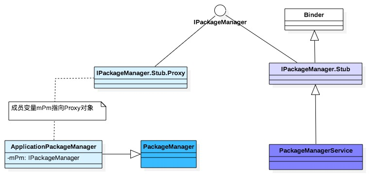

PackageManager启动篇 - Gityuan博客 | 袁辉辉的技术博客

> 基于Android 6.0源码， 分析PackageManagerService的启动过程

```
frameworks/base/services/core/java/com/android/server/pm/PackageManagerService.java
frameworks/base/services/core/java/com/android/server/pm/PackageInstallerService.java
frameworks/base/services/core/java/com/android/server/pm/Settings.java
frameworks/base/services/core/java/com/android/server/SystemConfig
frameworks/base/core/java/android/content/pm/PackageManager.java

frameworks/base/core/android/java/content/pm/IPackageManager.aidl
frameworks/base/core/java/android/content/pm/PackageParser.java
frameworks/base/cmds/pm/src/com/android/commands/pm/Pm.java

frameworks/base/services/core/java/com/android/server/pm/Installer.java
frameworks/base/core/java/com/android/internal/os/InstallerConnection.java

```

## 一.概述[](#一概述)

PackageManagerService(简称PKMS)，是Android系统中核心服务之一，管理着所有跟package相关的工作，常见的比如安装、卸载应用。 PKMS服务也是通过binder进行通信，IPackageManager.aidl由工具转换后自动生成binder的服务端IPackageManager.Stub和客户端IPackageManager.Stub.Proxy，具体关系如图：



- Binder服务端：PackageManagerService继承于IPackageManager.Stub；
- Binder客户端：ApplicationPackageManager(简称APM)的成员变量`mPM`继承于IPackageManager.Stub.Proxy; 本身APM是继承于PackageManager对象。

Android系统启动过程中，一路启动到[SystemServer](http://gityuan.com/2016/02/20/android-system-server-2/)后，便可以启动framework的各大服务，本文将介绍PKMS的启动过程。

#### PKMS启动[](#pkms启动)

SystemServer启动过程中涉及到的PKMS如下：

```
private void startBootstrapServices() {
    
    Installer installer = mSystemServiceManager.startService(Installer.class);
    ...

    
    String cryptState = SystemProperties.get("vold.decrypt");
    if (ENCRYPTING_STATE.equals(cryptState)) {
        mOnlyCore = true; 
    } else if (ENCRYPTED_STATE.equals(cryptState)) {
        mOnlyCore = true; 
    }

    
    mPackageManagerService = PackageManagerService.main(mSystemContext, installer,
                mFactoryTestMode != FactoryTest.FACTORY_TEST_OFF, mOnlyCore);
    
    mFirstBoot = mPackageManagerService.isFirstBoot();

    
    mPackageManager = mSystemContext.getPackageManager();
    ...
}

```

PKMS.main()过程主要是创建PKMS服务，并注册到ServiceManager大管家。

```
private void startOtherServices() {
    ...
    
    mSystemServiceManager.startService(MOUNT_SERVICE_CLASS);
    
    mPackageManagerService.performBootDexOpt();
    ...  

    
    mSystemServiceManager.startBootPhase(SystemService.PHASE_SYSTEM_SERVICES_READY);
    ...

    
    mPackageManagerService.systemReady();
    ...
}

```

整个system_server进程启动过程，涉及PKMS服务的主要几个动作如下，接下来分别讲解每个过程

- PKMS.main()
- PKMS.performBootDexOpt
- PKMS.systemReady

## 二、 PKMS.main[](#二-pkmsmain)

```
public static PackageManagerService main(Context context, Installer installer,
        boolean factoryTest, boolean onlyCore) {
    
    PackageManagerService m = new PackageManagerService(context, installer,
            factoryTest, onlyCore);
    
    ServiceManager.addService("package", m);
    return m;
}

```

该方法的主要功能创建PKMS对象，并将其注册到ServiceManager。 关于PKMS对象的构造方法很长，分为以下几个阶段，每个阶段会输出相应的EventLog： 除了阶段1的开头部分代码，后续代码都是同时持有同步锁mPackages和mInstallLock的过程中执行的。

```
public PackageManagerService(Context context, Installer installer,
        boolean factoryTest, boolean onlyCore) {

    阶段1：BOOT_PROGRESS_PMS_START
    ...
    synchronized (mInstallLock) {
    synchronized (mPackages) {
        ...
        阶段2：BOOT_PROGRESS_PMS_SYSTEM_SCAN_START
        阶段3：BOOT_PROGRESS_PMS_DATA_SCAN_START
        阶段4：BOOT_PROGRESS_PMS_SCAN_END
        阶段5：BOOT_PROGRESS_PMS_READY
        ...
    }
    }

    Runtime.getRuntime().gc();
    
    LocalServices.addService(PackageManagerInternal.class, new PackageManagerInternalImpl());
}

```

接下里分别说说这5个阶段：

### 2.1 PMS_START[](#21-pms_start)

阶段1 PMS_START有两部分组成，由无需加锁的前部分和同时持有两个锁的后半部分，先来说说前半部分：

```
EventLog.writeEvent(EventLogTags.BOOT_PROGRESS_PMS_START,
        SystemClock.uptimeMillis());
mContext = context;
mFactoryTest = factoryTest;
mOnlyCore = onlyCore; 

mLazyDexOpt = "eng".equals(SystemProperties.get("ro.build.type"));
mMetrics = new DisplayMetrics();
mSettings = new Settings(mPackages); 


mSettings.addSharedUserLPw("android.uid.system", Process.SYSTEM_UID,
        ApplicationInfo.FLAG_SYSTEM, ApplicationInfo.PRIVATE_FLAG_PRIVILEGED);
mSettings.addSharedUserLPw("android.uid.phone", RADIO_UID,
        ApplicationInfo.FLAG_SYSTEM, ApplicationInfo.PRIVATE_FLAG_PRIVILEGED);
mSettings.addSharedUserLPw("android.uid.log", LOG_UID,
        ApplicationInfo.FLAG_SYSTEM, ApplicationInfo.PRIVATE_FLAG_PRIVILEGED);
mSettings.addSharedUserLPw("android.uid.nfc", NFC_UID,
        ApplicationInfo.FLAG_SYSTEM, ApplicationInfo.PRIVATE_FLAG_PRIVILEGED);
mSettings.addSharedUserLPw("android.uid.bluetooth", BLUETOOTH_UID,
        ApplicationInfo.FLAG_SYSTEM, ApplicationInfo.PRIVATE_FLAG_PRIVILEGED);
mSettings.addSharedUserLPw("android.uid.shell", SHELL_UID,
        ApplicationInfo.FLAG_SYSTEM, ApplicationInfo.PRIVATE_FLAG_PRIVILEGED);

long dexOptLRUThresholdInMinutes;
if (mLazyDexOpt) {
    dexOptLRUThresholdInMinutes = 30; 
} else {
    dexOptLRUThresholdInMinutes = 7 * 24 * 60; 
}
mDexOptLRUThresholdInMills = dexOptLRUThresholdInMinutes * 60 * 1000;
...

mInstaller = installer; 
mPackageDexOptimizer = new PackageDexOptimizer(this); 

mMoveCallbacks = new MoveCallbacks(FgThread.get().getLooper());

mOnPermissionChangeListeners = new OnPermissionChangeListeners(
        FgThread.get().getLooper());

getDefaultDisplayMetrics(context, mMetrics);


SystemConfig systemConfig = SystemConfig.getInstance();
mGlobalGids = systemConfig.getGlobalGids();
mSystemPermissions = systemConfig.getSystemPermissions();
mAvailableFeatures = systemConfig.getAvailableFeatures();

```

这里有一个参数mDexOptLRUThresholdInMills用于决定执行dex优化操作的时间阈，这个参数用于后续的PKMS.performBootDexOpt()过程。

- 对于Eng版本，则只会对30分钟之内使用过的app执行dex优化；
- 对于非Eng版本，则会将用户最近一周内使用过的app执行dex优化；

接下来，再来看看后半部分：

```
synchronized (mInstallLock) {
synchronized (mPackages) {
    
    mHandlerThread = new ServiceThread(TAG,
            Process.THREAD_PRIORITY_BACKGROUND, true );
    mHandlerThread.start();
    mHandler = new PackageHandler(mHandlerThread.getLooper());
    Watchdog.getInstance().addThread(mHandler, WATCHDOG_TIMEOUT);

    
    File dataDir = Environment.getDataDirectory();
    mAppDataDir = new File(dataDir, "data");
    mAppInstallDir = new File(dataDir, "app");
    mAppLib32InstallDir = new File(dataDir, "app-lib");
    mAsecInternalPath = new File(dataDir, "app-asec").getPath();
    mUserAppDataDir = new File(dataDir, "user");
    mDrmAppPrivateInstallDir = new File(dataDir, "app-private");
    
    sUserManager = new UserManagerService(context, this,
            mInstallLock, mPackages);
    ...

    
    ArrayMap<String, String> libConfig = systemConfig.getSharedLibraries();
    for (int i=0; i<libConfig.size(); i++) {
        mSharedLibraries.put(libConfig.keyAt(i),
                new SharedLibraryEntry(libConfig.valueAt(i), null));
    }
    ...
    mRestoredSettings = mSettings.readLPw(this, sUserManager.getUsers(false),
            mSdkVersion, mOnlyCore);
    ...
  }
}

```

这个过程涉及的几个重要变量：

| 变量  | 所对应目录 |
| --- | --- |
| mAppDataDir | /data/data |
| mAppLib32InstallDir | /data/app-lib |
| mAsecInternalPath | /data/app-asec |
| mUserAppDataDir | /data/user |
| mAppInstallDir | /data/app |
| mDrmAppPrivateInstallDir | /data/app-private |

#### 2.1.1 创建Settings[](#211--创建settings)

```
Settings(Object lock) {
    this(Environment.getDataDirectory(), lock);
}

Settings(File dataDir, Object lock) {
    mLock = lock;

    mRuntimePermissionsPersistence = new RuntimePermissionPersistence(mLock);

    mSystemDir = new File(dataDir, "system");
    mSystemDir.mkdirs(); 
    FileUtils.setPermissions(mSystemDir.toString(),
           FileUtils.S_IRWXU|FileUtils.S_IRWXG
           |FileUtils.S_IROTH|FileUtils.S_IXOTH,
           -1, -1);
    mSettingsFilename = new File(mSystemDir, "packages.xml");
    mBackupSettingsFilename = new File(mSystemDir, "packages-backup.xml");
    mPackageListFilename = new File(mSystemDir, "packages.list");
    FileUtils.setPermissions(mPackageListFilename, 0640, SYSTEM_UID, PACKAGE_INFO_GID);

    mStoppedPackagesFilename = new File(mSystemDir, "packages-stopped.xml");
    mBackupStoppedPackagesFilename = new File(mSystemDir, "packages-stopped-backup.xml");
}

```

此处mSystemDir是指目录`/data/system`，在该目录有以下5个文件：

| 文件  | 功能  |
| --- | --- |
| packages.xml | 记录所有安装app的信息 |
| packages-backup.xml | 备份文件 |
| packages-stopped.xml | 记录系统被强制停止的文件 |
| packages-stopped-backup.xml | 备份文件 |
| packages.list | 记录应用的数据信息 |

#### 2.1.2 SC.getInstance[](#212-scgetinstance)

\[-\> SystemConfig.java\]

```
public static SystemConfig getInstance() {
     synchronized (SystemConfig.class) {
         if (sInstance == null) {
             sInstance = new SystemConfig();
         }
         return sInstance;
     }
 }

SystemConfig() {
    
    readPermissions(Environment.buildPath(
            Environment.getRootDirectory(), "etc", "sysconfig"), false);
    readPermissions(Environment.buildPath(
            Environment.getRootDirectory(), "etc", "permissions"), false);
    readPermissions(Environment.buildPath(
            Environment.getOemDirectory(), "etc", "sysconfig"), true);
    readPermissions(Environment.buildPath(
            Environment.getOemDirectory(), "etc", "permissions"), true);
}

```

readPermissions()解析指定目录下的所有xml文件，比如将标签`<library>`所指的动态库保存到 PKMS的成员变量mSharedLibraries。可见，SystemConfig创建过程是对以下这四个目录中的所有xml进行解析:

- /system/etc/sysconfig
- /system/etc/permissions
- /oem/etc/sysconfig
- /oem/etc/permissions

#### 2.1.3 SC.readPermissions[](#213-screadpermissions)

\[-\> SystemConfig.java\]

```
void readPermissions(File libraryDir, boolean onlyFeatures) {
     ...

     File platformFile = null;
     for (File f : libraryDir.listFiles()) {
         if (f.getPath().endsWith("etc/permissions/platform.xml")) {
             platformFile = f; 
             continue;
         }

         if (!f.getPath().endsWith(".xml")) {
             continue;
         }

         if (!f.canRead()) {
             continue;
         }
         readPermissionsFromXml(f, onlyFeatures);
     }

     if (platformFile != null) {
         readPermissionsFromXml(platformFile, onlyFeatures);
     }
 }

```

该方法是解析指定目录下所有的具有可读权限的，且以xml后缀文件。

### 2.2 PMS\_SYSTEM\_SCAN_START[](#22-pms_system_scan_start)

```
long startTime = SystemClock.uptimeMillis();
EventLog.writeEvent(EventLogTags.BOOT_PROGRESS_PMS_SYSTEM_SCAN_START,
        startTime);

final int scanFlags = SCAN_NO_PATHS | SCAN_DEFER_DEX | SCAN_BOOTING | SCAN_INITIAL;

final ArraySet<String> alreadyDexOpted = new ArraySet<String>();

final String bootClassPath = System.getenv("BOOTCLASSPATH");
final String systemServerClassPath = System.getenv("SYSTEMSERVERCLASSPATH");


if (bootClassPath != null) {
    String[] bootClassPathElements = splitString(bootClassPath, ':');
    for (String element : bootClassPathElements) {
        alreadyDexOpted.add(element);
    }
}


if (systemServerClassPath != null) {
    String[] systemServerClassPathElements = splitString(systemServerClassPath, ':');
    for (String element : systemServerClassPathElements) {
        alreadyDexOpted.add(element);
    }
}
...


if (mSharedLibraries.size() > 0) {
    for (String dexCodeInstructionSet : dexCodeInstructionSets) {
        for (SharedLibraryEntry libEntry : mSharedLibraries.values()) {
            final String lib = libEntry.path;
            ...
            int dexoptNeeded = DexFile.getDexOptNeeded(lib, dexCodeInstructionSet,
                    "speed", false);
            if (dexoptNeeded != DexFile.NO_DEXOPT_NEEDED) {
                alreadyDexOpted.add(lib);
                
                mInstaller.dexopt(lib, Process.SYSTEM_UID, dexCodeInstructionSet,
                        dexoptNeeded, DEXOPT_PUBLIC );
            }
        }
    }
}


File frameworkDir = new File(Environment.getRootDirectory(), "framework");


alreadyDexOpted.add(frameworkDir.getPath() + "/framework-res.apk");
alreadyDexOpted.add(frameworkDir.getPath() + "/core-libart.jar");

String[] frameworkFiles = frameworkDir.list();
if (frameworkFiles != null) {
    for (String dexCodeInstructionSet : dexCodeInstructionSets) {
        for (int i=0; i<frameworkFiles.length; i++) {
            File libPath = new File(frameworkDir, frameworkFiles[i]);
            String path = libPath.getPath();
            
            if (alreadyDexOpted.contains(path)) {
                continue;
            }
            
            if (!path.endsWith(".apk") && !path.endsWith(".jar")) {
                continue;
            }

            int dexoptNeeded = DexFile.getDexOptNeeded(path, dexCodeInstructionSet,
                    "speed", false);
            if (dexoptNeeded != DexFile.NO_DEXOPT_NEEDED) {
                
                mInstaller.dexopt(path, Process.SYSTEM_UID, dexCodeInstructionSet,
                        dexoptNeeded, DEXOPT_PUBLIC );
            }

        }
    }
}

final VersionInfo ver = mSettings.getInternalVersion();
mIsUpgrade = !Build.FINGERPRINT.equals(ver.fingerprint);
mPromoteSystemApps = mIsUpgrade && ver.sdkVersion <= Build.VERSION_CODES.LOLLIPOP_MR1;

if (mPromoteSystemApps) {
    Iterator<PackageSetting> pkgSettingIter = mSettings.mPackages.values().iterator();
    while (pkgSettingIter.hasNext()) {
        PackageSetting ps = pkgSettingIter.next();
        if (isSystemApp(ps)) {
            mExistingSystemPackages.add(ps.name);
        }
    }
}


File vendorOverlayDir = new File(VENDOR_OVERLAY_DIR);
scanDirLI(vendorOverlayDir, PackageParser.PARSE_IS_SYSTEM
        | PackageParser.PARSE_IS_SYSTEM_DIR, scanFlags | SCAN_TRUSTED_OVERLAY, 0);


scanDirLI(frameworkDir, PackageParser.PARSE_IS_SYSTEM
        | PackageParser.PARSE_IS_SYSTEM_DIR
        | PackageParser.PARSE_IS_PRIVILEGED,
        scanFlags | SCAN_NO_DEX, 0);


final File privilegedAppDir = new File(Environment.getRootDirectory(), "priv-app");
scanDirLI(privilegedAppDir, PackageParser.PARSE_IS_SYSTEM
        | PackageParser.PARSE_IS_SYSTEM_DIR
        | PackageParser.PARSE_IS_PRIVILEGED, scanFlags, 0);


final File systemAppDir = new File(Environment.getRootDirectory(), "app");
scanDirLI(systemAppDir, PackageParser.PARSE_IS_SYSTEM
        | PackageParser.PARSE_IS_SYSTEM_DIR, scanFlags, 0);


final File privilegedVendorAppDir = new File(Environment.getVendorDirectory(), "priv-app");
scanDirLI(privilegedVendorAppDir, PackageParser.PARSE_IS_SYSTEM
        | PackageParser.PARSE_IS_SYSTEM_DIR
        | PackageParser.PARSE_IS_PRIVILEGED, scanFlags, 0);


File vendorAppDir = new File(Environment.getVendorDirectory(), "app");
vendorAppDir = vendorAppDir.getCanonicalFile();
scanDirLI(vendorAppDir, PackageParser.PARSE_IS_SYSTEM
        | PackageParser.PARSE_IS_SYSTEM_DIR, scanFlags, 0);


final File oemAppDir = new File(Environment.getOemDirectory(), "app");
scanDirLI(oemAppDir, PackageParser.PARSE_IS_SYSTEM
        | PackageParser.PARSE_IS_SYSTEM_DIR, scanFlags, 0);


mInstaller.moveFiles();


final List<String> possiblyDeletedUpdatedSystemApps = new ArrayList<String>();
if (!mOnlyCore) {
    Iterator<PackageSetting> psit = mSettings.mPackages.values().iterator();
    while (psit.hasNext()) {
        PackageSetting ps = psit.next();

        if ((ps.pkgFlags & ApplicationInfo.FLAG_SYSTEM) == 0) {
            continue;
        }

        final PackageParser.Package scannedPkg = mPackages.get(ps.name);
        if (scannedPkg != null) {
            if (mSettings.isDisabledSystemPackageLPr(ps.name)) {
                removePackageLI(ps, true);
                mExpectingBetter.put(ps.name, ps.codePath);
            }
            continue;
        }

        if (!mSettings.isDisabledSystemPackageLPr(ps.name)) {
            psit.remove();
            removeDataDirsLI(null, ps.name);
        } else {
            final PackageSetting disabledPs = mSettings.getDisabledSystemPkgLPr(ps.name);
            if (disabledPs.codePath == null || !disabledPs.codePath.exists()) {
                possiblyDeletedUpdatedSystemApps.add(ps.name);
            }
        }
    }
}


ArrayList<PackageSetting> deletePkgsList = mSettings.getListOfIncompleteInstallPackagesLPr();
for(int i = 0; i < deletePkgsList.size(); i++) {
    cleanupInstallFailedPackage(deletePkgsList.get(i));
}

deleteTempPackageFiles();


mSettings.pruneSharedUsersLPw();

```

**环境变量:** 那可通过`adb shell env`来查看系统所有的环境变量及相应值。也可通过命令**adb shell echo $SYSTEMSERVERCLASSPATH**。

- SYSTEMSERVERCLASSPATH：主要包括/system/framework目录下services.jar，ethernet-service.jar，wifi-service.jar这3个文件。
- BOOTCLASSPATH：该环境变量内容较多，不同ROM可能有所不同，常见内容包含/system/framework目录下的framework.jar，ext.jar，core-libart.jar，telephony-common.jar，ims-common.jar，core-junit.jar等文件。

**dexopt():** 执行dex优化操作的文件有以下几类

- mSharedLibraries：该共享库下的所有文件，是由SystemConfig构造函数中赋值的；
- /system/framework：该目录的所有apk和jar文件，去除位于alreadyDexOpted中的文件。 具体有哪些文件不包括呢？比如services.jar, framework.jar, framework-res.apk, core-libart.jar.

**scanDirLI():** 扫描指定目录下的apk文件，最终调用`PackageParser.parseBaseApk`来完成AndroidManifest.xml文件的解析，生成Application, activity,service,broadcast, provider等信息。

1.  /vendor/overlay
2.  /system/framework
3.  /system/priv-app
4.  /system/app
5.  /vendor/priv-app
6.  /vendor/app
7.  /oem/app

#### 2.2.1 dexopt[](#221--dexopt)

\[-\> Installer.java\]

```
public int dexopt(String apkPath, int uid, String instructionSet,
        int dexoptNeeded, int dexFlags) {
    if (!isValidInstructionSet(instructionSet)) {
        return -1;
    }
    
    return mInstaller.dexopt(apkPath, uid, instructionSet, dexoptNeeded, dexFlags);
}

```

#### 2.2.2 IC.dexopt[](#222-icdexopt)

\[-\> InstallerConnection.java\]

```
public int dexopt(String apkPath, int uid, String instructionSet,
        int dexoptNeeded, int dexFlags) {
    return dexopt(apkPath, uid, "*", instructionSet, dexoptNeeded,
            null, dexFlags);
}

public int dexopt(String apkPath, int uid, String pkgName, String instructionSet,
     int dexoptNeeded, String outputPath, int dexFlags) {
   StringBuilder builder = new StringBuilder("dexopt");
   builder.append(' ');
   builder.append(apkPath);
   builder.append(' ');
   builder.append(uid);
   builder.append(' ');
   builder.append(pkgName);
   builder.append(' ');
   builder.append(instructionSet);
   builder.append(' ');
   builder.append(dexoptNeeded);
   builder.append(' ');
   builder.append(outputPath != null ? outputPath : "!");
   builder.append(' ');
   builder.append(dexFlags);
   return execute(builder.toString());    }

```

通过socket发送给installd守护进程来执行相应的dexopt操作。

### 2.3 PMS\_DATA\_SCAN_START[](#23-pms_data_scan_start)

```
if (!mOnlyCore) { 
    EventLog.writeEvent(EventLogTags.BOOT_PROGRESS_PMS_DATA_SCAN_START, SystemClock.uptimeMillis());
    
    scanDirLI(mAppInstallDir, 0, scanFlags | SCAN_REQUIRE_KNOWN, 0);
    
    scanDirLI(mDrmAppPrivateInstallDir, PackageParser.PARSE_FORWARD_LOCK,
            scanFlags | SCAN_REQUIRE_KNOWN, 0);

    for (String deletedAppName : possiblyDeletedUpdatedSystemApps) {
        PackageParser.Package deletedPkg = mPackages.get(deletedAppName);
        mSettings.removeDisabledSystemPackageLPw(deletedAppName);

        String msg;
        if (deletedPkg == null) {
            removeDataDirsLI(null, deletedAppName);
        } else {
            deletedPkg.applicationInfo.flags &= ~ApplicationInfo.FLAG_SYSTEM;

            PackageSetting deletedPs = mSettings.mPackages.get(deletedAppName);
            deletedPs.pkgFlags &= ~ApplicationInfo.FLAG_SYSTEM;
        }
    }

    for (int i = 0; i < mExpectingBetter.size(); i++) {
        final String packageName = mExpectingBetter.keyAt(i);
        if (!mPackages.containsKey(packageName)) {
            final File scanFile = mExpectingBetter.valueAt(i);

            final int reparseFlags;
            if (FileUtils.contains(privilegedAppDir, scanFile)) {
                reparseFlags = PackageParser.PARSE_IS_SYSTEM
                        | PackageParser.PARSE_IS_SYSTEM_DIR
                        | PackageParser.PARSE_IS_PRIVILEGED;
            } else if (FileUtils.contains(systemAppDir, scanFile)) {
                reparseFlags = PackageParser.PARSE_IS_SYSTEM
                        | PackageParser.PARSE_IS_SYSTEM_DIR;
            } else if (FileUtils.contains(vendorAppDir, scanFile)) {
                reparseFlags = PackageParser.PARSE_IS_SYSTEM
                        | PackageParser.PARSE_IS_SYSTEM_DIR;
            } else if (FileUtils.contains(oemAppDir, scanFile)) {
                reparseFlags = PackageParser.PARSE_IS_SYSTEM
                        | PackageParser.PARSE_IS_SYSTEM_DIR;
            } else {
                continue;
            }

            mSettings.enableSystemPackageLPw(packageName);

            try {
                
                scanPackageLI(scanFile, reparseFlags, scanFlags, 0, null);
            } catch (PackageManagerException e) {
                ...
            }
        }
    }
}
mExpectingBetter.clear();

updateAllSharedLibrariesLPw();

for (SharedUserSetting setting : mSettings.getAllSharedUsersLPw()) {
    adjustCpuAbisForSharedUserLPw(setting.packages, null ,
            false , false ,
            false );
}

mPackageUsage.readLP();

```

当mOnlyCore = false时，则scanDirLI()还会收集如下目录中的apk

- /data/app
- /data/app-private

### 2.4 PMS\_SCAN\_END[](#24-pms_scan_end)

```
EventLog.writeEvent(EventLogTags.BOOT_PROGRESS_PMS_SCAN_END,
        SystemClock.uptimeMillis());

int updateFlags = UPDATE_PERMISSIONS_ALL;
if (ver.sdkVersion != mSdkVersion) {
    updateFlags |= UPDATE_PERMISSIONS_REPLACE_PKG | UPDATE_PERMISSIONS_REPLACE_ALL;
}

updatePermissionsLPw(null, null, StorageManager.UUID_PRIVATE_INTERNAL, updateFlags);
ver.sdkVersion = mSdkVersion;

if (!onlyCore && (mPromoteSystemApps || !mRestoredSettings)) {
    for (UserInfo user : sUserManager.getUsers(true)) {
        mSettings.applyDefaultPreferredAppsLPw(this, user.id);
        applyFactoryDefaultBrowserLPw(user.id);
        primeDomainVerificationsLPw(user.id);
    }
}


if (mIsUpgrade && !onlyCore) {
    for (int i = 0; i < mSettings.mPackages.size(); i++) {
        final PackageSetting ps = mSettings.mPackages.valueAt(i);
        if (Objects.equals(StorageManager.UUID_PRIVATE_INTERNAL, ps.volumeUuid)) {
            deleteCodeCacheDirsLI(ps.volumeUuid, ps.name);
        }
    }
    ver.fingerprint = Build.FINGERPRINT;
}

checkDefaultBrowser();

mExistingSystemPackages.clear();
mPromoteSystemApps = false;

ver.databaseVersion = Settings.CURRENT_DATABASE_VERSION;

mSettings.writeLPr();

```

### 2.5 PMS_READY[](#25-pms_ready)

```
EventLog.writeEvent(EventLogTags.BOOT_PROGRESS_PMS_READY,
        SystemClock.uptimeMillis());

mRequiredVerifierPackage = getRequiredVerifierLPr();
mRequiredInstallerPackage = getRequiredInstallerLPr();
//【见小节2.5.1】
mInstallerService = new PackageInstallerService(context, this);

mIntentFilterVerifierComponent = getIntentFilterVerifierComponentNameLPr();
mIntentFilterVerifier = new IntentVerifierProxy(mContext,
        mIntentFilterVerifierComponent);

```

PKMS初始化完成阶段，还会创建一个PackageInstaller服务。

#### 2.5.1 创建PKIS服务[](#251-创建pkis服务)

\[-\> PackageInstallerService\]

```
public PackageInstallerService(Context context, PackageManagerService pm) {
    mContext = context;
    mPm = pm;
    
    mInstallThread = new HandlerThread(TAG);
    mInstallThread.start();

    mInstallHandler = new Handler(mInstallThread.getLooper());

    mCallbacks = new Callbacks(mInstallThread.getLooper());

    mSessionsFile = new AtomicFile(
            new File(Environment.getSystemSecureDirectory(), "install_sessions.xml"));
    mSessionsDir = new File(Environment.getSystemSecureDirectory(), "install_sessions");
    mSessionsDir.mkdirs();

    synchronized (mSessions) {
        readSessionsLocked();

        reconcileStagesLocked(StorageManager.UUID_PRIVATE_INTERNAL);

        final ArraySet<File> unclaimedIcons = newArraySet(
                mSessionsDir.listFiles());

        for (int i = 0; i < mSessions.size(); i++) {
            final PackageInstallerSession session = mSessions.valueAt(i);
            unclaimedIcons.remove(buildAppIconFile(session.sessionId));
        }

        for (File icon : unclaimedIcons) {
            icon.delete();
        }
    }
}

```

### 小节[](#小节)

PKMS初始化过程，分为5个阶段：

1.  PMS_START阶段：
    - 创建Settings对象；
    - 将6类shareUserId到mSettings；
    - 初始化SystemConfig；
    - 创建名为“PackageManager”的handler线程`mHandlerThread`;
    - 创建UserManagerService多用户管理服务；
    - 通过解析4大目录中的xmL文件构造共享mSharedLibraries；
2.  PMS\_SYSTEM\_SCAN_START阶段：
    - mSharedLibraries共享库中的文件执行dexopt操作；
    - system/framework目录中满足条件的apk或jar文件执行dexopt操作；
    - 扫描系统apk;
3.  PMS\_DATA\_SCAN_START阶段：
    - 扫描/data/app目录下的apk;
    - 扫描/data/app-private目录下的apk;
4.  PMS\_SCAN\_END阶段：
    - 将上述信息写回/data/system/packages.xml;
5.  PMS_READY阶段：
    - 创建服务PackageInstallerService；

## 三、操作PKMS[](#三操作pkms)

### 3.1 getPackageManager[](#31-getpackagemanager)

\[-\> ContextImpl.java\]

```
public PackageManager getPackageManager() {
    if (mPackageManager != null) {
        return mPackageManager;
    }

    
    IPackageManager pm = ActivityThread.getPackageManager();
    if (pm != null) {
        
        return (mPackageManager = new ApplicationPackageManager(this, pm));
    }

    return null;
}

```

获取PKMS服务，并创建ApplicationPackageManager对象

#### 3.1.1 AT.getPackageManager[](#311-atgetpackagemanager)

\[-\> ActivityThread.java\]

```
public static IPackageManager getPackageManager() {
    if (sPackageManager != null) {
        return sPackageManager;
    }
    IBinder b = ServiceManager.getService("package");
    sPackageManager = IPackageManager.Stub.asInterface(b);
    return sPackageManager;
}

```

### 3.2 PKMS.performBootDexOpt[](#32-pkmsperformbootdexopt)

\[-\> PackageManagerService.java\]

```
public void performBootDexOpt() {
   
   enforceSystemOrRoot("Only the system can request dexopt be performed");

   
   IMountService ms = PackageHelper.getMountService();
   if (ms != null) {
       final boolean isUpgrade = isUpgrade(); 
       boolean doTrim = isUpgrade;
       if (doTrim) {
           Slog.w(TAG, "Running disk maintenance immediately due to system update");
       } else {
           
           final long interval = android.provider.Settings.Global.getLong(
                   mContext.getContentResolver(),
                   android.provider.Settings.Global.FSTRIM_MANDATORY_INTERVAL,
                   DEFAULT_MANDATORY_FSTRIM_INTERVAL);
           if (interval > 0) {
               final long timeSinceLast = System.currentTimeMillis() - ms.lastMaintenance();
               if (timeSinceLast > interval) {
                   doTrim = true; 
               }
           }
       }
       
       if (doTrim) {
           ms.runMaintenance();
       }
   }

   final ArraySet<PackageParser.Package> pkgs;
   synchronized (mPackages) {
       
       pkgs = mPackageDexOptimizer.clearDeferredDexOptPackages();
   }

   if (pkgs != null) {
       ArrayList<PackageParser.Package> sortedPkgs = new ArrayList<PackageParser.Package>();

       for (Iterator<PackageParser.Package> it = pkgs.iterator(); it.hasNext();) {
           PackageParser.Package pkg = it.next();
           
           if (pkg.coreApp) {
               sortedPkgs.add(pkg);
               it.remove();
           }
       }

       
       Intent intent = new Intent(Intent.ACTION_PRE_BOOT_COMPLETED);
       ArraySet<String> pkgNames = getPackageNamesForIntent(intent);

       for (Iterator<PackageParser.Package> it = pkgs.iterator(); it.hasNext();) {
           PackageParser.Package pkg = it.next();
           
           if (pkgNames.contains(pkg.packageName)) {
               sortedPkgs.add(pkg);
               it.remove();
           }
       }

       
       filterRecentlyUsedApps(pkgs);

       
       for (PackageParser.Package pkg : pkgs) {
           sortedPkgs.add(pkg);
       }

       if (mLazyDexOpt) {
           filterRecentlyUsedApps(sortedPkgs);
       }

       int i = 0;
       int total = sortedPkgs.size();
       File dataDir = Environment.getDataDirectory();
       long lowThreshold = StorageManager.from(mContext).getStorageLowBytes(dataDir);
       ...

       for (PackageParser.Package pkg : sortedPkgs) {
           long usableSpace = dataDir.getUsableSpace();
           if (usableSpace < lowThreshold) {
               break;
           }
           
           performBootDexOpt(pkg, ++i, total);
       }
   }    }

```

该方法主要功能：

- 当处于升级或者3天未执行fstrim，则本次会否执行fstrim操作；
- 对sortedPkgs中的app执行dexopt优化，其中包含：
    - mDeferredDexOpt中的核心app；
    - mDeferredDexOpt中监听PRE\_BOOT\_COMPLETE的app；
    - mDeferredDexOpt中最近一周使用过的app;

#### 3.2.1 PKMS.filterRecentlyUsedApps[](#321-pkmsfilterrecentlyusedapps)

```
private void filterRecentlyUsedApps(Collection<PackageParser.Package> pkgs) {

     if (mLazyDexOpt || (!isFirstBoot() && mPackageUsage.isHistoricalPackageUsageAvailable())) {
         int total = pkgs.size();
         int skipped = 0;
         long now = System.currentTimeMillis();
         for (Iterator<PackageParser.Package> i = pkgs.iterator(); i.hasNext();) {
             PackageParser.Package pkg = i.next();
             
             long then = pkg.mLastPackageUsageTimeInMills;
             if (then + mDexOptLRUThresholdInMills < now) {
                 i.remove();
                 skipped++;
             }
         }
     }
 }

```

获取最近使用的app,其中mDexOptLRUThresholdInMills：

- 对于Eng版本，则只会对30分钟之内使用过的app执行dex优化；
- 对于用户版本，则会将用户最近一周内使用过的app执行dex优化；

#### 3.2.2 PKMS.performBootDexOpt[](#322-pkmsperformbootdexopt)

```
 private void performBootDexOpt(PackageParser.Package pkg, int curr, int total) {
    if (!isFirstBoot()) {
        ActivityManagerNative.getDefault().showBootMessage(
              mContext.getResources().getString(R.string.android_upgrading_apk,
                  curr, total), true);
    }
    PackageParser.Package p = pkg;
    synchronized (mInstallLock) {
        
        mPackageDexOptimizer.performDexOpt(p, null ,
                false , false , true ,
                false , false );
    }
}

```

#### 3.2.3 performDexOpt[](#323-performdexopt)

\[-\> PackageDexOptimizer.java\]

```
int performDexOpt(PackageParser.Package pkg, String[] instructionSets,
         boolean forceDex, boolean defer, boolean inclDependencies,
         boolean bootComplete, boolean useJit) {
     ArraySet<String> done;
     if (inclDependencies && (pkg.usesLibraries != null || pkg.usesOptionalLibraries != null)) {
         done = new ArraySet<String>();
         done.add(pkg.packageName);
     } else {
         done = null;
     }
     synchronized (mPackageManagerService.mInstallLock) {
         final boolean useLock = mSystemReady;
         if (useLock) {
             mDexoptWakeLock.setWorkSource(new WorkSource(pkg.applicationInfo.uid));
             mDexoptWakeLock.acquire();
         }
         try {
             
             return performDexOptLI(pkg, instructionSets, forceDex, defer, bootComplete,
                     useJit, done);
         } finally {
             if (useLock) {
                 mDexoptWakeLock.release();
             }
         }
     }
 }

```

这个过程最终还是调用\[小节2.2.1\]的dexopt操作.

### 3.3 PKMS.systemReady[](#33-pkmssystemready)

```
public void systemReady() {
    mSystemReady = true;
    ...

    synchronized (mPackages) {
        ArrayList<PreferredActivity> removed = new ArrayList<PreferredActivity>();
        for (int i=0; i<mSettings.mPreferredActivities.size(); i++) {
            PreferredIntentResolver pir = mSettings.mPreferredActivities.valueAt(i);
            removed.clear();
            for (PreferredActivity pa : pir.filterSet()) {
                if (mActivities.mActivities.get(pa.mPref.mComponent) == null) {
                    removed.add(pa);
                }
            }
            if (removed.size() > 0) {
                for (int r=0; r<removed.size(); r++) {
                    PreferredActivity pa = removed.get(r);
                    pir.removeFilter(pa);
                }
                mSettings.writePackageRestrictionsLPr(
                        mSettings.mPreferredActivities.keyAt(i));
            }
        }

        for (int userId : UserManagerService.getInstance().getUserIds()) {
            if (!mSettings.areDefaultRuntimePermissionsGrantedLPr(userId)) {
                grantPermissionsUserIds = ArrayUtils.appendInt(
                        grantPermissionsUserIds, userId);
            }
        }
    }

    sUserManager.systemReady(); 

    
    for (int userId : grantPermissionsUserIds) {
        mDefaultPermissionPolicy.grantDefaultPermissions(userId);
    }

    
    if (mPostSystemReadyMessages != null) {
        for (Message msg : mPostSystemReadyMessages) {
            msg.sendToTarget();
        }
        mPostSystemReadyMessages = null;
    }

    
    final StorageManager storage = mContext.getSystemService(StorageManager.class);
    storage.registerListener(mStorageListener);

    mInstallerService.systemReady();
    mPackageDexOptimizer.systemReady();

    MountServiceInternal mountServiceInternal = LocalServices.getService(MountServiceInternal.class);
    mountServiceInternal.addExternalStoragePolicy(...);
}

```

## 四. 总结[](#四-总结)

这个过程会有“PackageManager”线程和“andorid.fg”线程

### 4.1 核心文件[](#41-核心文件)

| 文件  | 功能  |
| --- | --- |
| /data/data/ | App数据目录 |
| /data/user/ | App数据目录 |
| /data/app/ | App安装目录 |
| /data/system/packages.xml | 所有安装app信息 |
| /data/system/packages-stopped.xml | 所有强制停止app信息 |
| /data/system/packages.list | 所有安装app信息 |

Android系统有很多目录可以存放app，如下所示：

| 目录  | App类别 |
| --- | --- |
| /vendor/overlay | 系统App |
| /system/framework | 系统App |
| /system/priv-app | 系统App |
| /system/app | 系统App |
| /vendor/priv-app | 系统App |
| /vendor/app | 系统App |
| /oem/app | 系统App |
| /data/app | 普通App |
| /data/app-private | 普通App |

### 4.2 dexopt[](#42-dexopt)

`startBootstrapServices`()执行到创建PKMS的过程中会对以下目录进行dexopt操作：

- mSharedLibraries：该共享库下的所有文件是由SystemConfig构造函数中，以下4个目录下的所有xml文件中的标签`<library>`所指的动态库。
    - /system/etc/sysconfig
    - /system/etc/permissions
    - /oem/etc/sysconfig
    - /oem/etc/permissions
- /system/framework：该目录的所有apk和jar文件，去除位于alreadyDexOpted中的文件，其中alreadyDexOpted：
    - SYSTEMSERVERCLASSPATH环境变量：/system/framework目录下services.jar，ethernet-service.jar，wifi-service.jar这3个文件
    - BOOTCLASSPATH环境变量：/system/framework目录下的framework.jar，ext.jar，core-libart.jar等等
    - /system/framework/framework-res.apk
    - /system/framework/core-libart.jar

`startOtherServices`()执行到PKMS.performBootDexOpt过程，也是进行dexopt操作：

- mDeferredDexOpt中的核心app；
- mDeferredDexOpt中监听PRE\_BOOT\_COMPLETE的app；
- mDeferredDexOpt中最近一周使用过的app;

最后，dexopt操作通过socket发送给守护进程installd来完成，下一篇文章介绍installd的功能。

* * *

**微信公众号** [**Gityuan**](http://gityuan.com/images/about-me/gityuan_weixin_logo.png) **| 微博** [**weibo.com/gityuan**](http://weibo.com/gityuan) **| 博客** [**留言区交流**](http://gityuan.com/talk/)

* * *