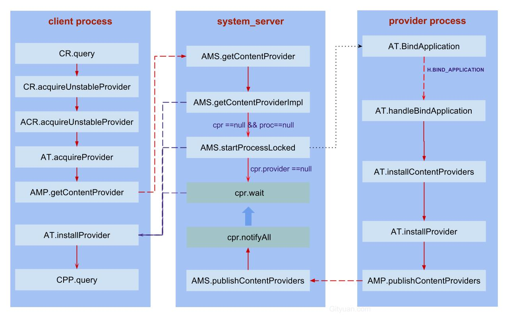

理解ContentProvider原理 - Gityuan博客 | 袁辉辉的技术博客

> 基于Android 6.0源码剖析，本文涉及的相关源码：

```
frameworks/base/core/java/android/app/
    - ActivityThread.java
    - ContextImpl.java
    - IActivityManager.java

frameworks/base/core/java/android/content/
    - ContentResolver.java
    - IContentProvider.java
    - ContentProvider.java
    - ContentProviderNative.java

frameworks/base/services/core/java/com/android/server/am/
    - ContentProviderRecord.java

```

## 一、概述[](#一概述)

ContentProvider(内容提供者)用于提供数据的统一访问格式，封装底层的具体实现。对于数据的使用者来说，无需知晓数据的来源是数据库、文件，或者网络，只需简单地使用ContentProvider提供的数据操作接口，也就是增(insert)、删(delete)、改(update)、查(query)四个过程。

### 1.1 ContentProvider[](#11-contentprovider)

ContentProvider作为Android四大组件之一，并没有Activity那样复杂的生命周期，只有简单地onCreate过程。ContentProvider是一个抽象类，当实现自己的ContentProvider类，只需继承于ContentProvider，并且实现以下六个abstract方法即可：

- insert(Uri, ContentValues)：插入新数据；
- delete(Uri, String, String\[\])：删除已有数据；
- update(Uri, ContentValues, String, String\[\])：更新数据；
- query(Uri, String\[\], String, String\[\], String)：查询数据；
- onCreate()：执行初始化工作；
- getType(Uri)：获取数据MIME类型。

**Uri:** 从ContentProvider的数据操作方法可以看出都依赖于Uri，对于Uri有其固定的数据格式，例如：`content://com.gityuan.articles/android/3`

| 字段  | 含义  | 对应项 |
| --- | --- | --- |
| 前缀  | 默认的固定开头格式 | content:// |
| 授权  | 唯一标识provider | com.gityuan.articles |
| 路径  | 数据类别以及数据项 | /android/3 |

### 1.2 ContentResolver[](#12-contentresolver)

其他app或者进程想要操作`ContentProvider`，则需要先获取其相应的`ContentResolver`，再利用ContentResolver类来完成对数据的增删改查操作，下面列举一个查询操作，查询得到的是一个`Cursor`结果集，再通过操作该Cursor便可获取想要查询的结果。

```
ContentResolver cr = getContentResolver();  
Uri uri = Uri.parse("content://com.gityuan.articles/android/3");
Cursor cursor = cr.query(uri, null, null, null, null);  
...
cursor.close(); 

```

### 1.3 继承关系图[](#13-继承关系图)


- CPP与CPN是一对Binder通信的C/S两端;
- ACR(ApplicationContentResolver)继承于ContentResolver, 位于ContextImpl的内部类. ACR的实现往往是通过调用其成员变量mMainThread(数据类型为ActivityThread)来完成;

### 1.4 重要成员变量[](#14-重要成员变量)

在开始源码分析之前，先说说涉及到的几个关于contentProvider的重要的成员变量。

| 类名  | 成员变量 | 含义  |
| --- | --- | --- |
| AMS | CONTENT\_PROVIDER\_PUBLISH_TIMEOUT | 默认值为10s |
| AMS | mProviderMap | 记录所有contentProvider |
| AMS | mLaunchingProviders | 记录存在客户端等待publish的ContentProviderRecord |
| PR  | pubProviders | 该进程创建的ContentProviderRecord |
| PR  | conProviders | 该进程使用的ContentProviderConnection |
| AT  | mLocalProviders | 记录所有本地的ContentProvider，以IBinder以key |
| AT  | mLocalProvidersByName | 记录所有本地的ContentProvider，以组件名为key |
| AT  | mProviderMap | 记录该进程的contentProvider |
| AT  | mProviderRefCountMap | 记录所有对其他进程中的ContentProvider的引用计数 |

- PR:ProcessRecord, AT: ActivityThread
- `CONTENT_PROVIDER_PUBLISH_TIMEOUT`(10s): provider所在进程发布其ContentProvider的超时时长为10s，超过10s则会系统所杀。
- `mLaunchingProviders`：记录的每一项是一个ContentProviderRecord对象, 所有的存在client等待其发布完成的contentProvider列表，一旦发布完成则相应的contentProvider便会从该列表移除；
- `mProviderMap`： AMS和AT都有一个同名的成员变量, AMS的数据类型为ProviderMap,而AT则是以ProviderKey为key的ArrayMap类型.
- `mLocalProviders`和`mLocalProvidersByName`：都是用于记录所有本地的ContentProvider,不同的只是key.

### 1.5 query流程图[](#15-query流程图)

点击查看[大图](http://www.gityuan.com/images/ams/get_content_provider.jpg)


getContentProviderImpl()过程返回的对象ContentProviderRecord中有成员变量ContentProviderConnection对象, 这个binder服务端.

## 二、查询ContentProvider[](#二查询contentprovider)

接下来，从源码角度来说说，以`query`的为例来说说ContentProvider的整个完整流程,首先获取ContentResolver再执行相应query方法.

```
ContentResolver cr = getContentResolver();  
Cursor cursor = cr.query(uri, null, null, null, null);  

```

### 2.1 getContentResolver[](#21-getcontentresolver)

\[-\> ContextImpl.java\]

```
class ContextImpl extends Context {
    public ContentResolver getContentResolver() {
        return mContentResolver;
    }

    private ContextImpl(...) {
        ...
        mContentResolver = new ApplicationContentResolver(this, mainThread, user);
    }
}

```

Context中调用getContentResolver，经过层层调用来到ContextImpl类。返回值`mContentResolver`赋值是在`ContextImpl`对象创建过程完成赋值.接下来看看query查询操作。

### 2.2 CR.query[](#22-crquery)

\[-\> ContentResolver.java\]

```
public final  Cursor query( Uri uri,  String[] projection,
         String selection,  String[] selectionArgs,
         String sortOrder) {
    return query(uri, projection, selection, selectionArgs, sortOrder, null);
}

public final  Cursor query(final  Uri uri,  String[] projection,
             String selection,  String[] selectionArgs,
             String sortOrder,  CancellationSignal cancellationSignal) {
        
        IContentProvider unstableProvider = acquireUnstableProvider(uri);
        if (unstableProvider == null) {
            return null;
        }
        IContentProvider stableProvider = null;
        Cursor qCursor = null;
        try {
            long startTime = SystemClock.uptimeMillis();
            ...
            try {
                
                qCursor = unstableProvider.query(mPackageName, uri, projection,
                        selection, selectionArgs, sortOrder, remoteCancellationSignal);
            } catch (DeadObjectException e) {
                
                unstableProviderDied(unstableProvider);
                
                stableProvider = acquireProvider(uri);
                if (stableProvider == null) {
                    return null;
                
                qCursor = stableProvider.query(mPackageName, uri, projection,
                        selection, selectionArgs, sortOrder, remoteCancellationSignal);

            }
            if (qCursor == null) {
                return null;
            }

            
            qCursor.getCount();
            
            CursorWrapperInner wrapper = new CursorWrapperInner(qCursor,
                    stableProvider != null ? stableProvider : acquireProvider(uri));
            stableProvider = null;
            qCursor = null;
            return wrapper;
        } catch (RemoteException e) {
            return null;
        } finally {
            if (qCursor != null) {
                qCursor.close();
            }
            if (cancellationSignal != null) {
                cancellationSignal.setRemote(null);
            }
            if (unstableProvider != null) {
                releaseUnstableProvider(unstableProvider);
            }
            if (stableProvider != null) {
                releaseProvider(stableProvider);
            }
        }
    }

```

一般地获取unstable的provider：

1.  调用acquireUnstableProvider()，尝试获取unstable的ContentProvider;
2.  然后执行query操作；

当执行query过程抛出DeadObjectException，即代表ContentProvider所在进程死亡，则尝试获取stable的ContentProvider:

1.  先调用unstableProviderDied(), 清理刚创建的unstable的ContentProvider；
2.  调用acquireProvider()，尝试获取stable的ContentProvider; 此时当ContentProvider进程死亡，则会杀掉该ContentProvider的客户端进程。
3.  然后执行query操作；

先用一句话说说stable与unstable的区别，采用unstable类型的ContentProvider的app不会因为远程ContentProvider进程的死亡而被杀，stable则恰恰相反。这便是ContentProvider坑爹之处，对于app无法事先决定创建的ContentProvider是stable，还是unstable 类型的，也便无法得知自己的进程是否会依赖于远程ContentProvider的生死。

### 2.3 CR.acquireUnstableProvider[](#23-cracquireunstableprovider)

\[-\> ContentResolver.java\]

```
public final IContentProvider acquireUnstableProvider(Uri uri) {
    
    if (!SCHEME_CONTENT.equals(uri.getScheme())) {
        return null;
    }
    String auth = uri.getAuthority();
    if (auth != null) {
        
        return acquireUnstableProvider(mContext, uri.getAuthority());
    }
    return null;
}

```

### 2.4 ACR.acquireUnstableProvider[](#24-acracquireunstableprovider)

\[-\> ContextImpl.java ::ApplicationContentResolver\]

```
class ContextImpl extends Context {
    private static final class ApplicationContentResolver extends ContentResolver {
        ...
        protected IContentProvider acquireUnstableProvider(Context c, String auth) {
            
            return mMainThread.acquireProvider(c,
                    ContentProvider.getAuthorityWithoutUserId(auth),
                    resolveUserIdFromAuthority(auth), false);
        }
    }
}

```

不论是acquireUnstableProvider还是acquireProvider方法，最终都会调用ActivityThread的同一个方法acquireProvider()。 getAuthorityWithoutUserId()的过程是字符截断过程，即去掉auth中的UserId信息，比如`com.gityuan.articles@123`，经过该方法处理后就变成了`com.gityuan.articles`。

### 2.5 AT.acquireProvider[](#25-atacquireprovider)

\[-\> ActivityThread.java\]

```
public final IContentProvider acquireProvider(
        Context c, String auth, int userId, boolean stable) {
    
    final IContentProvider provider = acquireExistingProvider(c, auth, userId, stable);
    if (provider != null) {
        
        return provider;
    }

    IActivityManager.ContentProviderHolder holder = null;
    try {
        
        holder = ActivityManagerNative.getDefault().getContentProvider(
                getApplicationThread(), auth, userId, stable);
    } catch (RemoteException ex) {
    }
    if (holder == null) {
        
        return null;
    }

    
    holder = installProvider(c, holder, holder.info,
            true , holder.noReleaseNeeded, stable);
    return holder.provider;
}

```

该方法的主要功能：

- 首先，尝试获取已存储的provider，当成功获取则直接返回，否则继续执行；
- 通过AMS来获取provider，当无法获取auth所对应的provider则直接返回，否则继续执行；
- 采用installProvider安装provider，并该provider的增加引用计数。

#### 2.5.1 AT.acquireExistingProvider[](#251-atacquireexistingprovider)

\[-\> ActivityThread.java\]

```
public final IContentProvider acquireExistingProvider(
        Context c, String auth, int userId, boolean stable) {
    synchronized (mProviderMap) {
        final ProviderKey key = new ProviderKey(auth, userId);
        
        final ProviderClientRecord pr = mProviderMap.get(key);
        if (pr == null) {
            return null;
        }

        IContentProvider provider = pr.mProvider;
        IBinder jBinder = provider.asBinder();
        if (!jBinder.isBinderAlive()) {
            
            handleUnstableProviderDiedLocked(jBinder, true);
            return null;
        }

        ProviderRefCount prc = mProviderRefCountMap.get(jBinder);
        if (prc != null) {
            
            incProviderRefLocked(prc, stable);
        }
        return provider;
    }
}

```

- 首先从ActivityThread的`mProviderMap`查询是否存在相对应的provider，若不存在则直接返回；
- 当provider记录存在,但其所在进程已经死亡，则调用`handleUnstableProviderDiedLocked`清理provider信息,并返回；
- 当provider记录存在,且进程存活的情况下,则在provider引用计数不为空时则继续增加引用计数。

### 2.6 AMS.getContentProvider[](#26-amsgetcontentprovider)

\[-\> ActivityManagerService.java\]

```
public final ContentProviderHolder getContentProvider(
        IApplicationThread caller, String name, int userId, boolean stable) {
    if (caller == null) {
        throw new SecurityException();
    }
    
    return getContentProviderImpl(caller, name, null, stable, userId);
}

```

ActivityManagerNative.getDefault()返回的是AMP，AMP经过binder IPC通信传递给AMS来完成相应工作, 从这里开始便进入了system_server进程。 清理,此处name就是前面的auth, 即com.gityuan.articles. 对应于AndroidManifest.xml中provider标签里面的`android:authorities`的值.

### 2.7 AMS.getContentProviderImpl[](#27-amsgetcontentproviderimpl)

\[-\> ActivityManagerService.java\]

```
private final ContentProviderHolder getContentProviderImpl(IApplicationThread caller,
        String name, IBinder token, boolean stable, int userId) {
    ContentProviderRecord cpr;
    ContentProviderConnection conn = null;
    ProviderInfo cpi = null;

    synchronized(this) {
        
        ProcessRecord r = getRecordForAppLocked(caller);
        
        cpr = mProviderMap.getProviderByName(name, userId);
        ...
        boolean providerRunning = cpr != null;

        
        if (providerRunning) {
            ...
        }

        
        if (!providerRunning) {
            ...
        }
    }

    
    synchronized (cpr) {
        while (cpr.provider == null) {
            ...
        }
    }

    return cpr != null ? cpr.newHolder(conn) : null;
}

```

该方法比较长,也是获取provider的核心实现代码, 这里分成以下3部分:

- 目标provider已存在的情况;
- 目标provider不存在的情况;
- 循环等待provider发布完成;

此处name,也就是ComponentName的mClass=`com.gityuan.articles`.

另外,

- mProviderMap.putProviderByClass(comp, cpr): 以ComponentName(组件名)为key, ContentProviderRecord为value;
- mProviderMap.putProviderByName(name, cpr): 以auth(即com.gityuan.articles)为key, ContentProviderRecord为value;

#### 2.7.1 目标provider已存在[](#271--目标provider已存在)

```
private final ContentProviderHolder getContentProviderImpl(IApplicationThread caller,
        String name, IBinder token, boolean stable, int userId) {
    ContentProviderRecord cpr;
    ContentProviderConnection conn = null;
    ProviderInfo cpi = null;

    synchronized(this) {
        
        if (providerRunning) {
            cpi = cpr.info;
            
            if (r != null && cpr.canRunHere(r)) {
                ContentProviderHolder holder = cpr.newHolder(null);
                holder.provider = null;
                return holder;
            }

            final long origId = Binder.clearCallingIdentity();
            
            conn = incProviderCountLocked(r, cpr, token, stable);
            if (conn != null && (conn.stableCount+conn.unstableCount) == 1) {
                if (cpr.proc != null && r.setAdj <= ProcessList.PERCEPTIBLE_APP_ADJ) {
                    
                    updateLruProcessLocked(cpr.proc, false, null);
                }
            }

            if (cpr.proc != null) {
                boolean success = updateOomAdjLocked(cpr.proc); 
                if (!success) {
                    
                    boolean lastRef = decProviderCountLocked(conn, cpr, token, stable);
                    appDiedLocked(cpr.proc);
                    if (!lastRef) {
                        return null;
                    }
                    providerRunning = false;
                    conn = null;
                }
            }
            Binder.restoreCallingIdentity(origId);
        }
        ...
    }
    ...
}

```

当ContentProvider所在进程已存在时的功能：

- 权限检查
- 当允许运行在调用者进程且已发布，则直接返回
- 增加引用计数
- 更新进程LRU队列
- 更新进程adj
- 当provider进程被杀时，则减少引用计数并调用appDiedLocked，且设置ContentProvider为没有发布的状态

#### 2.7.2 目标provider不存在[](#272-目标provider不存在)

```
private final ContentProviderHolder getContentProviderImpl(IApplicationThread caller,
        String name, IBinder token, boolean stable, int userId) {
    ...
    synchronized(this) {
        ...
        if (!providerRunning) {
            
            cpi = AppGlobals.getPackageManager().resolveContentProvider(name,
                    STOCK_PM_FLAGS | PackageManager.GET_URI_PERMISSION_PATTERNS, userId);
            ...
            singleton = isSingleton(cpi.processName, cpi.applicationInfo,
                    cpi.name, cpi.flags)
                    && isValidSingletonCall(r.uid, cpi.applicationInfo.uid);
            if (singleton) {
                userId = UserHandle.USER_OWNER;
            }
            cpi.applicationInfo = getAppInfoForUser(cpi.applicationInfo, userId);
            ...

            if (!mProcessesReady && !mDidUpdate && !mWaitingUpdate
                    && !cpi.processName.equals("system")) {
                throw new IllegalArgumentException(...);
            }
            
            if (!isUserRunningLocked(userId, false)) {
                return null;
            }

            ComponentName comp = new ComponentName(cpi.packageName, cpi.name);
            cpr = mProviderMap.getProviderByClass(comp, userId);
            final boolean firstClass = cpr == null;
            if (firstClass) {
                final long ident = Binder.clearCallingIdentity();
                try {
                    ApplicationInfo ai = AppGlobals.getPackageManager().
                      getApplicationInfo(cpi.applicationInfo.packageName, STOCK_PM_FLAGS, userId);

                    ai = getAppInfoForUser(ai, userId);
                    
                    cpr = new ContentProviderRecord(this, cpi, ai, comp, singleton);
                } finally {
                    Binder.restoreCallingIdentity(ident);
                }
            }

            
            if (r != null && cpr.canRunHere(r)) {
                return cpr.newHolder(null);
            }

            final int N = mLaunchingProviders.size();
            int i;
            
            for (i = 0; i < N; i++) {
                if (mLaunchingProviders.get(i) == cpr) {
                    break;
                }
            }
            
            if (i >= N) {
                final long origId = Binder.clearCallingIdentity();
                try {
                     AppGlobals.getPackageManager().setPackageStoppedState(
                                cpr.appInfo.packageName, false, userId);
                    
                    ProcessRecord proc = getProcessRecordLocked(
                            cpi.processName, cpr.appInfo.uid, false);

                    if (proc != null && proc.thread != null) {
                        if (!proc.pubProviders.containsKey(cpi.name)) {
                            proc.pubProviders.put(cpi.name, cpr);
                            
                            proc.thread.scheduleInstallProvider(cpi);
                        }
                    } else {
                        
                        proc = startProcessLocked(cpi.processName,
                                cpr.appInfo, false, 0, "content provider",
                                new ComponentName(cpi.applicationInfo.packageName,
                                        cpi.name), false, false, false);
                        if (proc == null) {
                            return null;
                        }
                    }
                    cpr.launchingApp = proc;
                    
                    mLaunchingProviders.add(cpr);
                } finally {
                    Binder.restoreCallingIdentity(origId);
                }
            }

            if (firstClass) {
                mProviderMap.putProviderByClass(comp, cpr);
            }
            mProviderMap.putProviderByName(name, cpr);
            
            conn = incProviderCountLocked(r, cpr, token, stable);
            if (conn != null) {
                conn.waiting = true;
            }
        }
    }
    ...
}

```

当ContentProvider所在进程没有存在时的功能：

- 根据authority，获取ProviderInfo对象；
- 权限检查
- 当provider不是运行在system进程，且系统未准备好，则抛出IllegalArgumentException
- 当拥有该provider的用户并没有运行，则直接返回
- 根据ComponentName，从AMS.mProviderMap中查询相应的ContentProviderRecord;
- 当首次调用，则创建对象ContentProviderRecord
- 当允许运行在调用者进程且ProcessRecord不为空，则直接返回
- 当provider并没有处于mLaunchingProviders队列，则启动它
    - 当ProcessRecord不为空，则加入到pubProviders，并开始安装provider;
    - 当ProcessRecord为空，则启动进程
- 增加引用计数

#### 2.7.3 等待目标provider发布[](#273-等待目标provider发布)

```
private final ContentProviderHolder getContentProviderImpl(IApplicationThread caller,
        String name, IBinder token, boolean stable, int userId) {
    ...
    
    synchronized (cpr) {
        while (cpr.provider == null) {
            if (cpr.launchingApp == null) {
                return null;
            }
            try {
                if (conn != null) {
                    conn.waiting = true;
                }
                cpr.wait();
            } catch (InterruptedException ex) {
            } finally {
                if (conn != null) {
                    conn.waiting = false;
                }
            }
        }
    }
    return cpr != null ? cpr.newHolder(conn) : null;
}

```

循环等待,直到provider发布完成才会退出循环.

#### 2.7.4 canRunHere[](#274-canrunhere)

\[-\> ContentProviderRecord.java\]

```
public boolean canRunHere(ProcessRecord app) {
    return (info.multiprocess || info.processName.equals(app.processName))
            && uid == app.info.uid;
}

```

该ContentProvider是否能运行在调用者所在进程需要满足以下条件：

- 条件1：ContentProvider在AndroidManifest.xml文件配置multiprocess=true；或调用者进程与ContentProvider在同一个进程。
- 条件2：ContentProvider进程跟调用者所在进程是同一个uid。

一般地, 程序进行到此处\[小节2.5\] AT.acquireProvider方法应该已成功获取了Provider对象, 接下来便是在调用端安装Provider.

### 2.8 AT.installProvider[](#28-atinstallprovider)

\[-\> ActivityThread.java\]

```
private IActivityManager.ContentProviderHolder installProvider(Context context,
        IActivityManager.ContentProviderHolder holder, ProviderInfo info,
        boolean noisy, boolean noReleaseNeeded, boolean stable) {
    ContentProvider localProvider = null;
    IContentProvider provider;
    if (holder == null || holder.provider == null) {
        ...
    } else {
        provider = holder.provider; 
    }

    IActivityManager.ContentProviderHolder retHolder;
    synchronized (mProviderMap) {
        IBinder jBinder = provider.asBinder();
        if (localProvider != null) {
            ...
        } else {
            
            ProviderRefCount prc = mProviderRefCountMap.get(jBinder);
            if (prc != null) {
                
                if (!noReleaseNeeded) {
                    
                    incProviderRefLocked(prc, stable);
                    
                    ActivityManagerNative.getDefault().removeContentProvider(
                            holder.connection, stable);
                    ...
                }
            } else {
                
                ProviderClientRecord client = installProviderAuthoritiesLocked(
                        provider, localProvider, holder);
                if (noReleaseNeeded) {
                    
                    prc = new ProviderRefCount(holder, client, 1000, 1000);
                } else {
                    prc = stable
                            ? new ProviderRefCount(holder, client, 1, 0)
                            : new ProviderRefCount(holder, client, 0, 1);
                }
                mProviderRefCountMap.put(jBinder, prc);
            }
            retHolder = prc.holder;
        }
    }
    return retHolder;
}

```

获取ContentProviderHolder对象,该对象的成员变量provider记录着ContentProviderProxy对象.

#### 2.8.1 AMS.removeContentProvider[](#281-amsremovecontentprovider)

\[-\> ActivityManagerService.java\]

```
public void removeContentProvider(IBinder connection, boolean stable) {
    enforceNotIsolatedCaller("removeContentProvider");
    long ident = Binder.clearCallingIdentity();
    try {
        synchronized (this) {
            ContentProviderConnection conn;
            try {
                conn = (ContentProviderConnection)connection;
            } catch (ClassCastException e) {
                throw new IllegalArgumentException(msg);
            }
            ...

            
            if (decProviderCountLocked(conn, null, null, stable)) {
                updateOomAdjLocked();
            }
        }
    } finally {
        Binder.restoreCallingIdentity(ident);
    }
}

```

#### 2.8.2 AMS.decProviderCountLocked[](#282-amsdecprovidercountlocked)

\[-\> ActivityManagerService.java\]

```
boolean decProviderCountLocked(ContentProviderConnection conn,
        ContentProviderRecord cpr, IBinder externalProcessToken, boolean stable) {
    if (conn != null) {
        cpr = conn.provider;
        if (stable) {
            conn.stableCount--;
        } else {
            conn.unstableCount--;
        }
        
        if (conn.stableCount == 0 && conn.unstableCount == 0) {
            cpr.connections.remove(conn);
            conn.client.conProviders.remove(conn);
            stopAssociationLocked(conn.client.uid, conn.client.processName, cpr.uid, cpr.name);
            return true;
        }
        return false;
    }
    cpr.removeExternalProcessHandleLocked(externalProcessToken);
    return false;
}

```

减小provider引用所相反的操作便是增加引用incProviderCountLocked,再来说说增加引用计数

#### 2.8.3 AMS.incProviderCountLocked[](#283-amsincprovidercountlocked)

\[-\> ActivityManagerService.java\]

```
ContentProviderConnection incProviderCountLocked(ProcessRecord r,
        final ContentProviderRecord cpr, IBinder externalProcessToken, boolean stable) {
    if (r != null) {
        for (int i=0; i<r.conProviders.size(); i++) {
            
            ContentProviderConnection conn = r.conProviders.get(i);
            if (conn.provider == cpr) {
                if (stable) {
                    conn.stableCount++;
                    conn.numStableIncs++;
                } else {
                    conn.unstableCount++;
                    conn.numUnstableIncs++;
                }
                return conn;
            }
        }
        
        ContentProviderConnection conn = new ContentProviderConnection(cpr, r);
        if (stable) {
            conn.stableCount = 1;
            conn.numStableIncs = 1;
        } else {
            conn.unstableCount = 1;
            conn.numUnstableIncs = 1;
        }
        cpr.connections.add(conn);
        r.conProviders.add(conn);
        startAssociationLocked(r.uid, r.processName, cpr.uid, cpr.name, cpr.info.processName);
        return conn;
    }
    cpr.addExternalProcessHandleLocked(externalProcessToken);
    return null;
}

```

\[-\> ActivityThread.java\]

```
private ProviderClientRecord installProviderAuthoritiesLocked(IContentProvider provider,
        ContentProvider localProvider, IActivityManager.ContentProviderHolder holder) {
    final String auths[] = holder.info.authority.split(";");
    final int userId = UserHandle.getUserId(holder.info.applicationInfo.uid);

    final ProviderClientRecord pcr = new ProviderClientRecord(
            auths, provider, localProvider, holder);
    for (String auth : auths) {
        final ProviderKey key = new ProviderKey(auth, userId);
        final ProviderClientRecord existing = mProviderMap.get(key);
        if (existing != null) {
            ... 
        } else {
            mProviderMap.put(key, pcr);
        }
    }
    return pcr;
}

```

#### 2.8.5 ProviderRefCount[](#285-providerrefcount)

\[-\> ActivityThread.java ::ProviderRefCount\]

```
private static final class ProviderRefCount {
    public final IActivityManager.ContentProviderHolder holder;
    public final ProviderClientRecord client;
    public int stableCount;
    public int unstableCount;

    
    public boolean removePending;

    ProviderRefCount(IActivityManager.ContentProviderHolder inHolder,
            ProviderClientRecord inClient, int sCount, int uCount) {
        holder = inHolder;
        client = inClient;
        stableCount = sCount;
        unstableCount = uCount;
    }
}

```

- stableCount代表的是stable引用的次数;
- unstableCount代表的是unstable引用的次数;

### 2.9 CPP.query[](#29-cppquery)

回到\[小节2.3\]执行完acquireUnstableProvider()操作则成功获取了

\[-\> ContentProviderNative.java ::ContentProviderProxy\]

```
public Cursor query(String callingPkg, Uri url, String[] projection, String selection,
        String[] selectionArgs, String sortOrder, ICancellationSignal cancellationSignal)
                throws RemoteException {
    
    BulkCursorToCursorAdaptor adaptor = new BulkCursorToCursorAdaptor();
    Parcel data = Parcel.obtain();
    Parcel reply = Parcel.obtain();
    try {
        data.writeInterfaceToken(IContentProvider.descriptor);
        data.writeString(callingPkg);
        url.writeToParcel(data, 0);
        int length = 0;
        if (projection != null) {
            length = projection.length;
        }
        data.writeInt(length);
        for (int i = 0; i < length; i++) {
            data.writeString(projection[i]);
        }
        data.writeString(selection);
        if (selectionArgs != null) {
            length = selectionArgs.length;
        } else {
            length = 0;
        }
        data.writeInt(length);
        for (int i = 0; i < length; i++) {
            data.writeString(selectionArgs[i]);
        }
        data.writeString(sortOrder);
        data.writeStrongBinder(adaptor.getObserver().asBinder());
        data.writeStrongBinder(cancellationSignal != null ? cancellationSignal.asBinder() : null);
        
        mRemote.transact(IContentProvider.QUERY_TRANSACTION, data, reply, 0);

        DatabaseUtils.readExceptionFromParcel(reply);
        if (reply.readInt() != 0) {
            BulkCursorDescriptor d = BulkCursorDescriptor.CREATOR.createFromParcel(reply);
            adaptor.initialize(d);
        } else {
            adaptor.close();
            adaptor = null;
        }
        return adaptor;
    } catch (RemoteException ex) {
        adaptor.close();
        throw ex;
    } catch (RuntimeException ex) {
        adaptor.close();
        throw ex;
    } finally {
        data.recycle();
        reply.recycle();
    }
}

```

### 2.10 CPN.onTransact[](#210-cpnontransact)

\[-\> ContentProviderNative.java\]

```
public boolean onTransact(int code, Parcel data, Parcel reply, int flags)
    throws RemoteException {
    switch (code) {
        case QUERY_TRANSACTION:{
            data.enforceInterface(IContentProvider.descriptor);
            String callingPkg = data.readString();
            Uri url = Uri.CREATOR.createFromParcel(data);

            int num = data.readInt();
            String[] projection = null;
            if (num > 0) {
                projection = new String[num];
                for (int i = 0; i < num; i++) {
                    projection[i] = data.readString();
                }
            }

            String selection = data.readString();
            num = data.readInt();
            String[] selectionArgs = null;
            if (num > 0) {
                selectionArgs = new String[num];
                for (int i = 0; i < num; i++) {
                    selectionArgs[i] = data.readString();
                }
            }

            String sortOrder = data.readString();
            IContentObserver observer = IContentObserver.Stub.asInterface(
                    data.readStrongBinder());
            ICancellationSignal cancellationSignal = ICancellationSignal.Stub.asInterface(
                    data.readStrongBinder());
            
            Cursor cursor = query(callingPkg, url, projection, selection, selectionArgs,
                    sortOrder, cancellationSignal);
            if (cursor != null) {
                CursorToBulkCursorAdaptor adaptor = null;
                try {
                    
                    adaptor = new CursorToBulkCursorAdaptor(cursor, observer,
                            getProviderName());
                    cursor = null;

                    BulkCursorDescriptor d = adaptor.getBulkCursorDescriptor();
                    adaptor = null;

                    reply.writeNoException();
                    reply.writeInt(1);
                    d.writeToParcel(reply, Parcelable.PARCELABLE_WRITE_RETURN_VALUE);
                } finally {
                    if (adaptor != null) {
                        adaptor.close();
                    }
                    if (cursor != null) {
                        cursor.close();
                    }
                }
            } else {
                reply.writeNoException();
                reply.writeInt(0);
            }
            return true;
        }
        ...
    }
}

```

### 2.11 Transport.query[](#211-transportquery)

\[-\> ContentProvider.java ::Transport\]

```
public Cursor query(String callingPkg, Uri uri, String[] projection,
        String selection, String[] selectionArgs, String sortOrder,
        ICancellationSignal cancellationSignal) {
    validateIncomingUri(uri);
    uri = getUriWithoutUserId(uri);
    if (enforceReadPermission(callingPkg, uri, null) != AppOpsManager.MODE_ALLOWED) {
        if (projection != null) {
            return new MatrixCursor(projection, 0);
        }

        Cursor cursor = ContentProvider.this.query(uri, projection, selection,
                selectionArgs, sortOrder, CancellationSignal.fromTransport(
                        cancellationSignal));
        if (cursor == null) {
            return null;
        }
        return new MatrixCursor(cursor.getColumnNames(), 0);
    }
    final String original = setCallingPackage(callingPkg);
    try {
        
        return ContentProvider.this.query(
                uri, projection, selection, selectionArgs, sortOrder,
                CancellationSignal.fromTransport(cancellationSignal));
    } finally {
        setCallingPackage(original);
    }
}

```

query过程更为繁琐,本文就不再介绍,到这里便真正调用到了目标provider的query方法.

## 三、Provider进程[](#三provider进程)

### 3.1 两种场景[](#31-两种场景)

发布ContentProvider分两种情况：Provider进程尚未启动，Provider进程已启动但未发布。

1.  场景一（Provider进程尚未启动）：system_server进程调用[startProcessLocked()](http://gityuan.com/2016/07/30/content-provider/startProcessLocked)创建provider进程且attach到system_server后, 通过binder call到provider进程执行AT.bindApplication()方法【见小节3.2】；
2.  场景二（Provider进程已启动但未发布）: 获取provider的过程\[小节2.7.2\], 发现provider进程已存在且attach到system_server，但所对应的provider还没有发布, 通过binder call到provider进程执行AT.scheduleInstallProvider方法【见小节3.6】。

殊途同归，这两种途径最终都会合入【小节3.3】installContentProviders过程。

这里先来说说目标provider进程尚未启动的情况。

### 3.2 AT.bindApplication[](#32-atbindapplication)

\[-\> ActivityThread.java\]

```
public final void bindApplication(...) {
    ...
    AppBindData data = new AppBindData();
    data.providers = providers;
    ...
    sendMessage(H.BIND_APPLICATION, data);
}

```

当主线程收到`H.BIND_APPLICATION`消息后，会调用handleBindApplication方法。

#### 3.2.1 AT.handleBindApplication[](#321-athandlebindapplication)

\[-\> ActivityThread.java\]

```
private void handleBindApplication(AppBindData data) {
    ...
    Process.setArgV0(data.processName); 
    
    Application app = data.info.makeApplication(data.restrictedBackupMode, null);
    ...
    if (!data.restrictedBackupMode) {
        List<ProviderInfo> providers = data.providers;
        if (providers != null) {
            
            installContentProviders(app, providers);
        }
    }
    ...
    
    mInstrumentation.callApplicationOnCreate(app);
}

```

### 3.3 AT.installContentProviders[](#33-atinstallcontentproviders)

\[-\> ActivityThread.java\]

```
private void installContentProviders(
        Context context, List<ProviderInfo> providers) {
    final ArrayList<IActivityManager.ContentProviderHolder> results =
        new ArrayList<IActivityManager.ContentProviderHolder>();

    for (ProviderInfo cpi : providers) {
        
        IActivityManager.ContentProviderHolder cph = installProvider(context, null, cpi,
                false , true , true );
        if (cph != null) {
            cph.noReleaseNeeded = true;
            results.add(cph);
        }
    }

    try {
        
        ActivityManagerNative.getDefault().publishContentProviders(
            getApplicationThread(), results);
    } catch (RemoteException ex) {
    }
}

```

### 3.4 AT.installProvider[](#34-atinstallprovider)

\[-\> ActivityThread.java\]

```
private IActivityManager.ContentProviderHolder installProvider(Context context,
        IActivityManager.ContentProviderHolder holder, ProviderInfo info,
        boolean noisy, boolean noReleaseNeeded, boolean stable) {
    ContentProvider localProvider = null;
    IContentProvider provider;
    if (holder == null || holder.provider == null) {
        Context c = null;
        ApplicationInfo ai = info.applicationInfo;
        if (context.getPackageName().equals(ai.packageName)) {
            c = context;
        } else if (mInitialApplication != null &&
                mInitialApplication.getPackageName().equals(ai.packageName)) {
            c = mInitialApplication;
        } else {
            c = context.createPackageContext(ai.packageName,
                    Context.CONTEXT_INCLUDE_CODE);
        }
        
        if (c == null) {
            return null;
        }
        try {
            final java.lang.ClassLoader cl = c.getClassLoader();
            
            localProvider = (ContentProvider)cl.
                loadClass(info.name).newInstance();
            
            provider = localProvider.getIContentProvider();
            if (provider == null) {
                return null;
            }
            
            localProvider.attachInfo(c, info);
        } catch (java.lang.Exception e) {
            return null;
        }
    } else {
        ...
    }

    IActivityManager.ContentProviderHolder retHolder;
    synchronized (mProviderMap) {
        IBinder jBinder = provider.asBinder();
        if (localProvider != null) {
            ComponentName cname = new ComponentName(info.packageName, info.name);
            ProviderClientRecord pr = mLocalProvidersByName.get(cname);
            if (pr != null) {
                provider = pr.mProvider;
            } else {
                holder = new IActivityManager.ContentProviderHolder(info);
                holder.provider = provider;
                holder.noReleaseNeeded = true;
                pr = installProviderAuthoritiesLocked(provider, localProvider, holder);
                mLocalProviders.put(jBinder, pr);
                mLocalProvidersByName.put(cname, pr);
            }
            retHolder = pr.mHolder;
        } else {
            ...
        }
    }
    return retHolder;
}

```

该过程主要是通过反射，创建目标ContentProvider对象,并调用该对象onCreate方法.

#### 3.4.1 getIContentProvider[](#341-geticontentprovider)

\[-\> ContentProvider.java\]

```
public abstract class ContentProvider implements ComponentCallbacks2 {

    private Transport mTransport = new Transport();

    class Transport extends ContentProviderNative {
        ContentProvider getContentProvider() {
            return ContentProvider.this;
        }
    }

    
    public IContentProvider getIContentProvider() {
        return mTransport;
    }

}

```

Transport继承于ContentProviderNative, 而ContentProviderNative实现接口IContentProvider.

### 3.5 AMS.publishContentProviders[](#35-amspublishcontentproviders)

由AMP.publishContentProviders经过binder IPC，交由AMS.publishContentProviders来处理

```
public final void publishContentProviders(IApplicationThread caller,
       List<ContentProviderHolder> providers) {
   if (providers == null) {
       return;
   }

   synchronized (this) {
       final ProcessRecord r = getRecordForAppLocked(caller);
       if (r == null) {
           throw new SecurityException(...);
       }

       final long origId = Binder.clearCallingIdentity();
       final int N = providers.size();
       for (int i = 0; i < N; i++) {
           ContentProviderHolder src = providers.get(i);
           if (src == null || src.info == null || src.provider == null) {
               continue;
           }
           ContentProviderRecord dst = r.pubProviders.get(src.info.name);
           if (dst != null) {
               ComponentName comp = new ComponentName(dst.info.packageName, dst.info.name);
               
               mProviderMap.putProviderByClass(comp, dst);
               String names[] = dst.info.authority.split(";");
               for (int j = 0; j < names.length; j++) {
                   mProviderMap.putProviderByName(names[j], dst);
               }

               int launchingCount = mLaunchingProviders.size();
               int j;
               boolean wasInLaunchingProviders = false;
               for (j = 0; j < launchingCount; j++) {
                   if (mLaunchingProviders.get(j) == dst) {
                       
                       mLaunchingProviders.remove(j);
                       wasInLaunchingProviders = true;
                       j--;
                       launchingCount--;
                   }
               }
               if (wasInLaunchingProviders) {
                   mHandler.removeMessages(CONTENT_PROVIDER_PUBLISH_TIMEOUT_MSG, r);
               }
               synchronized (dst) {
                   dst.provider = src.provider;
                   dst.proc = r;
                   
                   dst.notifyAll();
               }
               updateOomAdjLocked(r);
           }
       }
       Binder.restoreCallingIdentity(origId);
   }    }

```

一旦publish成功,则会移除provider发布超时的消息,并且调用notifyAll()来唤醒所有等待的Client端进程。 Provider进程的工作便是完成，接下来便开始执行【2.8】installProvider过程。

再来看看场景二，如下：

### 3.6 AT.scheduleInstallProvider[](#36-atscheduleinstallprovider)

\[-\> ActivityThread.java\]

```
public void scheduleInstallProvider(ProviderInfo provider) {
    sendMessage(H.INSTALL_PROVIDER, provider);
}

```

#### 3.6.1 AT.handleInstallProvider[](#361--athandleinstallprovider)

\[-\> ActivityThread.java\]

```
public void handleInstallProvider(ProviderInfo info) {
    final StrictMode.ThreadPolicy oldPolicy = StrictMode.allowThreadDiskWrites();
    try {
        
        installContentProviders(mInitialApplication, Lists.newArrayList(info));
    } finally {
        StrictMode.setThreadPolicy(oldPolicy);
    }
}

```

场景二，跟场景一后面的过程一样，再执行【小节3.3-3.5】过程。

## 四、总结[](#四总结)

本文以ContentProvider的查询过程为例展开了对Provider的整个使用过程的源码分析.先获取provider,然后安装provider信息,最后便是真正的查询操作.

### 4.1 场景一（进程不存在）[](#41-场景一进程不存在)

Provider进程不存在(provider ): 当provider进程不存在时,先创建进程并publish相关的provider:



图解:

1.  client进程：通过binder(调用AMS.getContentProviderImpl)向system_server进程请求相应的provider；
2.  system进程：如果目标provider所对应的进程尚未启动，system\_server会调用startProcessLocked来启动provider进程； 当进程启动完成，此时cpr.provider ==null，则system\_server便会进入wait()状态，等待目标provider发布；
3.  provider进程：进程启动后执行完attch到system\_server，紧接着执行bindApplication；在这个过程会installProvider以及 publishContentProviders；再binder call到system\_server进程；
4.  system进程：再回到system_server，发布provider信息，并且通过notify机制，唤醒前面处于wait状态的binder线程；并将 getContentProvider的结果返回给client进程；
5.  client进程：接着执行installProvider操作，安装provider的(包含对象记录,引用计数维护等工作)；

另外，关于`CONTENT_PROVIDER_PUBLISH_TIMEOUT`超时机制所统计的时机区间是指在startProcessLocked之后会调用AMS.attachApplicationLocked为起点，一直到AMS.publishContentProviders的过程。

### 4.2 场景二（进程已存在）[](#42-场景二进程已存在)

provider未发布: 请求provider时,provider进程存在但provide的记录对象cpr ==null,这时的流程如下:


- Client进程在获取provider的过程,发现cpr为空,则调用scheduleInstallProvider来向provider所在进程发出一个oneway的binder请求,并进入wait()状态.
- provider进程安装完provider信息,则notifyAll()处于等待状态的进程/线程;

如果provider在publish完成之后, 这时再次请求该provider,那就便没有的最右侧的这个过程,直接在AMS.getContentProviderImpl之后便进入AT.installProvider的过程,而不会再次进入wait()过程.

最后, 关于provider分为stable provider和unstable provider, 在于[引用计数](http://gityuan.com/2016/05/03/content_provider_release/) 的不同，一句话来说就是stable provider建立的是强连接, 客户端进程的与provider进程是存在依赖关系, 即provider进程死亡则会导致客户端进程被杀.

* * *

**微信公众号** [**Gityuan**](http://gityuan.com/images/about-me/gityuan_weixin_logo.png) **| 微博** [**weibo.com/gityuan**](http://weibo.com/gityuan) **| 博客** [**留言区交流**](http://gityuan.com/talk/)

* * *