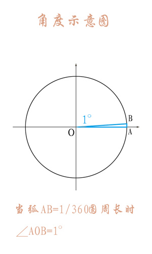
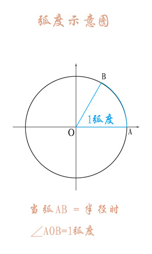
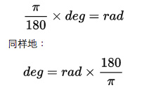
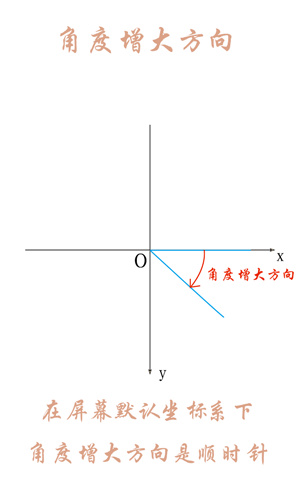
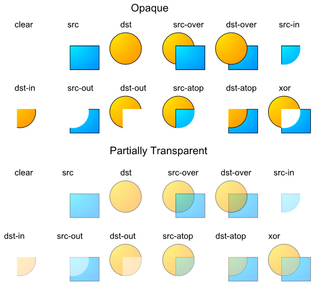

自定义View（TODO-7）

自定义View（TODO-7）

参考：http://www.gcssloop.com/customview/CustomViewIndex/
参考：https://jianshu.com/p/8844de6addb3
参考(重要)：https://developer.android.com/guide/topics/ui/custom-components?hl=zh-cn

自定义View有三种方式：
1. 完全自定义View：需要实现onDraw,onMeasure。onMeasure是一定要实现的，onDraw在某些时候可以不实现。两个方法都是有默认行为的，默认的 onMeasure() 始终会设置 100x100 的大小，默认的 onDraw() 不会执行任何操作。
2. 复合控件，写好了xml，在类中解析layout.xml，这个就不需要重写onMeasure和onDraw了，因为布局的默认行为会正常发挥作用。不过，您仍然可以根据需要替换这些方法。可以其他onKey方法
3. 修改现有的View，即继承并扩展。

**一、坐标体系**
**1、屏幕坐标系**

**2、View 的坐标系**
getTop();           //获取子View左上角距父View顶部的距离
getLeft();           //获取子View左上角距父View左侧的距离
getBottom();     //获取子View右下角距父View顶部的距离
getRight();        //获取子View右下角距父View左侧的距离

**3、MotionEvent中的get 和getRaw**
event.getX();       //触摸点相对于其所在组件坐标系的坐标
event.getY();

event.getRawX();    //触摸点相对于屏幕默认坐标系的坐标
event.getRawY();

**二、弧度与角度**
**1、简介： **
由于两者进制是不同的(**角度是60进制，弧度是10进制**),在合适的地方使用合适的单位来描述会更加方便。
**例如：** 角度是60进位制，遇到30°6′这样的角，应该转化为10进制的30.1°。但弧度就不需要，因为弧度本身就是十进制的实数。

**2、定义：**

|     |     |
| --- | --- |
| 名称  | 定义  |
| 角度  | 两条射线从圆心向圆周射出，形成一个夹角和夹角正对的一段弧。**当这段弧长正好等于圆周长的360分之一时，两条射线的夹角的大小为1度.** |
| 弧度  | 两条射线从圆心向圆周射出，形成一个夹角和夹角正对的一段弧。**当这段弧长正好等于圆的半径时，两条射线的夹角大小为1弧度.** |

  

**3、换算**

圆一周对应的角度为360度(角度)，对应的弧度为2π弧度。
故得等价关系:360(角度) = 2π(弧度) ==> 180(角度) = π(弧度)
**rad是弧度，deg是角度**

|     |     |
| --- | --- |
| 公式  | 例子  |
| rad = deg / 180 * π | 2π = 360 / 180 * π |
| deg = rad / π * 180 | 360 = 2π / π * 180 |

- 维基百科中的解释：

    

**4、坐标系中角度变化**

**三、颜色**
**1、简介**

|     |     |
| --- | --- |
| 颜色模式 | 备注  |
| ARGB8888 | 四通道高精度(32位) |
| ARGB4444 | 四通道低精度(16位) |
| RGB565 | **屏幕默认模式**(16位) |
| Alpha8 | 仅有透明通道(8位) |

*注意：我们常用的是ARGB8888和ARGB4444，而在所有的安卓设备屏幕上默认的模式都是RGB565，请留意这一点。*

以ARGB8888为例介绍：

|     |     |     |     |
| --- | --- | --- | --- |
| 类型  | 解释  | 0（0x00） | 255（0xff） |
| A（Alpha） | 透明度 | 透明  | 不透明 |
| R（Red） | 红色  | 无色  | 红色  |
| G（Green） | 绿色  | 无色  | 绿色  |
| B（Blue） | 蓝色  | 无色  | 蓝色  |

**当RGB全取最小值(0或0x000000)时颜色为黑色，全取最大值(255或0xffffff)时颜色为白色**

**2、几种创建和使用颜色的方式**

- java文件

int color = Color.GRAY;    //灰色

由于Color类提供的颜色仅为有限的几个，通常还是用ARGB值进行表示。
int color = Color.argb(127, 255, 0, 0); //半透明红色
int color = 0xaaff0000; //带有透明度的红色

- 在/res/values/color.xml 文件中

定义颜色以‘#’开头，后面跟十六进制的值，有如下几种定义方式：
#f00            //低精度 - 不带透明通道红色
#af00           //低精度 - 带透明通道红色

#ff0000         //高精度 - 不带透明通道红色
#aaff0000       //高精度 - 带透明通道红色

- java文件中使用xml中定义的color

int color = getResources().getColor(R.color.mycolor);

- 在xml中使用或者创建并使用颜色

<!--在style文件中引用-->

android:background="@color/red"     //引用在/res/values/color.xml 中定义的颜色

android:background="#ff0000"        //创建并使用颜色

**3、颜色混合模式（Alpha通道）**
通过前面介绍我们知道颜色一般都是四个通道(ARGB)的，其中(RGB)控制的是颜色,而A(Alpha)控制的是透明度。

因为我们的显示屏是没法透明的，因此最终显示在屏幕上的颜色里可以认为没有Alpha通道。Alpha通道主要在两个图像混合的时候生效。

默认情况下，当一个颜色绘制到Canvas上时的混合模式是这样计算的：

**(RGB通道) 最终颜色 = 绘制的颜色 + (1 - 绘制颜色的透明度) × Canvas上的原有颜色。**

注意：

1.这里我们一般把每个通道的取值从0(ox00)到255(0xff)映射到0到1的浮点数表示。

2.这里等式右边的“绘制的颜色”、“Canvas上的原有颜色” 都是经过预乘了自己的Alpha通道的值。如绘制颜色：0x88ffffff，那么参与运算时的每个颜色通道的值不是1.0，而是(1.0 * 0.5333 = 0.5333)。 (其中0.5333 = 0x88/0xff)

使用这种方式的混合，就会造成后绘制的内容以半透明的方式叠在上面的视觉效果。

其实还可以有不同的混合模式供我们选择，用Paint.setXfermode，指定不同的PorterDuff.Mode。

下表是各个PorterDuff模式的混合计算公式：（D指原本在Canvas上的内容dst，S指绘制输入的内容src，a指alpha通道，c指RGB各个通道）

|     |     |
| --- | --- |
| **混合模式** | **计算公式** |
| ADD | Saturate(S + D) |
| CLEAR | [0, 0] |
| DARKEN | [Sa + Da - Sa*Da, Sc*(1 - Da) + Dc*(1 - Sa) + min(Sc, Dc)] |
| DST | [Da, Dc] |
| DST_ATOP | [Sa, Sa * Dc + Sc * (1 - Da)] |
| DST_IN | [Sa * Da, Sa * Dc] |
| DST_OUT | [Da * (1 - Sa), Dc * (1 - Sa)] |
| DST_OVER | [Sa + (1 - Sa)*Da, Rc = Dc + (1 - Da)*Sc] |
| LIGHTEN | [Sa + Da - Sa*Da, Sc*(1 - Da) + Dc*(1 - Sa) + max(Sc, Dc)] |
| MULTIPLY | [Sa * Da, Sc * Dc] |
| SCREEN | [Sa + Da - Sa * Da, Sc + Dc - Sc * Dc] |
| SRC | [Sa, Sc] |
| SRC_ATOP | [Da, Sc * Da + (1 - Sa) * Dc] |
| SRC_IN | [Sa * Da, Sc * Da] |
| SRC_OUT | [Sa * (1 - Da), Sc * (1 - Da)] |
| SRC_OVER | [Sa + (1 - Sa)*Da, Rc = Sc + (1 - Sa)*Dc] |
| XOR | [Sa + Da - 2 * Sa * Da, Sc * (1 - Da) + (1 - Sa) * Dc] |

用示例图来查看使用不同模式时的混合效果如下（src表示输入的图，dst表示原Canvas上的内容）：

**四、自定义View**
自定义View绘制流程函数调用链(简化版)

**1、构造函数**
构造函数是View的入口，可以用于初始化一些的内容，和获取自定义属性。

View的构造函数有四种重载分别如下:
public void SloopView(Context context) {}
public void SloopView(Context context, AttributeSet attrs) {}
public void SloopView(Context context, AttributeSet attrs, int defStyleAttr) {}

public void SloopView(Context context, AttributeSet attrs, int defStyleAttr, int defStyleRes) {}

有三个参数的构造函数中第三个参数是默认的Style，这里的默认的Style是指它在当前Application或Activity所用的Theme中的默认Style，且只有在明确调用的时候才会生效。

**注意：即使你在View中使用了Style这个属性也不会调用三个参数的构造函数，所调用的依旧是两个参数的构造函数。**

重点介绍一个参数和两个参数的初始化方法：
//一般在直接**New一个View**的时候调用。
public void SloopView(Context context) {}

//一般**在layout文件中**使用的时候会调用，关于它的所有属性(包括自定义属性)都会包含在attrs中传递进来。
public void SloopView(Context context, AttributeSet attrs) {}

**2、测量view的大小**
测量View大小使用的是onMeasure函数，我们可以从onMeasure的两个参数中取出宽高的相关数据
@Override
protected void onMeasure(int widthMeasureSpec, int heightMeasureSpec) {
    int widthsize =  MeasureSpec.getSize(widthMeasureSpec);      //取出宽度的确切数值
    int widthmode =  MeasureSpec.getMode(widthMeasureSpec);      //取出宽度的测量模式

    int heightsize =  MeasureSpec.getSize(heightMeasureSpec);    //取出高度的确切数值
    int heightmode =  MeasureSpec.getMode(heightMeasureSpec);    //取出高度的测量模式
**    setMeasuredDimension( widthsize, heightsize);**
}

上面的参数widthMeasureSpec 是宽和在宽上的测量模式合成的一个值。heightMeasureSpec同理。测量模式共有三种如下：

|     |     |     |
| --- | --- | --- |
| **模式** | **二进制数值** | **描述** |
| UNSPECIFIED | 00  | 默认值，父控件没有给子view任何限制，子View可以设置为任意大小。 |
| EXACTLY | 01  | 表示父控件已经确切的指定了子View的大小。 |
| AT_MOST | 10  | 表示子View具体大小没有尺寸限制，但是存在上限，上限一般为父View大小。 |

**注意：****如果对View的宽高进行修改了，不要调用 super.onMeasure( widthMeasureSpec, heightMeasureSpec); 要调用 setMeasuredDimension( widthsize, heightsize); 这个函数。**

**3、确定View的大小（onSizeChanged）**
@Override
protected void onSizeChanged(int w, int h, int oldw, int oldh) {
    super.onSizeChanged(w, h, oldw, oldh);
}
可以看出，它有四个参数，分别为 宽度，高度，上一次宽度，上一次高度。

**4、确定子View布局位置（onLayout）**
在自定义ViewGroup中，onLayout一般是循环取出子View，然后经过计算得出各个子View位置的坐标值，然后用以下函数设置子View位置。

**    protected void onLayout(boolean changed, int left, int top, int right, int bottom）**

四个参数分别为：

|     |     |     |
| --- | --- | --- |
| **名称** | **说明** | **对应的函数** |
| changed | 对于该View是不是一个新的大小或位置 |     |
| left | View左侧距父View左侧的距离 | getLeft(); |
| top | View顶部距父View顶部的距离 | getTop(); |
| right | View右侧距父View左侧的距离 | getRight(); |
| bottom | View底部距父View顶部的距离 | getBottom(); |

具体方法可查看上面坐标系中的说明。

**5、绘制内容（onDraw)**
onDraw是实际绘制的部分，也就是我们真正关心的部分，使用的是Canvas绘图。
@Override
protected void onDraw(Canvas canvas) {
    super.onDraw(canvas);
}

**6.对外提供操作方法和监听回调**
自定义完View之后，一般会对外暴露一些接口，用于控制View的状态等，或者监听View的变化.

**五、Canvas使用**
**1、Canvas常用操作**

|     |     |     |
| --- | --- | --- |
| **操作类型** | **相关API** | **备注** |
| 绘制颜色 | drawColor, drawRGB, drawARGB | 使用单一颜色填充整个画布 |
| 绘制基本形状 | drawPoint, drawPoints, drawLine, drawLines, drawRect, drawRoundRect, drawOval, drawCircle, drawArc | 依次为 点、线、矩形、圆角矩形、椭圆、圆、圆弧 |
| 绘制图片 | drawBitmap, drawPicture | 绘制位图和图片 |
| 绘制文本 | drawText, drawPosText, drawTextOnPath | 依次为 绘制文字、绘制文字时指定每个文字位置、根据路径绘制文字 |
| 绘制路径 | drawPath | 绘制路径，绘制贝塞尔曲线时也需要用到该函数 |
| 顶点操作 | drawVertices, drawBitmapMesh | 通过对顶点操作可以使图像形变，drawVertices直接对画布作用、 drawBitmapMesh只对绘制的Bitmap作用 |
| 画布剪裁 | clipPath, clipRect | 设置画布的显示区域 |
| 画布快照 | save, restore, saveLayerXxx, restoreToCount, getSaveCount | 依次为 保存当前状态、 回滚到上一次保存的状态、 保存图层状态、 回滚到指定状态、 获取保存次数 |
| 画布变换 | translate, scale, rotate, skew | 依次为 位移、缩放、 旋转、错切 |
| Matrix(矩阵) | getMatrix, setMatrix, concat | 实际上画布的位移，缩放等操作的都是图像矩阵Matrix， 只不过Matrix比较难以理解和使用，故封装了一些常用的方法。 |

**2、Canvas的使用具体到时候看Canvas的源码，没必要现在纠结。**

** ****在更改了数据需要重绘界面时要调用invalidate()这个函数重新绘制。**

**3、画布操作**
注意：所有的画布操作都只影响后续的绘制，对之前已经绘制过的内容没有影响。

**3.1位移**
translate是坐标系的移动，可以为图形绘制选择一个合适的坐标系。 请注意，位移是基于当前位置移动，而不是每次基于屏幕左上角的(0,0)点移动

**3.2缩放**
缩放提供了两个方法，如下：
public void scale (float sx, float sy)

public final void scale (float sx, float sy, float px, float py)

这两个方法中前两个参数是相同的分别为x轴和y轴的缩放比例。而第二种方法比前一种多了两个参数，用来控制缩放中心位置的。

缩放比例(sx,sy)取值范围详解：

|     |     |
| --- | --- |
| **取值范围(n)** | **说明** |
| [-∞, -1) | 先根据缩放中心放大n倍，再根据中心轴进行翻转 |
| -1  | 根据缩放中心轴进行翻转 |
| (-1, 0) | 先根据缩放中心缩小到n，再根据中心轴进行翻转 |
| 0   | 不会显示，若sx为0，则宽度为0，不会显示，sy同理 |
| (0, 1) | 根据缩放中心缩小到n |
| 1   | 没有变化 |
| (1, +∞) | 根据缩放中心放大n倍 |

如果在缩放时稍微注意一下就会发现缩放的中心默认为坐标原点,而缩放中心轴就是坐标轴，如下：
// 将坐标系原点移动到画布正中心
canvas.translate(mWidth / 2, mHeight / 2);

RectF rect = new RectF(0,-400,400,0);   // 矩形区域

mPaint.setColor(Color.BLACK);           // 绘制黑色矩形
canvas.drawRect(rect,mPaint);

canvas.scale(0.5f,0.5f);                // 画布缩放

mPaint.setColor(Color.BLUE);            // 绘制蓝色矩形
canvas.drawRect(rect,mPaint);

缩放中心就是坐标原点：

图中用箭头指示的就是缩放中心：
