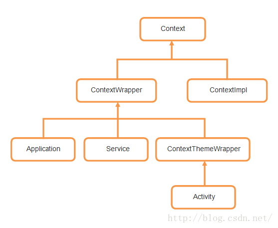
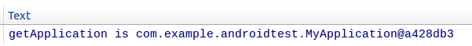
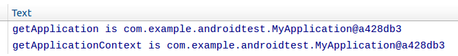
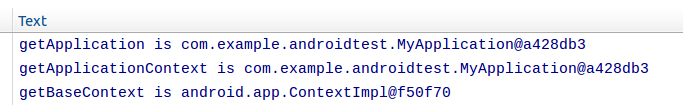
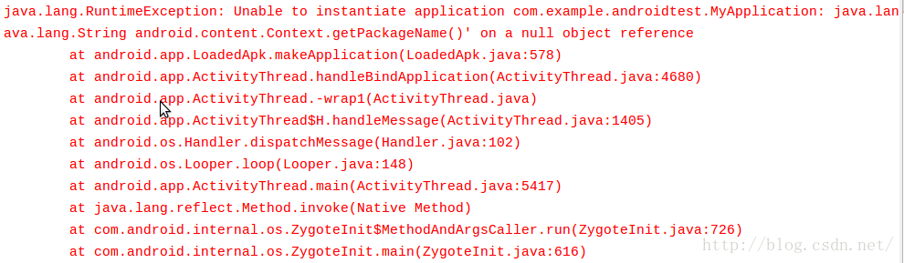
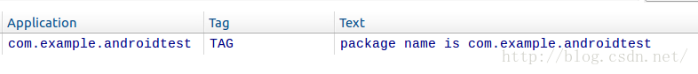
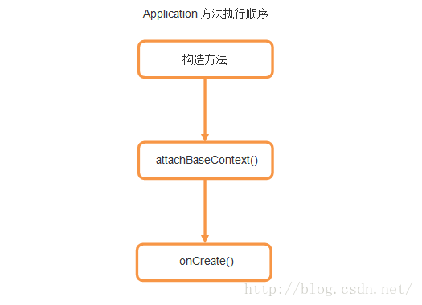
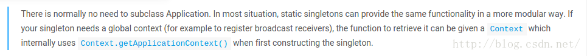

Android Context完全解析

转载请注明出处：[http://blog.csdn.net/guolin_blog/article/details/47028975](http://blog.csdn.net/guolin_blog/article/details/47028975)

前几篇文章，我也是费劲心思写了一个ListView系列的三部曲，虽然在内容上可以说是绝对的精华，但是很多朋友都表示看不懂。好吧，这个系列不仅是把大家给难倒了，也确实是把我给难倒了，之前为了写瀑布流ListView的Demo就写了大半个月的时间。那么本篇文章我们就讲点轻松的东西，不去分析那么复杂的源码了，而是来谈一谈大家都熟知的Context。

Context相信所有的Android开发人员基本上每天都在接触，因为它太常见了。但是这并不代表Context没有什么东西好讲的，实际上Context有太多小的细节并不被大家所关注，那么今天我们就来学习一下那些你所不知道的细节。

## <a id="t0"></a><a id="t0"></a>Context类型

我们知道，Android应用都是使用Java语言来编写的，那么大家可以思考一下，一个Android程序和一个Java程序，他们最大的区别在哪里？划分界限又是什么呢？其实简单点分析，Android程序不像Java程序一样，随便创建一个类，写个main()方法就能跑了，而是要有一个完整的Android工程环境，在这个环境下，我们有像Activity、Service、BroadcastReceiver等系统组件，而这些组件并不是像一个普通的Java对象new一下就能创建实例的了，而是要有它们各自的上下文环境，也就是我们这里讨论的Context。可以这样讲，Context是维持Android程序中各组件能够正常工作的一个核心功能类。

下面我们来看一下Context的继承结构：

  

Context的继承结构还是稍微有点复杂的，可以看到，直系子类有两个，一个是ContextWrapper，一个是ContextImpl。那么从名字上就可以看出，ContextWrapper是上下文功能的封装类，而ContextImpl则是上下文功能的实现类。而ContextWrapper又有三个直接的子类，ContextThemeWrapper、Service和Application。其中，ContextThemeWrapper是一个带主题的封装类，而它有一个直接子类就是Activity。

那么在这里我们至少看到了几个所比较熟悉的面孔，Activity、Service、还有Application。由此，其实我们就已经可以得出结论了，Context一共有三种类型，分别是Application、Activity和Service。这三个类虽然分别各种承担着不同的作用，但它们都属于Context的一种，而它们具体Context的功能则是由ContextImpl类去实现的。

那么Context到底可以实现哪些功能呢？这个就实在是太多了，弹出Toast、启动Activity、启动Service、发送广播、操作数据库等等等等都需要用到Context。由于Context的具体能力是由ContextImpl类去实现的，因此在绝大多数场景下，Activity、Service和Application这三种类型的Context都是可以通用的。不过有几种场景比较特殊，比如启动Activity，还有弹出Dialog。出于安全原因的考虑，Android是不允许Activity或Dialog凭空出现的，一个Activity的启动必须要建立在另一个Activity的基础之上，也就是以此形成的返回栈。而Dialog则必须在一个Activity上面弹出（除非是System Alert类型的Dialog），因此在这种场景下，我们只能使用Activity类型的Context，否则将会出错。

## <a id="t1"></a><a id="t1"></a>Context数量

那么一个应用程序中到底有多少个Context呢？其实根据上面的Context类型我们就已经可以得出答案了。Context一共有Application、Activity和Service三种类型，因此一个应用程序中Context数量的计算公式就可以这样写：

```
Context数量 = Activity数量 + Service数量 + 1
```

上面的1代表着Application的数量，因为一个应用程序中可以有多个Activity和多个Service，但是只能有一个Application。

## <a id="t2"></a><a id="t2"></a>Application Context的设计

基本上每一个应用程序都会有一个自己的Application，并让它继承自系统的Application类，然后在自己的Application类中去封装一些通用的操作。其实这并不是Google所推荐的一种做法，因为这样我们只是把Application当成了一个通用工具类来使用的，而实际上使用一个简单的单例类也可以实现同样的功能。但是根据我的观察，有太多的项目都是这样使用Application的。当然这种做法也并没有什么副作用，只是说明还是有不少人对于Application理解的还有些欠缺。那么这里我们先来对Application的设计进行分析，讲一些大家所不知道的细节，然后再看一下平时使用Application的问题。

首先新建一个MyApplication并让它继承自Application，然后在AndroidManifest.xml文件中对MyApplication进行指定，如下所示：

```
android:name=".MyApplication"android:allowBackup="true"android:icon="@drawable/ic_launcher"android:label="@string/app_name"android:theme="@style/AppTheme" >
```

指定完成后，当我们的程序启动时Android系统就会创建一个MyApplication的实例，如果这里不指定的话就会默认创建一个Application的实例。

前面提到过，现在很多的Application都是被当作通用工具类来使用的，那么既然作为一个通用工具类，我们要怎样才能获取到它的实例呢？如下所示：

```
public class MainActivity extends Activity {protected void onCreate(Bundle savedInstanceState) {super.onCreate(savedInstanceState);		setContentView(R.layout.activity_main);		MyApplication myApp = (MyApplication) getApplication();		Log.d("TAG", "getApplication is " + myApp);
```

可以看到，代码很简单，只需要调用getApplication()方法就能拿到我们自定义的Application的实例了，打印结果如下所示：



那么除了getApplication()方法，其实还有一个getApplicationContext()方法，这两个方法看上去好像有点关联，那么它们的区别是什么呢？我们将代码修改一下：

```
public class MainActivity extends Activity {protected void onCreate(Bundle savedInstanceState) {super.onCreate(savedInstanceState);		setContentView(R.layout.activity_main);		MyApplication myApp = (MyApplication) getApplication();		Log.d("TAG", "getApplication is " + myApp);		Context appContext = getApplicationContext();		Log.d("TAG", "getApplicationContext is " + appContext);
```

同样，我们把getApplicationContext()的结果打印了出来，现在重新运行代码，结果如下图所示：

  

咦？好像打印出的结果是一样的呀，连后面的内存地址都是相同的，看来它们是同一个对象。其实这个结果也很好理解，因为前面已经说过了，Application本身就是一个Context，所以这里获取getApplicationContext()得到的结果就是MyApplication本身的实例。

那么有的朋友可能就会问了，既然这两个方法得到的结果都是相同的，那么Android为什么要提供两个功能重复的方法呢？实际上这两个方法在作用域上有比较大的区别。getApplication()方法的语义性非常强，一看就知道是用来获取Application实例的，但是这个方法只有在Activity和Service中才能调用的到。那么也许在绝大多数情况下我们都是在Activity或者Service中使用Application的，但是如果在一些其它的场景，比如BroadcastReceiver中也想获得Application的实例，这时就可以借助getApplicationContext()方法了，如下所示：

```
public class MyReceiver extends BroadcastReceiver {public void onReceive(Context context, Intent intent) {		MyApplication myApp = (MyApplication) context.getApplicationContext();		Log.d("TAG", "myApp is " + myApp);
```

也就是说，getApplicationContext()方法的作用域会更广一些，任何一个Context的实例，只要调用getApplicationContext()方法都可以拿到我们的Application对象。

那么更加细心的朋友会发现，除了这两个方法之外，其实还有一个getBaseContext()方法，这个baseContext又是什么东西呢？我们还是通过打印的方式来验证一下：

  

哦？这次得到的是不同的对象了，getBaseContext()方法得到的是一个ContextImpl对象。这个ContextImpl是不是感觉有点似曾相识？回去看一下Context的继承结构图吧，ContextImpl正是上下文功能的实现类。也就是说像Application、Activity这样的类其实并不会去具体实现Context的功能，而仅仅是做了一层接口封装而已，Context的具体功能都是由ContextImpl类去完成的。那么这样的设计到底是怎么实现的呢？我们还是来看一下源码吧。因为Application、Activity、Service都是直接或间接继承自ContextWrapper的，我们就直接看ContextWrapper的源码，如下所示：

```
public class ContextWrapper extends Context {protected void attachBaseContext(Context base) {throw new IllegalStateException("Base context already set");public Context getBaseContext() {public AssetManager getAssets() {return mBase.getAssets();public Resources getResources() {return mBase.getResources();public ContentResolver getContentResolver() {return mBase.getContentResolver();public Looper getMainLooper() {return mBase.getMainLooper();public Context getApplicationContext() {return mBase.getApplicationContext();public String getPackageName() {return mBase.getPackageName();public void startActivity(Intent intent) {        mBase.startActivity(intent);public void sendBroadcast(Intent intent) {        mBase.sendBroadcast(intent);public Intent registerReceiver(        BroadcastReceiver receiver, IntentFilter filter) {return mBase.registerReceiver(receiver, filter);public void unregisterReceiver(BroadcastReceiver receiver) {        mBase.unregisterReceiver(receiver);public ComponentName startService(Intent service) {return mBase.startService(service);public boolean stopService(Intent name) {return mBase.stopService(name);public boolean bindService(Intent service, ServiceConnection conn,return mBase.bindService(service, conn, flags);public void unbindService(ServiceConnection conn) {        mBase.unbindService(conn);public Object getSystemService(String name) {return mBase.getSystemService(name);
```

由于ContextWrapper中的方法还是非常多的，我就进行了一些筛选，只贴出来了部分方法。那么上面的这些方法相信大家都是非常熟悉的，getResources()、getPackageName()、getSystemService()等等都是我们经常要用到的方法。那么所有这些方法的实现又是什么样的呢？其实所有ContextWrapper中方法的实现都非常统一，就是调用了mBase对象中对应当前方法名的方法。

那么这个mBase对象又是什么呢？我们来看第16行的attachBaseContext()方法，这个方法中传入了一个base参数，并把这个参数赋值给了mBase对象。而attachBaseContext()方法其实是由系统来调用的，它会把ContextImpl对象作为参数传递到attachBaseContext()方法当中，从而赋值给mBase对象，之后ContextWrapper中的所有方法其实都是通过这种委托的机制交由ContextImpl去具体实现的，所以说ContextImpl是上下文功能的实现类是非常准确的。

那么另外再看一下我们刚刚打印的getBaseContext()方法，在第26行。这个方法只有一行代码，就是返回了mBase对象而已，而mBase对象其实就是ContextImpl对象，因此刚才的打印结果也得到了印证。

## <a id="t3"></a><a id="t3"></a>使用Application的问题

虽说Application的用法确实非常简单，但是我们平时的开发工作当中也着实存在着不少Application误用的场景，那么今天就来看一看有哪些比较容易犯错的地方是我们应该注意的。

Application是Context的其中一种类型，那么是否就意味着，只要是Application的实例，就能随时使用Context的各种方法呢？我们来做个实验试一下就知道了：

```
public class MyApplication extends Application {		String packageName = getPackageName();		Log.d("TAG", "package name is " + packageName);
```

这是一个非常简单的自定义Application，我们在MyApplication的构造方法当中获取了当前应用程序的包名，并打印出来。获取包名使用了getPackageName()方法，这个方法就是由Context提供的。那么上面的代码能正常运行吗？跑一下就知道了，你将会看到如下所示的结果：

  

应用程序一启动就立刻崩溃了，报的是一个空指针异常。看起来好像挺简单的一段代码，怎么就会成空指针了呢？但是如果你尝试把代码改成下面的写法，就会发现一切正常了：

```
public class MyApplication extends Application {		String packageName = getPackageName();		Log.d("TAG", "package name is " + packageName);
```

运行结果如下所示：

  

在构造方法中调用Context的方法就会崩溃，在onCreate()方法中调用Context的方法就一切正常，那么这两个方法之间到底发生了什么事情呢？我们重新回顾一下ContextWrapper类的源码，ContextWrapper中有一个attachBaseContext()方法，这个方法会将传入的一个Context参数赋值给mBase对象，之后mBase对象就有值了。而我们又知道，所有Context的方法都是调用这个mBase对象的同名方法，那么也就是说如果在mBase对象还没赋值的情况下就去调用Context中的任何一个方法时，就会出现空指针异常，上面的代码就是这种情况。Application中方法的执行顺序如下图所示：

  

Application中在onCreate()方法里去初始化各种全局的变量数据是一种比较推荐的做法，但是如果你想把初始化的时间点提前到极致，也可以去重写attachBaseContext()方法，如下所示：

```
public class MyApplication extends Application {protected void attachBaseContext(Context base) {super.attachBaseContext(base);
```

以上是我们平时在使用Application时需要注意的一个点，下面再来介绍另外一种非常普遍的Application误用情况。

其实Android官方并不太推荐我们使用自定义的Application，基本上只有需要做一些全局初始化的时候可能才需要用到自定义Application，官方文档描述如下：

  

但是就我的观察而言，现在自定义Application的使用情况基本上可以达到100%了，也就是我们平时自己写测试demo的时候可能不会使用，正式的项目几乎全部都会使用自定义Application。可是使用归使用，有不少项目对自定义Application的用法并不到位，正如官方文档中所表述的一样，多数项目只是把自定义Application当成了一个通用工具类，而这个功能并不需要借助Application来实现，使用单例可能是一种更加标准的方式。

不过自定义Application也并没有什么副作用，它和单例模式二选一都可以实现同样的功能，但是我见过有一些项目，会把自定义Application和单例模式混合到一起使用，这就让人大跌眼镜了。一个非常典型的例子如下所示：

```
public class MyApplication extends Application {private static MyApplication app;public static MyApplication getInstance() {			app = new MyApplication();
```

就像单例模式一样，这里提供了一个getInstance()方法，用于获取MyApplication的实例，有了这个实例之后，就可以调用MyApplication中的各种工具方法了。

但是这种写法对吗？这种写法是大错特错！因为我们知道Application是属于系统组件，系统组件的实例是要由系统来去创建的，如果这里我们自己去new一个MyApplication的实例，它就只是一个普通的Java对象而已，而不具备任何Context的能力。有很多人向我反馈使用 **[LitePal](https://github.com/LitePalFramework/LitePal) **时发生了空指针错误其实都是由于这个原因，因为你提供给LitePal的只是一个普通的Java对象，它无法通过这个对象来进行Context操作。

那么如果真的想要提供一个获取MyApplication实例的方法，比较标准的写法又是什么样的呢？其实这里我们只需谨记一点，Application全局只有一个，它本身就已经是单例了，无需再用单例模式去为它做多重实例保护了，代码如下所示：

```
public class MyApplication extends Application {private static MyApplication app;public static MyApplication getInstance() {
```

getInstance()方法可以照常提供，但是里面不要做任何逻辑判断，直接返回app对象就可以了，而app对象又是什么呢？在onCreate()方法中我们将app对象赋值成this，this就是当前Application的实例，那么app也就是当前Application的实例了。

好了，关于Context的介绍就到这里吧，内容还是比较简单易懂的，希望大家通过这篇文章可以理解Context更多的细节，并且不要去犯使用Context时的一些低级错误。

> 关注我的技术公众号，每天都有优质技术文章推送。关注我的娱乐公众号，工作、学习累了的时候放松一下自己。
> 
> 微信扫一扫下方二维码即可关注：
> 
>          