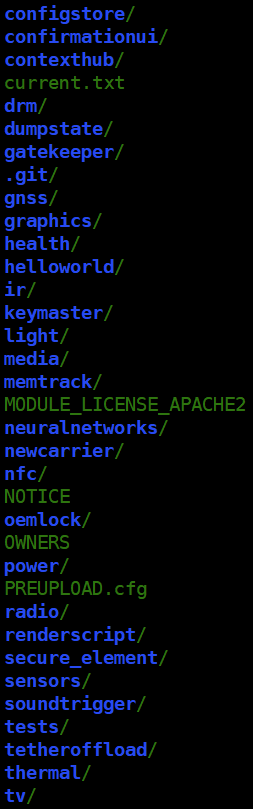
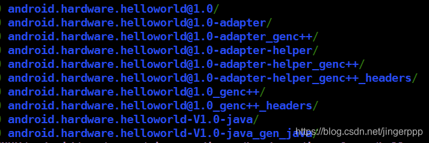

Android HIDL 实例_私房菜之 --学--无--止--境---CSDN博客

## <a id="t0"></a><a id="t0"></a>前言：

从[Android HIDL 详解](https://blog.csdn.net/jingerppp/article/details/86514997) 一文得知HIDL 使用passthrough 模式，为了与原来的HAL 版本兼容。除了passthrough 模式，还有一种binderized模式。本文通过HIDL 中的**Helloworld** 进行实例分析，进一步了解HIDL 使用。

本文source code 基于Android P。

## <a id="t1"></a><a id="t1"></a>Step 1 确定环境

[Android HIDL 编程规范](https://blog.csdn.net/jingerppp/article/details/86525761) 一文中得知需要确定HIDL 的目录结构和软件包名称。

**`ROOT-DIRECTORY`**

- `MODULE`
    - `SUBMODULE`（可选，可以有多层）
        - `VERSION`
            - `Android.mk`
            - `IINTERFACE_1.hal`
            - `IINTERFACE_2.hal`
            - `…`
            - `IINTERFACE_N.hal`
            - `types.hal`（可选）

下表列出了软件包前缀和位置：

| 软件包前缀 | 位置  |
| --- | --- |
| `android.hardware.*` | `hardware/interfaces/*` |
| `android.frameworks.*` | `frameworks/hardware/interfaces/*` |
| `android.system.*` | `system/hardware/interfaces/*` |
| `android.hidl.*` | `system/libhidl/transport/*` |

如上表，hardware/interfaces 目录一般放的是源生hal 相关的接口，如下图所示：



除了上表中提到这几个源生的目录，一般OEM 的hal 都是在vendor下，详细看[Android HIDL 接口和软件包使用](https://blog.csdn.net/jingerppp/article/details/86526547) 一文。

本文中Helloworld 位于hardware/interfaces中，所以目录路径为hardware/interfaces/helloworld/1.0。

确定目录后就是确定软件包名，根据[Android HIDL 接口和软件包使用](https://blog.csdn.net/jingerppp/article/details/86526547) 一文得知在 hardware/interfaces目录下的软件包package 为android.hardware，所以package name 应该是 android.hardware.helloworld@1.0。

## <a id="t2"></a><a id="t2"></a>Step 2 创建核心hal

确定HIDL 模块的路径和包名之后，需要创建一个hal 文件，这个文件包含了client 需要调用HAL 的入口api，这里命名为IHelloWorld.hal，代码如下：

```
package android.hardware.helloworld@1.0;    justTest(string name) generates (string result, HelloTest value);    justTest1(HelloTest name);
```

其中HelloTest 是用户自定义类型，如果是模块公共的类型，可以定义在types.hal 中，例如这里：

```
package android.hardware.helloworld@1.0;enum HelloTest : uint8_t {
```

详细代码格式和数据类型可以查看：[Android HIDL 编程规范](https://blog.csdn.net/jingerppp/article/details/86525761) 和 [Android HIDL 中的数据类型](https://blog.csdn.net/jingerppp/article/details/86531179)。

## <a id="t3"></a><a id="t3"></a>Step 3 创建编译的Android.bp

根据Step 2中的hal 文件利用hidl-gen（详细看 [Android HIDL 中 hidl-gen使用](https://blog.csdn.net/jingerppp/article/details/86525079)） 生成对应的Android.bp：

```
// This file is autogenerated by hidl-gen -Landroidbp.    name: "android.hardware.helloworld@1.0",    root: "android.hardware",
```

注意：

1.  name 需要与package name 相同，编译的时候会根据需要生成对应的so 或jar
2.  root 即为与hidl 对应的root name，详细看Step 1
3.  interfaces 为编译过程中依赖的接口名称，如c 中的shared library
4.  types 为模块中所需要的自定义类型
5.  如果有需要的java 代码可以将 gen\_java  设为 true，如果没有（例如passthrough 模式）需要将这里设为false。不过一般通过update\_makefiles.sh 就可以自动生成。详细看[Android HIDL 中 hidl-gen使用](https://blog.csdn.net/jingerppp/article/details/86525079)

## <a id="t4"></a><a id="t4"></a>Step 4 编译HIDL

在对应的hidl 目录下mm 编译或者在根目录下make PQName 即可，最终在**out/soong/.interfaces/hardware/interfaces/**下会生成对应模块的obj，这里目录决定为hardware/interfaces其实就是跟上面root 设定有关系。详细如下图：



其中：

- android.hardware.helloworld@1.0 就是模块对应的库文件；
- android.hardware.helloworld@1.0_genc++ 为生成对应的C++临时文件，在使用的时候都是链接到这里；

```
-rw-rw-r-- 1 shift shift 26745 1月  22 14:20 HelloWorldAll.cpp-rw-rw-r-- 1 shift shift   281 1月  22 14:20 HelloWorldAll.cpp.d-rw-rw-r-- 1 shift shift   874 1月  22 14:20 types.cpp
```

- android.hardware.helloworld@1.0\_genc++\_headers 为生成的C++ 所需的头文件；

```
-rw-rw-r-- 1 shift shift  2264 1月  22 14:20 BnHwHelloWorld.h-rw-rw-r-- 1 shift shift  3008 1月  22 14:20 BpHwHelloWorld.h-rw-rw-r-- 1 shift shift 17785 1月  22 14:20 BsHelloWorld.h-rw-rw-r-- 1 shift shift   519 1月  22 14:20 hwtypes.h-rw-rw-r-- 1 shift shift  5296 1月  22 14:20 IHelloWorld.h-rw-rw-r-- 1 shift shift   279 1月  22 14:20 IHelloWorld.h.d-rw-rw-r-- 1 shift shift   684 1月  22 14:20 IHwHelloWorld.h-rw-rw-r-- 1 shift shift  4520 1月  22 14:20 types.h
```

- android.hardware.helloworld-V1.0-java 为java 代码所使用的java 库文件；
- android.hardware.helloworld-V1.0-java\_gen\_java 为java 代码所使用的java 文件

```
-rw-rw-r-- 1 shift shift   922 1月  22 14:20 HelloTest.java-rw-rw-r-- 1 shift shift 24875 1月  22 14:20 IHelloWorld.java-rw-rw-r-- 1 shift shift   287 1月  22 14:20 IHelloWorld.java.d
```

## <a id="t5"></a><a id="t5"></a>Step 5 创建service 和impl

其实当IHelloworld.hal 创建完成就可以创建对应的HIDL 实现代码（impl 和service），而hidl-gen 也提供了默认生成的方式，详细看[Android HIDL 中 hidl-gen使用](https://blog.csdn.net/jingerppp/article/details/86525079)，最终生成的文件为：

```
-rw-rw-r-- 1 shift shift  973 1月  17 20:05 Android.bp-rw-rw-r-- 1 shift shift  605 1月  17 20:05 HelloWorld.cpp-rw-rw-r-- 1 shift shift 1159 1月  17 20:05 HelloWorld.h
```

先来看下HelloWorld.h：

```
#include <android/hardware/helloworld/1.0/IHelloWorld.h>#include <hidl/MQDescriptor.h>namespace implementation {using ::android::hardware::hidl_array;using ::android::hardware::hidl_memory;using ::android::hardware::hidl_string;using ::android::hardware::hidl_vec;using ::android::hardware::Return;using ::android::hardware::Void;struct HelloWorld : public IHelloWorld {Return<void> justTest(const hidl_string& name, justTest_cb _hidl_cb) override;Return<void> justTest1(::android::hardware::helloworld::V1_0::HelloTest name) override;
```

如果是实用passthrough 模式，则需要打开HIDL\_FETCH\_IHelloWorld() 函数的注释，并且在-impl 的C++文件中实现，例如这里如果使用passthrough 模式，需要在HelloWorld.cpp 中实现该函数，详细可以看nfc 或tv 等模块中实现。

再来看下HelloWorld.cpp：

```
#define LOG_TAG "HelloWorldImpl"namespace implementation {Return<void> HelloWorld::justTest(const hidl_string& name, justTest_cb _hidl_cb) {    ALOGD("justTest, name = %s", name.c_str());    _hidl_cb(name, HelloTest::V_TEST2);Return<void> HelloWorld::justTest1(::android::hardware::helloworld::V1_0::HelloTest name) {    ALOGD("justTest1, name = %hhu", name);
```

这里就是实现的地方，其中使用passthrough 的时候需要使能HIDL\_FETCH\_IHelloWorld() 函数。

关于HIDL 相关的数据类型详细看：[Android HIDL 中的数据类型](https://blog.csdn.net/jingerppp/article/details/86531179)

再来看下service.cpp：

```
#define LOG_TAG "android.hardware.helloworld@1.0-service"#include <android/hardware/helloworld/1.0/IHelloWorld.h>#include <hidl/LegacySupport.h>using android::hardware::helloworld::V1_0::IHelloWorld;using android::hardware::helloworld::V1_0::implementation::HelloWorld;using android::hardware::defaultPassthroughServiceImplementation;using android::hardware::configureRpcThreadpool;using android::hardware::joinRpcThreadpool;return defaultPassthroughServiceImplementation<IHelloWorld>();    sp<IHelloWorld> service = new HelloWorld();    configureRpcThreadpool(1, true );if(android::OK !=  service->registerAsService())
```

Android.bp 是为了编译HIDL 实现部分的代码生成的默认编译文件（详细看[Android HIDL 中 hidl-gen使用](https://blog.csdn.net/jingerppp/article/details/86525079)），可以根据实际的情况修改：

```
name: "android.hardware.helloworld@1.0-impl",relative_install_path: "hw","android.hardware.helloworld@1.0",
```

如果其他模块需要so 则需要share lib，如果不需要刻意直接编译service，如下：

```
name: "android.hardware.helloworld@1.0-service",defaults: ["hidl_defaults"],relative_install_path: "hw",init_rc: ["android.hardware.helloworld@1.0-service.rc"],"android.hardware.helloworld@1.0",
```

注意：

- name：为变成生成的库文件名称，-impl 为实现的库文件，-service为服务端的库文件；
- init_rc：指定启动service 的rc 名称；
- relative\_install\_path：为生成库文件路径，通常与proprietary 和vendor 属性配套，一般都设为hw；
- proprietary：标记默认生成路径，设为true 代表为系统默认路径（system/lib64下），通常与relative\_install\_path 属性配套，缺省时默认为system/lib64 下；
- vendor：与proprietary 相同，设为true代表路径在vendor 下，默认OEM 都会设置在vendor 下；

## <a id="t6"></a><a id="t6"></a>Step 6 添加rc 文件

在实现了serivce 和impl 代码后需要添加rc 文件，文件名为android.hardware.helloworld@1.0-service.rc：

```
service helloworld-hal-1-0 /vendor/bin/hw/android.hardware.helloworld@1.0-service
```

## <a id="t7"></a><a id="t7"></a>Step 7 启动service

需要注意的是，在应用起来之前需要使能service，一般有两种方式，一个是通过rc 中的service name，直接start；另外一种是通过selinux 中添加te 文件，设置domain 信息。对于selinux 配置，这里暂不分析，详细看 [SELINUX](https://blog.csdn.net/shift_wwx/article/category/7121234) 中文章。

## <a id="t8"></a><a id="t8"></a>Step 8 实现client 端

App 其他的代码这里不做展示，主要来看调用的地方：

```
        IHelloWorld service = null;            service = IHelloWorld.getService(true);        } catch (RemoteException e) {            Log.e(TAG, "test failed, service is null...");            service.justTest1((byte)123);        } catch (RemoteException e) {
```

Android.mk 为：

```
LOCAL_PATH := $(call my-dir)LOCAL_CERTIFICATE := platformLOCAL_MODULE_TAGS := optionalLOCAL_SRC_FILES := $(call all-java-files-under, src)LOCAL_PACKAGE_NAME := TestHIDLClientLOCAL_PRIVATE_PLATFORM_APIS := trueLOCAL_STATIC_JAVA_LIBRARIES := \    android.hardware.helloworld-V1.0-java
```

打印log 如下：

```
01-23 13:57:20.424  6498  6498 I android_os_HwBinder: HwBinder: Starting thread pool for default::android.hardware.helloworld@1.0::IHelloWorld01-23 13:57:20.424   572  3344 D audio_hw_primary: start_output_stream: enter: stream(0xedde7000)usecase(1: low-latency-playback) devices(0x2)01-23 13:57:20.424   572  3344 E audio_hw_extn: audio_extn_perf_lock_acquire: Failed to acquire perf lock, err: -101-23 13:57:20.424   572  3344 D audio_hw_primary: select_devices for use case (low-latency-playback)01-23 13:57:20.424   572  3344 D audio_hw_primary: select_devices: out_snd_device(2: speaker) in_snd_device(0: )01-23 13:57:20.424   572  3344 I msm8916_platform: platform_check_and_set_codec_backend_cfg:becf: afe: bitwidth 16, samplerate 48000 channels 2, backend_idx 0 usecase = 1 device (speaker)01-23 13:57:20.424   572  3344 D msm8916_platform: platform_split_snd_device: snd_device(2) num devices(1) new_snd_devices(0)01-23 13:57:20.424  6607  6607 D HelloWorldImpl: justTest1, name = 123
```

相关文章：

[Android Treble 简介](https://blog.csdn.net/jingerppp/article/details/86513675)

[Android HIDL 详解](https://blog.csdn.net/jingerppp/article/details/86514997)

[Android HIDL 中 hidl-gen使用](https://blog.csdn.net/jingerppp/article/details/86525079)

[Android HIDL 编程规范](https://blog.csdn.net/jingerppp/article/details/86525761)

[Android HIDL 接口和软件包使用](https://blog.csdn.net/jingerppp/article/details/86526547)

[Android HIDL 中的函数](https://blog.csdn.net/jingerppp/article/details/86531137)

[Android HIDL 中的数据类型](https://blog.csdn.net/jingerppp/article/details/86531179)