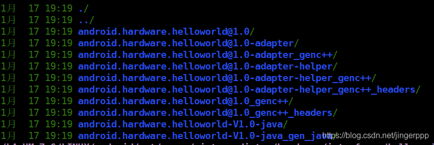

Android HIDL 详解

[Android Treble 简介](https://blog.csdn.net/jingerppp/article/details/86513675) 一文中提到了Android O之后使用Treble的架构，为了解决Android 系统的碎片化问题和提高系统更新的效率，减少了framework 和HAL 的耦合性，进而引出了HIDL 的概念。本文将详细的总结HIDL 的使用。

本文代码基于：Android P

HIDL 全称为HAL interface definition language（发音为“hide-l”）是用于指定 HAL 和其用户之间的接口的一种接口描述语言 (IDL)。

HIDL 的目标是，框架可以在无需重新构建 HAL 的情况下进行替换。HAL 将由供应商或 SOC 制造商构建，放置在设备的 `/vendor` 分区中，这样一来，框架就可以在其自己的分区中通过 OTA 进行替换，而无需重新编译 HAL，这也是Project Treble框架设计而诞生的。

## <a id="t2"></a><a id="t2"></a>HIDL对比与AIDL 

| 相同  | 不同  |     |
| --- | --- | --- |
| AIDL | HIDL |
| --- | --- | --- |
| 都是使用Binder 机制进行IPC<br><br>都使用service manager进行管控 | 文件的后缀为 aidl | 文件的后缀为 hal |
| 适用于框架/应用 之间的IPC | 适用于框架/HAL 进程之间的IPC<br><br>或<br><br>适用于OEM 进程之间的IPC |
| 使用设备节点为/dev/binder | 使用设备节点为/dev/hwbinder<br><br>或 /dev/vndbinder |
| 语言实现方式不同（例如数据类型、types.hal等） |     |

## <a id="t3"></a><a id="t3"></a>HIDL 设计原则

HIDL 的目标是，框架可以在无需重新构建 HAL 的情况下进行替换。HAL 将由供应商或 SOC 制造商构建，放置在设备的 `/vendor` 分区中，这样一来，框架就可以在其自己的分区中通过 OTA 进行替换，而无需重新编译 HAL。

HIDL 设计在以下方面之间保持了平衡：

- **互操作性**。在可以使用各种架构、工具链和编译配置来编译的进程之间创建可互操作的可靠接口。HIDL 接口是分版本的，发布后不得再进行更改。
- **效率**。HIDL 会尝试尽可能减少复制操作的次数。HIDL 定义的数据以 C++ 标准布局数据结构传递至 C++ 代码，无需解压，可直接使用。此外，HIDL 还提供共享内存接口；由于 RPC 本身有点慢，因此 HIDL 支持两种无需使用 RPC 调用的数据传输方法：共享内存和快速消息队列 (FMQ)。
- **直观**。通过仅针对 RPC 使用 `in` 参数，HIDL 避开了内存所有权这一棘手问题（请参阅 [Android 接口定义语言 (AIDL)](https://developer.android.com/guide/components/aidl.html)）；无法从方法高效返回的值将通过回调函数返回。无论是将数据传递到 HIDL 中以进行传输，还是从 HIDL 接收数据，都不会改变数据的所有权，也就是说，数据所有权始终属于调用函数。数据仅需要在函数被调用期间保留，可在被调用的函数返回数据后立即清除。

- ### <a id="t5"></a><a id="t5"></a>Passthrough
    

兼容之前的HAL 使用方式（在同一个进程）。

要将运行早期版本的 Android 的设备更新为使用 Android O，您可以将惯用的（和旧版）HAL 封装在一个新 HIDL 接口中，该接口将在绑定式模式和同进程（直通）模式提供 HAL。这种封装对于 HAL 和 Android 框架来说都是透明的。

直通模式仅适用于 C++ 客户端和实现。运行早期版本的 Android 的设备没有用 Java 编写的 HAL，因此 Java HAL 自然而然经过 Binder 化。

- ### <a id="t6"></a><a id="t6"></a>Binderized
    

使用Binder 方式进行IPC（在不同进程）。

在使用HIDL 的时候需要有两个软件包，一个是FQName-impl，一个是FQName-service。FQName-impl一般是HAL 实现的部分或者是链接HAL的部分，FQName-service 就是service 端。

当然，为了兼容之前的HAL 旧版本和接口的统一，FQName-service 也可以是简单的直通（passthrough）模式。例如：

```
return defaultPassthroughServiceImplementation<INfc>();                                            
```

如果是这样的话，需要在FQName-impl 中暴露HIDL\_FETCH\_*接口，例如：（这里用NFC 为例，HIDL 文件名为INfc.hal）

```
extern "C" INfc* HIDL_FETCH_INfc(const char* name);
```

当然，如果采用进程的方式FQName-service 的main 函数修改为：

```
#define LOG_TAG "android.hardware.cfc@1.0-service"                                                                                                                   #include <android/hardware/nfc/1.0/INfc.h>                                               #include <hidl/LegacySupport.h>                                                                        using android::hardware::nfc::V1_0::INfc;                                                using android::hardware::nfc::V1_0::implementation::Nfc;                                 using android::hardware::defaultPassthroughServiceImplementation;                                      using android::hardware::configureRpcThreadpool;                                                       using android::hardware::joinRpcThreadpool;                                                            int main(int , char*  []) {    configureRpcThreadpool(1 , true );    sp<INfc> nfc = new Nfc();if(android::OK !=  nfc->registerAsService())
```

如果有一个 `INfc`，您可以调用 `sp<INfc> INfc::getService(string name, bool getStub)`，以获取对 `INfc` 实例的访问权限。如果 `getStub` 为 True，则 `getService` 会尝试仅在直通模式下打开 HAL。如果 `getStub` 为 False，则 `getService` 会尝试找到 Binder 化服务；如果未找到，则它会尝试找到直通式服务。除了在 `defaultPassthroughServiceImplementation` 中，其余情况一律不得使用 `getStub` 参数。（搭载 Android O 的设备是完全 Binder 化的设备，因此不得在直通模式下打开服务。）

代码目录：system/tools/hidl

```
defaults: ["hidl-gen-defaults"],"ConstantExpression.cpp","DeathRecipientType.cpp",
```

在使用的时候可以直接使用out/host/linux-x86/bin/hidl-gen 或者使用：

lunch 之后可以直接使用hidl-gen，因为这个时候已经将bin 的目录添加到了环境变量中了

详细hidl-gen 使用可以看另一篇博文：[Android HIDL 中 hidl-gen使用](https://blog.csdn.net/jingerppp/article/details/86525079)

HIDL 是接口描述语言，只要是编程语言就会涉及到编写的规范，例如文件名、包名、变量、接口、数据类型、版本等等。

详细的代码规范可以看另一篇博文：[Android HIDL 编程规范](https://blog.csdn.net/jingerppp/article/details/86525761)

HIDL 是围绕接口进行编译的，接口是面向对象的语言使用的一种用来定义行为的抽象类型。每个接口都是软件包的一部分。

例如：

```
package android.hardware.nfc@1.0;import INfcClientCallback;    @callflow(next={"write", "coreInitialized", "prediscover", "powerCycle", "controlGranted"})    open(INfcClientCallback clientCallback) generates (NfcStatus status);
```

要使用接口INfc，必须要确定其package以及在interface 下定义所使用的接口。通过[Android HIDL 编程规范](https://blog.csdn.net/jingerppp/article/details/86525761) 得知package的定义是有一定的规范的（由PACKAGE、MODULE、SUBMODULE、VERSION等组成），interface 的定义也有特定的规则。

再例如：nfc 中的types.hal

```
package android.hardware.nfc@1.0;@export(name="", value_prefix="HAL_NFC_", value_suffix="_EVT")enum NfcEvent : uint32_t {
```

types.hal 定义的是需要使用的数据类型，并没有定义interface，这也是types.hal 的特殊之处。

详细内容可以看另一篇博文：[Android HIDL 接口和软件包使用](https://blog.csdn.net/jingerppp/article/details/86526547)

|     |     |
| --- | --- |
| `libhidlbase` | 包含标准 HIDL 数据类型。除非您的接口只包含直接映射到 C++ 基元的基元，否则您还必须链接到此库：<br><br>```<br>LOCAL_SHARED_LIBRARIES += libhidlbase<br><br>``` |
| `libhidltransport` | 通过不同的 RPC/IPC 机制处理 HIDL 调用的传输。您必须始终链接到此库：<br><br>```<br>LOCAL_SHARED_LIBRARIES += libhidltransport<br><br>``` |
| `libhwbinder` | 您还必须链接到此库：<br><br>```<br>LOCAL_SHARED_LIBRARIES += libhwbinder<br><br>``` |
| `libfmq` | 要使用快速消息队列 IPC，您还必须链接到此库。<br><br>```<br>LOCAL_SHARED_LIBRARIES += libfmq<br>``` |

在另一篇博文会详细描述HelloWorld 在HIDL中的使用：[Android HIDL 中的数据类型](https://blog.csdn.net/jingerppp/article/details/86531179)

在另一篇博文会描述HIDL 中函数的使用：[Android HIDL 中的函数](https://blog.csdn.net/jingerppp/article/details/86531137)

在另一篇博文会详细描述HelloWorld 在HIDL中的使用：[Android HIDL 实例](https://blog.csdn.net/jingerppp/article/details/86530600)

在编译HIDL 文件，会在out/soong/.interfaces/PACKAGE/MOUDLE/VERSION/下生成对应的文件。例如[Android HIDL 实例](https://blog.csdn.net/jingerppp/article/details/86530600) 中的helloworld 是在hardware/interfaces下创建，所以生成的文件路径为：out/soong/.intermediates/hardware/interfaces/helloworld/1.0



当然实际生成的文件是根据hidl 对应的Android.bp来的，例如在Android.bp 中设定gen\_java\_constants为true，会生成一个Constants 的JAVA 类。

android.hardware.helloworld@1.0\_genc++\_headers 目录就是为Client 和impl 准备的头文件。

android.hardware.helloworld@1.0_genc++ 目录为binder 使用的proxy 和 stub类（或者native 中的Bp 和Bn类）

android.hardware.helloworld-V1.0-java 是为Java 调用生成的java lib

android.hardware.helloworld-V1.0-java\_gen\_java 是为Java 调用生成的对应的Java 类

详细信息看博文：[Android HIDL 实例](https://blog.csdn.net/jingerppp/article/details/86530600)

**参考：**

[HIDL(General) - Overview](https://source.android.com/devices/architecture/hidl/)

相关文章：

[Android Treble 简介](https://blog.csdn.net/jingerppp/article/details/86513675)

[Android HIDL 中 hidl-gen使用](https://blog.csdn.net/jingerppp/article/details/86525079)

[Android HIDL 编程规范](https://blog.csdn.net/jingerppp/article/details/86525761)

[Android HIDL 接口和软件包使用](https://blog.csdn.net/jingerppp/article/details/86526547)

[Android HIDL 实例](https://blog.csdn.net/jingerppp/article/details/86530600)

[Android HIDL 中的函数](https://blog.csdn.net/jingerppp/article/details/86531137)

[Android HIDL 中的数据类型](https://blog.csdn.net/jingerppp/article/details/86531179)