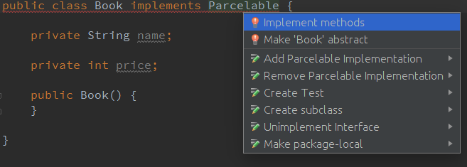
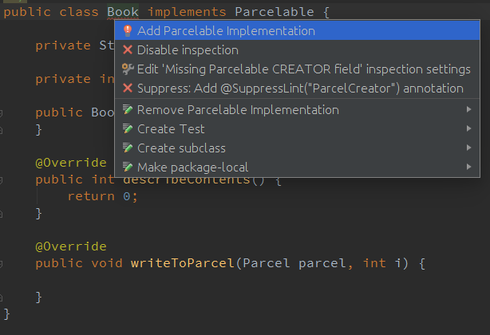
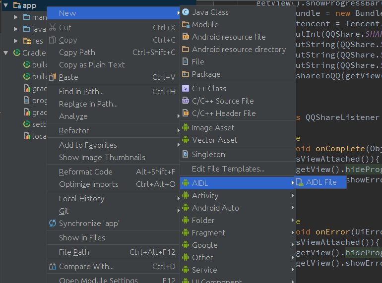
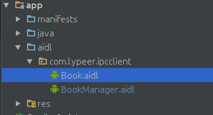
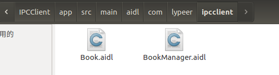

Android：学习AIDL，这一篇文章就够了(上) - 程序园

## 前言

在决定用这个标题之前甚是忐忑，主要是担心自己对AIDL的理解不够深入，到时候大家看了之后说——你这是什么玩意儿，就这么点东西就敢说够了？简直是坐井观天不知所谓——那样就很尴尬了。不过又转念一想，我辈年轻人自当有一种一往无前的锐气，标题大气一点岂不更好？并且大家都是文明人，总归更多的是理解与补充而不是侮辱与谩骂？所以最终还是厚颜用了这么一个不怎么有耻的标题。

好了，接下来进入正题，谈谈我对AIDL的理解和认识。

## 1、概述

AIDL是一个缩写，全称是Android Interface Definition Language，也就是Android接口定义语言。是的，首先我们知道的第一点就是：AIDL是一种语言。既然是一种语言，那么相应的就很自然的衍生出了一些问题：

- 为什么要设计出这么一门语言？
- 它有哪些语法？
- 我们应该如何使用它？
- 再深入一点，我们可以思考，我们是如何通过它来达到我们的目的的？
- 更深入一点，为什么要这么设计这门语言？会不会有更好的方式来实现我们的目的？

接下来，我们就一步步的来解答上面的这些问题。

ps： 1， 在研究AIDL相关的东西之前，一些必要的知识储备是要有的。一方面是关于Android中service相关的知识，要了解的比较通透才行，关于这方面的东西可以参考 Android中的Service：默默的奉献者 (1) ， Android中的Service：Binder，Messenger，AIDL（2） 这两篇博文。另一方面是关于Android中序列化的相关知识，这方面的东西文中会简单提及，但是如果想要深入的研究一下的话最好还是去找一些这方面的资料看一下。 2， 我的编译环境为Android Studio2.1.2，SDK Version 23，JDK 1.7。

## 2、为什么要设计这门语言？

设计这门语言的目的是为了实现 进程间通信 。

每一个进程都有自己的Dalvik VM实例，都有自己的一块独立的内存，都在自己的内存上存储自己的数据，执行着自己的操作，都在自己的那片狭小的空间里过完自己的一生。每个进程之间都你不知我，我不知你，就像是隔江相望的两座小岛一样，都在同一个世界里，但又各自有着自己的世界。而AIDL，就是两座小岛之间沟通的桥梁。相对于它们而言，我们就好像造物主一样，我们可以通过AIDL来制定一些规则，规定它们能进行哪些交流——比如，它们可以在我们制定的规则下传输一些特定规格的数据。

总之，通过这门语言，我们可以愉快的在一个进程访问另一个进程的数据，甚至调用它的一些方法，当然，只能是特定的方法。

## 3、它有哪些语法？

其实AIDL这门语言非常的简单，基本上它的语法和 Java 是一样的，只是在一些细微处有些许差别——毕竟它只是被创造出来简化Android程序员工作的，太复杂不好——所以在这里我就着重的说一下它和 Java 不一样的地方。主要有下面这些点：

- 文件类型：用AIDL书写的文件的后缀是 .aidl，而不是 .java。
- 数据类型：AIDL默认支持一些数据类型，在使用这些数据类型的时候是不需要导包的，但是除了这些类型之外的数据类型，在使用之前必须导包， 就算目标文件与当前正在编写的 .aidl 文件在同一个包下 ——在 Java 中，这种情况是不需要导包的。比如，现在我们编写了两个文件，一个叫做 Book.java ，另一个叫做 BookManager.aidl ，它们都在 com.lypeer.aidldemo 包下 ，现在我们需要在 .aidl 文件里使用 Book 对象，那么我们就必须在 .aidl 文件里面写上 import com.lypeer.aidldemo.Book; 哪怕 .java 文件和 .aidl 文件就在一个包下。  
    默认支持的数据类型包括：
    - Java中的八种基本数据类型，包括 byte，short，int，long，float，double，boolean，char。
    - String 类型。
    - CharSequence类型。
    - List类型：List中的所有元素必须是AIDL支持的类型之一，或者是一个其他AIDL生成的接口，或者是定义的parcelable（下文关于这个会有详解）。List可以使用泛型。
    - Map类型：Map中的所有元素必须是AIDL支持的类型之一，或者是一个其他AIDL生成的接口，或者是定义的parcelable。Map是不支持泛型的。
- 定向tag：这是一个极易被忽略的点——这里的“被忽略”指的不是大家都不知道，而是很少人会正确的使用它。在我的理解里，定向 tag 是这样的： AIDL中的定向 tag 表示了在跨进程通信中数据的流向，其中 in 表示数据只能由客户端流向服务端， out 表示数据只能由服务端流向客户端，而 inout 则表示数据可在服务端与客户端之间双向流通。其中，数据流向是针对在客户端中的那个传入方法的对象而言的。in 为定向 tag 的话表现为服务端将会接收到一个那个对象的完整数据，但是客户端的那个对象不会因为服务端对传参的修改而发生变动；out 的话表现为服务端将会接收到那个对象的的空对象，但是在服务端对接收到的空对象有任何修改之后客户端将会同步变动；inout 为定向 tag 的情况下，服务端将会接收到客户端传来对象的完整信息，并且客户端将会同步服务端对该对象的任何变动。 具体的分析大家可以移步我的另一篇博文： [你真的理解AIDL中的in，out，inout么](../../Android/Android_NDK/你真的理解AIDL中的in，out，inout么.md) 
    另外，Java 中的基本类型和 String ，CharSequence 的定向 tag 默认且只能是 in 。还有，请注意， 请不要滥用定向 tag ，而是要根据需要选取合适的——要是不管三七二十一，全都一上来就用 inout ，等工程大了系统的开销就会大很多——因为排列整理参数的开销是很昂贵的。
- 两种AIDL文件：在我的理解里，所有的AIDL文件大致可以分为两类。一类是用来定义parcelable对象，以供其他AIDL文件使用AIDL中非默认支持的数据类型的。一类是用来定义方法接口，以供系统使用来完成跨进程通信的。可以看到，两类文件都是在“定义”些什么，而不涉及具体的实现，这就是为什么它叫做“Android接口定义语言”。  
    注： 所有的非默认支持数据类型必须通过第一类AIDL文件定义才能被使用。

下面是两个例子，对于常见的AIDL文件都有所涉及：
```java
package com.lypeer.ipcclient;


parcelable Book;
```
```java
package com.lypeer.ipcclient;

import com.lypeer.ipcclient.Book;

interface BookManager {

    
    List<Book>; getBooks();
    Book getBook();
    int  getBookCount();

    
    
    void  setBookPrice(in Book book , int price)  
	void  setBookName(in Book book , String name)  
	void  addBookIn(in Book book);
    void  addBookOut(out Book book);
    void  addBookInout(inout Book book);
}
```
## 4、如何使用AIDL文件来完成跨进程通信？

在进行跨进程通信的时候，在AIDL中定义的方法里包含非默认支持的数据类型与否，我们要进行的操作是不一样的。如果不包含，那么我们只需要编写一个AIDL文件，如果包含，那么我们通常需要写 n+1 个AIDL文件（ n 为非默认支持的数据类型的种类数）——显然，包含的情况要复杂一些。所以我接下来将只介绍AIDL文件中包含非默认支持的数据类型的情况，至于另一种简单些的情况相信大家是很容易从中触类旁通的。

### 4.1、使数据类实现 Parcelable 接口

由于不同的进程有着不同的内存区域，并且它们只能访问自己的那一块内存区域，所以我们不能像平时那样，传一个句柄过去就完事了——句柄指向的是一个内存区域，现在目标进程根本不能访问源进程的内存，那把它传过去又有什么用呢？ 所以我们必须将要传输的数据转化为能够在内存之间流通的形式。 这个转化的过程就叫做序列化与反序列化。简单来说是这样的：比如现在我们要将一个对象的数据从客户端传到服务端去，我们就可以在客户端对这个对象进行序列化的操作，将其中包含的数据转化为序列化流，然后将这个序列化流传输到服务端的内存中去，再在服务端对这个数据流进行反序列化的操作，从而还原其中包含的数据——通过这种方式，我们就达到了在一个进程中访问另一个进程的数据的目的。

而通常，在我们通过AIDL进行跨进程通信的时候，选择的序列化方式是实现 Parcelable 接口。关于实现 Parcelable 接口之后里面具体有那些方法啦，每个方法是干嘛的啦，这些我就不展开来讲了，那並非这篇文章的重点，我下面主要讲一下如何快速的生成一个合格的可序列化的类（以Book.java为例）。

注：若AIDL文件中涉及到的所有数据类型均为默认支持的数据类型，则无此步骤。因为默认支持的那些数据类型都是可序列化的。

4.1.1、编译器自动生成

我当前用的编译器是Android Studio 2.1.2，它是自带了 Parcelable 接口的模板的，只需要我们敲几下键盘就可以轻松的生成一个可序列化的 Parcelable 实现类。

首先，创建一个类，正常的书写其成员变量，建立getter和setter并添加一个无参构造，比如：
```java
public class  Book{
    public String getName() {
        return name;
    }

    public  void  setName(String name) {
        this.name = name;
    }

    public  int  getPrice() {
        return price;
    }

    public  void  setPrice(int price) {
        this.price = price;
    }

    private String name;

    private int price;

    public  Book() {}

}
```
然后 implements Parcelable ，接着 as 就会报错，将鼠标移到那里，按下 alt+enter（as默认的自动解决错误的快捷键，如果你们的as有修改过快捷键的话以修改后的为准） 让它自动解决错误，这个时候它会帮你完成一部分的工作：



Parcelable实现第一步

在弹出来的框里选择所有的成员变量，然后确定。你会发现类里多了一些代码，但是现在还是会报错，Book下面仍然有一条小横线，再次将鼠标移到那里，按下 alt+enter 让它自动解决错误：



Parcelable实现第二步

这次解决完错误之后就不会报错了，这个 Book 类也基本上实现了 Parcelable 接口，可以执行序列化操作了。

但是请注意，这里有一个坑： 默认生成的模板类的对象只支持为 in 的定向 tag 。 为什么呢？因为默认生成的类里面只有 writeToParcel() 方法，而如果要支持为 out 或者 inout 的定向 tag 的话，还需要实现 readFromParcel() 方法——而这个方法其实并没有在 Parcelable 接口里面，所以需要我们从头写。具体为什么大家可以去看看： [你真的理解AIDL中的in，out，inout么](../../Android/Android_NDK/你真的理解AIDL中的in，out，inout么.md)

那么这个 readFromParcel() 方法应当怎么写呢？这样写：
```java
@Override
public  void  writeToParcel(Parcel dest, int flags) {
    dest.writeString(name);
    dest.writeInt(price);
}

public  void  readFromParcel(Parcel dest) {
    
    name = dest.readString();
    price = dest.readInt();
}
```
像上面这样添加了 readFromParcel() 方法之后，我们的 Book 类的对象在AIDL文件里就可以用 out 或者 inout 来作为它的定向 tag 了。

此时，完整的 Book 类的代码是这样的：
```java
package com.lypeer.ipcclient;

import android.os.Parcel;
import android.os.Parcelable;

public class  Book  implements  Parcelable{
    public String getName() {
        return name;
    }

    public  void  setName(String name) {
        this.name = name;
    }

    public  int  getPrice() {
        return price;
    }

    public  void  setPrice(int price) {
        this.price = price;
    }

    private String name;
    private int price;
    public  Book(){}

    public  Book(Parcel in) {
        name = in.readString();
        price = in.readInt();
    }

    public static final Creator<Book> CREATOR = new Creator<Book>() {
        @Override
        public Book createFromParcel(Parcel in) {
            return new Book(in);
        }

        @Override
        public Book[] newArray(int size) {
            return new Book[size];
        }
    };

    @Override
    public  int  describeContents() {
        return 0;
    }

    @Override
    public  void  writeToParcel(Parcel dest, int flags) {
        dest.writeString(name);
        dest.writeInt(price);
    }

    
    public  void  readFromParcel(Parcel dest) {
        
        name = dest.readString();
        price = dest.readInt();
    }

    
    @Override
    public String toString() {
        return "name : " + name + " , price : " + price;
    }
}
```
至此，关于AIDL中非默认支持数据类型的序列化操作就完成了。

4.1.2、插件生成

我不是很清楚 Eclipse 或者较低版本的 as 上会不会像 as 2.1.2 这样帮我们在实现 Parcelable 接口的过程中做如此多的操作，但是就算不会，我们还有其他的招数——通过插件来帮我们实现 Parcelable 接口。

具体的实现方式和实现过程大家可以参见这篇文章： [告别手写parcelable](http://www.javashuo.com/article/p-opugvfff-uz.html)

### 4.2、书写AIDL文件

首先我们需要一个 Book.aidl 文件来将 Book 类引入使得其他的 AIDL 文件其中可以使用 Book 对象。那么第一步，如何新建一个 AIDL 文件呢？Android Studio已经帮我们把这个集成进去了：



新建AIDL文件

鼠标移到app上面去，点击右键，然后 new->AIDL->AIDL File，按下鼠标左键就会弹出一个框提示生成AIDL文件了。生成AIDL文件之后，项目的目录会变成这样的：



建立AIDL文件后的项目目录

比起以前多了一个叫做 aidl 的包，而且他的层级是和 java 包相同的，并且 aidl 包里默认有着和 java 包里默认的包结构。那么如果你用的是 Eclipse 或者较低版本的 as ，编译器没有这个选项怎么办呢？没关系，我们也可以自己写。打开项目文件夹，依次进入 app->src->main，在 main 包下新建一个和 java 文件夹平级的 aidl 文件夹，然后我们手动在这个文件夹里面新建和 java 文件夹里面的默认结构一样的文件夹结构，再在最里层新建 .aidl 文件就可以了：



自己新建AIDL文件的目录

注意看图中的文件目录。

Ok，如何新建AIDL文件说的差不多了，接下来就该写AIDL文件的内容了。内容的话如果上一节([你真的理解AIDL中的in，out，inout么](../../Android/Android_NDK/你真的理解AIDL中的in，out，inout么.md))有认真看的话基本上是没什么问题的。在这里，我们需要两个AIDL文件，我是这样写的：
```java
package com.lypeer.ipcclient;


parcelable Book;

package com.lypeer.ipcclient;

import com.lypeer.ipcclient.Book;

interface  BookManager {

    
    List<Book> getBooks();

    
    
    void  addBook(in Book book);
}
```
注意： 这里又有一个坑！ 大家可能注意到了，在 Book.aidl 文件中，我一直在强调： Book.aidl与Book.java的包名应当是一样的。 这似乎理所当然的意味着这两个文件应当是在同一个包里面的——事实上，很多比较老的文章里就是这样说的，他们说最好都在 aidl 包里同一个包下，方便移植——然而在 Android Studio 里并不是这样。如果这样做的话，系统根本就找不到 Book.java 文件，从而在其他的AIDL文件里面使用 Book 对象的时候会报 Symbol not found 的错误。为什么会这样呢？因为 Gradle 。大家都知道，Android Studio 是默认使用 Gradle 来构建 Android 项目的，而 Gradle 在构建项目的时候会通过 sourceSets 来配置不同文件的访问路径，从而加快查找速度——问题就出在这里。Gradle 默认是将 java 代码的访问路径设置在 java 包下的，这样一来，如果 java 文件是放在 aidl 包下的话那么理所当然系统是找不到这个 java 文件的。那应该怎么办呢？

又要 java文件和 aidl 文件的包名是一样的，又要能找到这个 java 文件——那么仔细想一下的话，其实解决方法是很显而易见的。首先我们可以把问题转化成：如何在保证两个文件包名一样的情况下，让系统能够找到我们的 java 文件？这样一来思路就很明确了：要么让系统来 aidl 包里面来找 java 文件，要么把 java 文件放到系统能找到的地方去，也即放到 java 包里面去。接下来我详细的讲一下这两种方式具体应该怎么做：

- 修改 build.gradle 文件：在 android{} 中间加上下面的内容：
    
    sourceSets {
     main {
         java.srcDirs = ['src/main/java', 'src/main/aidl']
     }
    }
    
    也就是把 java 代码的访问路径设置成了 java 包和 aidl 包，这样一来系统就会到 aidl 包里面去查找 java 文件，也就达到了我们的目的。只是有一点，这样设置后 Android Studio 中的项目目录会有一些改变，我感觉改得挺难看的。
- 把 java 文件放到 java 包下去：把 Book.java 放到 java 包里任意一个包下，保持其包名不变，与 Book.aidl 一致。只要它的包名不变，Book.aidl 就能找到 Book.java ，而只要 Book.java 在 java 包下，那么系统也是能找到它的。但是这样做的话也有一个问题，就是在移植相关 .aidl 文件和 .java 文件的时候没那么方便，不能直接把整个 aidl 文件夹拿过去完事儿了，还要单独将 .java 文件放到 java 文件夹里去。

我们可以用上面两个方法之一来解决找不到 .java 文件的坑，具体用哪个就看大家怎么选了，反正都挺简单的。

到这里我们就已经将AIDL文件新建并且书写完毕了，clean 一下项目，如果没有报错，这一块就算是大功告成了。

### 4.3、移植相关文件

我们需要保证，在客户端和服务端中都有我们需要用到的 .aidl 文件和其中涉及到的 .java 文件，因此不管在哪一端写的这些东西，写完之后我们都要把这些文件复制到另一端去。如果是用的上面两个方法中的第一个解决的找不到 .java 文件的问题，那么直接将 aidl 包复制到另一端的 main 目录下就可以了；如果是使用第二个方法的话，就除了把把整个 aidl 文件夹拿过去，还要单独将 .java 文件放到 java 文件夹里去。

### 4.4、编写服务端代码

通过上面几步，我们已经完成了AIDL及其相关文件的全部内容，那么我们究竟应该如何利用这些东西来进行跨进程通信呢？其实，在我们写完AIDL文件并 clean 或者 rebuild 项目之后，编译器会根据AIDL文件为我们生成一个与AIDL文件同名的 .java 文件，这个 .java 文件才是与我们的跨进程通信密切相关的东西。事实上，基本的操作流程就是：在服务端实现AIDL中定义的方法接口的具体逻辑，然后在客户端调用这些方法接口，从而达到跨进程通信的目的。

接下来我直接贴上我写的服务端代码：
```java
public class  AIDLService  extends  Service {

    public final String TAG = this.getClass().getSimpleName();

    
    private List<Book> mBooks = new ArrayList<>();

    
    private final BookManager.Stub mBookManager = new BookManager.Stub() {
        @Override
        public List<Book> getBooks()  throws RemoteException {
            synchronized (this) {
                Log.e(TAG, "invoking getBooks() method , now the list is : " + mBooks.toString());
                if (mBooks != null) {
                    return mBooks;
                }
                return new ArrayList<>();
            }
        }


        @Override
        public  void  addBook(Book book)  throws RemoteException {
            synchronized (this) {
                if (mBooks == null) {
                    mBooks = new ArrayList<>();
                }
                if (book == null) {
                    Log.e(TAG, "Book is null in In");
                    book = new Book();
                }
                
                book.setPrice(2333);
                if (!mBooks.contains(book)) {
                    mBooks.add(book);
                }
                
                Log.e(TAG, "invoking addBooks() method , now the list is : " + mBooks.toString());
            }
        }
    };

    @Override
    public  void  onCreate() {
        super.onCreate();
        Book book = new Book();
        book.setName("Android开发艺术探索");
        book.setPrice(28);
        mBooks.add(book);   
    }

    @Nullable
    @Override
    public IBinder onBind(Intent intent) {
        Log.e(getClass().getSimpleName(), String.format("on bind,intent = %s", intent.toString()));
        return mBookManager;
    }
}
```
整体的代码结构很清晰，大致可以分为三块：第一块是 初始化 。在 onCreate() 方法里面我进行了一些数据的初始化操作。第二块是 重写 BookManager.Stub 中的方法 。在这里面提供AIDL里面定义的方法接口的具体实现逻辑。第三块是 重写 onBind() 方法 。在里面返回写好的 BookManager.Stub 。

接下来在 Manefest 文件里面注册这个我们写好的 Service ，这个不写的话我们前面做的工作都是无用功：
```
<service
    android:name=".service.AIDLService" android:exported="true">
        <intent-filter>
            <action android:name="com.lypeer.aidl"/>
            <category android:name="android.intent.category.DEFAULT"/>
        </intent-filter>
</service>
```
到这里我们的服务端代码就编写完毕了，如果你对里面的一些地方感觉有些陌生或者根本不知所云的话，说明你对 Service 相关的知识已经有些遗忘了，建议再去看看这两篇博文： [Android中的Service：默默的奉献者 (1)](https://link.jianshu.com/?t=http://blog.csdn.net/luoyanglizi/article/details/51586437)，[Android中的Service：Binder，Messenger，AIDL（2)](https://link.jianshu.com/?t=http://blog.csdn.net/luoyanglizi/article/details/51594016)。

### 4.5、编写客户端代码

前面说过，在客户端我们要完成的工作主要是调用服务端的方法，但是在那之前，我们首先要连接上服务端，完整的客户端代码是这样的：
```java
public class  AIDLActivity  extends  AppCompatActivity {

    
    private BookManager mBookManager = null;

    
    private boolean mBound = false;

    
    private List<Book> mBooks;

    @Override
    protected  void  onCreate(Bundle savedInstanceState) {
        super.onCreate(savedInstanceState);
        setContentView(R.layout.activity_aidl);
    }

    
    public  void  addBook(View view) {
        
        if (!mBound) {
            attemptToBindService();
            Toast.makeText(this, "当前与服务端处于未连接状态，正在尝试重连，请稍后再试", Toast.LENGTH_SHORT).show();
            return;
        }
        if (mBookManager == null) return;

        Book book = new Book();
        book.setName("APP研发录In");
        book.setPrice(30);
        try {
            mBookManager.addBook(book);
            Log.e(getLocalClassName(), book.toString());
        } catch (RemoteException e) {
            e.printStackTrace();
        }
    }

    
    private  void  attemptToBindService() {
        Intent intent = new Intent();
        intent.setAction("com.lypeer.aidl");
        intent.setPackage("com.lypeer.ipcserver");
        bindService(intent, mServiceConnection, Context.BIND_AUTO_CREATE);
    }

    @Override
    protected  void  onStart() {
        super.onStart();
        if (!mBound) {
            attemptToBindService();
        }
    }

    @Override
    protected  void  onStop() {
        super.onStop();
        if (mBound) {
            unbindService(mServiceConnection);
            mBound = false;
        }
    }

    private ServiceConnection mServiceConnection = new ServiceConnection() {
        @Override
        public  void  onServiceConnected(ComponentName name, IBinder service) {
            Log.e(getLocalClassName(), "service connected");
            mBookManager = BookManager.Stub.asInterface(service);
            mBound = true;

            if (mBookManager != null) {
                try {
                    mBooks = mBookManager.getBooks();
                    Log.e(getLocalClassName(), mBooks.toString());
                } catch (RemoteException e) {
                    e.printStackTrace();
                }
            }
        }

        @Override
        public  void  onServiceDisconnected(ComponentName name) {
            Log.e(getLocalClassName(), "service disconnected");
            mBound = false;
        }
    };
}
```
同样很清晰，首先建立连接，然后在 ServiceConnection 里面获取 BookManager 对象，接着通过它来调用服务端的方法。

### 4.6、开始通信吧！

通过上面的步骤，我们已经完成了所有的前期工作，接下来就可以通过AIDL来进行跨进程通信了！将两个app同时运行在同一台手机上，然后调用客户端的 addBook() 方法，我们会看到服务端的 logcat 信息是这样的：

1，on bind,intent = Intent { act=com.lypeer.aidl pkg=com.lypeer.ipcserver }
2，invoking getBooks() method , now the list is : [name : Android开发艺术探索 , price : 28] 3，invoking addBooks() method , now the list is : [name : Android开发艺术探索 , price : 28, name : APP研发录In , price : 2333]

客户端的信息是这样的：

1，service connected
2，[name : Android开发艺术探索 , price : 28]
3，name : APP研发录In , price : 2333

所有的 log 信息都很正常并且符合预期——这说明我们到这里为止的步骤都是正确的，按照上面说的来做是能够正确的使用AIDL来进行跨进程通信的。

## 结语

这一篇文章主要介绍了我们在概述里提到的前三个问题，即：

- 为什么要设计AIDL语言？
- AIDL的语法是什么？
- 如何使用AIDL语言完成跨进程通信？

本来我是准备在这篇文章里把我那五个问题都讲完的，结果写到这里发现篇幅已经有些长了，再写的话可能就少有人有这个耐性读下去了——那么写在后面的这些又有什么意义呢？于是就干脆从这里截断，将AIDL的工作原理和它的设计思想以及我对于它的这种设计的一些看法放在下一篇博文里来讲述——刚好，有那么点基础篇和提高篇的意思，哈哈。

谢谢大家。

转自：http://www.jianshu.com/p/a8e43ad5d7d2