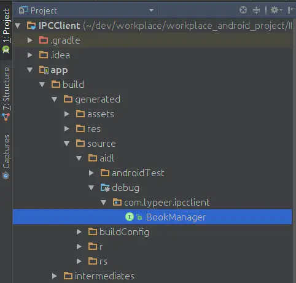

Android：学习AIDL，这一篇文章就够了(下) - 程序园

上一篇博文介绍了关于AIDL是什么，为什么我们需要AIDL，AIDL的语法以及如何使用AIDL等方面的知识，这一篇博文将顺着上一篇的思路往下走，接着介绍关于AIDL的一些更加深入的知识。强烈建议大家在看这篇博文之前先看一下上一篇博文：Android：学习AIDL，这一篇文章就够了(上)

注：文中所有代码均源自上一篇博文中的例子。   
另：在看这篇博文之前，建议先将上一篇博文中的代码下载下来或者敲一遍，然后确定可以正常运行后再接着看。因为文中有大量对于具体代码的分析以及相关代码片段之间的跳转，如果你手头没有一份完整代码的话很容易看得一头雾水，最后浪费了你的时间也浪费了这篇博文。

## <a id="t2"></a>1，源码分析：AIDL文件是怎么工作的？

进行到上一篇文章的最后一步，我们已经学会了AIDL的全部用法，接下来让我们透过现象看本质，研究一下究竟AIDL是如何帮助我们进行跨进程通信的。

我们在上一篇提到过，在写完AIDL文件后，编译器会帮我们自动生成一个同名的 .Java 文件——也许大家已经发现了，在我们实际编写客户端和服务端代码的过程中，真正协助我们工作的其实是这个文件，而 .aidl 文件从头到尾都没有出现过。这样一来我们就很容易产生一个疑问：难道我们写AIDL文件的目的其实就是为了生成这个文件么？答案是肯定的。事实上，就算我们不写AIDL文件，直接按照它生成的 .java 文件那样写一个 .java 文件出来，在服务端和客户端中也可以照常使用这个 .java 类来进行跨进程通信。所以说AIDL语言只是在简化我们写这个 .java 文件的工作而已，而要研究AIDL是如何帮助我们进行跨进程通信的，其实就是研究这个生成的 .java 文件是如何工作的。

### <a id="t3"></a>1.1，这个文件在哪儿？

要研究它，首先我们就需要找到它，那么它在哪儿呢？在这里：



它的完整路径是：app->build->generated->source->aidl->debug->com->lypeer->ipcclient->BookManager.java（其中 `com.lypeer.ipcclient`是包名，相对应的AIDL文件为 BookManager.aidl ）。在Android Studio里面目录组织方式由默认的 Android 改为 Project 就可以直接按照文件夹结构访问到它。

### <a id="t4"></a>1.2，从应用看原理

和我一贯的分析方式一样，我们先不去看那些冗杂的源码，先从它在实际中的应用着手，辅以思考分析，试图寻找突破点。首先从服务端开始，刨去其他与此无关的东西，从宏观上我们看看它干了些啥：
```java
private final BookManager.Stub mBookManager = new BookManager.Stub() {
    @Override
    public List<Book> getBooks() throws RemoteException {
        
    }

    @Override
    public  void  addBook(Book book) throws RemoteException {
         
    }
};

public IBinder onBind(Intent intent) {
    return mBookManager;
}
```
可以看到首先我们是对 BookManager.Stub 里面的抽象方法进行了重写——实际上，这些抽象方法正是我们在 AIDL 文件里面定义的那些。也就是说，我们在这里为我们之前定义的方法提供了具体实现。接着，在 onBind() 方法里我们将这个 BookManager.Stub 作为返回值传了过去。

接着看看客户端：

 ```java
private BookManager mBookManager = null;

private ServiceConnection mServiceConnection = new ServiceConnection() {
    @Override
    public  void  onServiceConnected(ComponentName name, IBinder service) 
        mBookManager = BookManager.Stub.asInterface(service);
        
    }
    @Override
    public  void  onServiceDisconnected(ComponentName name) {
       
    }
};

public  void  addBook(View view) {
   
   mBookManager.addBook(book);
}
```
简单的来说，客户端就做了这些事：获取 BookManager 对象，然后调用它里面的方法。

现在结合服务端与客户端做的事情，好好思考一下，我们会发现这样一个怪事情：它们配合的如此紧密，以至于它们之间的交互竟像是同一个进程中的两个类那么自然！大家可以回想下平时项目里的接口回调，基本流程与此一般无二。明明是在两个进程里面，数据不能直接互通，何以他们能交流的如此愉快呢？答案在 BookManager.java 里。

### <a id="t5"></a>1.3，从客户端开始

一点开 BookManager.java ，我发现的第一件事是：BookManager 是一个接口类！一看到它是个接口，我就知道，突破口有了。为什么呢？接口意味着什么？方法都没有具体实现。但是明明在客户端里面我们调用了 mBookManager.addBook() ！那么就说明我们在客户端里面用到的 BookManager 绝不仅仅是 BookManager，而是它的一个实现类！那么我们就可以从这个实现类入手，看看在我们的客户端调用 addBook() 方法的时候，究竟 BookManager 在背后帮我们完成了哪些操作。首先看下客户端的 BookManager 对象是怎么来的：

 
 

```java
public  void  onServiceConnected(ComponentName name, IBinder service) 
    mBookManager = BookManager.Stub.asInterface(service);
}
```
在这里我首先注意到的是方法的传参：IBinder service 。这是个什么东西呢？通过调试，我们可以发现，这是个 BinderProxy 对象。但随后我们会惊讶的发现：Java中并没有这个类！似乎研究就此陷入了僵局——其实不然。在这里我们没办法进一步的探究下去，那我们就先把这个问题存疑，从后面它的一些应用来推测关于它的更多的东西。

接下来顺藤摸瓜去看下这个 BookManager.Stub.asInterface() 是怎么回事：

 ```java
public static com.lypeer.ipcclient.BookManager asInterface(android.os.IBinder obj) {
    
    if ((obj == null)) {
        return null;
    }
    
    
    android.os.IInterface iin = obj.queryLocalInterface(DESCRIPTOR);
    if (((iin != null) && (iin instanceof com.lypeer.ipcclient.BookManager))) {
        return ((com.lypeer.ipcclient.BookManager) iin);
    }
    
    return new com.lypeer.ipcclient.BookManager.Stub.Proxy(obj);
}
```
方法里首先进行了验空，这个很正常。第二步操作是调用了 queryLocalInterface() 方法，这个方法是 IBinder 接口里面的一个方法，而这里传进来的 IBinder 对象就是上文我们提到过的那个 service 对象。由于对 service 对象我们还没有一个很清晰的认识，这里也没法深究这个 queryLocalInterface() 方法：它是 IBinder 接口里面的一个方法，那么显然，具体实现是在 service 的里面的，我们无从窥探。但是望文生义我们也能体会到它的作用，这里就姑且这么理解吧。第三步是创建了一个对象返回——很显然，这就是我们的目标，那个实现了 BookManager 接口的实现类。果断去看这个 BookManager.Stub.Proxy 类：

 
 

```java
private static class  Proxy  implements  com.lypeer.ipcclient.BookManager  {
    private android.os.IBinder mRemote;

    Proxy(android.os.IBinder remote) {
        
        mRemote = remote;
    }

    @Override
    public java.util.List<com.lypeer.ipcclient.Book> getBooks() throws android.os.RemoteException {
        
    }

    @Override
    public  void  addBook(com.lypeer.ipcclient.Book book) throws android.os.RemoteException {
        
    }
    
}
```
看到这里，我们几乎可以确定：Proxy 类确实是我们的目标，客户端最终通过这个类与服务端进行通信。

那么接下来看看 getBooks() 方法里面具体做了什么：

 
 
```java
@Override
public java.util.List<com.lypeer.ipcclient.Book> getBooks() throws android.os.RemoteException {
    
    
    android.os.Parcel _data = android.os.Parcel.obtain();
    android.os.Parcel _reply = android.os.Parcel.obtain();
    java.util.List<com.lypeer.ipcclient.Book> _result;
    try {
        _data.writeInterfaceToken(DESCRIPTOR);
        
        mRemote.transact(Stub.TRANSACTION_getBooks, _data, _reply, 0);
        _reply.readException();
        
        _result = _reply.createTypedArrayList(com.lypeer.ipcclient.Book.CREATOR);
    } finally {
        _reply.recycle();
        _data.recycle();
    }
    
    return _result;
}
```
在这段代码里有几个需要说明的地方，不然容易看得云里雾里的：

- 关于 _data 与 _reply 对象：一般来说，我们会将方法的传参的数据存入_data 中，而将方法的返回值的数据存入 _reply 中——在没涉及定向 tag 的情况下。如果涉及了定向 tag ，情况将会变得稍微复杂些，具体是怎么回事请参见这篇博文：你真的理解AIDL中的in，out，inout么？
- 关于 Parcel ：简单的来说，Parcel 是一个用来存放和读取数据的容器。我们可以用它来进行客户端和服务端之间的数据传输，当然，它能传输的只能是可序列化的数据。具体 Parcel 的使用方法和相关原理可以参见这篇文章：[Android中Parcel的分析以及使用](http://www.javashuo.com/article/p-berkobjg-op.html)
- 关于 transact() 方法：这是客户端和服务端通信的核心方法。调用这个方法之后，客户端将会挂起当前线程，等候服务端执行完相关任务后通知并接收返回的 _reply 数据流。关于这个方法的传参，这里有两点需要说明的地方：   
    - 方法 ID ：transact() 方法的第一个参数是一个方法 ID ，这个是客户端与服务端约定好的给方法的编码，彼此一一对应。在AIDL文件转化为 .java 文件的时候，系统将会自动给AIDL文件里面的每一个方法自动分配一个方法 ID。
    - 第四个参数：transact() 方法的第四个参数是一个 int 值，它的作用是设置进行 IPC 的模式，为 0 表示数据可以双向流通，即 _reply 流可以正常的携带数据回来，如果为 1 的话那么数据将只能单向流通，从服务端回来的 _reply 流将不携带任何数据。   
        注：AIDL生成的 .java 文件的这个参数均为 0。

上面的这些如果要去一步步探究出结果的话也不是不可以，但是那将会涉及到 Binder 机制里比较底层的东西，一点点说完势必会将文章的重心带偏，那样就不好了——所以我就直接以上帝视角把结论给出来了。

另外的那个 addBook() 方法我就不去分析了，殊途同归，只是由于它涉及到了定向 tag ，所以有那么一点点的不一样，有兴趣的读者可以自己去试着阅读一下。接下来我总结一下在 Proxy 类的方法里面一般的工作流程：

- 1，生成 _data 和 _reply 数据流，并向 _data 中存入客户端的数据。
- 2，通过 transact() 方法将它们传递给服务端，并请求服务端调用指定方法。
- 3，接收 _reply 数据流，并从中取出服务端传回来的数据。

纵观客户端的所有行为，我们不难发现，其实一开始我们不能理解的那个 IBinder service 恰恰是客户端与服务端通信的灵魂人物——正是通过用它调用的 transact() 方法，我们得以将客户端的数据和请求发送到服务端去。从这个角度来看，这个 service 就像是服务端在客户端的代理一样——你想要找服务端？要传数据过去？行啊！你来找我，我给你把数据送过去——而 BookManager.java 中的那个 Proxy 类，就只能沦为二级代理了，我们在外部通过它来调动 service 对象。

至此，客户端在 IPC 中进行的工作已经分析完了，接下来我们看一下服务端。

### <a id="t6"></a>1.4，接着看服务端

前面说了客户端通过调用 transact() 方法将数据和请求发送过去，那么理所当然的，服务端应当有一个方法来接收这些传过来的东西：在 BookManager.java 里面我们可以很轻易的找到一个叫做 onTransact() 的方法——看这名字就知道，多半和它脱不了关系，再一看它的传参

`(int code, android.os.Parcel data, android.os.Parcel reply, int flags)` ——和 transact() 方法的传参是一样的！如果说他们没有什么 py 交易把我眼珠子挖出来当泡踩！下面来看看它是怎么做的：

 
 ```java

@Override
public  boolean  onTransact(int code, android.os.Parcel data, android.os.Parcel reply, int flags) throws android.os.RemoteException {
    switch (code) {
        case INTERFACE_TRANSACTION: {
            reply.writeString(DESCRIPTOR);
            return true;
        }
        case TRANSACTION_getBooks: {
            
            return true;
        }
        case TRANSACTION_addBook: {
            
            return true;
        }
    }
    return super.onTransact(code, data, reply, flags);
}
```
可以看到，它在接收了客户端的 transact() 方法传过来的参数后，什么废话都没说就直接进入了一个 switch 选择：根据传进来的方法 ID 不同执行不同的操作。接下来看一下每个方法里面它具体做了些什么，以 getBooks() 方法为例：

 
```java
case TRANSACTION_getBooks: {
    data.enforceInterface(DESCRIPTOR);
    
    
    java.util.List<com.lypeer.ipcclient.Book> _result = this.getBooks();
    reply.writeNoException();
    
    reply.writeTypedList(_result);
    return true;
}
```
非常的简单直了，直接调用服务端这边的具体方法实现，然后获取返回值并将其写入 reply 流——当然，这是由于这个方法没有传入参数并且不涉及定向 tag 的关系，不然还会涉及到将传入参数从 data 中读取出来，以及针对定向 tag 的操作，具体的可以参考这篇博文：你真的理解AIDL中的in，out，inout么？。

另外，还有一个问题，有些读者可能会疑惑，为什么这里没有看到关于将 reply 回传到客户端的相关代码？事实上，在客户端我们也没有看到它将相关参数传向服务端的相关代码——它只是把这些参数都传入了一个方法，其中过程同样是对我们隐藏的——服务端也同样，在执行完 return true 之后系统将会把 reply 流传回客户端，具体是怎么做的就不足为外人道也了。不知道大家发现了没有，通过隐藏了这些细节，我们在 transact() 与 onTransact() 之间的调用以及数据传送看起来就像是发生在同一个进程甚至同一个类里面一样。我们的操作就像是在一条直线上面走，根本感受不出来其中原来有过曲折——也许这套机制在设计之初，就是为了达到这样的目的。

分析到这里，服务端的工作我们也分析的差不多了，下面我们总结一下服务端的一般工作流程：

- 1，获取客户端传过来的数据，根据方法 ID 执行相应操作。
- 2，将传过来的数据取出来，调用本地写好的对应方法。
- 3，将需要回传的数据写入 reply 流，传回客户端。

### <a id="t7"></a>1.5，总结

现在我们已经完成了 BookManager.java 几乎所有的分析工作，接下来我想用两张图片来做一个总结。第一张是它的 UML 结构图：


第二张是客户端与服务端使用其进行 IPC 的工作流程：


剩下的就大家自己体味一下吧——如果前面的东西你看懂了，这里有没有我说的几句总结都差不多；如果前面你看的似懂非懂，看看这两张图片也就懂了；如果前面你几乎没有看懂，那么我写几句总结你还是看不懂。。。

## <a id="t8"></a>2，为什么要这样设计？

这个问题可以拆分成两个子问题：

- 为什么AIDL的语法要这样设计？
- 为什么它生成的 .java 文件的结构要这样设计？

首先我有一个总的观点：在程序设计领域，任何的解决方案，无非是基于需求和性能两方面的考虑。首先是保证把需求完成，在这个大前提下保证性能最佳——这里的性能，就包括了代码的健壮性，可维护性等等林林总总的东西。

关于AIDL的语法为什么要这么设计，其实没有太大的研究的必要——因为他的语法实际上和 Java 没有多大区别，区别的地方也很容易想通，多是因为一些很显然的原因而不得不那样做。接下来我主要分析一下 BookManager.java 的设计之道。首先我们要明确需求：

- 基本需求当然是实现 IPC 。
- 在此基础上要尽可能的对开发者友好，即使用方便，且最好让开发者有那种在同一个进程中调用方法传输数据的爽感。

既然要实现 IPC ，一些核心的要素就不能少，比如客户端接收到的 IBinder service ，比如 transact() 方法，比如 onTransact() 方法——但是能让开发者察觉到这些这些东西的存在甚至自己写这些东西么？不能。为什么？因为这些东西做的事情其实非常的单调，无非就是那么几步，但是偏偏又涉及到很多对数据的写入读出的操作——涉及到数据流的东西一般都很繁琐。把这些东西暴露出去显然是不合适的，还是建立一套模板把它封装起来比较的好。但是归根结底，我们实现 IPC 是需要用到它们的，所以我们需要有一种途径去访问它们——在这个时候，代理-桩的设计理念就初步成型了。为了达到我们的目的，我们可以在客户端建立一个服务端的代理，在服务端建立一个客户端的桩，这样一来，客户端有什么需求可以直接跟代理说，代理跟它说你等等，我马上给你处理，然后它就告诉桩，客户端有这个需求了，桩就马上让服务端开始执行相应的事件，在执行结束后再通过桩把结果告诉代理，代理最后把结果给客户端。这样一来，客户端以为代理就是服务端，并且事实上它也只与代理进行了交互，而客户端与代理是在同一个进程中的，在服务端那边亦然——通过这种方式，我们就可以让客户端与服务端的通信看上去简单无比，像是从头到尾我们都在一个进程中工作一样。

在上面的设计思想指导之下，BookManager.java 为什么是我们看到的这个样子就很清楚明白了。

## <a id="t9"></a>3，有没有更好的方式来完成 IPC ?

首先我要阐述的观点是：如果你对这篇文章中上面叙述的那些内容有一定的掌握与理解了的话，完全脱离AIDL来手动书写客户端与服务端的相关文件来进行 IPC 是绝对没有问题的。并且在了解了 IPC 得以进行的根本之后，你甚至完全没有必要照着 BookManager.java 来写，只要那几个点在，你想怎么写就怎么写。

但是要说明的是，相较于使用AIDL来进行IPC，手动实现基本上是没有什么优势的。毕竟AIDL是一门用来简化我们的工作的语言，用它确实可以省很多事。

那么现在除了AIDL与自己手动写，有没有其他的方式来进行 IPC 呢？答案是：有的。前段时间饿了么（这不算打广告吧。。。毕竟没有利益相关，只是纯粹的讨论技术）的一个工程师开源了一套 IPC 的框架，地址在这里：Hermes。这套框架的核心还是 IBinder service , transact() ，onTransact() 那些东西（事实上，任何和IPC有关的操作最终都还是要落在这些东西上面），但是他采取了一种巧妙的方式来实现：在服务端开启了一条默认进程，让这条进程来负责所有针对服务端的请求，同时采用注解的方式来注册类和方法，使得客户端能用这种形式和服务端建立约定，并且，这个框架对绑定service的那些细节隐藏的比较好，我们甚至都不需要在服务端写service，在客户端调用 bindService了——三管齐下，使得我们可以远离以前那些烦人的有关service的操作了。但是也并不是说这套框架就完全超越了AIDL，在某些方面它也有一些不足。比如，不知道是他的那个 Readme 写的太晦涩了还是怎么回事，我觉得使用它需要付出的学习成本还是比较大的；另外，在这套框架里面是将所有传向服务端的数据都放在一个 Mail 类里面的，而这个类的传输方式相当于AIDL里面定向 tag 为 in 的情况——也就是说，不要再想像AIDL里面那样客户端数据还能在服务端完成操作之后同步变化了。更多的东西我也还没看出来，还没用过这个框架，只是简单的看了下它的源码，不过总的来说能过看出来的是作者写的很用心，作者本身的Android功底也很强大，至少不知道比我强大到哪里去了……另外，想微微的吐槽一下，为什么这个框架用来进行IPC的核心类 IHermesService 里面长得和AIDL生成的 .java 一模一样啊一模一样……

总之，我想说的就是，虽然已经有AIDL了，但是并不意味着就不会出现比它更好的实现了——不止在这里是这样，这个观点可以推广到所有领域。

这篇文章说是学习AIDL的，其实大部分的内容都是在通过AIDL生成的那个.java 文件讲 IPC 相关的知识——其实也就是 Binder 机制的利用的一部分——这也是为什么文中其实有很多地方没有深入下去讲，而是匆匆忙忙的给出了结论，因为再往下就不是应用层的东西了，讲起来比较麻烦，而且容易把人看烦。

讲到这里，基本上关于Android里面 IPC 相关的东西都已经讲得差不多了，如果你是从我写的 Android中的Service：默默的奉献者 (1) –> Android中的Service：Binder，Messenger，AIDL（2） –> Android：学习AIDL，这一篇文章就够了(上) –> 现在这篇，这样一路看下来，并且是认真的看下来的话，基本上这一块的问题都难不倒你了。

另外，除了知识，我更希望通过我的博文传递的是一些解决问题分析问题的思路或者说是方法，所以我的很多博文都重在叙述思考过程而不是阐述结果——这样有好处也有坏处，好处是如果看懂了，能够收获更多，坏处是，大部分人都没有那个耐性慢慢的来看懂它，毕竟这需要思考，而当前很多的人都已经没有思考的时间，甚至丧失思考的能力了。

谢谢大家。

另：关于脱离AIDL自己写IPC的代码，我自己写了一份，大家可以聊作参考，传送门。