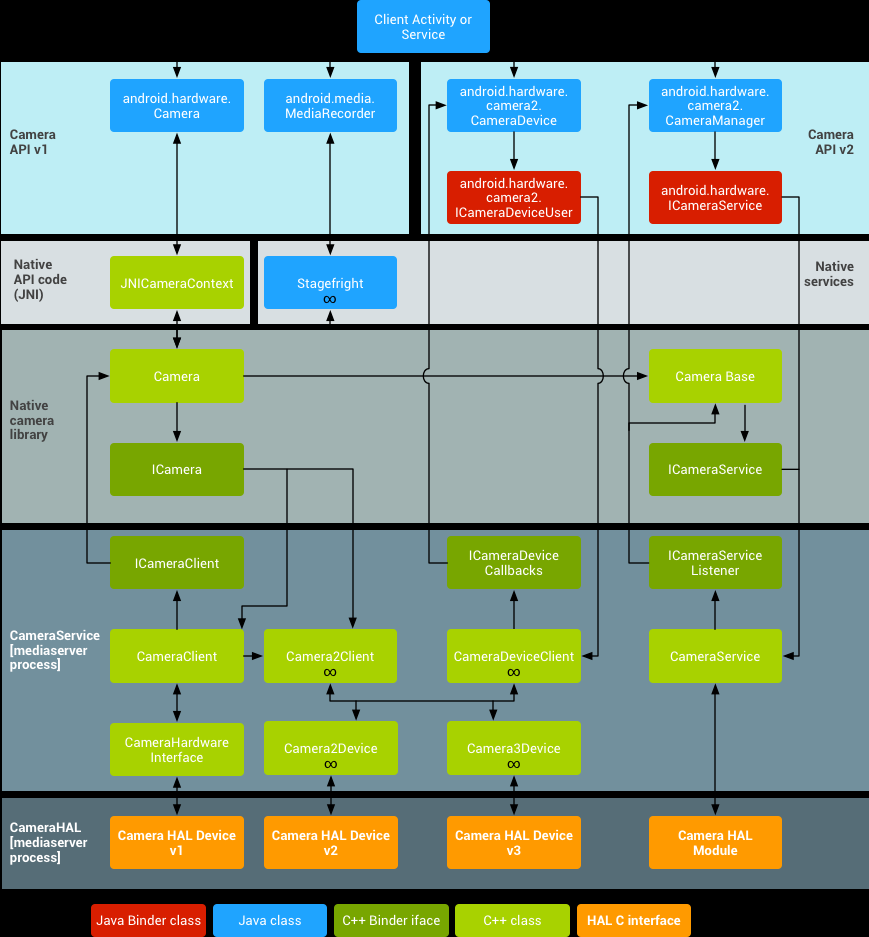
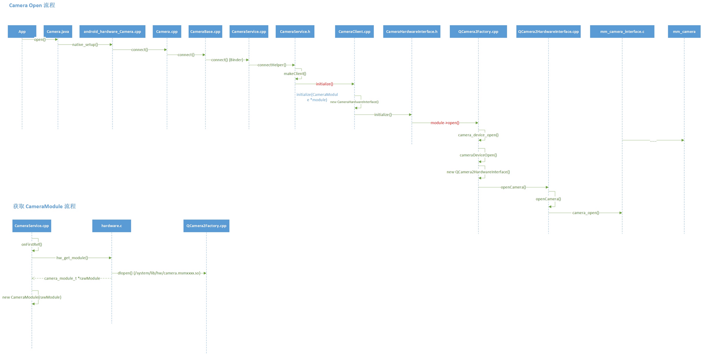
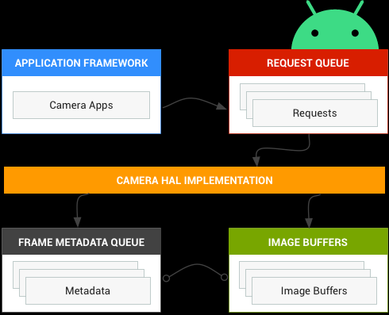
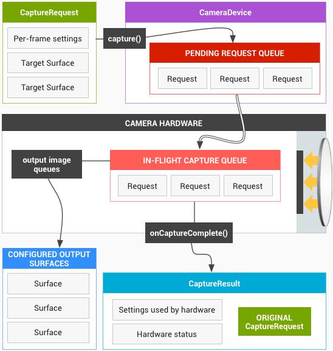
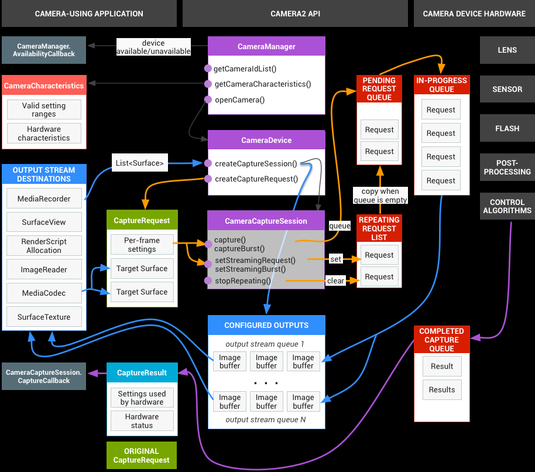
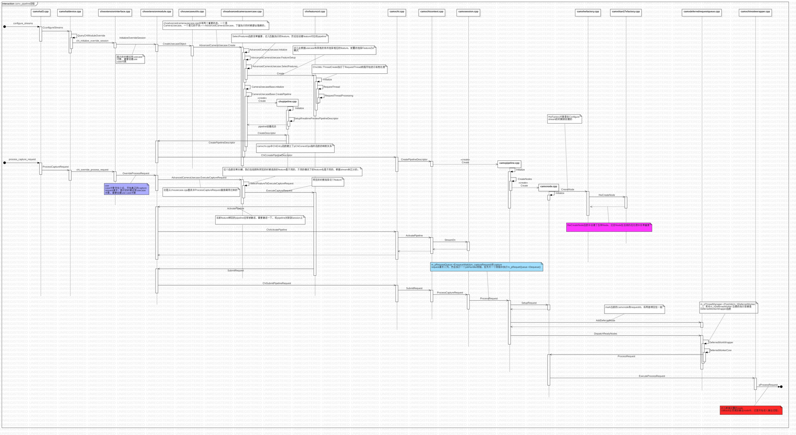

Camera HAL3 分析

> Android Camera硬件抽象层（HAL，Hardware Abstraction Layer）主要用于把底层硬件驱动和位于android.hardware中的framework APIs连接起来。Camera子系统(mm-camera)主要包含了camera pipeline components 的各种实现，而camera HAL提供了这些组件的使用接口。  
> 起着承上启下的作用。  
> 在camera HAL层实现中，芯片厂商一般将camera HAL层的实现分为两层：interface层和OEM层(这个应该就是我们说的mm-camera)。OEM层为下层，它用于屏蔽不同的camera硬件。不同的camera硬件必须支持OEM层提供的对外接口。Interface层为上层，它调用OEM层的对外接口来实现camera HAL所定义的接口。对于Interface层，它并不知道底层camera硬件到底是哪一个版本。同时，interface层完成了屏蔽camera HAL版本的作用。对于OEM层，它也不知道上层是哪一个camera HAL版本，及android版本。两层分离架构，可以很容易地实现不同芯片支持同一个android版本和同一款芯片支持不同android版本(前提条件是该款芯片能够支持这些android版本的各个需求)。

## （一）相机系统架构

Camera System Architecture

  
主要包含如下几个重要组成部分：

### Application Framework

Application framework层主要是应用代码（app’s code），这个代码主要利用android.hardware.Camera API与Camera硬件进行交互。这些代码调用相关的JNI类来访问与Camera进行交互的原生代码（native code）。API有1和2两个版本。

### JNI

与android.hardware.Camera有关的JNI代码主要frameworks/base/core/jni/ android\_hardware\_Camera.cpp。这些代码调用下一层的原生代码以获得物理camera的访问权，然后返回用于在framework层创建android.hardware.Camera对象的数据。

### Native framework

Native framework的定义位于 frameworks/av/camera/Camera.cpp中，它提供了android.hardware.Camera类在本地的实现。这些类调用IPC binder来获得camera service。

### Binder IPC proxies

IPC binder代理可以现实进程间通信。在frameworks/av/camera目录下有三个camera binder类的定义。ICameraService是cameraservice的接口，ICamera是被打开的camera设备的接口，ICameraClient是camera设备返回给application framework层的接口。

### Camera Service

Camera service位于frameworks/av/services/camera/libcameraservice/CameraService.cpp，它是与HAL直接进行交互的真正代码。

### HAL

硬件抽象层定义了一套标准接口，你必须实现这些接口，以保证你的APP能够与你的Camera硬件正确的协调工作，从而使保证你的Camera的所有功能能够正常进行工作。

### Kernel Driver

Camera驱动向下与真实的camera硬件进行交互，向上与HAL实现进行交互。Camera硬件和驱动必须能够提供YV12和NV21格式的图像数据，以支持camera图像数据在显示屏上的预览和视频录制。  
高通老平台（670以下）在HAL和kernel之间还有一个mm-camera，kernel负责操作硬件，提供图像数据，mm-camera负责对ISP pipeline的控制以及各个功能（如快门时间）的实现。

### HAL1的camera open的流程

camera open的流程

## （二）HAL层概述

Android硬件抽象层（Hardware Abstraction Layer，HAL）向上连接camera framework 层APIs，向下连接底层Camera驱动和硬件。最新版的Android引进了一种全新的camera stack底层实现方案。如果你有之前开发的适用于老版本Android的camera HAL module和驱动，那么注意了，因为新版本与老版本在camera pipeline的实现上面有非常大的改动。

由于很多设备仍然依赖于老版本的camera HAL，因此，未来的Android发布版本依然会支持第一版的camera HAL。Android camera service也支持同时实现两种HAL，这种设计有一定的好处，比如你想使用HAL v1支持一个能力比较有限的前置camera，同时使用HAL v3支持一个具有强大功能的后置camera，此时这种设计就有了用武之地。HAL v2是v1向v3的一个过渡版本，将不在支持。

系统中只会有一个camera HAL module（这个module拥有自己的版本号，当前是1、2或2.1），该module可以维护多个独立的camera device，每个device都会有自己的版本号。Camera module v2或更新版本的module会支持device v2及更新的版本，这个 camera module可以支持多个不同版本的camera device。这也就是我们为什么说Android支持两个HAL的实现。

### 不用HAL1的原因

第1版的camera subsystem被设计成由顶层控制黑箱结构。简单的说，老的camera子系统有3种操作模式：

*   预览
*   视频录制
*   继续拍照

HAL相机组件

  
每种模式都有所不同，也有一定的功能重叠。这使得很以后在功能扩展方面变得比较困难，比如说burst mode，它属于上面三种中的两种。

### HAL3的改进

重新设计 Android Camera API 的目的在于大幅提高应用对于 Android 设备上的相机子系统的控制能力，同时重新组织 API，提高其效率和可维护性。借助额外的控制能力，您可以更轻松地在 Android 设备上构建高品质的相机应用，这些应用可在多种产品上稳定运行，同时仍会尽可能使用设备专用算法来最大限度地提升质量和性能。

版本 3 相机子系统将多个运行模式整合为一个统一的视图，您可以使用这种视图实现之前的任何模式以及一些其他模式，例如连拍模式。这样一来，便可以提高用户对聚焦、曝光以及更多后期处理（例如降噪、对比度和锐化）效果的控制能力。此外，这种简化的视图还能够使应用开发者更轻松地使用相机的各种功能。

API 将相机子系统塑造为一个管道，该管道可按照 1:1 的基准将传入的帧捕获请求转化为帧。这些请求包含有关帧的捕获和处理的所有配置信息，其中包括分辨率和像素格式；手动传感器、镜头和闪光灯控件；3A 操作模式；RAW 到 YUV 处理控件；统计信息生成等等。

简单来说，应用框架从相机子系统请求帧，然后相机子系统将结果返回到输出流。此外，系统还会针对每组结果生成包含色彩空间和镜头遮蔽等信息的元数据。您可以将相机版本 3 看作相机版本 1 的单向流管道。它会将每个捕获请求转化为传感器捕获的一张图像，这张图像将被处理成：

包含有关捕获的元数据的 Result 对象。  
图像数据的 1 到 N 个缓冲区，每个缓冲区会进入自己的目标 Surface。  
可能的输出 Surface 组经过预配置：

每个 Surface 都是一个固定分辨率的图像缓冲区流的目标位置。  
一次只能将少量 Surface 配置为输出（约 3 个）。  
一个请求中包含所需的全部捕获设置，以及要针对该请求将图像缓冲区（从总配置组）推送到其中的输出 Surface 的列表。请求可以只发生一次（使用 capture()），也可以无限重复（使用 setRepeatingRequest()）。捕获的优先级高于重复请求的优先级。  

相机核心操作模型

  

## （三）HAL3的使用

google范例：[https://github.com/android/camera-samples](https://github.com/android/camera-samples) 这里面有API2的使用范例，通过调用API2来实现HDR预览。

由于我们更偏向底层，需要了解如何对HAL层直接控制。高通有HAL3的使用范例，在`hardware/qcom/camera/QCamera2/HAL3/test`。如果想要看HAL1的使用范例，在对应的HAL目录下。

从main函数看起，一开始创建了一个对象MainTestContext，用来菜单的控制和显示。

然后创建了CameraHAL3Base类的实例，这个类是camera的操作函数，包括摄像头的打开，能力集的获取，预览录像拍照的初始化。

### 加载HAL摄像头

1.  通过hal3appTestLoad解析动态库，获取HAL层的接口。操作函数都在`camera_module_t`结构体中。
2.  `get_number_of_cameras`获取camera的数量。
3.  `get_vendor_tag_ops`获取厂商标签（vendor tag），然后设置下去
4.  通过`set_callbacks`注册两个回调函数，`torch_mode_status_change`和`camera_device_status_change`
5.  通过`get_camera_info`获取camera的静态信息

### 初始化摄像头

通过camera\_module\_t.common.methods->`open`打开摄像头，输入一个camera id，返回一个`camera3_device_t`（通过hw\_device\_t指针中转）。

通过camera3\_device\_t.ops->`initialize`初始化camera的两个回调函数：`Notify`和`ProcessCaptureResult`。

### 配置流

这里分为预览，录像，普通抓拍，RAW拍照，红外模式等等，其实流程都是一样的，拿预览说事。

1.  初始化一个数据流`camera3_stream_t`，定义这个数据流的输入输出，图像大小与格式
2.  初始化数据流配置`camera3_stream_configuration`，放入所有需要的数据流
3.  通过camera3\_device\_t.ops->`configure_streams`配置数据流
4.  通过camera3\_device\_t.ops->`construct_default_request_settings`获取预览和拍照的默认配置（metadata的形式）

### 开启流

1.  创建一个请求线程，专门负责发送请求`process_capture_request`
2.  通过回调函数`ProcessCaptureResult`对图像数据进行处理，然后发送信号量，让请求线程发送下一帧的请求
3.  如果有参数发生改变，比如开启红外，只需要更新元数据metadata，继续发送请求即可。camera\_metadata\_t.`update`更新元数据，`release`发布元数据。

## （四）HAL层的实现

### 对外接口

HAL层位于camera驱动和上层Android framework层之间，它定义了一些标准接口，你必须正确地实现这些接口，以保证你的APP能够正确的操作你的camera硬件进行正常工作。HAL接口定义位于hardware/libhardware/include/hardware/camera.h 和hardware/libhardware/include/hardware/camera_common.h头文件中。如果是HAL3，接口是camera3.h。

camera\_common.h文件主要定义了两个结构体。camera\_info是camera的硬件信息，如朝向,版本信息等等。camera_module是camera的操作方法，如获取camera信息，设置回调等等。

Camera.h则包含了与android.hardware.Camera相关的代码。该头文件声明了camera\_device结构体，camera\_device结构体包含一个camera\_device\_ops结构体，camera\_device\_ops结构体包含了指向HAL接口实现函数的函数指针。可以查看frameworks/av/include/camera/CameraParameters.h 文件以了解更多不同类型的camera参数的相关文档。这些参数都通过HAL中的 int (\*set\_parameters)(struct camera\_device \*, const char *parms) 函数指针进行设置。

camera3.h包含了camera3\_device结构体，里面包含了hw\_device和camera3\_device\_opts结构体。每个设备数据结构必须以hw\_device\_t开头，后跟模块特定的公共方法和属性。其中opts是camera的操作函数，初始化的时候注册了两个重要的函数，一个是处理数据流的捕获结果，这里面包含了metadate信息以及图像数据，另外一个是事件通知，主要通知camera的时间戳和错误信息。configure\_streams是用来重置camera处理流程，设置一个新的输入输出流。process\_capture\_request是构建一个捕获请求。process\_capture_result是处理完成的捕获。

### 代码位置

1.  老平台的HAL  
    位置在hardware/qcom/camera.QCamera2路径下，分为HAL和HAL3两个版本。具体的实现在vendor/qcom/proprietary/mm-camera路径下。
2.  新平台的HAL  
    位置在vendor/qcom/proprietary/camx/src/core/hal路径下，camxhal3.h就是对应了HAL3的接口。判断到底用哪个地方的代码，需要查看编译脚本。

### CAMX代码流程

camera service 调用camera.provider的HAL接口，在结构体camera3\_device\_ops中。这个接口映射到了vendor/qcom/proprietary/camx/src/core/hal/camxhal3entry.cpp中的camera3\_device\_ops。

而这个camera3\_device\_ops调用的是g\_jumpTableHAL3 的接口。g\_jumpTableHAL3的定义在camxhal3.cpp中，通过调用HALDevice的操作函数实现。

这个地方有个**疑问**，为什么要用复杂的dispatch类进行重定向，并原子性的加载操作函数。原子意味着不可分的，同一时刻只能有一个线程对它进行操作。

接下来HALDevice里面的各个函数又会调用camxhal3module.cpp中GetCHIAppCallbacks()里面的函数实现，通过funcCHIHALOverrideEntry映射到chi\_hal\_override_entry，而这个函数接口又来自于chioverride.h，这里是CHI框架的对外接口，是HAL和chi交接的地方。

代码流程如下图：

camera servicecamxhal3entry.cppcamxhal3.cppcamxhal3module.cppchioverride.hcamera3\_device\_opsHAL3对外接口g_jumpTableHAL3GetCHIAppCallbackschi\_hal\_callback\_ops\_tCHI对外接口camera servicecamxhal3entry.cppcamxhal3.cppcamxhal3module.cppchioverride.h

这就到了chxextensioninterface.cpp

InitializeOverrideSession函数在初始化的时候，通过CreateUsecaseObject创建了一个用例

然后进入到对应用例的cpp中，比如说chxadvancedcamerausecase.cpp

sequenceDiagram  
 participant chioverride as chioverride.h  
 participant chiextensioninterface as extensioninterface  
 chioverride-->chiextensioninterface: chi\_hal\_callback_ops  

camx 代码流程图

metadata：

通过ConstructDefaultRequestSettings获取默认配置

这里会从HAL层和CHI获取两次metadata，然后将这两者的metadata进行融合

未完待续。。。