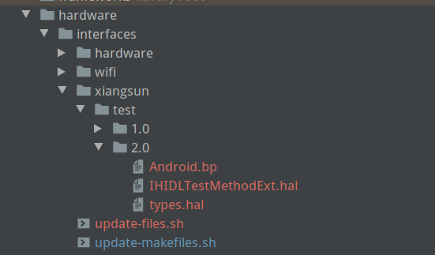
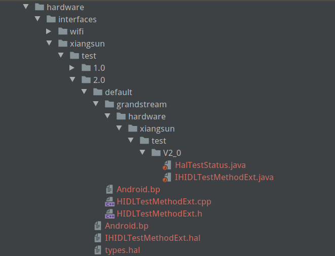

HIDL的使用

# HIDL的使用

## `hidl-gen`编译

`hidl-gen`在`source`和`lunch`之后就可以使用。如果没有该命令，去`android/system/tools/hidl`下面编译。

编译后命令在`out/host/linux-x86/bin/hidl-gen`。

## `hal`文件编写

在`android/vendor/company-name/hardware/interfaces/`或者在`android/hardware/interfaces/`下面编写。

文件架构如下：

**`ROOT-DIRECTORY`**

- `MODULE`

  - `SUBMODULE`

    （可选，可以有多层）

    - `VERSION`
      - `Android.mk`
      - `IINTERFACE_1.hal`
      - `IINTERFACE_2.hal`
      - `…`
      - `IINTERFACE_N.hal`
      - `types.hal`（可选）

现实如下

file:///home/sun/Desktop/image-20210129160023711.png

测试文件内容如下：

```c++
package grandstream.hardware.xiangsun.test@1.0;


interface IHIDLTestMethod{
 getInt(int32_t band) generates (int32_t status);
};
```

继承某一个hidl的写法：

```c++
package grandstream.hardware.xiangsun.test@2.0;
import grandstream.hardware.xiangsun.test@1.0::IHIDLTestMethod;

interface IHIDLTestMethodExt extend grandstream.hardware.xiangsun.test@1.0.IHIDLTestMethod{
 getInt(HalTestStatus status) generates (HalTestStatus status);
};
```

HalTestStatus 定义在types.hal中，和IHIDLTestMethodExt在一个目录下，内容如下：

```c++
package grandstream.hardware.xiangsun.test@2.0;

enum HalTestStatus : uint32_t {
    IDLE        = 0,
    BUSY        = 1
};
```

具体写法参考[Android官方语法指导](https://source.android.com/devices/architecture/hidl#grammar)，[Android HIDL 编程规范_私房菜之 --学--无--止--境---CSDN博客](../../Android/Android_NDK/Android%20HIDL%20编程规范_私房菜之%20--学--无--止--境---CSDN博客.md)、 [Android HIDL 中的数据类型_私房菜之 --学--无--止--境---CSDN博客](../../Android/Android_NDK/Android%20HIDL%20中的数据类型_私房菜之%20--学--无--止--境---CSDN博客.md) 和[Android HIDL 中的函数_私房菜之 --学--无--止--境---CSDN博客](../../Android/Android_NDK/Android%20HIDL%20中的函数_私房菜之%20--学--无--止--境---CSDN博客.md)

## 自动生成bp文件

使用`android/vendor/grandstream/hardware/interfaces/update-makefiles.sh`生成bp文件，sh具体内容如下：

```shell
#!/bin/bash
source $ANDROID_BUILD_TOP/system/tools/hidl/update-makefiles-helper.sh

do_makefiles_update \
    "grandstream.hardware:vendor/company-name/hardware/interfaces/" \
    "android.hardware:hardware/interfaces" \
    "android.hidl:system/libhidl/transport"
```

这样就会自动生成`bp`文件，内容如下

```shell
// This file is autogenerated by hidl-gen -Landroidbp.

hidl_interface {
    name: "grandstream.hardware.xiangsun.test@1.0",
    root: "grandstream.hardware",
    srcs: [
        "IHIDLTestMethod.hal",
    ],
    interfaces: [
        "android.hidl.base@1.0",
    ],
    gen_java: true,
}
```


## 自动生成实际cpp文件与java文件

**注意：cpp文件是hidl的下层，java是hidl的上层。如果hidl变成一个服务，cpp是hidl的具体实现。java是给app层调用hidl的工具。**

**app ->java - > hidl -> cpp。 **

使用`android/vendor/grandstream/hardware/interfaces/update-files.sh`自动生成用到的`cpp`文件，sh文件内容如下：

```shell
#! /bin/bash
 
PACKAGE=grandstream.hardware.xiangsun.test@2.0
# c++ 文件存放路径
LOC=xiangsun/test/2.0/default/
#--c++
hidl-gen -o $LOC -Lc++-impl -r grandstream.hardware:vendor/grandstream/hardware/interfaces \
        -randroid.hidl:system/libhidl/transport $PACKAGE
#--bp文件--
hidl-gen -o $LOC -Landroidbp-impl -r grandstream.hardware:vendor/grandstream/hardware/interfaces \
        -randroid.hidl:system/libhidl/transport $PACKAGE

#--java-- 这个给app使用的，放在哪里无所谓，只要你能找到，再把它复制到app中就行。
hidl-gen -o $LOC -Ljava -rgrandstream.hardware:vendor/grandstream/hardware/interfaces \
  -randroid.hidl:system/libhidl/transport $PACKAGE
```

生成了

如下文件夹及文件

file:///home/sun/Desktop/image-20210129162833145.png


**出现该问题 "ERROR: conflicting package roots grandstream.hardware and grandstream.hardware"，在一次hidl-gen命令的调用中定义了多次同一个`-r` 参数**

`cpp`文件内容:

```c++
#include "HIDLTestMethod.h"

namespace grandstream {
namespace hardware {
namespace xiangsun {
namespace test {
namespace V1_0 {
namespace implementation {

// Methods from ::grandstream::hardware::xiangsun::test::V1_0::IHIDLTestMethod follow.
Return<int32_t> HIDLTestMethod::getInt(int32_t band) {
    // TODO implement
    return int32_t {};
}


// Methods from ::android::hidl::base::V1_0::IBase follow.

//IHIDLTestMethod* HIDL_FETCH_IHIDLTestMethod(const char* /* name */) {
    //return new HIDLTestMethod();
//}
//
}  // namespace implementation
}  // namespace V1_0
}  // namespace test
}  // namespace xiangsun
}  // namespace hardware
}  // namespace grandstream
```

`java` 文件内容：

过长不做记录。

`h`文件内容:

```c++
#ifndef GRANDSTREAM_HARDWARE_XIANGSUN_TEST_V1_0_HIDLTESTMETHOD_H
#define GRANDSTREAM_HARDWARE_XIANGSUN_TEST_V1_0_HIDLTESTMETHOD_H

#include <grandstream/hardware/xiangsun/test/1.0/IHIDLTestMethod.h>
#include <hidl/MQDescriptor.h>
#include <hidl/Status.h>

namespace grandstream {
namespace hardware {
namespace xiangsun {
namespace test {
namespace V1_0 {
namespace implementation {

using ::android::hardware::hidl_array;
using ::android::hardware::hidl_memory;
using ::android::hardware::hidl_string;
using ::android::hardware::hidl_vec;
using ::android::hardware::Return;
using ::android::hardware::Void;
using ::android::sp;

struct HIDLTestMethod : public IHIDLTestMethod {
    // Methods from ::grandstream::hardware::xiangsun::test::V1_0::IHIDLTestMethod follow.
    Return<int32_t> getInt(int32_t band) override;

    // Methods from ::android::hidl::base::V1_0::IBase follow.

};

// FIXME: most likely delete, this is only for passthrough implementations
// extern "C" IHIDLTestMethod* HIDL_FETCH_IHIDLTestMethod(const char* name);

}  // namespace implementation
}  // namespace V1_0
}  // namespace test
}  // namespace xiangsun
}  // namespace hardware
}  // namespace grandstream

#endif  // GRANDSTREAM_HARDWARE_XIANGSUN_TEST_V1_0_HIDLTESTMETHOD_H

```

`bp`文件内容如下：

```shell
cc_library_shared {
    // FIXME: this should only be -impl for a passthrough hal.
    // In most cases, to convert this to a binderized implementation, you should:
    // - change '-impl' to '-service' here and make it a cc_binary instead of a
    //   cc_library_shared.
    // - add a *.rc file for this module.
    // - delete HIDL_FETCH_I* functions.
    // - call configureRpcThreadpool and registerAsService on the instance.
    // You may also want to append '-impl/-service' with a specific identifier like
    // '-vendor' or '-<hardware identifier>' etc to distinguish it.
    name: "grandstream.hardware.xiangsun.test@1.0-impl",
    relative_install_path: "hw",
    // FIXME: this should be 'vendor: true' for modules that will eventually be
    // on AOSP.
    proprietary: true,
    srcs: [
        "HIDLTestMethod.cpp",
    ],
    shared_libs: [
        "libhidlbase",
        "libhidltransport",
        "libutils",
        "grandstream.hardware.xiangsun.test@1.0",
    ],
}
```


## 将程序变成service

1. 修改default下的Android.bp文件，增加如下内容

```shell
cc_binary {
    // FIXME: this should only be -impl for a passthrough hal.
    // In most cases, to convert this to a binderized implementation, you should:
    // - change '-impl' to '-service' here and make it a cc_binary instead of a
    //   cc_library_shared.
    // - add a *.rc file for this module.
    // - delete HIDL_FETCH_I* functions.
    // - call configureRpcThreadpool and registerAsService on the instance.
    // You may also want to append '-impl/-service' with a specific identifier like
    // '-vendor' or '-<hardware identifier>' etc to distinguish it.
    name: "grandstream.hardware.xiangsun.test@1.0-service",
    init_rc: ["grandstream.hardware.xiangsun.test@1.0-service.rc"],
    relative_install_path: "hw",
    // FIXME: this should be 'vendor: true' for modules that will eventually be
    // on AOSP.
    proprietary: true,
    srcs: [
        "HIDLTestMethod.cpp",
        "service.cpp"
    ],
    shared_libs: [
        "libhidlbase",
        "libhidltransport",
        "libutils",
        "grandstream.hardware.xiangsun.test@1.0",
    ],
}
```

主要是复制本身bp的内容，并增加了`init_rc: ["grandstream.hardware.xiangsun.test@1.0-service.rc"],`和源码`service.cpp`并修改`cc_library_shared`为`cc_binary`

`grandstream.hardware.xiangsun.test@1.0-service.rc`

内容为

```shell
service vendor.xiangsun_hal /vendor/bin/hw/grandstream.hardware.xiangsun.test@1.0-service
    class hal
    user root
    group system
```

2. 增加service.cpp

   ```c++
   #define LOG_TAG "android.hardware.helloworld@1.0-service"
    
   #include <grandstream/hardware/xiangsun/test/2.0/IHIDLTestMethodExt.h>
    
   #include <hidl/LegacySupport.h>
   #include "HIDLTestMethodExt.h"
    
   // Generated HIDL files
   using grandstream::hardware::xiangsun::test::V2_0::implementation::HIDLTestMethodExt;
   using grandstream::hardware::xiangsun::test::V2_0::IHIDLTestMethodExt;
    
   using android::hardware::defaultPassthroughServiceImplementation;
   using android::hardware::configureRpcThreadpool;
   using android::hardware::joinRpcThreadpool;
   using namespace android;
   int main() {
   #if 0
       return defaultPassthroughServiceImplementation<IHelloWorld>();
   #else
       sp<IHIDLTestMethodExt> service = new HIDLTestMethodExt();
       configureRpcThreadpool(1, true /*callerWillJoin*/);
       if(android::OK !=  service->registerAsService())
           return 1;
       joinRpcThreadpool();
   #endif
   } 
   ```

## 编译使用

在`android/vendor/grandstream/hardware/interfaces/xiangsun/test/1.0`文件下编译。

编译后的文件在：`android/out/soong/.intermediates/vendor/grandstream/hardware/interfaces`， 如果不会向设备推送文件，可以删除你编译的出来的对应的文件夹。

编译的jar包在`android/out/target/product/gvc3220_box/system/framework/grandstream.hardware.xiangsun.test-V2.0-java.jar`

编译生成的service命令在`android/out/target/product/gvc3220_box/vendor/bin/hw/grandstream.hardware.xiangsun.test@2.0-service`

## 注册hidl

修改
`android/device/rockchip/rk3399/manifest.xml` 或者
`android/device/rockchip/common/manifest.xml`
增加 或者直接在设备的下面两个文件中一个增加

```shell
/system/etc/vintf/manifest.xml
/vendor/etc/vintf/manifest.xml
```

```xml
    <hal format="hidl">                                
        <name>grandstream.hardware.xiangsun.test</name>
        <transport>hwbinder</transport>                      
        <version>1.0</version>                         
        <interface>                                    
            <name>IHIDLTestMethod</name>                 
            <instance>default</instance>               
        </interface>                                   
    </hal> 
```

## 在app 的bp或mk文件增加java module

这个java module是服务的。和之前自动生成的jave不一样，自动生成的java是调用这个module的。

mk:

```shell
LOCAL_STATIC_JAVA_LIBRARIES := grandstream.hardware.xiangsun.test-V1.0-java
```

bp:

```shell
static_libs: [
	"grandstream.hardware.xiangsun.test-V1.0-java"
]
```

记住把之前编译出来的java文件复制到项目中，或者依赖那个module

## 编译运行app

如果出现`java.util.NoSuchElementException`查看是否是没有注册hidl并已经启动service。如果没有启动service，在设备上运行`/vendor/bin/hw/youservice` 这个是暂时测试方式，真正的应在selinux中配置。

*参考*

[Android HIDL 实例](https://blog.csdn.net/jingerppp/article/details/86530600)

[Android HIDL 详解](https://blog.csdn.net/shift_wwx/article/details/86514997)

