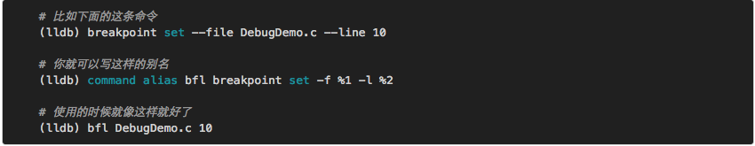
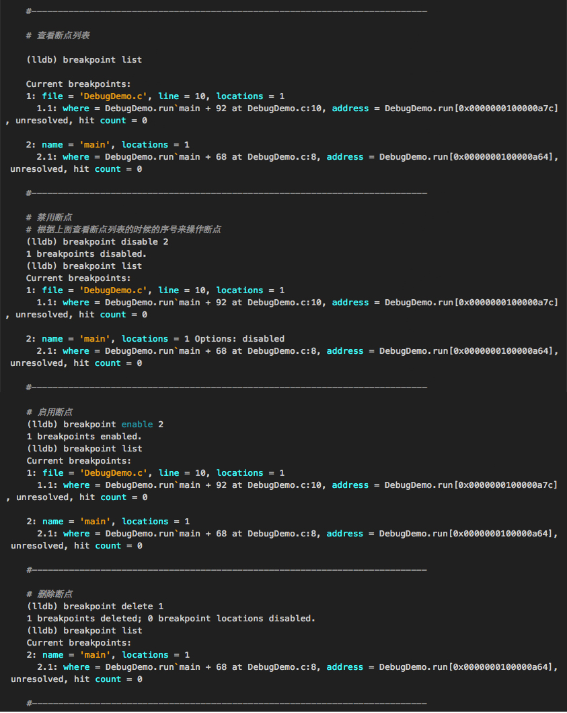

LLDB使用

LLDB使用

我们把调试器挂上程序了，也看到代码了，接下来就是找一个地方下断点，然后让程序跑起来，看看这里面到底发生了些什么～o

1. 根据文件名和行号下断点
    

2. 根据函数名下断点
    

3. 根据某个函数调用语句下断点(Objective-C比较有用)

    

4. 一个小技巧

    你可以通过设置命令的别名来简化上面的命令
    
    
5. 查看断点列表、启用/禁用断点、删除断点
    

