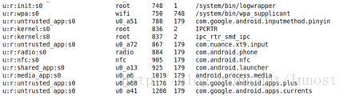
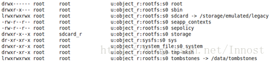
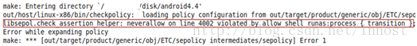

 Selinux SeAndroid_私房菜之 --学--无--止--境---CSDN博客

转载：http://blog.csdn.net/innost/article/details/19299937  

SEAndroid是Google在Android 4.4上正式推出的一套以SELinux为基础于核心的系统安全机制。而SELinux则是由美国NSA（国安局）和一些公司（RedHat、Tresys）设计的一个针对Linux的安全加强系统。  
NSA最初设计的安全模型叫FLASK，全称为Flux Advanced Security Kernel（由Uta大学和美国国防部开发，后来由NSA将其开源），当时这套模型针对DTOS系统。后来，NSA觉得Linux更具发展和普及前景，所以就在Linux系统上重新实现了FLASK，称之为SELinux。  
Linux Kernel中，SELinux通过Linux Security Modules实现。在2.6之前，SElinux通过Patch方式发布。从2.6开始，SELinux正式入驻内核，成为标配。  
思考：  
1 同样是政府部门，差别咋这么大？  
2 同样涉及操作系统和安全相关，NSA为何敢用Linux，为什么想方设法要开源？

由于Linux有多种发行版本，所以各家的SELinux表现形式也略有区别。具体到Android平台，Google对其进行了一定得修改，从而得到SEAndroid。  
本文将先对SELinux相关知识进行介绍，然后看看Android是如何实现SELinux的（咱们只看用户空间）。  
要求：最好能下到Android 4.4源码，可http://blog.csdn.net/innost/article/details/14002899  
目标：学完本文，读者应该可以轻松修改相关安全策略文件，以进一步在安全方面定制自己的Android系统。

一 SELinux背景知识  
1.  DAC和MAC  
SELinux出现之前，Linux上的安全模型叫DAC，全称是Discretionary Access Control，翻译为自主访问控制。DAC的核心思想很简单，就是：  
进程理论上所拥有的权限与执行它的用户的权限相同。比如，以root用户启动Browser，那么Browser就有root用户的权限，在Linux系统上能干任何事情。  
显然，DAC太过宽松了，所以各路高手想方设法都要在Android系统上搞到root权限。那么SELinux如何解决这个问题呢？原来，它在DAC之外，设计了一个新的安全模型，叫MAC（Mandatory Access Control），翻译为强制访问控制。MAC的处世哲学非常简单：即任何进程想在SELinux系统中干任何事情，都必须先在安全策略配置文件中赋予权限。凡是没有出现在安全策略配置文件中的权限，进程就没有该权限。来看一个SEAndroid中设置权限的例子：

```
allow netd proc:file write
```

如果没有在netd.te中使用上例中的权限配置allow语句，则netd就无法往/proc目录下得任何文件中写数据，即使netd具有root权限。  
显然，MAC比DAC在权限管理这一块要复杂，要严格，要细致得多。  
那么，关于DAC和MAC，此处笔者总结了几个知识点：  
    Linux系统先做DAC检查。如果没有通过DAC权限检查，则操作直接失败。通过DAC检查之后，再做MAC权限检查。  
    SELinux中也有用户的概念，但它和Linux中原有的user概念不是同一个东西。什么意思呢？比如，Linux中的超级用户root在SELinux中可能就是一个没权限，没地位，打打酱油的”路人甲“。当然，这一切都由SELinux安全策略的制定者来决定。  
通过上述内容，读者应该能感觉到，在SELinux中，安全策略文件是最重要的。确实如此。事实上，对本文的读者而言，学习SELinux的终极目标应该是：  
看懂现有的安全策略文件。  
编写符合特定需求的安全策略文件。  
前面也曾提到，SELinux有自己的一套规则来编写安全策略文件，这套规则被称之为SELinux Policy语言。它是掌握SELinux的重点。  
2.  SELinux Policy语言介绍  
Linux中有两种东西，一种死的（Inactive），一种活的（Active）。死的东西就是文件（Linux哲学，万物皆文件。注意，万不可狭义解释为File），而活的东西就是进程。此处的“死”和“活”是一种比喻，映射到软件层面的意思是：进程能发起动作，例如它能打开文件并操作它。而文件只能被进程操作。  
SELinux中，每种东西都会被赋予一个安全属性，官方说法叫Security Context。Security Context（以后用SContext表示）是一个字符串，主要由三部分组成。例如SEAndroid中，进程的SContext可通过ps -Z命令查看，如图1所示：

  

图1中最左边的那一列是进程的SContext，以第一个进程/system/bin/logwrapper的SContext为例，其值为u:r:init:s0，其中：  
u为user的意思。SEAndroid中定义了一个SELinux用户，值为u。  
r为role的意思。role是角色之意，它是SELinux中一种比较高层次，更方便的权限管理思路，即Role Based Access Control（基于角色的访问控制，简称为RBAC）。简单点说，一个u可以属于多个role，不同的role具有不同的权限。RBAC我们到最后再讨论。  
init，代表该进程所属的Domain为init。MAC的基础管理思路其实不是针对上面的RBAC，而是所谓的Type Enforcement Accesc Control（简称TEAC，一般用TE表示）。对进程来说，Type就是Domain。比如init这个Domain有什么权限，都需要通过\[例子1\]中allow语句来说明。  
S0和SELinux为了满足军用和教育行业而设计的Multi-Level Security（MLS）机制有关。简单点说，MLS将系统的进程和文件进行了分级，不同级别的资源需要对应级别的进程才能访问。后文还将详细介绍MLS。

再来看文件的SContext，读者可通过ls -Z来查看，如图2所示：  

  

图2中，倒数第二列所示为Nexus 7根目录下几个文件和目录的SContext信息，以第一行root目录为例，其信息为u:object_r:rootfs:s0：  
u：同样是user之意，它代表创建这个文件的SELinux user。  
object\_r：文件是死的东西，它没法扮演角色，所以在SELinux中，死的东西都用object\_r来表示它的role。  
rootfs：死的东西的Type，和进程的Domain其实是一个意思。它表示root目录对应的Type是rootfs。  
s0：MLS的级别。  
根据SELinux规范，完整的SContext字符串为：  
user:role:type\[:range\]  
注意，方括号中的内容表示可选项。s0属于range中的一部分。下文再详细介绍range所代表的Security Level相关的知识。  
看，SContext的核心其实是前三个部分：user:role:type。  
刚才说了，MAC基本管理单位是TEAC（Type Enforcement Accesc Control），然后是高一级别的Role Based Accesc Control。RBAC是基于TE的，而TE也是SELinux中最主要的部分。  
下面来看看TE。  

2.1  TE介绍  
在例子1中，大家已经见过TE的allow语句了，再来细致研究下它：  
\[例子2\]

```
allow netd proc:file write
```

这条语句的语法为：  
allow：TE的allow语句，表示授权。除了allow之外，还有allowaudit、dontaudit、neverallow等。  
netd：source type。也叫subject，domain。  
proc：target type。它代表其后的file所对应的Type。  
file：代表Object Class。它代表能够给subject操作的一类东西。例如File、Dir、socket等。在Android系统中，有一个其他Linux系统没有的Object Class，那就是Binder。  
write：在该类Object Class中所定义的操作。  
根据SELinux规范，完整的allow相关的语句格式为：

```
rule_name source_type target_type : class perm_set
```

我们直接来看几个实例：  
\[例子3\]

```
#允许zygote域中的进程向init type的进程（Object Class为process）发送sigchld信号allow zygote init:process sigchld;#允许zygote域中的进程search或getattr类型为appdomain的目录。注意，多个perm_setallow zygote appdomain:dir { getattr search };#source_type为unconfineddomain target_type为一组type，由#{ fs_type dev_type file_type }构成。object_class也包含两个，为{ chr_file file }#perm_set语法比较奇特，前面有一个~号。它表示除了{entrypoint relabelto}之外，{chr_file #file}这两个object_class所拥有的其他操作allow unconfineddomain {fs_type dev_type file_type}:{ chr_file file }   \#下面这条语句中，source_type为属于appdomain，但不属于unconfinedomain的进程。#而 *表示所有和capability2相关的权限neverallow { appdomain -unconfineddomain } self:capability2 *;
```

特别注意，前面曾提到说权限必须显示声明，没有声明的话默认就没有权限。那neverallow语句就没必要存在了。因为”无权限“是不需要声明的。确实如此，neverallow语句的作用只是在生成安全策略文件时进行检查，判断是否有违反neverallow语句的allow语句。例如，笔者修改shell.te中一个语句后，生成安全策略文件时就检测到了冲突，如图3所示：

  
如图3所示，笔者修改shell.te后，意外导致了一条allow语句与neverallow语句冲突，从而生成安全策略文件失败。  
下面我们来看上述allow语句中所涉及到的object class和perm set。  
（1）  Object class和Perm Set

Object class很难用语言说清楚它到底是怎么定义的，所以笔者也不废话，直接告诉大家常见的Object class有哪些。见下面的SEPolicy示例：  
\[external/sepolicy/security_classes示例\]

```
#此文件定义了Android平台中支持的Object class#根据SELinux规范，Object Class类型由class关键字申明# network-related classesclass binder   #Android平台特有的binderclass zygote   #Android平台特有的zygote#Android平台特有的属性服务。注意其后的userspace这个词class property_service # userspace和用户空间中的SELinux权限检查有关，下文再解释
```

上述示例展示了SEAndroid中Object Class的定义，其中：  
Object Class需要通过class语句申明。这些申明一般放在一个叫security_class的文件中。  
另外，这些class和kernel中相关模块紧密结合。  
据说：在kernel编译时会根据security_class文件生成对应的头文件。从这里可以看出，SELinux需要根据发行平台来做相应修改。同时可以看出，该文件一般也不需要我们去修改。  
再来看Perm set。Perm set指得是某种Object class所拥有的操作。以file这种Object class而言，其拥有的Perm set就包括read，write，open，create,execute等。  
和Object class一样，SELinux或SEAndroid所支持的Perm set也需要声明，来看下面的例子：  
\[external/sepolicy/access_vectors\]

```
#SELinux规范中，定义perm set有两种方式，一种是使用下面的common命令#其格式为：common common_name { permission_name ... } common定义的perm set能#以下是Android平台中，file对应的权限（perm set）。其大部分权限读者能猜出是干什么的。      ioctl read write create getattr setattr lock relabelfrom relabelto      append unlink link rename execute swapon quotaon mounton }#除了common外，还有一种class命令也可定义perm set，如下面的例子：#class class_name [ inherits common_name ] { permission_name ... }#inherits表示继承了某个common定义的权限  注意，class命令定义的权限其实针对得就是#某个object class。它不能被其他class继承class dir inherits file {   add_name  remove_name reparent search rmdir open audit_access execmod#来看SEAndroid中的binder和property_service这两个Object class定义了哪些操作权限      impersonate  call set_context_mgr transfer }class property_service { set }
```

提示：Object class和Perm set的具体内容（SELinux中其实叫Access Vector）都和Linux系统/Android系统密切相关。所以，从知识链的角度来看，Linux编程基础很重要。  
（2）  type，attribute和allow等

现在再来看type的定义，和type相关的命令主要有三个，如下面的例子所示：  
\[external/sepolicy相关文件\]

```
#type命令的完整格式为：type type_id [alias alias_id,] [attribute_id]#其中，方括号中的内容为可选。alias指定了type的别名，可以指定多个别名。#下面这个例子定义了一个名为shell的type，它和一个名为domain的属性（attribute）关联type shell, domain; #本例来自shell.te，注意，可以关联多个attribute#属性由attribute关键字定义，如attributes文件中定义的SEAndroid使用的属性有：#可以在定义type的时候，直接将其和某个attribute关联，也可以单独通过#typeattribue将某个type和某个或多个attribute关联起来，如下面这个例子#将前面定义的system类型和mlstrustedsubject属性关联了起来typeattribute system mlstrustedsubject
```

特别注意：对初学者而言，attribute和type的关系最难理解，因为“attribute”这个关键词实在是没取好名字，很容易产生误解：  
实际上，type和attribute位于同一个命名空间，即不能用type命令和attribute命令定义相同名字的东西。  
其实，attribute真正的意思应该是类似type（或domain） group这样的概念。比如，将type A和attribute B关联起来，就是说type A属于group B中的一员。  
使用attribute有什么好处呢？一般而言，系统会定义数十或数百个Type，每个Type都需要通过allow语句来设置相应的权限，这样我们的安全策略文件编起来就会非常麻烦。有了attribute之后呢，我们可以将这些Type与某个attribute关联起来，然后用一个allow语句，直接将source_type设置为这个attribute就可以了：  
这也正是type和attribute位于同一命名空间的原因。  
这种做法实际上只是减轻了TE文件编写者的烦恼，安全策略文件在编译时会将attribute拓展为其包含的type。如例子4所示：  
\[例子4\]

```
#定义两个type，分别是A_t和B_t，它们都管理到attribute_test#写一个allow语句，直接针对attribute_testallow attribute_test C_t:file {read write};#上面这个allow语句在编译后的安全策略文件中会被如下两条语句替代：allow A_t C_t:file {read write};allow B_t C_t:file {read write};rule_name source_type target_type : class perm_set
```

所以，attribute可以出现在source\_type中，也可以出现在target\_type中。  
提示：一般而言，定义type的时候，都会在名字后添加一个\_t后缀，例如type system\_t。而定义attribute的时候不会添加任何后缀。但是Android平台没使用这个约定俗成的做法。不过没关系，SEAndroid中定义的attribute都在external/sepolicy/attribute这个文件中，如果分不清是type还是attribute，则可以查看这个文件中定义了哪些attribute。  
最后我们来看看TE中的rule_name，一共有四种：  
allow：赋予某项权限。  
allowaudit：audit含义就是记录某项操作。默认情况下是SELinux只记录那些权限检查失败的操作。allowaudit则使得权限检查成功的操作也被记录。注意，allowaudit只是允许记录，它和赋予权限没关系。赋予权限必须且只能使用allow语句。  
dontaudit：对那些权限检查失败的操作不做记录。  
neverallow：前面讲过，用来检查安全策略文件中是否有违反该项规则的allow语句。如例子5所示：  
\[例子5\]

```
#来自external/sepolicy/netd.te文件#永远不允许netd域中的进程 读写 dev_type类型的 块设备文件（Object class为blk_file）neverallow netd dev_type:blk_file { read write }
```

（3）  RBAC和constrain

绝大多数情况下，SELinux的安全配置策略需要我们编写各种各样的xx.te文件。由前文可知，.te文件内部应该包含包含了各种allow，type等语句了。这些都是TEAC，属于SELinux MAC中的核心组成部分。  
在TEAC之上，SELiunx还有一种基于Role的安全策略，也就是RBAC。RBAC到底是如何实施相关的权限控制呢？我们先来看SEAndroid中Role和User的定义。  
\[external/sepolicy/roles\]

```
#Android中只定义了一个role，名字就是r#将上面定义的r和attribute domain关联起来
```

再来看user的定义。  
\[external/sepolicy/users\]

```
#user seuser_id roles role_id level mls_level range mls_range;#user seuser_id roles role_id;#SEAndroid使用了支持MLS的格式。下面定义的这个user u，将和role r关联。#level之后的是该user具有的安全级别。s0为最低级，也就是默认的级别，mls_systemHigh#为u所能获得的最高安全级别（security level）。此处暂且不表MLSuser u roles { r } level s0 range s0 - mls_systemhigh;
```

那么，Roles和User中有什么样的权限控制呢？  
1）首先，我们应该允许从一个role切换（SELinux用Transition表达切换之意）到另外一个role，例如：

```
#注意，关键字也是allow，但它和前面TE中的allow实际上不是一种东西#下面这个allow允许from_role_id切换到to_role_idallow from_role_id to_role_id;
```

2) 角色之间的关系。SELinux中，Role和Role之间的关系和公司中的管理人员的层级关系类似，例如：

```
#dominance语句属于deprecated语句，MLS中有新的定义层级相关的语句。不过此处要介绍的是#下面这句话表示super_r dominate（统治，关键词dom） sysadm_r和secadm_r这两个角色#反过来说，sysadm_r和secadm_r dominate by (被统治，关键词 domby) super_r#从type的角度来看，super_r将自动继承sysadm_r和secadm_r所关联的type（或attribute）dominance { role super_r {role sysadm_r; role secadm_r; }
```

3）其他内容，由于SEAndroid没有使用，此处不表。读者可阅读后面的参考文献。  
话说回来，怎么实现基于Role或User的权限控制呢？SELinux提供了一个新的关键词，叫constrain，来看下面这个例子：  
\[例子6\]

```
# constrain object_class_set perm_set expression ;#下面这句话表示只有source和target的user相同，并且role也相同，才允许#write object_class为file的东东constrain file write (u1 == u2 and r1 == r2) ;
```

前面已经介绍过object\_class和perm\_set了，此处就不再赘述。constrain中最关键的是experssion，它包含如下关键词:  
u1,r1,t1：代表source的user，role和type。  
u2,r2,t2：代表target的user,role和type。  
==和!=：==表示相等或属于，!=表示不等或不属于。对于u,r来说，==和!=表示相等或不等，而当诸如t1“==或!=”某个attribute时，表示源type属于或不属于这个attribute。  
dom,domby,incomp,eq：仅针对role，表示统治，被统治，没关系和相同（和==一样）  
关于constrain，再补充几个知识点：  
SEAndroid中没有使用constrain，而是用了MLS中的mlsconstrain。所以下文将详细介绍它。  
constrain是对TEAC的加强。因为TEAC仅针对Type或Domain，没有针对user和role的，所以constrain在TEAC的基础上，进一步加强了权限控制。在实际使用过程中，SELinux进行权限检查时，先检查TE是否满足条件，然后再检查constrain是否也满足条件。二者都通过了，权限才能满足。  
关于RBAC和constrain，我们就介绍到此。  
提示：笔者花了很长时间来理解RBAC和constrain到底是想要干什么。其实这玩意很简单。因为TE是Type Enforcement，没user和role毛事，而RBAC则可通过constrain语句来在user和role上再加一些限制。当然，constrain也可以对type进行限制。如此而已！  
2.2  Labeling介绍  
前面陆陆续续讲了些SELinux中最常见的东西。不过细心的人可能会问这样一个问题：这些SContext最开始是怎么赋给这些死的和活的东西的？Good Question！  
提示：SELinux中，设置或分配SContext给进程或文件的工作叫Security Labeling，土语叫打标签。  
（1）  sid和sid_context

这个问题的回答嘛，其实也蛮简单。Android系统启动后（其他Linux发行版类似），init进程会将一个编译完的安全策略文件传递给kernel以初始化kernel中的SELinux相关模块（姑且用Linux Security Module:LSM来表示它把），然后LSM可根据其中的信息给相关Object打标签。  
提示：上述说法略有不准，先且表述如此。  
LSM初始化时所需要的信息以及SContext信息保存在两个特殊的文件中，以Android为例，它们分别是：  
initial_sids：定义了LSM初始化时相关的信息。SID是SELinux中一个概念，全称是Security Identifier。SID其实类似SContext的key值。因为在实际运行时，如果老是去比较字符串（还记得吗，SContext是字符串）会严重影响效率。所以SELinux会用SID来匹配某个SContext。  
initial\_sid\_context：为这些SID设置最初的SContext信息。  
来看这两个文件的内容：  
\[external/sepolicy/initial\_sids和initial\_sid_context\]

```
sid kernel  #sid是关键词，用于定义一个sidsid kernel u:r:kernel:s0   #将initial_sids中定义的sid和初始的SContext关联起来sid security u:object_r:kernel:s0sid unlabeled u:object_r:unlabeled:s0sid fs u:object_r:labeledfs:s0sid file u:object_r:unlabeled:s0sid file_labels u:object_r:unlabeled:s0sid init u:object_r:unlabeled:s0
```

提示：sid的细节需要查看LSM的实现。此处不拟深究它。另外，这两个文件也是和Kernel紧密相关的，所以一般不用修改它们。  
（2）  Domain/Type Transition和宏

SEAndroid中，init进程的SContext为u:r:init:s0，而init创建的子进程显然不会也不可能拥有和init进程一样的SContext（否则根据TE，这些子进程也就在MAC层面上有了和init一样的权限）。那么这些子进程的SContext是怎么被打上和其父进程不一样的SContext呢？  
SELinux中，上述问题被称为Domain Transtition，即某个进程的Domain切换到一个更合适的Domain中去。Domain Transition也是需要我们在安全策略文件中来配置的，而且有相关的关键词，来看例子7。  
\[例子7-1\]

```
#先要使用type_transition语句告诉SELinux# type_transition source_type target_type : class default_type;#对Domain Transition而言有如下例子：type_transition init_t apache_exec_t : process apache_t;
```

上面这个例子的解释如下，请读者务必仔细：  
当init\_t Domain中的进程执行type为apache\_exec\_t类型的可执行文件（fork并execv）时，其class（此处是process）所属Domain（对process而言，肯定是指Domain）需要切换到apache\_t域。  
明白了吗？要做DT，肯定需要先fork一个子进程，然后通过execv打开一个新的可执行文件，从而进入变成那个可执行文件对应的活物！所以，在type\_transition语句中，target\_type往往是那个可执行文件（死物）的type。default_type则表示execv执行后，这个活物默认的Domain。另外，对DT来说，class一定会是process。  
请注意，DT属于Labeling一部分，但这个事情还没完。因为打标签也需要相关权限。所以，上述type_transition不过是开了一个头而已，要真正实施成功这个DT，还需要下面至少三个allow语句配合：  
\[例子7-2\]

```
#首先，你得让init_t域中的进程能够执行type为apache_exec_t的文件allow init_t apache_exec_t : file execute;#然后，你还得告诉SELiux，允许init_t做DT切换以进入apache_t域allow init_t apache_t : process transition;#最后，你还得告诉SELinux，切换入口（对应为entrypoint权限）为执行apache_exec_t类型allow apache_t apache_exec_t : file entrypoint;
```

为什么会需要上述多达三个权限呢？这是因为在Kernel中，从fork到execv一共设置了三处Security检查点，所以需要三个权限。  
提示：读者不必纠结这个了，按照规范做就完了。不过...，这导致我们写TE文件时候会比较麻烦啊！  
确实比较麻烦，不过SELinux支持宏，这样我们可以定义一个宏语句把上述4个步骤全部包含进来。在SEAndroid中，系统定义的宏全在te_macros文件中，其中和DT相关的宏定义如下：  
\[external/sepolicy/te_macros\]

```
#定义domain_trans宏。$1,$2等等代表宏的第一个，第二个....参数# SEAndroid在上述三个最小权限上，还添加了自己的一些权限allow $1 $2:file { getattr open read execute };allow $1 $3:process transition;allow $3 $2:file { entrypoint read execute };allow $3 $1:process sigchld;dontaudit $1 $3:process noatsecure;allow $1 $3:process { siginh rlimitinh };#定义domain_auto_trans宏，这个宏才是我们在te中直接使用的#domain_auto_trans(init_t, apache_exec_t, apache_t)define(`domain_auto_trans', `type_transition $1 $2:process $3;
```

在external/sepolicy/init_shell.te中就有上述宏的用法：

```
./init_shell.te:4:domain_auto_trans(init, shell_exec, init_shell)
```

除了DT外，还有针对Type的Transition。举个例子，假设目录A的SContext为u:r:dir\_a，那么默认情况下在该目录下创建的文件都具有u:r:dir\_a这个SContext。所以我们也要针对死得东西进行打标签。  
和DT类似，TT的语句也是type\_transition，而且要顺利完成Transition，也需要申请相关权限。废话不再多说，我们直接看te\_macros是怎么定义TT所需要的宏的：  
\[external/sepolicy/te_macros\]

```
# 定义file_type_trans(domain, dir_type, file_type)宏define(`file_type_trans', `# ra_dir_perms是一个宏，由global_macros文件定义，其值为：#define(`ra_dir_perms', `{ r_dir_perms add_name write }')allow $1 $2:dir ra_dir_perms;# create_file_perms也是一个宏，定义在global_macros文件中，其值为：# define(`create_file_perms', `{ create setattr rw_file_perms#而r_dir_perms=define(`r_dir_perms', `{ open getattr read search ioctl }allow $1 $3:notdevfile_class_set create_file_perms;allow $1 $3:dir create_dir_perms;# 定义file_type_auto_trans(domain, dir_type, file_type)宏#该宏的含义是：当domain域中的进程在某个Type为dir_type的目录中创建文件时，该文件的define(`file_type_auto_trans', `file_type_trans($1, $2, $3)type_transition $1 $2:dir $3;#notdevfile_class_set也是一个宏，由global_macros文件定义，其值为# define(`notdevfile_class_set', `{ file lnk_file sock_file fifo_file }')type_transition $1 $2:notdevfile_class_set $3;
```

WoW，SEAndroid太这两个宏定义太复杂了，来看看官方文档中的最小声明是什么：  
\[例子8\]

```
type_transition acct_t var_log_t:file wtmp_t;allow acct_t var_log_t:dir { read getattr lock search ioctl                                   add_name remove_name write };allow acct_t wtmp_t:file { create open getattr setattr read                                 write append rename link unlink ioctl lock };
```

在SEAndroid的app.te中，有如下TT设置：

```
./app.te:86:file_type_auto_trans(appdomain, download_file, download_file)
```

DT和TT就介绍到这，翻来覆去就这么点东西，多看几遍就“柜”（用柜字，打一成语，参考2014年中国首次猜谜大会）了

  =======未完，待续========