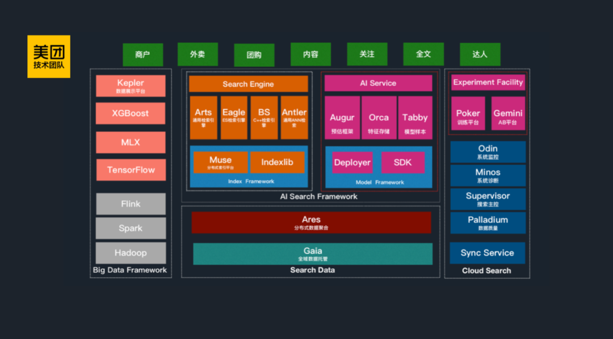
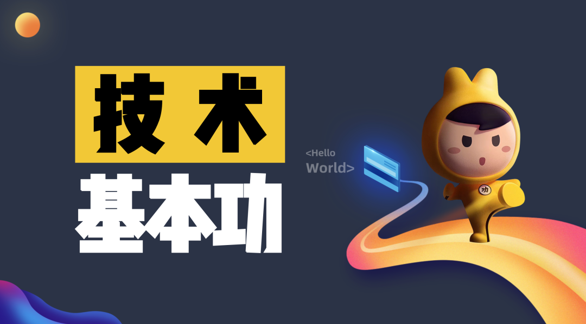
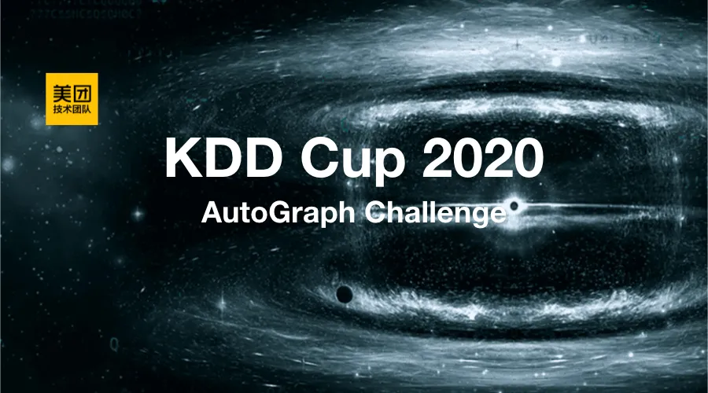
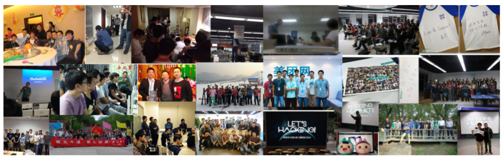
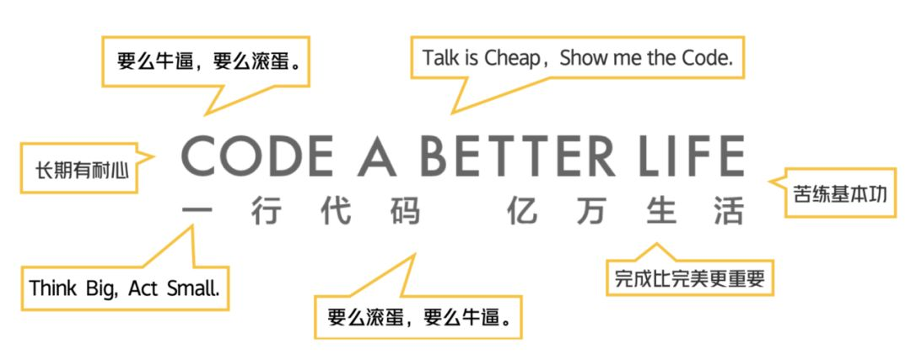

2020年美团技术团队最受欢迎的16篇技术文章

**|** 2020年阅读量最高的8篇技术文章

**1. **[**Java线程池实现原理及其在美团业务中的实践**](http://mp.weixin.qq.com/s?__biz=MjM5NjQ5MTI5OA==&mid=2651751537&idx=1&sn=c50a434302cc06797828782970da190e&chksm=bd125d3c8a65d42aaf58999c89b6a4749f092441335f3c96067d2d361b9af69ad4ff1b73504c&scene=21#wechat_redirect)** （阅读量36646）**

随着计算机行业的飞速发展，摩尔定律逐渐失效，多核CPU成为主流。使用多线程并行计算逐渐成为开发人员提升服务器性能的基本武器。J.U.C提供的线程池ThreadPoolExecutor类，帮助开发人员管理线程并方便地执行并行任务。了解并合理使用线程池，是一个开发人员必修的基本功。

本文开篇简述线程池概念和用途，接着结合线程池的源码，帮助读者领略线程池的设计思路，最后回归实践，通过案例讲述使用线程池遇到的问题，并给出了一种动态化线程池解决方案。

\-\-\-\-\-\-\-\-\-\-\-\-\-\-\-\-\-\-\-\-

**2. **[**移动端UI一致性解决方案**](http://mp.weixin.qq.com/s?__biz=MjM5NjQ5MTI5OA==&mid=2651755491&idx=1&sn=4ac719deb5781e9060b4d023bc75691f&chksm=bd124aae8a65c3b888df80cc15d2f6dbd25c7e7094f3dc665c8e9079963b709043ac6fe865a7&scene=21#wechat_redirect)** （阅读量32916）**

外卖UI一致性项目是外卖UI设计团队与研发团队共建的项目，目的是改善用户端体验的一致性，提升多技术方案间组件的通用性和复用率，降低整体视觉改版带来的研发成本。外卖技术团队通过在实践中不断总结经验，开发了一套完整的UI一致性解决方案，目前已经取得了一些成果，本文系实践经验分享。

\-\-\-\-\-\-\-\-\-\-\-\-\-\-\-\-\-\-\-\-

**3. **[**美团万亿级 KV 存储架构与实践**](http://mp.weixin.qq.com/s?__biz=MjM5NjQ5MTI5OA==&mid=2651752247&idx=1&sn=2cd5711eeffd5cf8ce55219f2d1fddce&chksm=bd125e7a8a65d76c863f370df0160a225b85ea85d01039a5f575a9180d7644e4e86316fc2525&scene=21#wechat_redirect)** （阅读量30539）**

KV 存储作为美团一项重要的在线存储服务，承载了在线服务每天万亿级的请求量。

在 2019 年QCon全球软件开发大会（上海站）上，美团高级技术专家齐泽斌分享了《美团点评万亿级KV存储架构与实践》，本文系演讲内容的整理，第一部分讲述了美团KV存储的发展历程；第二部分阐述了内存KV Squirrel架构和实践；第三部分介绍了持久化KV Cellar架构和实践；最后分享了未来的发展规划和业界新趋势。

\-\-\-\-\-\-\-\-\-\-\-\-\-\-\-\-\-\-\-\-

**4.**[**智能搜索模型预估框架的建设与实践**](http://mp.weixin.qq.com/s?__biz=MjM5NjQ5MTI5OA==&mid=2651752351&idx=1&sn=f2654948de066c0e49e07032b868ac35&chksm=bd125ed28a65d7c4e5bc3a0f8b025c021479005cf88e39c663f0961c89bd2dc64c94cf2e05ee&scene=21#wechat_redirect)** （阅读量28978）**  

在过去十年，机器学习在学术界取得了众多的突破，在工业界也有很多应用落地。美团很早就开始探索不同的机器学习模型在搜索场景下的应用，从最开始的线性模型、树模型，再到近两年的深度神经网络、BERT、DQN等，并在实践中也取得了良好的效果与产出。

在美团搜索AI化的过程中，比较核心的两个组件是模型训练平台Poker和在线预估框架Augur。本文主要与大家探讨Augur的设计思路、效果，以及它的优势与不足，最后也简单介绍了一下Poker平台的价值。希望这些内容对大家有所帮助或者启发。

\-\-\-\-\-\-\-\-\-\-\-\-\-\-\-\-\-\-\-\-

**5. ****[Java中9种常见的CMS GC问题分析与解决](http://mp.weixin.qq.com/s?__biz=MjM5NjQ5MTI5OA==&mid=2651754955&idx=1&sn=8411133d2e5f22b9e2c5a34cdc67985d&chksm=bd1248868a65c1900dd1b7203ce17159740253df2324a208ea9c71ee764e1bde1ed2616d77ce&scene=21#wechat_redirect) ****（阅读量28636）**

目前，互联网上Java的GC资料要么是主要讲解理论，要么就是针对单一场景的 GC 问题进行了剖析，对整个体系总结的资料少之又少。前车之鉴，后事之师，美团的几位工程师历时一年多的时间，搜集了内部各种GC问题的分析文章，并结合个人的理解做了一些总结，希望能起到“抛砖引玉”的作用。

\-\-\-\-\-\-\-\-\-\-\-\-\-\-\-\-\-\-\-\-

**6. ****[美团配送A/B评估体系建设与实践](http://mp.weixin.qq.com/s?__biz=MjM5NjQ5MTI5OA==&mid=2651751891&idx=1&sn=5db900dba6693f5eeae0d8042eb00426&chksm=bd125c9e8a65d588d1f0bac7abdebecd96cbd313accdc38352a581eaed8b35527fc647b04ca9&scene=21#wechat_redirect) **（阅读量27644）****

2019年5月6日，美团正式推出新品牌“美团配送”，发布了美团配送新愿景：“每天完成一亿次值得信赖的配送服务，成为不可或缺的生活基础设施。”现在，美团配送已经服务于全国400多万商家和4亿多用户，覆盖2800余座市县，日活跃骑手超过70万人，成为全球领先的分钟级配送网络。

本文从评估体系建设的原因开始入手，重点阐述了美团配送技术团队在A/B评估体系构建过程中的一些思考和具体的实践，包括如何建立完备的指标体系、如何建立科学权威的评估方式等等。希望能够给大家一些启发和帮助。

\-\-\-\-\-\-\-\-\-\-\-\-\-\-\-\-\-\-\-\-

**7. **[**新一代垃圾回收器ZGC的探索与实践**](http://mp.weixin.qq.com/s?__biz=MjM5NjQ5MTI5OA==&mid=2651752559&idx=1&sn=c720b67e93db1885d72dab8799bba78c&chksm=bd1251228a65d834db610deb2ce55003e0fc1f90793e84873096db19027936f6add301242545&scene=21#wechat_redirect)** （阅读量27233）**  

很多低延迟高可用Java服务的系统可用性经常受GC停顿的困扰，作为新一代的低延迟垃圾回收器，ZGC在大内存低延迟服务的内存管理和回收方面，有着非常不错的表现。

本文从GC之痛、ZGC原理、ZGC调优实践、升级ZGC效果等维度展开，详述了ZGC在美团低延时场景中的应用，以及在生产环境中取得的一些成果。希望这些实践对大家有所帮助或者启发。

\-\-\-\-\-\-\-\-\-\-\-\-\-\-\-\-\-\-\-\-

**8. **[**设计模式在外卖营销业务中的实践**](http://mp.weixin.qq.com/s?__biz=MjM5NjQ5MTI5OA==&mid=2651751455&idx=1&sn=b67a0fe617f1f1d3a6ee2217f7b4e853&chksm=bd125d528a65d44424b60a3c9890fe36773da7b2b4c1df9cea33c61936133718571d78e44207&scene=21#wechat_redirect)** （阅读量25717）**

业务策略多变导致需求多变，是业界很多技术团队面临的最具挑战的问题之一。那么如何设计一套易于扩展和维护的营销系统呢？

美团外卖营销技术团队分享了从领域模型到代码工程之间的转化，从DDD引出了设计模式，并详细介绍了工厂方法模式、策略模式、责任链模式以及状态模式这四种模式在美团营销业务中的具体实现，将理论与实践进行了一次深度结合。

\-\-\-\-\-\-\-\-\-\-\-\-\-\-\-\-\-\-\-\-

**备注**：以上所有文章均为技术文章，非技术类不统计在内。阅读量统计日期为12月31日16：00，后续数字会发生变更，请大家知悉。

**| 2020年「在看」最高的8篇公众号文章**

****

**1. **[**外卖客户端容器化架构的演进**](http://mp.weixin.qq.com/s?__biz=MjM5NjQ5MTI5OA==&mid=2651753413&idx=1&sn=e987b6a105d65952de35c86e5f19ba03&chksm=bd1252888a65db9e9aac10fb930f5ad6a2f62b47b6df868c7cb975ebf613650ad3c4b8ade51e&scene=21#wechat_redirect)** （在看3820，阅读量18941）**  

好的架构要不断演变，进而去适应业务的发展。美团在移动端上的架构，也经历了组件化、平台化、RN混合化，到现在开始向容器化变迁。容器化架构充分地利用了现在的跨端技术，将动态化的能力最大化地赋予了业务。

作为美团最为重要的业务之一，美团外卖移动端的架构演进是怎样的呢？本文将为你揭开背后的思考、技术细节以及实践。

\-\-\-\-\-\-\-\-\-\-\-\-\-\-\-\-\-\-\-\-

**2. **[**AIOps在美团的探索与实践——故障发现篇**](http://mp.weixin.qq.com/s?__biz=MjM5NjQ5MTI5OA==&mid=2651753574&idx=1&sn=7f9d5547b204aa85675efbabab056c91&chksm=bd12552b8a65dc3de74a198f3c32967eb74196e4ac7a311d36569faddcc53781bbbf96dfb0ed&scene=21#wechat_redirect)** （在看3499，阅读量14972）**  

AIOps，最初的定义是Algorithm IT Operations，是利用运维算法来实现运维的自动化，最终走向无人化运维。随着技术成熟，逐步确定为Artificial Intelligence for IT Operations——智能运维，将人工智能应用于运维领域，基于已有的运维数据（日志、监控信息、应用信息等），通过机器学习的方式来进一步解决自动化运维无法解决的问题。

本文系AIOps在美团的探索与实践的第一部分，如何自动发现故障问题，其中重点介绍了美团时序数据异常检测系统Horae的架构与设计。

\-\-\-\-\-\-\-\-\-\-\-\-\-\-\-\-\-\-\-\-

**3. **[**工程师的基本功是什么？该如何练习？听听美团技术大咖怎么说**](http://mp.weixin.qq.com/s?__biz=MjM5NjQ5MTI5OA==&mid=2651753051&idx=1&sn=db8b5909da19ba5a412e874bb94b7853&chksm=bd1253168a65da00ec5eb4cb5bf6aadab593dedaf3484bd0480acaa1008f031dabeea8b126c0&scene=21#wechat_redirect)** （在看3415，阅读量29265）**

在美团有一句老话，叫做“苦练基本功”。美团创始人王兴解读的基本功是业务和管理的基本动作。只要能把基本功扎实练好，就能产生巨大价值。然而滴水石穿非一日之功，练好基本功是一个长期的事情。

苦练基本功，我们要调整好心态面对长期的挑战，同时在重复工作中得到自我提升，将简单的事情做到更好，将我们的能力提高一大截。那么对于技术同学来说，专业基本功是什么？又该如何练习呢？一起听听美团技术大咖是如何理解技术基本功的吧......

\-\-\-\-\-\-\-\-\-\-\-\-\-\-\-\-\-\-\-\-

**4. **[**基本功 | Java即时编译器原理解析及实践**](http://mp.weixin.qq.com/s?__biz=MjM5NjQ5MTI5OA==&mid=2651753676&idx=1&sn=b5f75addee662172daac802f075f217d&chksm=bd1255818a65dc979db9da570664f16826f1b52c76d48f4aa0e6b0e21d31ad9e51fac8a03d86&scene=21#wechat_redirect)** （在看3394，阅读量19523）**  

跟其他常见的编程语言不同，Java将编译过程分成了两个部分，这就对性能带来了一定的影响。而即时（Just In Time, JIT）编译器能够提高Java程序的运行速度。

本文会先解析一下即时编译器的原理，然后再分享一些在美团实践的经验，希望能对大家有所帮助或者启发。

\-\-\-\-\-\-\-\-\-\-\-\-\-\-\-\-\-\-\-\-

**5. **[**KDD Cup 2020多模态召回比赛亚军方案与搜索业务应用**](http://mp.weixin.qq.com/s?__biz=MjM5NjQ5MTI5OA==&mid=2651753312&idx=1&sn=0ca831a0e34aaa3effb0b70df027dc2d&chksm=bd12522d8a65db3b518a08aeab6a6f579189909f2967d1c96e55a3eea74030aeb71b9b2fb6bd&scene=21#wechat_redirect)** **（在看3376，阅读量8526）****

ACM SIGKDD（ACM SIGKDD Conference on Knowledge Discovery and Data Mining）是世界数据挖掘领域的顶级国际会议。今年，KDD Cup共设置四个赛道共五道赛题，涉及数据偏差问题（Debiasing）、多模态召回（Multimodalities Recall）、自动化图学习（AutoGraph）、对抗学习问题和强化学习问题。

美团搜索广告算法团队最终在Debiasing赛道中获得冠军（1/1895），在AutoGraph赛道中也获得了冠军（1/149）。在Multimodalities Recall赛道中，亚军被美团搜索与NLP团队摘得（2/1433），而季军被美团搜索广告算法团队收入囊中（3/1433）。

本文将介绍多模态召回比赛亚军的技术方案，以及在美团搜索业务中的应用与实践，希望能给从事相关工作的同学带来一些帮助或者启发。

\-\-\-\-\-\-\-\-\-\-\-\-\-\-\-\-\-\-\-\-

**6. **[**Flutter包大小治理上的探索与实践**](http://mp.weixin.qq.com/s?__biz=MjM5NjQ5MTI5OA==&mid=2651753182&idx=1&sn=e891dd072dc8d54d056bd4e366091424&chksm=bd1253938a65da85c291b7d75547fde1c42d49eadec9525300fdfce8e37cfa6bc03d016d7c0d&scene=21#wechat_redirect)** （在看3246，阅读量16185）**

Flutter作为一种全新的响应式、跨平台、高性能的移动开发框架，在性能、稳定性和多端体验一致上都有着较好的表现，自开源以来，已经受到越来越多开发者的喜爱。

但是，Flutter的引入往往带来包体积的增大，给很多研发团队带来了很大的困扰。美团外卖前端团队对Flutter的包大小问题进行了调研和实践，设计并实现了一套基于动态下发的包大小优化方案，希望对从事Flutter开发相关的同学能够带来一些启发或者帮助。

\-\-\-\-\-\-\-\-\-\-\-\-\-\-\-\-\-\-\-\-

**7. **[**KDD Cup 2020 自动图学习比赛冠军技术方案及在美团广告的实践**](http://mp.weixin.qq.com/s?__biz=MjM5NjQ5MTI5OA==&mid=2651753013&idx=1&sn=695f259b1235fcc9e878196377319532&chksm=bd1253788a65da6e3af981aa287a5f47178bfcef480d50b2d44fe5c20cea9842d08ed86581e4&scene=21#wechat_redirect)**（在看3126，阅读量9322）**

ACM SIGKDD （国际数据挖掘与知识发现大会，简称 KDD）是数据挖掘领域的国际顶级会议。本文介绍了AutoGraph赛题的技术方案，以及团队在广告系统中图表示学习的应用与研究，希望对大家有所帮助或者启发。

\-\-\-\-\-\-\-\-\-\-\-\-\-\-\-\-\-\-\-\-

**8.**[**KDD Cup 2020 Debiasing比赛冠军技术方案及在美团广告的实践**](http://mp.weixin.qq.com/s?__biz=MjM5NjQ5MTI5OA==&mid=2651752878&idx=1&sn=8438f2a4f147cad71a72c34e46726943&chksm=bd1250e38a65d9f578c4e48bd45b179974b6e135139221942f06aa1c9e6e26c6486200c60dad&scene=21#wechat_redirect)**（在看2978，阅读量11599）**

ACM SIGKDD （国际数据挖掘与知识发现大会，简称 KDD）是数据挖掘领域的国际顶级会议。本文介绍了Debiasing赛题的技术方案，以及团队在广告业务中偏差消除的应用与研究。

\-\-\-\-\-\-\-\-\-\-\-\-\-\-\-\-\-\-\-\-

**备注**：以上包含所有文章（含技术类文章）。阅读量统计日期为12月31日16：00，后续数字会发生变更，请大家知悉。

**| 写在后面**  

2020年3月4日，美团技术团队迎来了第10个生日。2010年3月4日美团网上线的时候，整个公司总共十来人，在一套三居室的民房里起步。其中技术团队只有5个人，令人感动的是，现在有4位还在美团。如果你想了解美团技术团队更多的故事，请移步《[美团技术十年：让我们感动的那些人那些事](http://mp.weixin.qq.com/s?__biz=MjM5NjQ5MTI5OA==&mid=2651751405&idx=1&sn=7380d03bf284e49a0f7524fcaf5a3516&chksm=bd125aa08a65d3b6e9e9580a0b5165d553f0f47b28a1410767095d6c03b82e3c516e8513b6c2&scene=21#wechat_redirect)》。

十年磨一剑，我们收获无数的成长与感悟。这期间慢慢积累的一些东西，渐渐渗入我们的血液，成为我们的基因。  

美团技术团队是一个求真、务实的团队，我们欢迎优秀的你加入我们，跟我们一起脚踏实地，不断追求卓越。感兴趣的同学，可以点击：《[想进美团不知道选哪个技术岗位？这里有一份通关秘籍！](http://mp.weixin.qq.com/s?__biz=MjM5NjQ5MTI5OA==&mid=2651751493&idx=1&sn=4d48cdb7f792022c8bd61723352eddaa&chksm=bd125d088a65d41eb9e8dbe3ba3b672cc704715dd691d67944dd96cb226666b32d823857f53e&scene=21#wechat_redirect)》

在今年4月23日世界读书日的当天，我们还给大家推荐了一份《[推荐收藏 | 美团技术团队的书单](http://mp.weixin.qq.com/s?__biz=MjM5NjQ5MTI5OA==&mid=2651751600&idx=1&sn=c1c928cc71d7e5f2db221f4f30ea5d8e&chksm=bd125dfd8a65d4ebaac18c1115138c46696d8cec7cf46c38cee4a6f3cd05396bcfd04061f995&scene=21#wechat_redirect)》，刚好趁着这个元旦假期，大家可以也静下心读一读，思考一下如何更好地度过2021年。

**时间，是我们最好的朋友**。在美团，我们信仰耐心和坚持的力量，愿意持续去做一些正确、有积累、可能表面看上去不那么重要实则非常关键的事情。  

2013年12月4日，[美团技术团队博客](https://tech.meituan.com/)诞生，发表第1篇文章《[YUI3在美团的实践](https://tech.meituan.com/2013/12/04/yui3-practice.html)》。2020年12月6日，微信公众号关注者总数突破**26万**。**7**年的时间，**2259**天，**427**篇文章，美团技术团队博客/公众号，感谢7年来大家的一路相伴！每一篇文章，都凝聚着你我的努力。一直有你，真好。未来继续同行，一起成长！

最后，祝大家新年快乐，健康平安 ~~