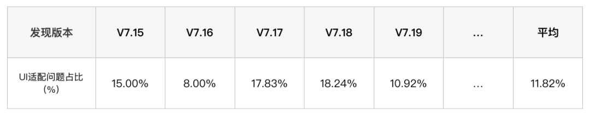
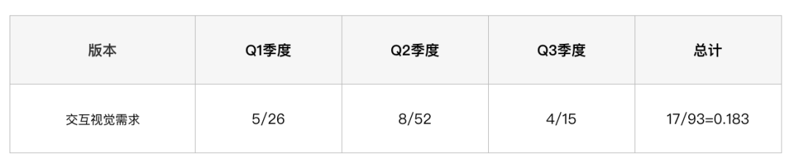
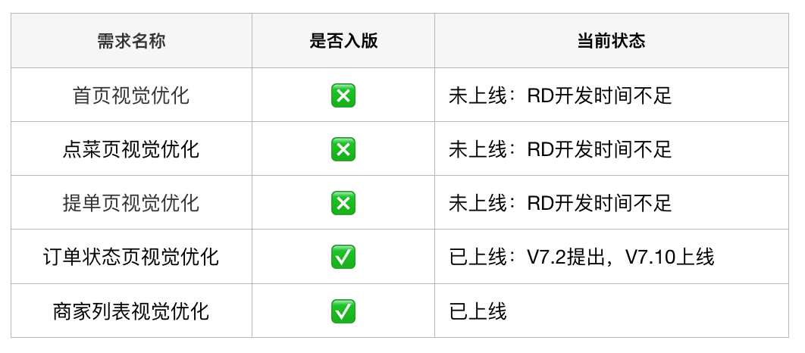

移动端UI一致性解决方案

**1\. 背景**

**1.1 行业现状与问题**

很多技术同学都知道，移动端往往比较侧重业务开发，这会导致人员规模不断扩大，项目复杂度也会持续增长。而为了满足业务的快速上线，很难去落实统一的设计规范，在开发过程中由于UI缺乏标准导致的问题不断凸显，具体体现在以下4个层面：

- **设计层面**：由于UI缺乏标准化设计规范，在不同App及不同开发语言平台上设计风格不统一，用户体验不一致；设计资源与代码均缺乏统一管理手段，无法实现积累沉淀，无法适应新业务的开发需求。
    
- **开发层面**：组件代码实现碎片化，存在多次开发的情况，质量难以保证；各端代码API不统一，维护拓展成本较高，变更主题、适配Dark Mode等需求难以实现。
    
- **测试层面**：重复走查，频繁回归，每次发版均需验证组件质量。
    
- **产品层面**：版本迭代效率低，版本需求吞吐量低，不具备业务的快速拓展能力。
    

**1.2 外卖移动端UI一致性情况**

近来年，美团外卖业务开始由发展期走入成熟期，这更要求对细分场景的快速迭代。目前，外卖平台承载了餐饮、商超、闪购、跑腿、药品等多个业务品类，用户入口则覆盖了美团App外卖频道、外卖App、大众点评外卖频道等多个独立应用。由于前期侧重需求的快速上线，设计层面缺乏标准化的规范约束，UI设计风格不统一，也存在多次开发的情况，目前的维护成本较高，在开发过程中逐渐暴露出一些问题，主要体现在以下三个层面。

**指标一：移动端UI问题统计**

在Ones（美团内部研发需求管理工具）中，单个版本的UI适配问题占比超过总Bug数的11.82%，亟待优化；交互适配问题在绝大多数版本中均有出现，一定程度上反映了其发生的普遍性。



**指标二：需求承接率数据统计**

用户侧UI需求吞吐率达18.3%，目前用户侧UI需求吞吐率较低，亟待解决。



**指标三：需求入版情况统计**

目前各版本UI同学都会提出一定数量的视觉优化需求，但实际入版量仅为三分之一左右，未上线的原因均为RD开发时间不足。



从长远角度来看，随着固有业务渗透率的不断饱和，未来一段时间内，美团外卖还有开拓新业务、进入新市场的需求，如国际化App、闪购App等，需要移动端能够高效地组建新业务App。在此背景下，移动端具备快速调整适应的UI展现能力是重中之重。为了达到上述目标，需要PM/UI/RD共同维护一套设计规范，在产品上统一风格，在源头上做到统一设计，并在代码中统一进行实现。

**1.3 UI一致性项目**

基于上述开发工作中的切实痛点，以及未来可预见的移动端能力需求，迫切需要一套统一的UI设计规范，以此沉淀设计风格，建立统一的UI设计标准。

UI一致性项目自2019年5月份被提出，是外卖UI设计团队与研发团队的共建项目，该项目是为了改善用户端体验一致性，提升多技术方案间组件的通用性和复用率，降低整体视觉改版的研发成本。通过抽离成熟的业务场景，建立可提供高质量、可扩展、可统一配置的基于Android/iOS/MRN的组件代码库，使之具备支持多业务高层次的代码复用能力，进而提高UI业务中台能力，使项目保持高度一致性。

为了帮助团队提升产研效率，外卖技术成立了袋鼠UI共建项目组，将门户建设、工具链建设以及组件建设统一管理统一规划，并将工具链的品牌确定为“积木”，此前我们已经写过两篇文章《[积木Sketch Plugin：设计同学的贴心搭档](http://mp.weixin.qq.com/s?__biz=MjM5NjQ5MTI5OA==&mid=2651751846&idx=1&sn=6425b58e416d908c1bbfd9f8d523b4ae&chksm=bd125ceb8a65d5fd7e24bd842bac425e44d64ed233c4c9264517a550b32275b7d3f09e9b50ae&scene=21#wechat_redirect)》、《[积木Sketch插件进阶开发指南](http://mp.weixin.qq.com/s?__biz=MjM5NjQ5MTI5OA==&mid=2651754717&idx=1&sn=1ca4dad6ccb82c17ea43478aa50ff663&chksm=bd1249908a65c08647e713bfc784b8c4e4c7421220689fefa82bd85ec005f2725b9e017c5e9a&scene=21#wechat_redirect)》介绍过积木相关的内容，本文主要介绍UI一致性。

UI一致性是绝大部分研发团队面临的共性问题，大家对落地设计规范，提高UI中台能力，提升产研效率具有强烈的诉求。通过UI一致性的建设，不仅可以在品牌上实现体验升级，更可以全面提高产研效率，为业务的快速迭代提供有力支持和有效保障。

统一的品牌符号、品牌特征，有助于加深产品在用户心目中的印象。统一的用户界面和交互形式，能帮助用户加深对产品的熟悉感和信任感。而一个好的设计语言可以在体验上为产品加分，也能够更好的创造一致性体验。

**2\. UI一致性整体方案**

为了帮助更多的业务部门定制符合一致性原则的专属设计风格，外卖技术部在实践中不断总结经验，开发了一套通用的UI一致性解决方案。该方案通过UI一致性工具链落地项目建设，并打造一整套的闭环UI开发流程，目前已经取得了一定的成果，以下系具体方案的介绍。

**2.1 方案全景**

外卖UI一致性套件由积木工具链、代码组件库、定制化设计云协作平台以及文档化说明（官网）四部分组成。

1.  **积木工具链**：通过建立包含相同设计元素的统一物料市场，PM通过Axure插件拾取物料市场中的组件产出原型稿；UI/UE通过Sketch插件落地物料市场中的设计规范，产出符合要求的设计稿。未来，希望通过高保真原型输出，可以给中后台项目、非依赖体验项目提供更好的服务体验，赋予产品同学直接向技术侧输出原型稿的能力。
    
2.  **代码组件库（Android、iOS、MRN）**：设计稿中的组件与RD代码仓库中组件一一对应。
    
3.  **文档化说明**：官网详细描述了代码组件库的集成方式、组件的使用方法，降低开发上手难度，只需要理解接口和职责即可进行业务开发。
    
4.  **定制化设计云协作平台**：与美团内部的印迹团队（云协作平台）合作开发，在RD的设计稿中标注了哪些是代码组件库中已有的元素，避免重复开发，同时关联了官网中该组件的使用说明，是代码组件库与官网的纽带。
    


外卖UI一致性解决方案

**2.2 接入指南**

1.  设计师逐步将设计语言沉淀为设计规范（包括组件、颜色、字体、图片等）上传至官网供整个设计团队查阅，同时将其量化并内置于积木Sketch插件中；开发同学则将其代码化，针对Android/iOS/MRN三端进行组件库开发。
    
2.  设计师使用积木Sketch插件绘制设计稿，可以保证设计元素均从既定的设计标准中获取，产出符合业务设计规范的设计稿，而代码组件库中也有对应的实现。
    
3.  绘制完成的设计稿上传至印迹云协作平台，交付开发同学进行设计稿还原。
    
4.  开发同学拿到设计稿后，就可以知道本次需求哪些组件已内置于代码组件库中，并可以点击设计稿中的链接，直接查看组件的使用说明。
    


UI一致性协作流程闭环

**2.3 方案落地**

虽然UI一致性在落地上会增加开发同学不少的工作量，推进一致性建设也是一个艰难的工作，由于成本较高，且无法量化评估收益，很多团队最终未达到预期效果，但一旦有效运作起来后，团队将获得丰厚的回报。UI一致性的建设需要设计者对现有状态有足够的认识，对业务有充分理解，以及优秀的设计能力，同时还要不断地进行实践和优化。为了保证一致性项目的成功落地，避免“半途而废”，我们制定了一系列的推进措施：

1.  项目小组不能脱离日常需求开发工作。这样可以保证设计师所沉淀的设计元素始终来自于最新的业务场景，同时项目产出可以快速应用到最新的版本中得以验证。
    
2.  优先选择受视觉因素影响较大、投入产出比高的模块场景进行改造，化繁为简，确定最小验证闭环 （MVP，Minimum Viable Product），在实践中不断优化，进而跑通整个流程。
    
3.  项目推进由UI同学按版本提出需求，移动端排期并落地实施，由UI统一验收。
    
4.  建立阶段性目标，并完成最近三期工作的具体规划，定期复盘完成情况，保证项目的持续推进。
    

**2.4 一致性成果**

经过一段时间的UI一致性建设，在资源一致性方面，外卖App团队已经完成了近百个Iconfont的替换工作，有效减小了安装包的体积。在组件代码库建设方面，完成组件替换三十多处，中等业务需求平均节约3pd人力；在工具链方面，根据UI/UE提供的数据，对于强依赖设计资源的需求，在使用积木Sketch插件后，提效能够达到30%以上，对于UI资源依赖不强的流程需求，平均提效可以达到50%以上。

**3\. 设计体系建设**

细化来看，UI一致性整体方案主要分为两个部分，一个是设计体系建设，另一个则是工具链建设。设计体系建设是基础，主要是设计师沉淀设计风格，建立统一的UI设计标准的工作，而工具链建设则是支撑，是开发人员通过开发一系列的工具将开发过程闭环，实现设计体系落地。

**3.1 外卖DPL**

DPL（Design Pattern Library）是一份面向UED设计人员的文档化说明，描述了设计模式库的规范以及应用场景等，外卖DPL主要包括组件搭建规范以及资源一致性两部分。DPL的背面是技术实现，一般体现在Android/iOS/RN代码框架中，比如阿里的FusionDesign库、腾讯的QMUI库等，这些封装好的代码组件面向程序开发人员。在未建立DPL模型之前，开发同学拿到设计稿进行视觉还原后，需要修改多次，才能最终通过设计师的验证，极大影响了开发效率，还降低了需求吞吐率。


未建立外卖DPL模型之前开发流程

而通过DPL实现设计-开发流程的闭环，UI同学由于设计规范的标准化，可使出稿效率、走查效率显著提升，重复组件甚至无需走查；对于RD同学来说，组件库中的组件在配置正确的情况下，由于已经经过了历史版本的检验，适配问题出现较少，无需重复进行视觉的修正；对于设计团队来说，优秀的设计体系具有包容性且充满生命力，好的设计模式库能够帮助实现规范化，从而减轻界面开发的工作量，提高一致性；而对于设计师来说，建立DPL有助于减少误用、滥用以及无效的创新。

**3.2 组件搭建**

在长期的版本迭代中，随着功能的不断增加以及UI的持续改版，新旧样式混杂，维护极为困难。设计师通过将页面走查结果归纳梳理，制定设计规范，从而选取复用性高的组件进行组件库搭建。通过搭建组件库可以进行规范控制，避免控件的随意组合，减少页面之间的差异；组件库中组件满足业务特色，同时可以应对不断变化的环境，具有云端动态调整能力，可以在规范更新时进行统一调整。

在不影响需求实现以及设计效果的前提下，只有在方案设计中尽可能使用组件，提升组件设计稿中的覆盖度，才可能真正通过组件库来提效。而除了在新的需求中使用组件，还需要将已有页面内容尽量替换成组件，才能避免页面升级时的重复修改问题，真正提高产研效率。在进行组件库建设时要注意以下几点。

**选择合适粒度**

组件的粒度选择曾是困扰我们很久的一个问题，虽然有构建设计系统的核心理论——原子设计理论为指导，即按照“原子、分子、组织、模板、页面”五个层面进行页面设计。这一理论对于从零开发新应用没有任何问题，但进行一致性改造的App，往往已经暴露出很多设计问题，已经存在数百个成熟的线上页面，改造存在非常大的困难，必须根据具体业务选择合适粒度。在进行组件制作前，项目同学对外卖的近百个页面进行了梳理，对使用到的组件进行了分类，并根据组件的使用频率进行排序，制定了逐步替换计划。从而避免了组件库做的很全、花费了很多的人力，但实际很多组件都用不上，或者开发的组件过少，覆盖场景不足等问题。

我们将走查结果与设计师反复交流，发现复用性较高的组件大体可以分为两类：第一类“基础控件”，也就是类似于标签、按钮、开关等具备基础功能的元素，对应原子理论中的原子；第二类“业务组件”，类似于商品卡片等，是由“基础控件”组成（比如商品卡片由“标签控件”与“图片控件”组成），同时“业务组件”还能相互组合，成为更高阶的“复杂组件”，类似于原子理论中的分子。“业务组件”的组合又是千变万化的，不同样式的业务组件可以组成类似“商家列表”、“菜品列表”等“模板”，而“模板”与“基本控件”组合在一起，就成为了“页面”。


外卖DPL模型建立

**具备拓展性**

组件必须具备一定的可配置属性才能提升适用场景。可配置属性体现在三个方面：组件支持局部元素展示隐藏，例如商品卡片的标题、说明、价格可根据接口数据控制展示逻辑；组件支持多种样式，例如商品卡片的左图右文排列、上图下文排列；组件支持业务方配置主题，如调整高亮色、调整对齐方式等。


组件应具有拓展性

**支持统一管理**

组件管理功能对外卖UI一致性起着至关重要的作用，这主要体现在两方面：首先是设计风格沉淀，目前袋鼠UI已经形成了自己的独特风格，外卖设计团队根据设计规范，对符合UI一致性外卖业务场景的组件不断进行抽象及建设，沉淀出越来越多的通用业务组件，这些组件需要及时扩充到Library中，供团队成员使用；另外一个作用则是保持团队使用的均为最新组件。由于各种原因，组件的设计元素（色彩、字体、圆角等属性）可能会发生变更，需要及时提醒团队成员更新组件，从而保持所有页面的一致性。

**3.3 资源一致性**

UI设计语言与自身业务关联性很强，美团很多业务包括外卖、酒旅、团购等都有一套自己的设计系统。“通用”意味着无法满足具有业务特色的需求，不同业务的组件、色彩系统、动效、字体样式等千差万别，其中任意一环的缺失都会导致一致性被破坏。

设计语言并不是一个抽象的概念，大家提到美团就想起美团黄，想到袋鼠，想到菜品卡片列表，想到骑着摩托车穿着印有“美团外卖”衣服的骑手，通过设计语言可以传达品牌主张和设计理念。目前，袋鼠UI已经形成了一套属于自己的独特风格，对于一致性元素处理有了一套自己的标准，对于产品的设计者而言，必须将这种风格化延续，才能使我们整个项目具备高度的一致性，才能保持“袋鼠特色“，保证吸引力。

**3.3.1 图片**

**建立插画库**

插图作为一种视觉语言，是品牌识别度的关键核心元素，与单纯的文案信息不同，图形化在直观描述固有信息的同时，也在塑造情感背景，使用户更具沉浸感和共情性。插画在提升产品用户体验的同时完成商业目标，在表达效果及生产效率上有独特的优势，在追求效率的互联网产品中被大量地运用。

由于之前产品中的插图未经系统整合，而插画师的个人风格明显，不同的设计师在图形化的工作协同中，风格很难复现，而单纯由一名设计师去完成整体业务的插画建设工作也存在一定风险。不同设计师之前画过的元素无法互通，造成很多元素重复设计、风格不统一，缺乏系统性地创作和整理，无法最大化地提升生产效率，并且影响产品的品质感。所以插图体系在保持品牌一致性、提升工作效率以及规避风险上尤为重要。


插画规范示例

**使用Iconfont**

Iconfont可译为图标字体，顾名思义就是用字体文件取代图片文件来展示图标、特殊字体等元素的一种方法。简单来说，Iconfont就是把多个图标文件打包为ttf字体文件，注册到系统中，App可以像使用字体一样使用图标。其原理可以简单理解为通过ttf字体文件维护一个Unicode码与图形的映射关系。当使用Iconfont为项目助力的时候，配置多个图标不再需要去下载数个PNG文件，仅需要维护一套ttf字体文件即可。

Iconfont不仅具有矢量性、可自由变化大小的特点，而且支持任意改变颜色。从项目角度来看，由于无需针对不同手机分辨率内置多张图片，可以一定程度减小包体积，而且方便UI同学对图标进行统一管理，为无用icon和相似icon检测做基础。


使用iconfont替换项目中的图片

**归档图片文件**

当App发展到一定阶段，必然面临着包体积会越来越大，无用图片与相似图片也会越来越多的问题。同时，由于开拓新业务而不断涌现的新场景，又不可避免地新增大量的图片。总结来看，图片文件在一致性项目中需要解决两个问题，即存量图片的处理以及新增图片的管理。

对于存量图片，必须判断其合理性，项目中存在大量相似图片，这些图片可能仅是padding不同，或者颜色尺寸存在微小差异，可以通过脚本扫描相似图片，根据图片的特征Hash判断图片的相似度，相似度高的图片根据UI建议，保留一张即可。那如何防止新增图片“重蹈覆辙”呢？通过建立图片管理后台，将图片按场景分类，标准图片需从组件代码库中选取，新增图片执行PR策略，需相关负责人审核，可有效防止相似图片的堆积问题。


一致性项目实施前项目中的相似图片

**3.3.2 动效**

动效是指那些那些能够为产品赋予生机的动态界面元素及视觉效果，这些交互效果通常与特定的响应行为相关，甚至包括那些与交互行为没有直接关联的临时状态。精细而恰当的动画效果可以传达状态，增强用户对于直接操纵的感知，通过视觉化的方式向用户呈现操作结果。

随着外卖业务的不断增加，动效的使用比重在不断增加，重要性日渐凸显，也是增强用户体验与竞品拉开差距的重要因素，因此，统一规范的使用动效尤为重要。通过动效库建设，UI层面可以承载品牌、传递情感，加深用户对App的印象，让用户放松、愉悦；RD层面同一组件可在多场景直接复用，还降低了研发成本。


动效

**3.3.3 颜色**

颜色可以起到传递品牌信息、区分信息的所属关系、标明控件的选中状态以及对内容的信息进行分层级展示等功能。重要的信息需要在页面中被突出展示。系统级色彩体系主要定义了外卖的主要颜色、文字颜色、辅助颜色以及标准渐变色，颜色在一定时期内不再支持新增。通过将标准色板内置于积木Sketch插件中，限制UI绘制设计稿时的使用范围，而RD同学仅可通过代码组件库中选取颜色，保证色值的准确性，也便于进行主题定制。


定义颜色使用场景

**3.3.4 字体**

字体是体系化界面设计中最基本的构成之一。用户通过文本来理解内容和完成工作，科学的字体系统将大大提升用户的阅读体验及工作效率。设计师在字体设计过程中需要关注非常多的方面，比如字体family、字距、行高、段落等等。如何让文字看起来更自然，是设计师团队一直探寻的答案，UI同学根据文字的层级关系，规定了Headline、Subtitle、Body、Button以及Caption的文字使用规范，根据设计稿中文字的位置，就可确定文字的具体样式。


定义字体使用规范

**4\. 工具链建设**

要想保持UI一致性，就不能打破规则。外卖UI一致性套件由积木工具链、代码组件库、定制化设计云协作平台以及官网四部分组成，通过将这四部分连接起来，形成一个闭环，把整个工作流限制在标准操作以内。

**4.1 积木Sketch插件**

在之前的文章中，我们已经对积木插件进行了详细介绍，这里只作简要概述，介绍其在一致性项目中发挥的作用。从设计阶段颜色的选择、字体的规范、控件的样式，到RD开发阶段代码的统一管理、API的制定、多端的实现方式都必须遵守一套规则，通过积木Sketch插件落地设计规范，可以保证设计元素均从既定设计标准中获取，产出符合业务设计语言的设计稿，而各平台UI代码库中也有对应实现，从而使积木插件成为UI一致性的抓手。


积木Sketch Plugin平台化示意

**4.1.1 插件功能**

积木Sketch插件经过一段时间的建设，目前已具备Iconfont、标准色板、组件库、数据填充、文字模板等功能。通过Iconfont可以从公司图标库中拉取设计团队上传的SVG图标，并直接应用于设计稿；标准色板可以限定设计师的颜色使用范围，确保设计稿中的颜色均符合设计规范；组件库中包含从外卖业务抽离的基本控件与通用组件，具有可复用和标准化的特点，并与不同开发语言组件库中的代码一一对应；数据填充库可以使设计师采用真实数据进行填充，使设计稿更贴近线上环境；文字模板中内置了字体样式的使用规范，根据设计稿中文字的位置，点击文字图层即可直接应用。


积木Sketch Plugin功能演示

**4.1.2 物料市场**

通过Sketch管理后台，设计师可以将配色规范、文字规范、话术、Iconfont、组件库上传至云端并与整个设计团队中成员共享，并可实现设计资产的版本管理。通过将Sketch Library存储在后台物料市场，设计师可以与团队成员共享组件（Symbol），Library可以实现“一处更改，处处生效”，即使是关联了远程组件库历史的设计稿检测到更新时，也会收到Sketch通知，确保工作中使用的是最新组件。


积木Sketch Plugin 物料管理后台

**4.2 代码模型建设**

为了满足中小企业的需求，越来越多的开源组件库诞生，但开源代表着“通用”，无法满足业务特色的需求，于是很多企业也开始做起了自己的组件库。通过建立代码组件库，能帮助开发同学快速搭建App页面，减少设计与开发沟通成本，统一体验规范等。


代码组件库模型

**4.2.1 代码库功能**

**提高项目可维护性**

由于组件库中的组件职责单一，降低了系统的耦合度，开发人员可以很容易地了解该组件提供的能力。组件可以自由替换、组合为高阶组件，在进行组件更新时仅需修改一处。每个项目成员维护一定数量的组件，让团队中每个人都能发挥所长，可以最大化团队的开发效率。

**实现文档化**

组件接口有统一的规范，降低新人的上手难度，新成员只需要理解接口和职责即可开发组件代码，由于代码的影响范围仅限于组件内部，对项目的风险控制也非常有帮助。通过对组件统一管理，实现代码的积累沉淀与有效复用，全面提升了新业务的需求开发效率。

**便于单元测试**

由于组件职责单一而清晰，对外仅暴露接口，概念上可以把组件当成一个函数，输入对应着输出，这让自动化测试变得更加简单。

**实现无障碍等定制化功能**

无障碍功能可以改善残障人士的用户体验，组件库中的组件资源高内聚，完全由自身控制加载，不与全局或其他组件产生影响。组件的加载、渲染路径清晰可控，对于组件功能定制，实现类似于无障碍等功能较为方便。

**4.2.2 方案设计**

**统一配置文件**

前文也提到，外卖业务入口覆盖外卖独立App、美团外卖频道以及大众点评外卖频道等，外卖组件需要在不同的移动端上适配宿主App的UI风格及交互体验，这就需要组件库支持主题配置功能。由于主题涉及Android/iOS/MRN多端，需要一套通用的主题配置文件。经过了各端开发同学与设计师的多轮讨论，最终确定了包含主题颜色、文字外观、组件风格等内容的主题描述文件格式。配置文件通过下发，就可以实现全局替换主题的功能。

```
{  // 主题颜色  "rooBrandColors": {    "rooBrandPrimary": "#FFCC33"  },  // 文本外观  "rooTextAppearance": {    "rooTextAppearanceHeadline1": {      "fontFamily": "sans-serif-medium",    // 字体      "textStyle": "normal",                // 风格（normal/bold/italic）      "textSize": 44,                       // 字号    }  },  // 组件风格  "rooStyle":{      "rooButtonStyle": {        "textAppearance": "?attr/rooTextAppearanceButton",        "backgroundColor": "?attr/rooBrandPrimary",        "cornerRadius": 0,      }  }
```

**搭建全平台组件库**

目前，市面上耳熟能详的组件库包括阿里的Antd Desigin、Fusion Design以及美团的Roo Design等，基本都是服务于Web开发的组件库，通过这些组件库可以快速搭建一些中后台系统。

为什么没有知名的Native开源组件库呢？因为每个应用的主题、风格以及交互体验都是不同的，而这些不同恰恰是传达品牌主张和设计理念的灵魂，因此必须结合业务，针对Android/iOS/MRN三端进行组件库开发。通过搭建全平台代码组件库，可以保证同一个UI组件在各端表现一致，进行UI升级时降低改错或遗漏的风险，除此之外，还能降低测试压力，提高需求的吞吐率。

**4.2.3 示例应用**

我们针对Android/iOS/MRN三端代码开发了示例工程，通过示例工程，不仅可以帮助UI同学完成组件验收，还能帮助开发同学快速查阅可以应用的所有组件，了解其使用方式以及进行代码调试。


组件库demo示例

**4.3 官网门户建设**

官网相当于项目的门面，一个好的门面才能吸引更多的用户，才能更好地对项目进行推广。官网作为设计师与开发同学沟通的媒介，需要两者共同维护。通过官网可以帮助团队内设计师沉淀设计风格，建立统一的UI设计规范，帮助RD同学进行组件文档管理与查阅。

**4.3.1 官网功能**

当前的官网主要由四部分组成，分别是设计语言、组件库、插画库以及资源下载，分别服务于UI和RD同学。


外卖平台化官网导航栏

**设计语言**

UI一致性项目中采取了“原子理论”的构成原理，即从最小的元素开始定义，进而将这些元素按照规则进行组装，拼接成组件，最后通过这些组件拼接成最终的页面，这是一个由点到面的过程。设计语言章节主要服务于UI/UE同学，该章节通过视觉、设计模式、动效等三个子章节使得读者能够快速了解项目的设计规范，从而快速上手。

**组件库**

组件库是设计模式中各种元素的具体实现，在这个页面描述了组件的使用方式。

**插画库**

插画库中则介绍了插画的使用场景，插画的绘制规范以及插画案例展示。

**资源下载**

提供积木工具链产品下载功能。


外卖平台化官网

**4.3.2 方案设计**

由于官网以纯粹的图文展示为主，且迭代频率较快，因而选择了当下较为普遍的文档-网站生成系统，即只需按照一定规范将书写的Markdown文档放至相应目录，前端自动解析后生成导航，并且支持多语种、图片、文件、视频等素材。这种方式极大地缩短了官网的开发周期，即便是没有前端经验的同学也能快速上手。

为了方便UI同学对官网文档的修改，我们基于文档网站生成系统搭建了在线编辑平台。通过该平台，相关人员可以直接做到在线编辑、发布，节约了UI同学与RD同学的沟通成本以及发布成本。填充期间，使用者可以实时预览编辑的内容，修改后只需点击保存即可立即更新到网站中。

官网支持平台化功能，不同业务方可以创建属于自己的文档站点，一个好的文档站点对于设计组的方案推广、外部接入都大有裨益。


外卖平台化官网录入后台

**4.4 工具链的闭环**

当我们信心满满的把UI一致性解决方案推广到日常开发中时，除了听到可以提升效率的褒奖外，开发同学对项目的吐槽声也常常传入我们的耳边，“怎么才能知道设计稿中的哪个组件已经开发完成了？”，“查询这个组件的使用方法好麻烦，每次都要去官网检索”，“规范颜色、图标的名称是什么？怎么才能引用到？”

我们无法限制别人的选择，所以只能让这套体系变得更好用，如果不去优化整个流程，将其串联起来形成闭环，后面整个项目可能都会慢慢崩塌，所以我们对项目进行了重新复盘，经过大家集思广益，终于找到了能将工具链体系打通的解决方案：设计稿作为衔接RD与UI的纽带，可以把官网与代码仓库打通。

我们与美团内部的印迹团队合作开发，然后定制了一个设计云协作平台，在给RD的设计稿中标注了哪些是代码组件库中已有的元素，避免了重复开发，同时关联了官网上该组件的使用说明，RD同学在开发过程中遇到组件使用问题无需检索，点击即可跳转至使用文档。后期我们还将颜色、iconfont以及插画库中图片也进行了关联，真正做到了一致性元素的全覆盖。


与印迹合作支持组件展示的云协作平台

**加入我们**

UI一致性项目原本只是外卖技术团队提升UI/RD协作效率的一次尝试，现在已经作为全面提升产研效率的媒介，承载了越来越多的功能。围绕设计日常工作，提供高效的设计元素获取方式，让工作变得更轻松，是我们的核心目标。如何推动设计规范落地，并且输出到各个业务系统灵活使用，是我们持续追寻的答案。探寻研发和设计更为高效的协作模式，是我们一直努力的方向。

如你所见，通过UI一致性建设可以帮助设计团队提升设计效率、沉淀设计语言以及减少走查负担；让RD同学面对新项目时可以专注于业务需求，而无需把时间耗费在组件的编写上；减少QA工作量，保证控件质量无需频繁的回归测试；帮助PM提高版本迭代效率及版本需求吞吐量，提供业务的快速拓展能力。当然，我们除了希望制作一流的产品，也希望可以让大家在繁忙的工作中得以喘息。我们会继续以设计语言为依托，以工具链建设为抓手持续进行UI一致性建设，不断提高移动端UI业务中台能力。

如果你也想参与我们的UI一致性项目建设，欢迎加入我们！

**致谢**

感谢晓飞、彦平、杜瑶、冰冰、云鹏对项目的大力支持。

感谢到家优秀设计师淼林、昱翰、冉冉、璟琦、雪美、田园。

感谢用户平台组参与UI一致性建设的开发同学王鹏、腾飞、赵炎、瀚阳等，感谢美团印迹开发团队的支持。

感谢所有参与人的努力与坚持，为外卖DPL建立贡献力量！

**参考文献**

**|** [爱奇艺产品工作流优化：搭建组件库做高ROI](https://www.infoq.cn/article/p4qS71yQjtDHToUfU9ry)  
**| **[阿里重磅开源中后台 UI 解决方案 Fusion](https://www.infoq.cn/article/4KIST8M4XtbC5j3c-k2a)  
**| **[Ant Design 背后的故事](https://zhuanlan.zhihu.com/p/32746810)  
**| **[Google Material Design](https://material.io/design/motion/understanding-motion.html)  
**| **[前端组件化开发方案及其在React Native中的运用](https://www.infoq.cn/article/front-end-component-develop-and-application-in-react-native/)