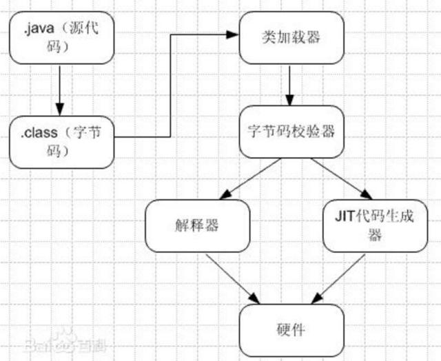
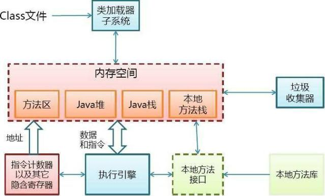
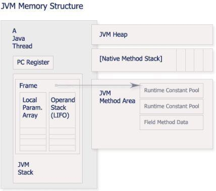
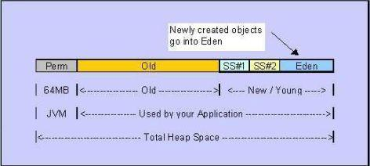
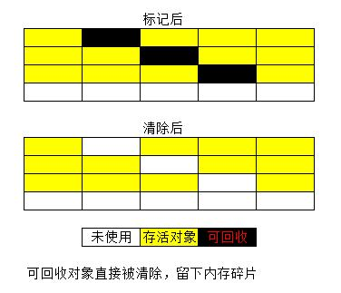
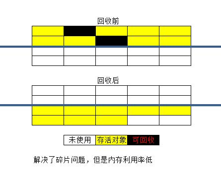
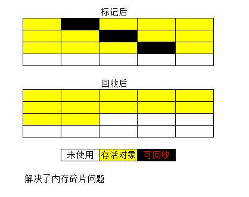
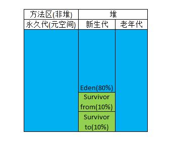
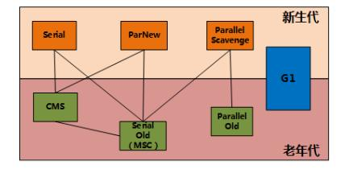

JVM原理 - 有容乃大 - 博客园

原文：[https://baijiahao.baidu.com/s?id=1605937053950156833&wfr=spider&for=pc](https://baijiahao.baidu.com/s?id=1605937053950156833&wfr=spider&for=pc)

1：什么是JVM

JVM是Java Virtual Machine（Java虚拟机）的缩写，JVM是一种用于计算设备的规范，它是一个虚构出来的计算机，是通过在实际的计算机上仿真模拟各种计算机功能来实现的。Java虚拟机包括一套字节码指令集、一组寄存器、一个栈、一个垃圾回收堆和一个存储方法域。 JVM屏蔽了与具体操作系统平台相关的信息，使Java程序只需生成在Java虚拟机上运行的目标代码（字节码）,就可以在多种平台上不加修改地运行。JVM在执行字节码时，实际上最终还是把字节码解释成具体平台上的机器指令执行。

2：JRE/JDK/JVM是什么关系

JRE(JavaRuntimeEnvironment，Java运行环境)，也就是Java平台。所有的Java 程序都要在JRE下才能运行。普通用户只需要运行已开发好的java程序，安装JRE即可。

JDK(Java Development Kit)是程序开发者用来来编译、调试java程序用的开发工具包。JDK的工具也是Java程序，也需要JRE才能运行。为了保持JDK的独立性和完整性，在JDK的安装过程中，JRE也是 安装的一部分。所以，在JDK的安装目录下有一个名为jre的目录，用于存放JRE文件。

JVM(JavaVirtualMachine，Java虚拟机)是JRE的一部分。它是一个虚构出来的计算机，是通过在实际的计算机上仿真模拟各种计算机功能来实现的。JVM有自己完善的硬件架构，如处理器、堆栈、寄存器等，还具有相应的指令系统。Java语言最重要的特点就是跨平台运行。使用JVM就是为了支持与操作系统无关，实现跨平台。

3：JVM原理

JVM是java的核心和基础，在java编译器和os平台之间的虚拟处理器。它是一种利用软件方法实现的抽象的计算机基于下层的操作系统和硬件平台，可以在上面执行java的字节码程序。

java编译器只要面向JVM，生成JVM能理解的代码或字节码文件。Java源文件经编译成字节码程序，通过JVM将每一条指令翻译成不同平台机器码，通过特定平台运行。

4：JVM的体系结构

类装载器（ClassLoader）（用来装载.class文件）

执行引擎（执行字节码，或者执行本地方法）

运行时数据区（方法区、堆、java栈、PC寄存器、本地方法栈）

5：JVM运行时数据区

第一块：PC寄存器

PC寄存器是用于存储每个线程下一步将执行的JVM指令，如该方法为native的，则PC寄存器中不存储任何信息。

第二块：JVM栈

JVM栈是线程私有的，每个线程创建的同时都会创建JVM栈，JVM栈中存放的为当前线程中局部基本类型的变量（java中定义的八种基本类型：boolean、char、byte、short、int、long、float、double）、部分的返回结果以及Stack Frame，非基本类型的对象在JVM栈上仅存放一个指向堆上的地址。

第三块：堆（Heap）

它是JVM用来存储对象实例以及数组值的区域，可以认为Java中所有通过new创建的对象的内存都在此分配，Heap中的对象的内存需要等待GC进行回收。

（1） 堆是JVM中所有线程共享的，因此在其上进行对象内存的分配均需要进行加锁，这也导致了new对象的开销是比较大的

（2） Sun Hotspot JVM为了提升对象内存分配的效率，对于所创建的线程都会分配一块独立的空间TLAB（Thread Local Allocation Buffer），其大小由JVM根据运行的情况计算而得，在TLAB上分配对象时不需要加锁，因此JVM在给线程的对象分配内存时会尽量的在TLAB上分配，在这种情况下JVM中分配对象内存的性能和C基本是一样高效的，但如果对象过大的话则仍然是直接使用堆空间分配

（3） TLAB仅作用于新生代的Eden Space，因此在编写Java程序时，通常多个小的对象比大的对象分配起来更加高效。

（4） 所有新创建的Object 都将会存储在新生代Yong Generation中。如果Young Generation的数据在一次或多次GC后存活下来，那么将被转移到OldGeneration。新的Object总是创建在Eden Space。

第四块：方法区域（Method Area）

（1）在Sun JDK中这块区域对应的为PermanetGeneration，又称为持久代。

（2）方法区域存放了所加载的类的信息（名称、修饰符等）、类中的静态变量、类中定义为final类型的常量、类中的Field信息、类中的方法信息，当开发人员在程序中通过Class对象中的getName、isInterface等方法来获取信息时，这些数据都来源于方法区域，同时方法区域也是全局共享的，在一定的条件下它也会被GC，当方法区域需要使用的内存超过其允许的大小时，会抛出OutOfMemory的错误信息。

第五块：运行时常量池（Runtime Constant Pool）

存放的为类中的固定的常量信息、方法和Field的引用信息等，其空间从方法区域中分配。

第六块：本地方法堆栈（Native Method Stacks）

JVM采用本地方法堆栈来支持native方法的执行，此区域用于存储每个native方法调用的状态。

6：对象“已死”的判定算法

由于程序计数器、Java虚拟机栈、本地方法栈都是线程独享，其占用的内存也是随线程生而生、随线程结束而回收。而Java堆和方法区则不同，线程共享，是GC的所关注的部分。

在堆中几乎存在着所有对象，GC之前需要考虑哪些对象还活着不能回收，哪些对象已经死去可以回收。

有两种算法可以判定对象是否存活：

1.）引用计数算法：给对象中添加一个引用计数器，每当一个地方应用了对象，计数器加1；当引用失效，计数器减1；当计数器为0表示该对象已死、可回收。但是它很难解决两个对象之间相互循环引用的情况。

2.）可达性分析算法：通过一系列称为“GC Roots”的对象作为起点，从这些节点开始向下搜索，搜索所走过的路径称为引用链，当一个对象到GC Roots没有任何引用链相连（即对象到GC Roots不可达），则证明此对象已死、可回收。Java中可以作为GC Roots的对象包括：虚拟机栈中引用的对象、本地方法栈中Native方法引用的对象、方法区静态属性引用的对象、方法区常量引用的对象。

在主流的商用程序语言（如我们的Java）的主流实现中，都是通过可达性分析算法来判定对象是否存活的。

7：JVM垃圾回收

GC (Garbage Collection)的基本原理：将内存中不再被使用的对象进行回收，GC中用于回收的方法称为收集器，由于GC需要消耗一些资源和时间，Java在对对象的生命周期特征进行分析后，按照新生代、旧生代的方式来对对象进行收集，以尽可能的缩短GC对应用造成的暂停

（1）对新生代的对象的收集称为minor GC；

（2）对旧生代的对象的收集称为Full GC；

（3）程序中主动调用System.gc()强制执行的GC为Full GC。

不同的对象引用类型， GC会采用不同的方法进行回收，JVM对象的引用分为了四种类型：

（1）强引用：默认情况下，对象采用的均为强引用（这个对象的实例没有其他对象引用，GC时才会被回收）

（2）软引用：软引用是Java中提供的一种比较适合于缓存场景的应用（只有在内存不够用的情况下才会被GC）

（3）弱引用：在GC时一定会被GC回收

（4）虚引用：由于虚引用只是用来得知对象是否被GC

8：垃圾收集算法

1、标记-清除算法

最基础的算法，分标记和清除两个阶段：首先标记处所需要回收的对象，在标记完成后统一回收所有被标记的对象。

它有两点不足：一个效率问题，标记和清除过程都效率不高；一个是空间问题，标记清除之后会产生大量不连续的内存碎片（类似于我们电脑的磁盘碎片），空间碎片太多导致需要分配大对象时无法找到足够的连续内存而不得不提前触发另一次垃圾回收动作。

2、复制算法

为了解决效率问题，出现了“复制”算法，他将可用内存按容量划分为大小相等的两块，每次只需要使用其中一块。当一块内存用完了，将还存活的对象复制到另一块上面，然后再把刚刚用完的内存空间一次清理掉。这样就解决了内存碎片问题，但是代价就是可以用内容就缩小为原来的一半。

3、标记-整理算法

复制算法在对象存活率较高时就会进行频繁的复制操作，效率将降低。因此又有了标记-整理算法，标记过程同标记-清除算法，但是在后续步骤不是直接对对象进行清理，而是让所有存活的对象都向一侧移动，然后直接清理掉端边界以外的内存。

4、分代收集算法

当前商业虚拟机的GC都是采用分代收集算法，这种算法并没有什么新的思想，而是根据对象存活周期的不同将堆分为：新生代和老年代，方法区称为永久代（在新的版本中已经将永久代废弃，引入了元空间的概念，永久代使用的是JVM内存而元空间直接使用物理内存）。

这样就可以根据各个年代的特点采用不同的收集算法。

新生代中的对象“朝生夕死”，每次GC时都会有大量对象死去，少量存活，使用复制算法。新生代又分为Eden区和Survivor区（Survivor from、Survivor to），大小比例默认为8:1:1。

老年代中的对象因为对象存活率高、没有额外空间进行分配担保，就使用标记-清除或标记-整理算法。

新产生的对象优先进去Eden区，当Eden区满了之后再使用Survivor from，当Survivor from 也满了之后就进行Minor GC（新生代GC），将Eden和Survivor from中存活的对象copy进入Survivor to，然后清空Eden和Survivor from，这个时候原来的Survivor from成了新的Survivor to，原来的Survivor to成了新的Survivor from。复制的时候，如果Survivor to 无法容纳全部存活的对象，则根据老年代的分配担保（类似于银行的贷款担保）将对象copy进去老年代，如果老年代也无法容纳，则进行Full GC（老年代GC）。

大对象直接进入老年代：JVM中有个参数配置-XX:PretenureSizeThreshold，令大于这个设置值的对象直接进入老年代，目的是为了避免在Eden和Survivor区之间发生大量的内存复制。

长期存活的对象进入老年代：JVM给每个对象定义一个对象年龄计数器，如果对象在Eden出生并经过第一次Minor GC后仍然存活，并且能被Survivor容纳，将被移入Survivor并且年龄设定为1。每熬过一次Minor GC，年龄就加1，当他的年龄到一定程度（默认为15岁，可以通过XX:MaxTenuringThreshold来设定），就会移入老年代。但是JVM并不是永远要求年龄必须达到最大年龄才会晋升老年代，如果Survivor 空间中相同年龄（如年龄为x）所有对象大小的总和大于Survivor的一半，年龄大于等于x的所有对象直接进入老年代，无需等到最大年龄要求。

9：垃圾收集器

垃圾收集算法是方法论，垃圾收集器是具体实现。JVM规范对于垃圾收集器的应该如何实现没有任何规定，因此不同的厂商、不同版本的虚拟机所提供的垃圾收集器差别较大，这里只看HotSpot虚拟机。

JDK7/8后，HotSpot虚拟机所有收集器及组合（连线）如下：

