浅谈UML中常用的几种图

Update Time:2020年1月5日20:17:47 Author:要你命三千又 三千 type：笔记整理

> 做一个简单的UML总结  
> 学习UML 的各个用图；  
> 如果详细学习每一个部分，是看一篇总结是远远不够的。

> 统一建模语言（Unified Modeling Language，UML）又称标准建模语言，是始于1997年的一个OMG标准，它是一个支持模型化和软件系统开发的图形化语言，为软件开发的所有阶段提供模型化和可视化支持，包括由需求分析到规格，到构造和配置。‘UML感兴趣的可以阅读UML 1规 范，包含了UML 的所有知识内容。  
> `注：OMG, Object Management Group 对象管理组织`

UML从考虑系统的不同`角度`出发，定义了`用况图`、`类图`、`对象图`、`包图`、`状态图`、`活动图`、`序列图`、`通信图`、`构件图、部署图等`10种图。

分类：  
面向`对象动态建模`，用于建立行为的实体间行为`交互的四种图`：状态图(Stage Diagram)，序列图(Sequence Diagram)，协作图(Communication Diagram)，活动图(Activity Diagram) 。  
“`序列图”与“协作图”表述的是相似的消息`，“活动图”是“状态图”的一种。

- 静态结构图Static Structure Diagram  
    类图`Class Diagram`  
    对象图`Object Diagram`  
    用况图`Use Case Diagram`
- 交互图Interaction Diagram  
    顺序图`Sequence Diagram`  
    协作图`Collaboration Diagram`  
    状态图`State chart Diagrams`  
    活动图Activity Diagrams
- 实现图Implementation Diagrams  
    构件图`Component Diagram`  
    部署图`Deployment Diagram`

用例图，展现了一组`用例、参与者（actor）`以及它们之间的关系。  
用例图从用户角度描述系统的静态使用情况，用于建立`需求模型`。(用于需求分析)

- 参与者（Actor）  
    　　在系统外部与系统直接交互的人或事物。需要注意以下两点：  
    　　1）参与者是角色而不是具体的人（可以是`外部系统`），它代表了参与者在与系统打交道的过程中所扮演的角色。所以在系统的实际运作中，一个实际用户可能对应系统的多个参与者。不同的用户也可以只对应于一个参与者，从而代表同一参与者的不同实例。  
    　　2）参与者作为外部用户（而不是内部）与系统发生交互作用，是它的主要特征。

在UML中，参与者使用如图所示的一个小人表示：  
  
用例（Use Case）`用况`

> 系统外部可见的一个系统功能单元。系统的功能由系统单元所提供，并通过一系列系统单元与一个或多个参与者之间交换的消息所表达。用椭圆表示，椭圆中的文字简述系统的功能：  
> 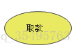

在`UML类图`中，常见的有以下`几种关系`: 泛化（Generalization）, 实现（Realization），关联（Association)，聚合（Aggregation），组合(Composition)，依赖(Dependency)

1.  `泛化`（Generalization）  
    【泛化关系】：是一种`继承关系`，表示一般与特殊的关系，它指定了子类如何特化父类的所有特征和行为。例如：老虎是动物的一种，即有老虎的特性也有动物的共性。  
    【箭头指向】：带三角箭头的实线，箭头指向父类

> 实现类的继承关系

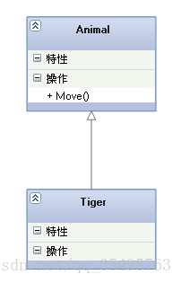

2.  实现（Realization）  
    【实现关系】：是一种类与接口的关系，表示类是接口所有特征和行为的实现.  
    【箭头指向】：带三角箭头的虚线，箭头指向接口

> 注意可以理解类的继承的关系的另外一种表现形式。

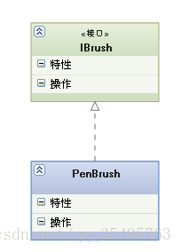

3.  关联（Association)  
    【关联关系】：是一种拥有的关系，它使一个类知道另一个类的属性和方法；如：老师与学生，丈夫与妻子关联可以是双向的，也可以是单向的。双向的关联可以有两个箭头或者没有箭头，单向的关联有一个箭头。  
    【代码体现】：成员变量  
    【箭头及指向】：带普通箭头的实心线，指向被拥有者

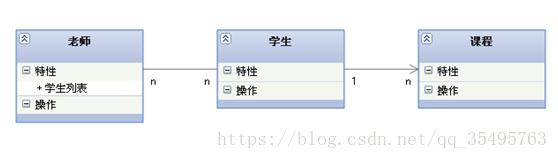  
上图中，老师与学生是双向关联，老师有多名学生，学生也可能有多名老师。但学生与某课程间的关系为单向关联，一名学生可能要上多门课程，课程是个抽象的东西他不拥有学生。下图为自身关联：  
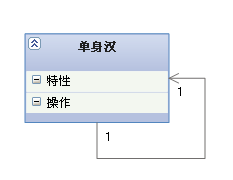

4.  聚合（Aggregation）  
    【聚合关系】：是整体与部分的关系，且部分可以离开整体而单独存在。如车和轮胎是整体和部分的关系，轮胎离开车仍然可以存在。  
    聚合关系是关联关系的一种，是强的关联关系；关联和聚合在语法上无法区分，必须考察具体的逻辑关系。  
    【代码体现】：成员变量  
    【箭头及指向】：带空心菱形的实心线，菱形指向整体

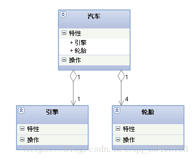

5.  组合(Composition)  
    【组合关系】：是整体与部分的关系，但部分不能离开整体而单独存在。如公司和部门是整体和部分的关系，没有公司就不存在部门。组合关系是关联关系的一种，是比聚合关系还要强的关系，它要求普通的聚合关系中代表整体的对象负责代表部分的对象的生命周期。  
    【代码体现】：成员变量  
    【箭头及指向】：带实心菱形的实线，菱形指向整体
	
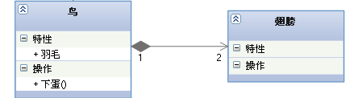

6.  依赖(Dependency)  
    【依赖关系】：是一种使用的关系，即一个类的实现需要另一个类的协助，所以要尽量不使用双向的互相依赖.  
    【代码表现】：局部变量、方法的参数或者对静态方法的调用  
    【箭头及指向】：带箭头的虚线，指向被使用者  
    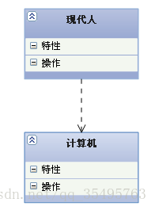
    

各种关系的强弱顺序：  
泛化 = 实现 > 组合 > 聚合 > 关联 \> 依赖  
下面这张UML图，比较形象地展示了各种类图关系：  
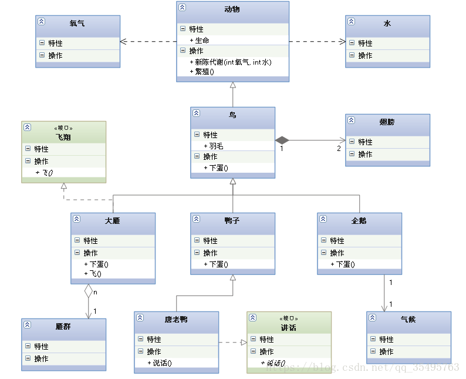  
图片转自：http://blog.csdn.net/tianhai110/article/details/6339565

> 注意这里的雁群和大雁的关系画反了。

## 简单类图使用 举例

1.  根据下面的陈述画出类图  
    1)学生包括本科生、研究生两种。  
    2)研究生的一部分利用课余时间担任助教。  
    3)教师包括讲师和教授两种。  
    4)一名助教可以为一位讲师或一位教授助课,一位讲师只能有一名助教,一位教授可以有5名助教。
    
2.  按如下描述画出一个自治机器人的类图。  
    这张图的焦点是聚集在那些让机器人在路上行走的机制所对应的类上。你可以发现一个虚类Motor和两个从它派生出来的类: SteeringMotor和MainMotor。这两个类都从它的父亲Motor继承了五个方法:move()、stop()、resetCounter()、statues()、distance()。这两个类又是另一个类Driver的一部分。类PathAgent 和Driver有一个1对1的关系,和CollisionSensor有1对n的关系。
    

【问题:】综上所述请你用UML来绘制分析类图。  
参考答案:  
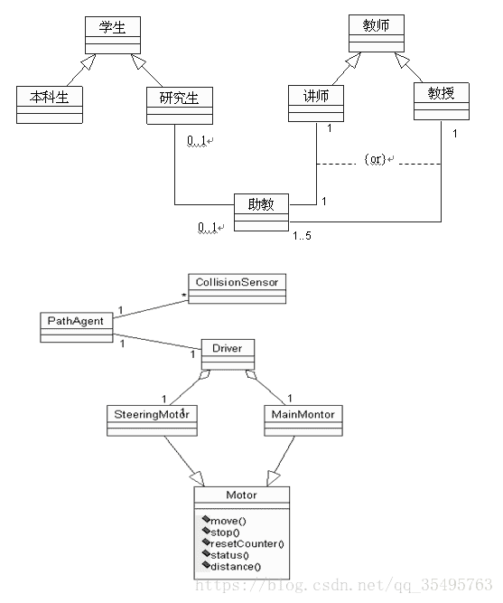

## 时序图(顺序图)

> 时序图别称为顺序图、序列图，在我的大致印象中时序图是以时间为主线，有生命线的动态视图，主要描述的对象是对象。是交互图的一种。主要的作用是表达设计者心中对于未来程序在运作时的对象协作建模，验证软件领域模型的正确性，为程序员提供编码的蓝图。

（一）概念

1.  定义：  
    时序图是以时间为序的表示方法，主要用来描述对象之间的时间顺序。将交互关系表示为二维图的。纵轴为时间，横轴为在协作中各个独立的对象。对象存在时用一条虚线表示，当对象的过程处于激活状态是，生命线是一个双道线。消息用从一个对象的生命线到另一个对象生命线的箭头表示。箭头以时间顺序在图中从上到下排列。如下图：  
    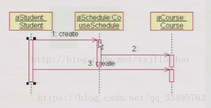
2.  四个元素（对象，生命线，消息，激活）  
    （1）对象  
    对象的概念就不多说了，就是类的实例化，在系统中随便都可以找到一个对象，因为我们使用的是基于OO编程的VB。  
    （2）生命线  
    表示对象的存在存在多久的时间  
    （3）消息  
    对象之间的单路通信，人有人的语言，机器有机器的语言，人和机器都是靠消息传递信息和指令的。  
    消息的类型大致有：`同步与异步，返回、阻止和超时`。  
    （4）激活  
    表示这个时间，对象实现操作。时序图是将交互关系表示为二维图的。纵轴为时间，横轴为在协作中各个独立的对象。对象`存在时用一条虚线表示`，当对象的过程处于激活状态，生命线是一个`双道线`。消息用从一个对象的生命线到另一个对象生命线的箭头表示。箭头以时间顺序在图中从上到下排列。

（二）建模  
主要是按时间顺序对控制流建模

（三）实例  
首先要分析用例的正常流  
，学生刷卡上机  
，系统记录学生上机时间，同时显示学生的基本信息  
，此时的学生信息时系统更新  
，系统根据学生上机时长和类别计算上机费用  
，系统保存学上上机信息。  
，学生下机  
，系统记录时间，跟新数据库  
，数据库更新，反馈学生信息  
，系统根据学生上机和下机时间、类别计算上机费用  
，系统保存学生上机费用  
然后开始画图：  
）创建时序图  
）添加对象并设置对象属性，持续性  
）添加消息（消息的编号，显示或取消激活显示）  
如图：（图片有错，不提供参考）

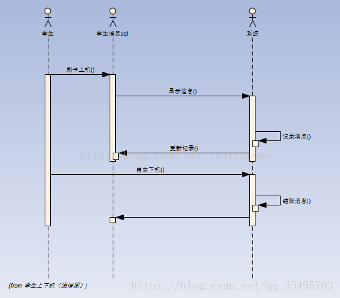

> 版权声明：本文为博主原创文章，未经博主允许不得转载。 https://blog.csdn.net/tsj11514oo/article/details/38179121

## 协作图（Collaboration Diagram/communication Diagram）/通信图

> 协作图(Collaboration Diagram /Communication Diagram，也叫合作图)是一种交互图（interaction diagram），强调的是发送和接收消息的对象之间的组织结构。一个协作图显示了一系列的对象和在这些对象之间的联系以及对象间发送和接收的消息。对象通常是命名或匿名的类的实例，也可以代表其他事物的实例，例如协作、组件和节点。使用协作图来说明系统的动态情况。

下面这张图介绍协作图的基本内容：

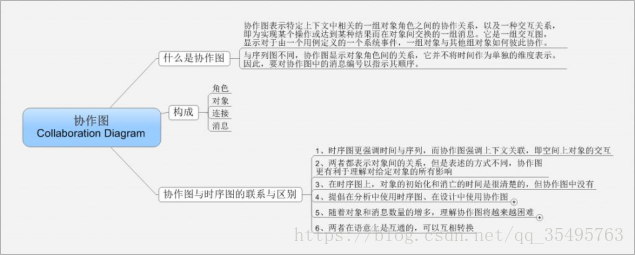  
下面一张图是一个协作图的实例，创建课程的协作图：

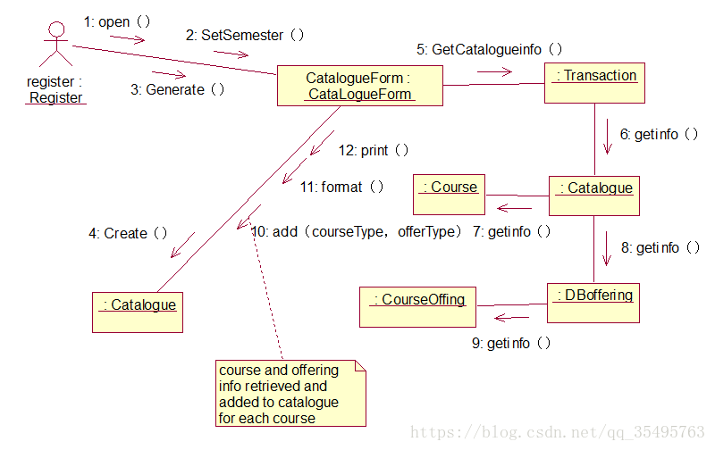

`由于协作图和时序图在语意上是相通的，所以可以互相转换`，下面是利用ROSE把上面的协作图转换成的时序图的实例，可以直接使用功能进行转换：

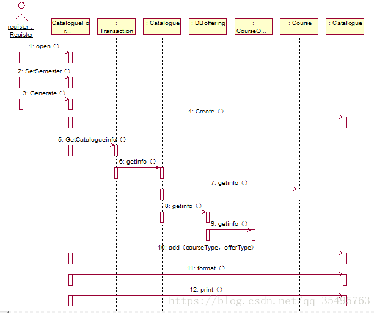

> `由于协作图和时序图在作用上可以替代`的，在使用中，一般有了时序图就没有必要使用协作图。

## 状态图

1.概述：  
状态图（Statechart Diagram）主要用于描述一个`特定的`**对象**`的所有可能状态以及由于各种事件的发生而引起的状态之间的转换`。  
2.构成要素：  
状态图由`状态`、`转移`和`事件`组成。联合使用状态和转移可以更好地建模它们，有时需要包含决策点和同步条来显示更高层次的细节信息。  
2.1状态（States）：  
在对象的生命周期中满足某些条件、执行某些活动或等待某些事件的一个条件或状况。所有的对象都有状态，状态是对象执行了一系列活动的结果，当某个事件发生后，对象的状态将发生变化。  
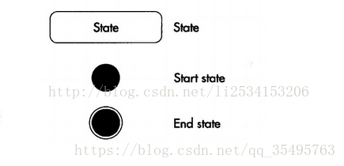  
状态图中可以包含0个多个开始状态，也可以包含多个结束状态。模型不必同时具有开始和结束状态，因为模型可以总是运行，从不停止。  
2.2转移（Transitions）：  
两个状态之间的一种关系，表示对象将在第一个状态中执行一定的动作并在某个特定事件发生或某个特定条件满足时进入第二个状态。  
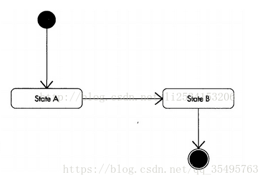  
2.3事件：  
使状态发生变化的某时刻发生的动作或活动，用来指示是什么触发了转移从而导致状态发生了改变。事件通常在从一个状态到另一个状态的转移路径上直接指定。  
2.4判断：  
判断点通过对事件判断分组转移到各自方向，提高了状态图的可视性。  
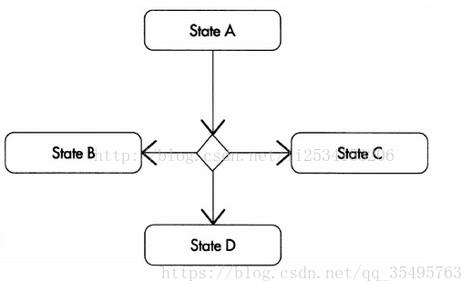  
2.4同步：  
使用同步和活动图一样是为了说明并发工作流的分叉与联合。  
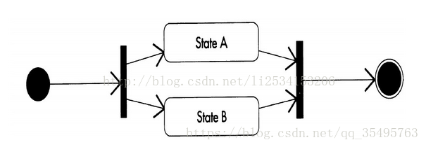  
3.机房实例（注册部分）：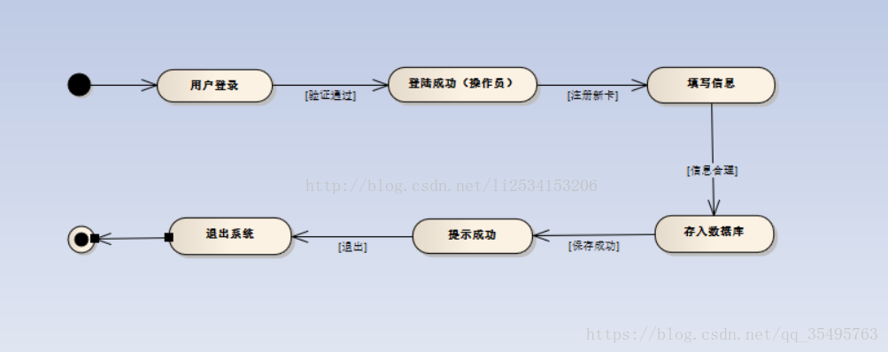总结：状态图重点在与描述对象的状态及其状态之间的转移，与活动图区别在于状态图注重的是行为的结果，活动图更注重是行为的动作。

## 活动图(Activity Diagram)

“活动图”可通过一系列操作将业务流程或软件进程以工作流的形式显示出来。这些操作可以由人、软件组件或计算机来执行。  
使用活动图可以描述多种类型的流程，如下：  
1、用户和您的系统之间的业务流程或工作流。  
2、某一用例中执行的步骤。  
3、软件协议，即允许在组件间进行的交互序列。  
4、软件算法。  
下面用一张图来介绍活动图的基本内容  
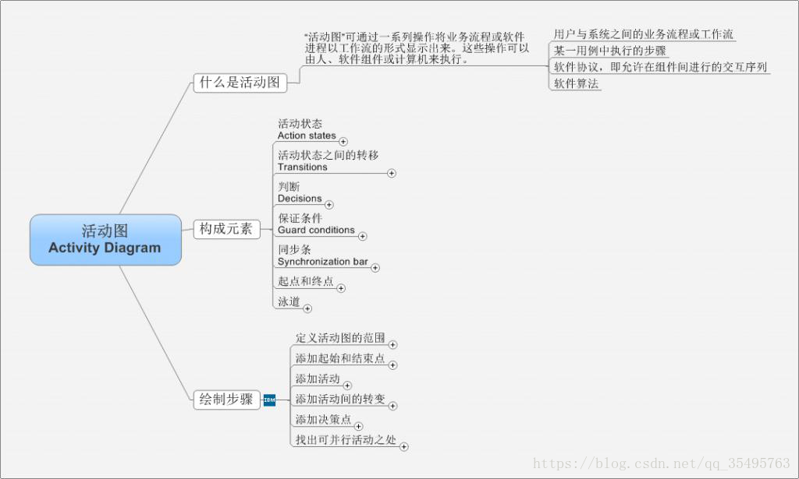  
下面是用rose 和 onenote结合画的一张活动图的实例，基本囊括了活动图的重要元素。  
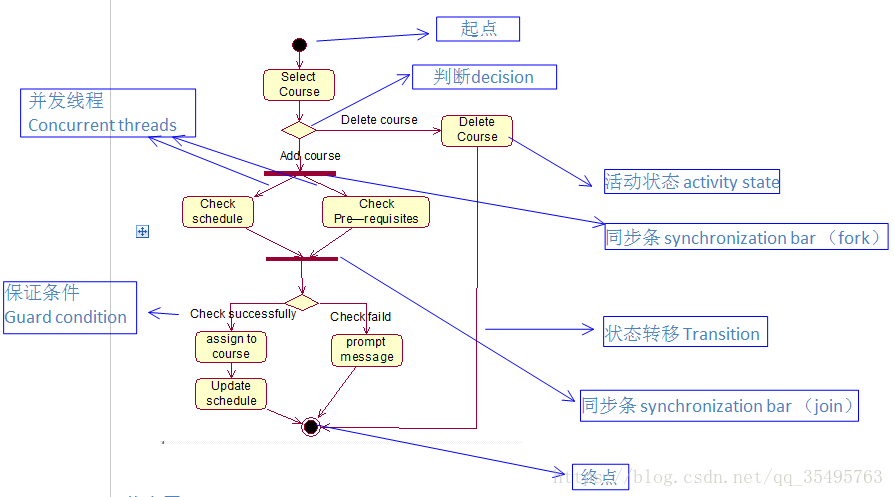

> 组件（构件图）和配置图（部署图）是面向对象系统的物理建模时使用的两种图。

- 组件图：描述软件组件以及组件之间的关系。  
    组件图元素：组件、接口、依赖关系  
    组件：是定义良好接口的物理实现单元，遵从同一组接口，提供实现物理的可替换的部分。  
    接口：一个类提供另一个类的一组操作。  
    依赖关系：一种使用关系（这里不做详解）
    
- 构件与结构之间关系：  
    构件与构件之间关系：`依赖`  
    构件与其对应接口之间关系：`实现`  
    导出接口：组件实现的接口，由提供操作的组件提供  
    导入接口：访问服务的组件使用导入接口
    

机房收费系统构件图：机房收费系统引用控件与报表生成器，导出EXcel，打印报表，通过代码与数据库连接实时更新数据。  
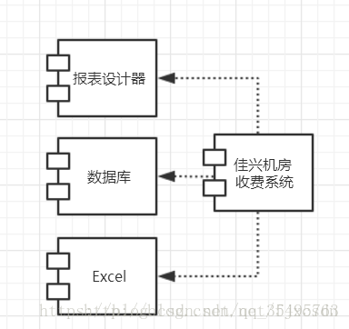

- 配置图：描述系统硬件的物理结构以及如何将软件部署在硬件上。用于对系统的实现视图建模，主要是为了描述系统各个物理组成部分的分布、提交、安装过程。  
    组成元素：`节点、关系`  
    机房收费系统部署图：  
    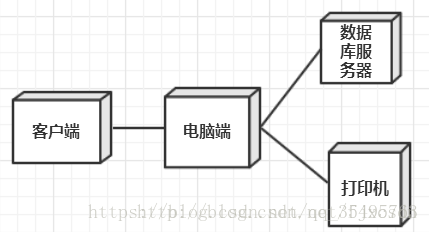

[github上的地址](https://neonmike.github.io/EasyBLog/UMLPage.html)  
补充：UML是不断修订的 在UML 中，主要是使用了9 张图，到了UML 2 中有新增了几张图；概览

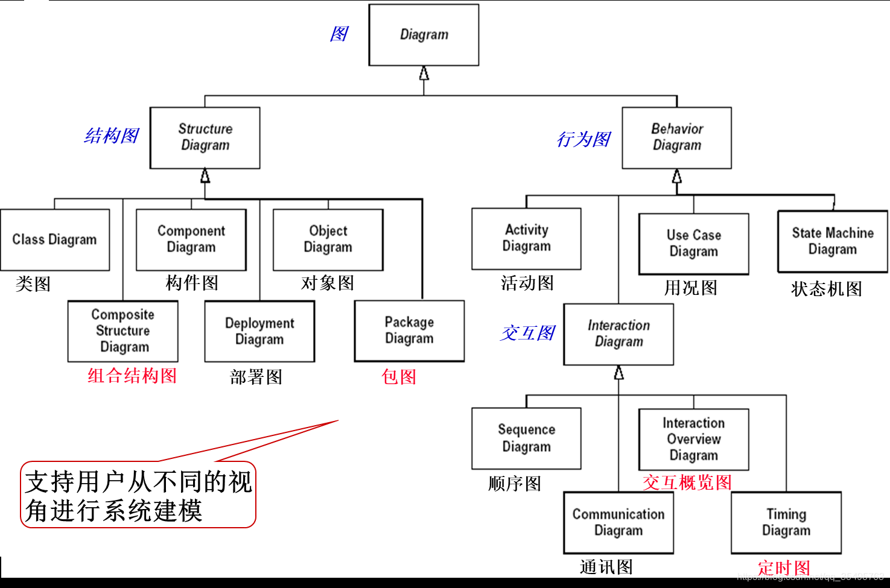  
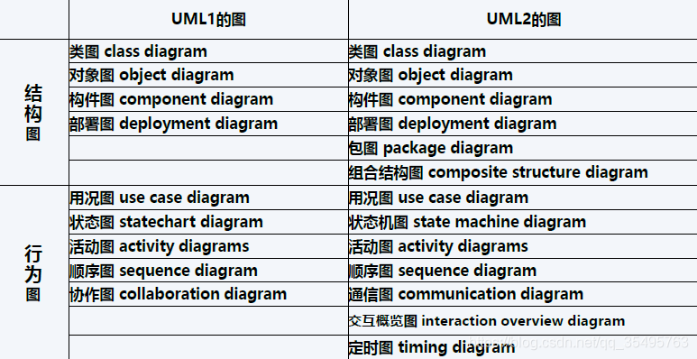

> 注意：`UML 1.0中协作图改为了UML 2 通信图`。