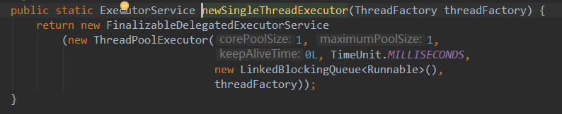

线程池使用

https://blog.csdn.net/teagreen_red/article/details/75314663
https://blog.csdn.net/u010687392/article/details/49850803

阿里对于线程池使用规范：
线程池不允许使用 Executors 去创建，而是通过 ThreadPoolExecutor 的方 式，这样的处理方式让写的同学更加明确线程池的运行规则，规避资源耗尽的风险。
说明:
Executors 返回的线程池对象的弊端如下:
1) FixedThreadPool 和 SingleThreadPool : 允 许 的 请 求 队 列 长 度 为Integer.MAX_VALUE，可能会堆积大量的请求，从而导致 OOM;
2)CachedThreadPool 和 ScheduledThreadPool : 允 许 的 创 建 线 程 数 量 为Integer.MAX_VALUE，可能会创建大量的线程，从而导致 OOM。
正例:
int NUMBER_OF_CORES = Runtime.getRuntime().availableProcessors(); 
int KEEP_ALIVE_TIME = 1;
TimeUnit KEEP_ALIVE_TIME_UNIT = TimeUnit.SECONDS; 
BlockingQueue<Runnable> taskQueue = new LinkedBlockingQueue<Runnable>(); 

ExecutorService executorService = new ThreadPoolExecutor(NUMBER_OF_CORES, NUMBER_OF_CORES*2, KEEP_ALIVE_TIME, KEEP_ALIVE_TIME_UNIT,
taskQueue, new BackgroundThreadFactory(), new DefaultRejectedExecutionHandler());

反例:
ExecutorService cachedThreadPool = Executors.newCachedThreadPool();


*** 线程数量的确认 ***


（1）核心线程数量：处理器数量，Runtime.getRuntime().availableProcessors()
（2）总线程数的计算：N为处理器数量，通过执行业务的单线程分析出本地计算时间为x（即为图中的1、3、5、7），等待时间为y（即为图中的2，4，5），则总的线程数设置为 N*(x+y)/x，能让CPU的利用率最大化。


一、ThreadPoolExecutor的使用
1、使用线程池的好处可以归纳为 3 点：
    （1）重用线程池中的线程， 避免因为线程的创建和销毁所带来的性能开销.
    （2）有效控制线程池中的最大并发数，避免大量线程之间因为相互抢占系统资源而导致的阻塞现象.
    （3）能够对线程进行简单的管理，可提供定时执行和按照指定时间间隔循环执行等功能.

2、ThreadPoolExecutor 是 Executors 类的底层实现。android 中线程池的概念来源于 java 中的 Executor, 线程池真正的实现类是 ThreadPoolExecutor，它间接实现了 Executor 接口。ThreadPoolExecutor 提供了一系列参数来配置线程池，通过不同的参数配置实现不同功能特性的线程池，android 中的 Executors 类提供了 4 个工厂方法用于创建 4 种不同特性的线程池给开发者用.

3、执行过程
先装满核心线程，再装满 workQueue，再装满非核心线程，都装满则拒绝任务。
详细过程：
用 currentSize 表示线程池中当前线程数量，将上述过程可以表示如下
（1） 当 currentSize < corePoolSize 时，直接启动一个核心线程并执行任务。
（2）当 currentSize>=corePoolSize、并且 workQueue 未满时，添加进来的任务会被安排到 workQueue 中等待执行。
（3）当 workQueue 已满，但是 currentSize < maximumPoolSize 时，会立即开启一个非核心线程来执行任务。
（4） 当 currentSize >= corePoolSize、workQueue 已满、并且 currentSize > maximumPoolSize 时，调用 handler 默认抛出 RejectExecutionExpection 异常。

4、ThreadPoolExcutor介绍
    public ThreadPoolExecutor(int corePoolSize,
                          int maximumPoolSize,
                          long keepAliveTime,
                          TimeUnit unit,
                          BlockingQueue<Runnable> workQueue,
                          ThreadFactory threadFactory,
                          RejectedExecutionHandler handler) {
        this.corePoolSize = corePoolSize;
        this.maximumPoolSize = maximumPoolSize;
        this.workQueue = workQueue;
        this.keepAliveTime = unit.toNanos(keepAliveTime);
        this.threadFactory = threadFactory;
        this.handler = handler;
    }
    
（1）corePoolSize: 线程池的核心线程数，默认情况下， 核心线程会在线程池中一直存活， 即使处于闲置状态. 但如果将allowCoreThreadTimeOut设置为true的话, 那么核心线程也会有超时机制， 在keepAliveTime设置的时间过后， 核心线程也会被终止.
（2）maximumPoolSize: 最大的线程数， 包括核心线程， 也包括非核心线程， 在线程数达到这个值后，新来的任务将会被阻塞.
（3）keepAliveTime: 超时的时间， 闲置的非核心线程超过这个时长，将会被销毁回收， 当allowCoreThreadTimeOut为true时，这个值也作用于核心线程.
（4）unit：超时时间的时间单位.
（5）workQueue：线程池的任务队列， 通过execute方法提交的runnable对象会存储在这个队列中.
（6）threadFactory: 线程工厂, 为线程池提供创建新线程的功能.
（7）handler: 任务无法执行时，回调handler的rejectedExecution方法来通知调用者.

5、队列
在上述执行过程中有个关键的承载工具 workQueue，任务队列 queue 的种类有三种：
（1）直接提交。工作队列的默认选项是 SynchronousQueue，它将任务直接提交给线程而不保持它们。在此，如果不存在可用于立即运行任务的线程，则试图把任务加入队列将失败，因此会构造一个新的线程。此策略可以避免在处理可能具有内部依赖性的请求集时出现锁。直接提交通常要求无界 maximumPoolSizes 以避免拒绝新提交的任务。当命令以超过队列所能处理的平均数连续到达时，此策略允许无界线程具有增长的可能性。
（2）无界队列。使用无界队列（例如，不具有预定义容量的 LinkedBlockingQueue）将导致在所有 corePoolSize 线程都忙时新任务在队列中等待。这样，创建的线程就不会超过 corePoolSize。（因此，maximumPoolSize 的值也就无效了。）当每个任务完全独立于其他任务，即任务执行互不影响时，适合于使用无界队列；例如，在 Web 页服务器中。这种排队可用于处理瞬态突发请求，当命令以超过队列所能处理的平均数连续到达时，此策略允许无界线程具有增长的可能性。
（3）有界队列。当使用有限的 maximumPoolSizes 时，有界队列（如 ArrayBlockingQueue）有助于防止资源耗尽，但是可能较难调整和控制。队列大小和最大池大小可能需要相互折衷：使用大型队列和小型池可以最大限度地降低 CPU 使用率、操作系统资源和上下文切换开销，但是可能导致人工降低吞吐量。如果任务频繁阻塞（例如，如果它们是 I/O 边界），则系统可能为超过您许可的更多线程安排时间。使用小型队列通常要求较大的池大小，CPU 使用率较高，但是可能遇到不可接受的调度开销，这样也会降低吞吐量。

二、Executors工厂类的使用
Executors类，提供了一系列工厂方法用于创先线程池，返回的线程池都实现了ExecutorService接口。
1. newFixedThreadPool
创建一个定长线程池，可控制线程最大并发数，超出的线程会在队列中等待。
(1)用法
public static ExecutorService newFixedThreadPool(int nThreads);
public static ExecutorService newFixedThreadPool(int nThreads, ThreadFactory threadFactory)


（2）特点：只有核心线程数，并且没有超时机制，因此核心线程即使闲置时，也不会被回收，因此能更快的响应外界的请求.


2. newSingleThreadExecutor
创建一个单线程化的线程池，它只会用唯一的工作线程来执行任务，保证所有任务按照指定顺序(FIFO, LIFO, 优先级)执行。
（1）用法
public static ExecutorService newSingleThreadExecutor();
public static ExecutorService newSingleThreadExecutor(ThreadFactory threadFactory);


（2）特点：
只有一个核心线程，并没有超时机制。意义在于统一所有的外界任务到一个线程中， 这使得在这些任务之间不需要处理线程同步的问题.

3. newCachedThreadPool
池里的线程数量并不是固定的，理论上可以无限大，任务不需要排队，如果有空闲的线程，则复用，无则新建线程。
（1）用法
public static ExecutorService newCachedThreadPool();
public static ExecutorService newCachedThreadPool(ThreadFactory threadFactory);


（2）特点：
没有核心线程，非核心线程数量没有限制， 超时为60秒。适用于执行大量耗时较少的任务，当线程闲置超过60秒时就会被系统回收掉，当所有线程都被系统回收后，它几乎不占用任何系统资源.


4. newScheduledThreadPool
创建一个定长线程池，支持定时及周期性任务执行。
（1）用法：
public static ScheduledExecutorService newScheduledThreadPool(int corePoolSize);
public static ScheduledExecutorService newScheduledThreadPool(int corePoolSize, ThreadFactory threadFactory);


这里的super，就是ThreadPoolExecutor。DEFAULT_KEEPALIVE_MILLIS = 10L；这个参数说是用不到，

（2）特点：
核心线程数是固定的，非核心线程数量没有限制，超时限制是10ms。主要用于执行定时任务和具有固定周期的重复任务.


5. newSingleThreadScheduledExecutor
创建一个单一线程的线程池，定期执行一定任务
（1）用法
public static ScheduledExecutorService newSingleThreadScheduledExecutor();
public static ScheduledExecutorService newSingleThreadScheduledExecutor(ThreadFactory threadFactory);


这里的super，就是ThreadPoolExecutor

（2）特点
集合了SingleThreadExecutor和SchedulerThreadExecutor两者的特点

三、提交线程使用
1、接收的参数不一样
2、submit有返回值，而execute没有
Method submit extends base method Executor.execute by creating and returning a Future that can be used to cancel execution and/or wait for completion. 
用到返回值的例子，比如说我有很多个做validation的task，我希望所有的task执行完，然后每个task告诉我它的执行结果，是成功还是失败，如果是失败，原因是什么。然后我就可以把所有失败的原因综合起来发给调用者。
个人觉得cancel execution这个用处不大，很少有需要去取消执行的。
而最大的用处应该是第二点。
3、submit方便Exception处理
There is a difference when looking at exception handling. If your tasks throws an exception and if it was submitted with execute this exception will go to the uncaught exception handler (when you don't have provided one explicitly, the default one will just print the stack trace to System.err). If you submitted the task with submit any thrown exception, checked or not, is then part of the task's return status. For a task that was submitted with submit and that terminates with an exception, the Future.get will rethrow this exception, wrapped in an ExecutionException.
意思就是如果你在你的task里会抛出checked或者unchecked exception，而你又希望外面的调用者能够感知这些exception并做出及时的处理，那么就需要用到submit，通过捕获Future.get抛出的异常。
可以查看下面的代码：
public class ExecutorServiceTest {
    public static void main(String[] args) {
        ExecutorService executorService = Executors.newCachedThreadPool();
        List<Future<String>> resultList = new ArrayList<Future<String>>();
        // 创建10个任务并执行
        for (int i = 0; i < 10; i++) {
            // 使用ExecutorService执行Callable类型的任务，并将结果保存在future变量中
            Future<String> future = executorService.submit(new TaskWithResult(i));
            // 将任务执行结果存储到List中
            resultList.add(future);
        }
        executorService.shutdown();
        // 遍历任务的结果
        for (Future<String> fs : resultList) {
            try {
                System.out.println(fs.get()); // 打印各个线程（任务）执行的结果
            } catch (InterruptedException e) {
                e.printStackTrace();
            } catch (ExecutionException e) {
                executorService.shutdownNow();
                e.printStackTrace();
                return;
            }
        }
    }
}
class TaskWithResult implements Callable<String> {
    private int id;
    public TaskWithResult(int id) {
        this.id = id;
    }
    /**
     * 任务的具体过程，一旦任务传给ExecutorService的submit方法，则该方法自动在一个线程上执行。
     *
     * @return
     * @throws Exception
     */
    public String call() throws Exception {
        System.out.println("call()方法被自动调用,干活！！！             " + Thread.currentThread().getName());
        if (new Random().nextBoolean())
            throw new TaskException("Meet error in task." + Thread.currentThread().getName());
        // 一个模拟耗时的操作
        for (int i = 999999999; i > 0; i--)
            ;
        return "call()方法被自动调用，任务的结果是：" + id + "    " + Thread.currentThread().getName();
    }
}
class TaskException extends Exception {
    public TaskException(String message) {
        super(message);
    }
}

执行结果：
call()方法被自动调用,干活！！！             pool-1-thread-1
call()方法被自动调用,干活！！！             pool-1-thread-2
call()方法被自动调用,干活！！！             pool-1-thread-3
call()方法被自动调用,干活！！！             pool-1-thread-5
call()方法被自动调用,干活！！！             pool-1-thread-7
call()方法被自动调用,干活！！！             pool-1-thread-4
call()方法被自动调用,干活！！！             pool-1-thread-6
call()方法被自动调用,干活！！！             pool-1-thread-7
call()方法被自动调用,干活！！！             pool-1-thread-5
call()方法被自动调用,干活！！！             pool-1-thread-8
call()方法被自动调用，任务的结果是：0    pool-1-thread-1
call()方法被自动调用，任务的结果是：1    pool-1-thread-2
java.util.concurrent.ExecutionException: com.cicc.pts.TaskException: Meet error in task.pool-1-thread-3
    at java.util.concurrent.FutureTask$Sync.innerGet(FutureTask.java:222)
    at java.util.concurrent.FutureTask.get(FutureTask.java:83)
    at com.cicc.pts.ExecutorServiceTest.main(ExecutorServiceTest.java:29)
Caused by: com.cicc.pts.TaskException: Meet error in task.pool-1-thread-3
    at com.cicc.pts.TaskWithResult.call(ExecutorServiceTest.java:57)
    at com.cicc.pts.TaskWithResult.call(ExecutorServiceTest.java:1)
    at java.util.concurrent.FutureTask$Sync.innerRun(FutureTask.java:303)
    at java.util.concurrent.FutureTask.run(FutureTask.java:138)
    at java.util.concurrent.ThreadPoolExecutor$Worker.runTask(ThreadPoolExecutor.java:886)
    at java.util.concurrent.ThreadPoolExecutor$Worker.run(ThreadPoolExecutor.java:908)
    at java.lang.Thread.run(Thread.java:619)

四、合理的分配线程池大小

一般需要根据任务的类型来配置线程池大小：
　　（1）如果是CPU密集型任务，就需要尽量压榨CPU，参考值可以设为 NCPU+1
　　（2）如果是IO密集型任务，参考值可以设置为2*NCPU
　　当然，这只是一个参考值，具体的设置还需要根据实际情况进行调整，比如可以先将线程池大小设置为参考值，再观察任务运行情况和系统负载、资源利用率来进行适当调整。


五、AsyncTask的使用
AsyncTask 是对 Handler 与线程池的封装。使用它的方便之处在于能够更新用户界面，当然这里更新用户界面的操作还是在主线程中完成的，但是由于 AsyncTask 内部包含一个 Handler，所以可以发送消息给主线程让它更新 UI。另外，AsyncTask 内还包含了一个线程池。使用线程池的主要原因是避免不必要的创建及销毁线程的开销。
方便处理一个线程，并把结果返回到UI线程。主要用于一些短时间操作，长时间操作还是推荐使用线程池一类的。
一个离线任务包括三个通用类：Params，Process，Result，和四个步骤，onPreExecute, doInBackground, onProcessUpdate, onPostExcute。

1、AsyncTask介绍：
AsyncTask 是一个抽象类，我们在使用时需要定义一个它的派生类并重写相关方法。AsyncTask 类的声明如下：
public abstract class AsyncTask<Params, Progress, Result>

我们可以看到，AsyncTask 是一个泛型类，它的三个类型参数的含义如下：
Params：doInBackground 方法的参数类型；
Progress：AsyncTask 所执行的后台任务的进度类型；
Result：后台任务的返回结果类型。


2、主要方法：
onPreExecute(): 在UI线程被调用，这个步骤通常被用来设置任务，在用户接口显示进度条
doInBackground(Params...): 在onPreExecute执行后，立即执行。是另外一个线程，非UI线程。这一步用来执行需要很长时间的计算操作。异步任务的参数也是在这里传入。计算的结果必须返回，并会把他传入下一步。这一步也会通过publishProgress(Progress...)发布一个或多个进程。这些值将会通过onProgressUpdate（Progress...）发布到UI线程。
onProgressUpdate(Progress...)： 在publishProgress(progress...)被调用后，这个方法在UI线程被调用。他执行的时间是不被限制的。只要publishProcess被调用了，这个方法就会执行。哪怕是上一个计算操作仍然在执行。比如可以用来展示进度条的动画。或者在textview中显示日志信息。
onPostExecute(Result): 在计算操作做完之后会在UI线程中调用。计算结果会通过这个方法传过来。
onCancelled()：此方法会在后台任务被取消时被调用，UI线程调用

3、取消任务:
一个人任务可以随时被取消通过调用Cancel(boolean)。调用这个方法后，isCancelled()就会返回true。在调用了这个方法后，doInBackground()方法执行完成后（不会立即停止），不会调用onPostExecute(Result)，执行过程中即使调用了publishProcess，也不会调用onProgressUpdate，会调用onCancelled(Object)方法。为了确保尽可能快的取消，应该在doInBackground方法中，不断的检查isCancelled()。可以放到一个循环里面。

5、线程规则
在 Android 4.1 版本之前，AsyncTask 类必须在主线程中加载，这意味着对 AsyncTask 类的第一次访问必须发生在主线程中；在 Android 4.1 以及以上版本则不存在这一限制，因为 ActivityThread（代表了主线程）的 main 方法中会自动加载 AsyncTask
AsyncTask 对象必须在主线程中创建
excute(Params...)必须在UI线程调用
不用手动调用这些方法： onPreExecute(), onPostExecute(Result), doInBackground(Params...)
一个 AsyncTask 对象只能调用一次 execute 方法，否则报如下异常：
        正在执行：
        java.lang.IllegalStateException: Cannot execute task: the task is already running. 
        执行完成
        java.lang.IllegalStateException: Cannot execute task: the task has already been executed (a task can be executed only once)
excute(Runnable) 可以多次执行。
excute(params) 只能执行一次

6. 源码解析
1. AsyncTask初始化
```java
    public AsyncTask() {
        this((Looper) null);
    }
```
```java
	public AsyncTask(@Nullable Handler handler) {
        this(handler != null ? handler.getLooper() : null);
    }
```
```java
	public AsyncTask(@Nullable Looper callbackLooper) {	
			//线程运行结束后，通过此Handler发消息。
			mHandler = callbackLooper == null || callbackLooper == Looper.getMainLooper()
				? getMainHandler()
				: new Handler(callbackLooper);
			//对整体流程控制
			mWorker = new WorkerRunnable<Params, Result>() {
				public Result call() throws Exception {
					//设置开始用，在postResultIfNotInvoked有用到，
					mTaskInvoked.set(true);
					Result result = null;
					try {
						//设置线程优先级，后台线程，比正常线程低一些。
						Process.setThreadPriority(Process.THREAD_PRIORITY_BACKGROUND);
						//noinspection unchecked
						//执行doInBackground
						result = doInBackground(mParams);
						Binder.flushPendingCommands();
					} catch (Throwable tr) {
						//执行错误，类似Cancel，在publish 和finish时有用到，查看
						mCancelled.set(true);
						throw tr;
					} finally {
//最后发布结果，用上面的Handler发消息。查看
						postResult(result);
					}
					return result;
				}
			};

			mFuture = new FutureTask<Result>(mWorker) {
				@Override
				protected void done() {
					try {
						postResultIfNotInvoked(get());
					} catch (InterruptedException e) {
						android.util.Log.w(LOG_TAG, e);
					} catch (ExecutionException e) {
						throw new RuntimeException("An error occurred while executing doInBackground()",
								e.getCause());
					} catch (CancellationException e) {
						postResultIfNotInvoked(null);
					}
				}
			};
		}
	```
2. excute(param)
会执行到executeOnExecutor方法
```
public final AsyncTask<Params, Progress, Result> executeOnExecutor(Executor exec,
            Params... params) {
		
<!--         /**
         * Indicates that the task has not been executed yet.
         */
        PENDING,
        /**
         * Indicates that the task is running.
         */
        RUNNING,
        /**
         * Indicates that {@link AsyncTask#onPostExecute} has finished.
         */
        FINISHED, -->
		//判断当前task的状态，如上。由此看出通过提交参数的方式只能运行一次
        if (mStatus != Status.PENDING) {
            switch (mStatus) {
                case RUNNING:
                    throw new IllegalStateException("Cannot execute task:"
                            + " the task is already running.");
                case FINISHED:
                    throw new IllegalStateException("Cannot execute task:"
                            + " the task has already been executed "
                            + "(a task can be executed only once)");
            }
        }

        mStatus = Status.RUNNING;

        onPreExecute();

        mWorker.mParams = params;
        exec.execute(mFuture);

        return this;
    }
```


4、使用：


