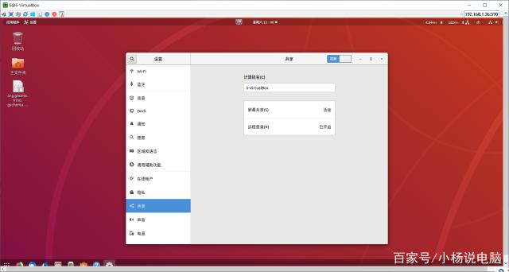
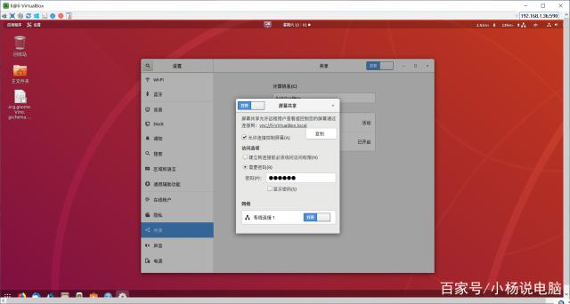
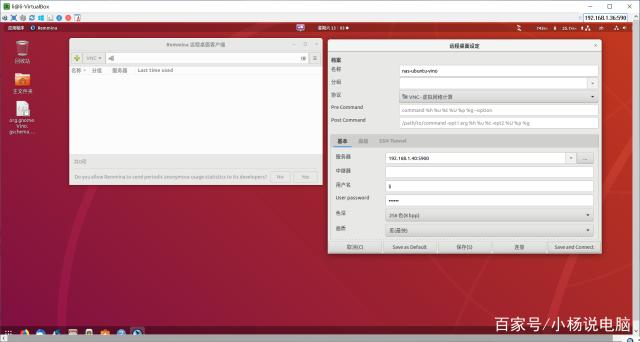
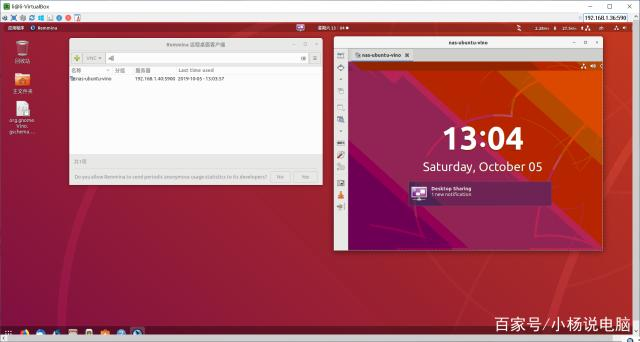

Ubuntu 18.04 上配置VNC服务器之Vino篇

Ubuntu desktop 18.04自带了的GNOME桌面系统，这个Ubuntu默认的桌面是有桌面共享功能的，使用的就是Vino软件。Vino是GNOME桌面环境的默认组件，是VNC（虚拟网络计算）服务器，允许远程主机连接到Ubuntu 18.04的实际桌面。但是，最小化安装的Ubuntu不带Vino，是没有共享功能的。

一、安装Vino软件

sudo apt-get update

sudo apt-get install vino

二、配置屏幕共享

打开 设置-->共享（Setting-->Sharing），安装完vino后会出现屏幕共享（Screen Sharing）选项，打开共享（Sharing）和屏幕共享（Screen Sharing），设置访问密码之后即可。

屏幕共享设置

首先启用屏幕共享

运行以下命令，编辑org.gnome.Vino.gschema.xml

sudo nano /usr/share/glib-2.0/schemas/org.gnome.Vino.gschema.xml

添加如下内容

&lt;key name='enabled' type='b'&gt;&lt;summary&gt;Enable remote access to the desktop&lt;/summary&gt; &lt;description&gt; If true, allows remote access to the desktop via the RFB protocol. Users on remote machines may then connect to the desktop using a VNC viewer. &lt;/description&gt; &lt;default&gt;true&lt;/default&gt;&lt;/key&gt;

重新编译

sudo glib-compile-schemas /usr/share/glib-2.0/schemas

启动Vino服务器

/usr/lib/vino/vino-server

若是ssh下进入系统启动vino，则添加 --display=:0 参数，如下

/usr/lib/vino/vino-server --display=:0

修改Vino的设置

gsettings set org.gnome.Vino enabled true

gsettings set org.gnome.Vino require-encryption false

gsettings set org.gnome.Vino prompt-enabled false

gsettings set org.gnome.Vino view-only false

gsettings set org.gnome.Vino authentication-methods "\['vnc'\]"

gsettings set org.gnome.Vino vnc-password $(echo -n "mypassword"|base64)

查看Vino的设置

gsettings list-recursively org.gnome.Vino

gsettings list-recursively org.gnome.Vino | grep encrypt

org.gnome.Vino notify-on-connect trueorg.gnome.Vino alternative-port uint16 5900org.gnome.Vino disable-background falseorg.gnome.Vino use-alternative-port falseorg.gnome.Vino icon-visibility 'client'org.gnome.Vino use-upnp falseorg.gnome.Vino view-only falseorg.gnome.Vino enabled trueorg.gnome.Vino prompt-enabled falseorg.gnome.Vino disable-xdamage falseorg.gnome.Vino authentication-methods \['vnc'\]org.gnome.Vino network-interface ''org.gnome.Vino require-encryption falseorg.gnome.Vino mailto ''org.gnome.Vino lock-screen-on-disconnect falseorg.gnome.Vino vnc-password 'MTIzNDU2'

三、配置VNC客户端

使用VNC Viewer连接即可，VNC Viewer推荐使用Remmina远程桌面客户端。Remmina 及其插件包已经在所有主流的 Linux 发行版的大多数官方仓库中提供。在 Debian/Ubuntu 中可以运行下面的命令来安装Remmina和所有支持的插件。

sudo apt-get install remmina remmina-plugin-*

Remmina远程桌面设定

Remmina远程桌面

写的文字冗长，谢谢大家耐心看到这里！