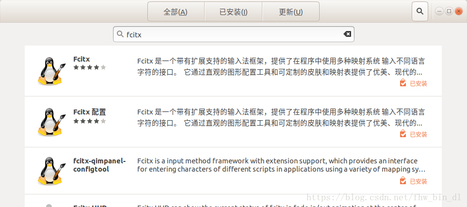
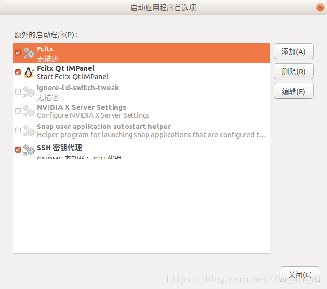
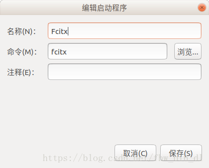
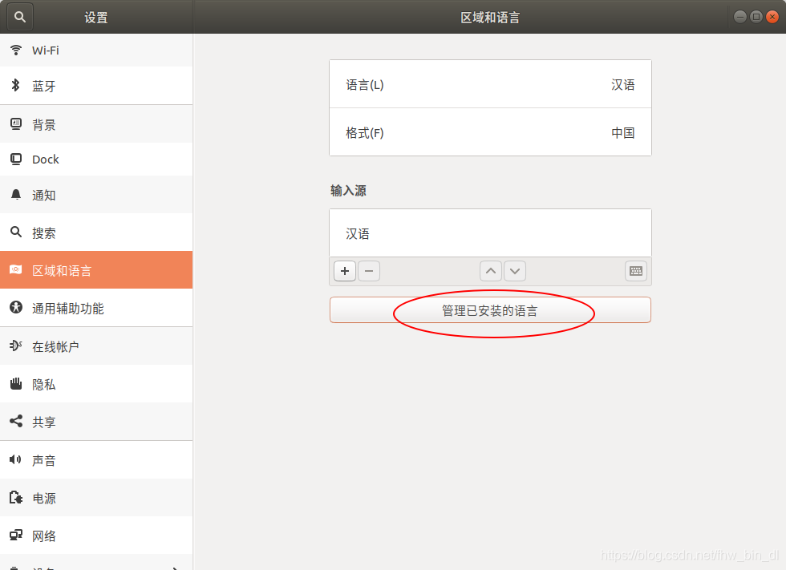
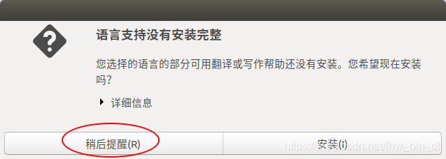
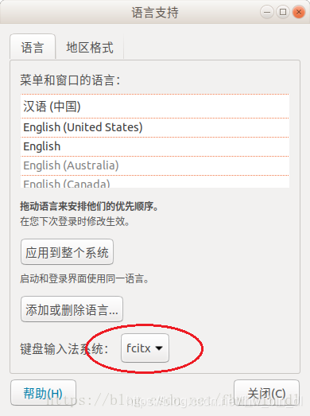

Ubuntu 18.04安装fcitx输入法

1、卸载IBUS

sudo apt-get  purge  ibus

2、打开 ubuntu 软件中心，搜索 fcitx，把3个带企鹅图标的软件都安装上；

3、根据你的需要安装输入法码表，我用的是五笔拼音，sudo apt-get install fcitx-table-wbpy；

其它输入法的名称如下  
//拼音：fcitx-pinyin、fcitx-sunpinyin、fcitx-googlepinyin、fcitx-sogoupinyin  
//五笔：fcitx-table、fcitx-table-wubi、fcitx-table-wbpy（五笔拼音混合）

4、sudo apt remove fcitx-ui-classic，防止出现两个输入法图标；  

5、在 /usr/share/applications 路径中找到并执行 Startup Applications，把fcitx设为自启动，防止Ubuntu注销后输入法消失；

6、选择fcitx为系统输入法，在 /usr/share/applications 路径中找到并执行 “Region & Language”，在出现的对话框中点击“管理已安装的语言”，

可能会弹出下面的对话框，选择 “稍后提醒“

  
7、最后一步，注销或者重启Ubuntu；

8. 皮肤文件夹
/usr/share/fcitx/skin/
~/.config/fcitx/skin/
/home/sun/.config/fcitx-qimpanel/skin

9. `sudo apt-get install fcitx-ui-qimpanel`
方便管理和使用fcitx;

10. 配置fcitx
点击图标，configure-fcitx，Global config

