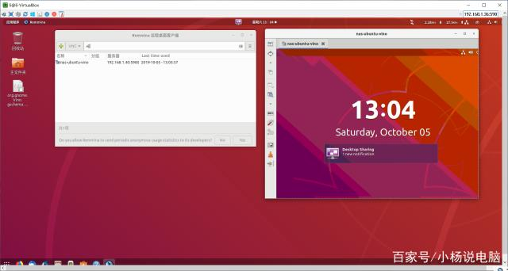

Ubuntu18.04 自带桌面共享配置

本人PC上安装的Ubuntu为18.04.3，具体桌面共享配置步骤如下。

# Step1： 安装dconf-editor

```
sudo apt install dconf-editor

```

# Step2： dconf-editor配置

```
dconf write /org/gnome/desktop/remote-access/require-encryption false

```

# Step3： 重启屏幕共享： 
**如果没有下面的选项，请走下面的 #step4**

settings-> Sharing->Screen Sharing，设置：  

  

# Step4： 配置dconf-editor

```
dconf write /org/gnome/desktop/remote-access/prompt-enabled false
```

# Step5： 配置 org.gnome.Vino.gschema.xml

```
sudo vi /usr/share/glib-2.0/schemas/org.gnome.Vino.gschema.xml

```

在第二行后，增加如下内容

```
<key name='enabled' type='b'>
  <summary>Enable remote access to the desktop</summary>
  <d[Linux 使用技巧](../../OS/Linux/Linux%20使用技巧.md)escription>
    If true, allows remote access to the desktop via the RFB
    protocol. Users on remote machines may then connect to the
    desktop using a VNC viewer.
  </description>
  <default>false</default>
</key>

`[Ubuntu 18.04安装fcitx输入法](../../OS/Linux/Ubuntu%2018.04安装fcitx输入法.md)``
```
# Step6： 重新编译

```
sudo glib-compile-schemas /usr/share/glib-2.0/schemas

```

# Step7 重启屏幕共享： 

settings-> Sharing->Screen Sharing，设置：  

  


# Step8 启动服务

方法1：在Ubuntu桌面系统中开启服务，具体vino使用查看 [Ubuntu 18.04 上配置VNC服务器之Vino篇](../../OS/Linux/Ubuntu%2018.04%20上配置VNC服务器之Vino篇.md)

```
/usr/lib/vino/vino-server

```

方法2：ssh下进入系统开启远程控制

```
/usr/lib/vino/vino-server --display=:0

```

# Step9：VNC连接 或者Windows远程桌面连接：

1. Windows远程桌面


2. 用TightVNC Viewer远程访问桌面：

	- Windows：
	

	

	
	- Ubuntu
	安装：`sudo apt-get install remmina remmina-plugin-*`
	启动：`remmina`
	
	
	


# Step10 VINO自启
1. `sudo gnome-session-properties`
2. 填入启动命令：
	`/usr/lib/vino/vino-server`
	 
