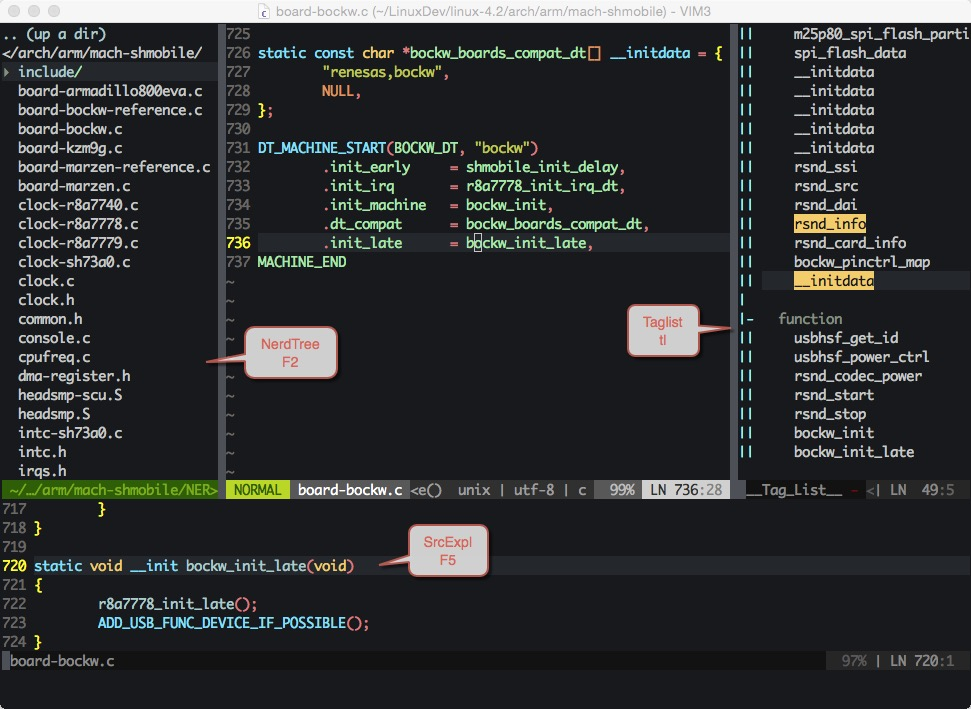

tonyho/VIM

I found this vim package in [Here](http://www.oschina.net/code/snippet_574132_13357 "OSChina") and I modify some of the configurations and Add two registry file to add two entry (`open in gvim tab` and `Open with gvim`) in Windows right click context menu.

* * *

1.  After clone the this repo, move this repo directory to where you want to place.
2.  Add the path to system environment variable\[path\], if you want to using the ctags and cscope.
3.  Modify the path string where store the gvim.exe in registry file `EditWithVim-tab.reg` and `EditWithVim.reg`. The default is `D:\\software\\gVimPortable\\vim73\\gvim.exe\`
4.  Double click the registry files to merge them to system. As the registry file name imply, each of them will add a enty in right click context menu.

1.  Clone this repo. eg:

`mkdir ~/github`

`cd ~/github`

`git clone https://github.com/tonyho/VIM.git`

2.  Install the vim(or gvim) using the proper commands, for example in Ubuntu:

`sudo apt-get install vim`

3.  Install the cscope, ctags and taglist plugin. eg:

`sudo apt-get install ctags cscope`

4.Symbol link the .vimrc and .gvimrc. Or make a soft link to it:

`cd ~ && ln -s ~/github/VIM/_vimrc ~/.vimrc`

`cd ~ && ln -s ~/github/VIM/_gvimrc ~/.gvimrc`

5.  Move the vimfiles directory to you home directory, and rename it to .vim,or make a soft link to it:

`ln -s ~/github/VIM/vimfiles/ .vim`

then clone the vundle:

`git clone https://github.com/VundleVim/Vundle.vim.git ~/.vim/bundle/vundle`

These is no much different between cygwin and linux to use vim.

Clone this repo. eg:

```
mkdir ~/github
cd ~/github
git clone https://github.com/tonyho/VIM.git

```

Install the macvim, for someone using the homebrew, use below commands:

```
brew install macvim

```

Install the cscope, ctags:

```
brew install ctags
brew install cscope

```

Move the _vimrc file to you home directory, and rename it to .vimrc. Or make ln to it `cd ~ && ln -s ~/github/VIM/_vimrc .vimrc`

Move the vimfiles directory to you home directory, and rename it to .vim,or ln it `ln -s ~/github/VIM/vimfiles/ .vim` ;then clone the vundle:

Add the macvim's executive files' path to environment variable PATH by appending the below line to the end of file ~/.bash_profile file: export PATH=$PATH:/usr/local/opt/macvim/bin/

## <a id="user-content-plugins"></a>[](#plugins)Plugins

Since we use the vundle to manage the plugins, we should install the plugins. Open a terminal, then open the vim: `vim` In Vim, we just call the PluginInstall to let the vundle install all the needed plugins: `:PluginInstall` After do this, the vundle will auto install the plugins.

If error occurs, use the `l` to see the logs, or save it the a file. Usually, there're 2 kinds of error:

1.  Git repo not existed anymore: for this situation, we need to search in github to a new repo, see the _vimrc content for reference.
2.  Plugin directory already existed in vimfiles/vundle, so just delete it.

## <a id="user-content-install-fonts"></a>[](#install-fonts)Install Fonts

Install fonts placed in user_fonts directory, or install all the powerline fonts:

# clone
git clone https://github.com/powerline/fonts.git --depth=1
# install
cd fonts
./install.sh

About the vundle, you can refer this artcle: [How To Use Vundle to Manage Vim Plugins on a Linux VPS](https://www.digitalocean.com/community/tutorials/how-to-use-vundle-to-manage-vim-plugins-on-a-linux-vps)

## <a id="user-content-install-youcompeleteme"></a>[](#install-youcompeleteme)Install YouCompeleteMe

If you have golang installled use following: `~/.vim/bundle/YouCompleteMe/install.py --go-completer`

Otherwise, install it without golang support: `~/.vim/bundle/YouCompleteMe/install.py`

## <a id="user-content-srcexpl"></a>[](#srcexpl)SrcExpl:

1.  F5--> Open the source explorer window
2.  F3--> Previous Definition
3.  F4--> Next Definition
4.  F6--> Goto definition
5.  SPACE --> Back from the Definition

## <a id="user-content-taglist-and-tagbar"></a>[](#taglist-and-tagbar)TagList and Tagbar

1.  tl--> taglist, list the tag generated by ctags
2.  tb--> tagbar, like the taglist

## <a id="user-content-nerdtree"></a>[](#nerdtree)NerdTree

1.  F2--> Nerd Tree sidebar

## <a id="user-content-switch-buffers"></a>[](#switch-buffers)Switch buffers

### <a id="user-content-in-gvim"></a>[](#in-gvim)In Gvim

1.  Ctrl+Tab--> Switch to next buffer
2.  Ctrl+Shift+Tab--> Switch back to previous buffer

### <a id="user-content-in-vim"></a>[](#in-vim)In vim

1.  :bnext--> Switch to next buffer
2.  :bprev--> Switch back to previous buffer

## <a id="user-content-python-indent"></a>[](#python-indent)Python indent

1.  =--\> indent the selected(visual mode) python code

## <a id="user-content-ctrlp"></a>[](#ctrlp)CtrlP

1.  Ctrl + p--> Ctrlp plugin for search

## <a id="user-content-others"></a>[](#others)Others

1.  cM--> Remove the ^M string at the end of line
2.  cS--> Remove the space string at the end of line
3.  :ToggleWhitespace: Display or hide the highlight for the training space
4.  :StripWhitespace--> Remove the space string at the end of line

## <a id="user-content-tabular"></a>[](#tabular)tabular

See the [tabular plugin vimcast](http://vimcasts.org/episodes/aligning-text-with-tabular-vim/)

## <a id="user-content-screenshot"></a>[](#screenshot)ScreenShot

A MacVim screenshot:

## 
[查看原图](https://raw.githubusercontent.com/tonyho/VIM/master/docs/MacVimScreenCast.jpg?raw=true)

* * *

## <a id="user-content-reference"></a>[](#reference)Reference

Ref config [Reference config](https://github.com/ashfinal/vimrc-config)

PowerLine fonts PowerLine Fonts

Markdown CheatSheet [Markdown cheatsheet](https://github.com/adam-p/markdown-here/wiki/Markdown-Cheatsheet)

## <a id="user-content-changelog"></a>[](#changelog)ChangeLog

### <a id="user-content-2017-12-28"></a>[](#2017-12-28)2017-12-28

1.  Change the PowerLine to airline with buffer file list at status bar
2.  Add Gvim rc
3.  Change fonts to RobotoMono
4.  Replace Syntastic with YouCompelteMe
5.  Add python relatives
6.  Using PaperColor color theme for Gvim/VIM, for this theme support many other plugins
7.  Add golang plugin: 'fatih/vim-go'
8.  Add ctrlp plugin