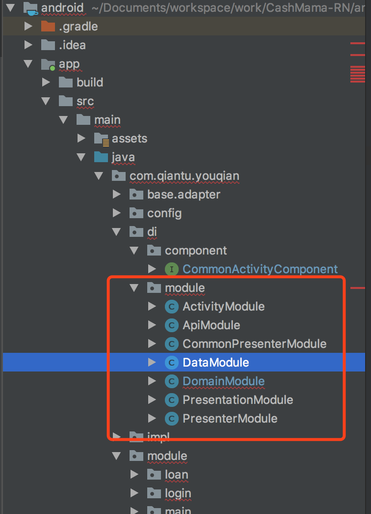

工作笔记

工作笔记

增加一个Activity需要增加的文件

CommonActivityComponent

DomainMoudle

！！！这个类上编译结果。
DaggerCommonActivityComponent{

provideReocrdProvider
provideRecordUseCaseProvider
provideRecordPresenterProvider
loanRecordActivityMembersInjector

this.provideReocrdProvider =
    DoubleCheck.*provider*(
        DomainModule_ProvideReocrdProviderFactory.*create*(
            builder.domainModule,
            provideIBuildRequestHeaderProvider,
            provideLoanApiServiceProvider));

this.provideRecordUseCaseProvider =
    DoubleCheck.*provider*(
        DomainModule_ProvideRecordUseCaseFactory.*create*(
            builder.domainModule, provideReocrdProvider));

this.provideRecordPresenterProvider =
    DoubleCheck.*provider*(
        PresenterModule_ProvideRecordPresenterFactory.*create*(
            builder.presenterModule,
            viewInjectorProvider,
            provideRecordUseCaseProvider,
            provideICheckNetStateProvider,
            provideIUseCaseTransformLoggingPlusShowDialogProvider,
            provideIValidateResponseCodeProvider,
            provideOnUserTokenExpiredListenerProvider,
            provideILogProvider));

this.loanRecordActivityMembersInjector =
    LoanRecordActivity_MembersInjector.*create*(
        applicationContextProvider,
        provideActivityProvider,
        busProvider,
        provideILogProvider,
        provideICheckNetStateProvider,
        multiStateViewUtilProvider,
        ActivityViewInjector_Factory.*create*(),
        provideRecordPresenterProvider);
}

Presenter:activity中网络请求直接调用的地方，将activity提供的数据整理成json body.并且是回调开始的地方
MVPView是Presenter回调页面的地方

Firebase Anasysic 日志，本地查看方式：
1. adb shell setprop log.tag.FA VERBOSE
2. adb shell setprop log.tag.FA-SVC VERBOSE
3. adb logcat -v time -s FA FA-SVC

adb shell setprop log.tag.FA VERBOSE;adb shell setprop log.tag.FA-SVC VERBOSE;adb logcat -v time -s FA FA-SVC

