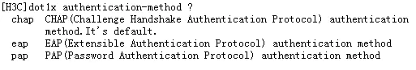
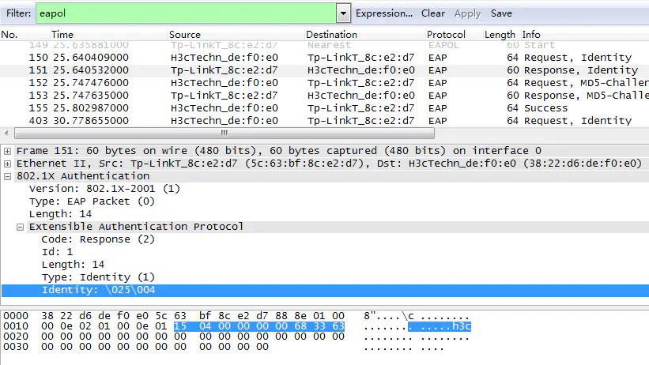

802.1X协议及Radius协议（二）

![]

上一节中对802.1X的环境搭建以及如何实现进行了简单的介绍，这一节中将会对802.1X协议及Radius协议涉及到的报文进行分析。

1、客户端和设备端通过EAPOL帧来交互信息

2、设备端和服务器之间的认证方法当采用EAP来交互信息时，工作为EAP中继方式；当采用CHAP或者PAP来交互信息时，工作为EAP终结方式，如下为设置认证方法的例子

2

EAP中继方式

设置交换机802.1X认证方法为EAP。此时，交换机对客户端发过来的request报文直接封装在radius中，传递给radius服务器。

EAP中继方式实验抓包分析，尝试过用镜像的方法去抓取客户端到设备端再到Radius服务器之间所有的报文，但是没有尝试成功。所以下面就用分别抓到的包去分析

客户端与设备端抓包

设备端与服务器端抓包

5

1、客户端主动发起EAPOL-Start报文

6

version，协议版本号

type为1，代表为EAPOL-Start

length为0，表示没有数据域

2、设备端发出request，identity报文，请求客户端发送用户名过来

7

version，协议版本号

type为0，代表承载的为EAP报文

length为5，表示数据域长度为5即EAP报文长度为5

EAP Code，1代表request，2代表response，3代表success，4代表failure

EAP Id，用于匹配request和response消息，request为1则response的Id也应该为1

EAP length，EAP包的长度，包含Code、Identifier、Length、Data

EAP Type，1代表Identity，查询对方身份，也就是说请将用户名发过来

这个后面的Identity：没有意义，空的。

3、客户端将用户名通过response报文发出去

version，协议版本号

type为0，代表承载的为EAP报文

length为14，表示数据域长度为14即EAP报文长度为14

EAP Code，1代表request，2代表response，3代表success，4代表failure

EAP Id，用于匹配request和response消息，request为1则response的Id也应该为1

EAP length，EAP包的长度，包含Code、Identifier、Length、Data

EAP Type，1代表Identity，查询对方身份，也就是说请将用户名发过来

这个后面的Identity：h3c即认证用户名

4、设备端将EAP数据封装在radius协议的EAP-Message属性中，发送给radius服务器进行认证

**radius协议属于应用层协议，采用UDP协议进行传输。**

radius code，1 Access-request

packet identity，21与回应报文的id一致，下一个请求报文的id应该为22

length，报文有效长度

Authenticator，访问请求认证字，用于确认radius client和radius server之间消息认证的有效性和密码隐藏算法，也被用于访问回应认证字的MD5计算。

radius协议属性，TLV格式。

EAP-Message属性中携带者EAP数据包

**介绍两种比较重要的属性EAP-Message和Message-Authenticator**

5、服务器收到设备转发的用户名信息后，将该信息与数据库中的用户名表比对，找到该用户名对应的密码信息，用随机生成的一个加密子对它进行加密处理，同时也将该加密字通过Access-Challenge报文发送给设备端，由设备端发给客户端程序。

radius code，11 Access-challenge

packet identity，21与请求报文的id一致

length，报文有效长度

Authenticator，访问回应认证字，用于鉴别响应报文的合法性

radius协议属性，TLV格式。

6、设备将随机加密字通过MD5-Challenge报文转发给客户端

version，协议版本号

type为0，代表承载的为EAP报文

length为22，表示数据域长度为22即EAP报文长度为22

EAP Code，1代表request，2代表response，3代表success，4代表failure

EAP Id，用于匹配request和response消息，request为2则response的Id也应该为2

EAP length，EAP包的长度，包含Code、Identifier、Length、Data

EAP Type，包含在data域中，4代表MD5-Challenge，加密算法

EAP-MD5 Value，由设备端传过来的服务器生成的加密字

7、客户端用加密字对密码进行加密后，生成Response报文后，发送给设备端

version，协议版本号

type为0，代表承载的为EAP报文

length为25，表示数据域长度为22即EAP报文长度为25

EAP Code，1代表request，2代表response，3代表success，4代表failure

EAP Id，用于匹配request和response消息，request为2则response的Id也应该为2

EAP length，EAP包的长度，包含Code、Identifier、Length、Data

EAP Type，包含在data域中，4代表MD5-Challenge，加密算法

EAP-MD5 Value，新生成的加密字

EAP-MD5 Extra Data，添加的一些自带信息，以实现更安全的认证。该种方式为非标准802.1X流程

8、设备端再次通过Access-Request报文将新的加密字传送给服务器

radius code，1 Access-request

packet identity，22接着21的一个请求报文

length，报文有效长度

Authenticator，访问请求认证字，用于确认radius client和radius server之间消息认证的有效性和密码隐藏算法，也被用于访问回应认证字的MD5计算。

radius协议属性，TLV格式。EAP-Message属性中携带着EAP数据包，其中包含客户端发过来的加密的密码信息

9、Radius服务器将收到的加密的密码信息和本地经过加密认证的密码信息进行对比，如果相同，返回Access-Accept报文

radius code，2 Access-Accept

packet identity，22匹配22请求报文

length，报文有效长度

Authenticator，响应认证字

radius协议属性，TLV格式。EAP-Message属性中携带着EAP数据包

10、设备端收到服务器的Access-Accept报文后，向客户端转发success报文，即认证通过，可以上网了

version，协议版本号

type为0，代表承载EAP报文

length为4，表示数据域长度为4即EAP报文长度

EAP Code，1代表request，2代表response，3代表success，4代表failure

EAP Id，用于匹配request和response消息，request为2则response的Id也应该为2

EAP length，EAP包的长度，包含Code、Identifier、Length、Data，该报文没有data域

11、设备端会通过向客户端定期发送握手报文的方法，对用户的在线情况进行监测。15s发送一对报文。

12、设备端向服务器发起计费请求信息

radius code，4 Accounting-Request

packet identity，66

length，报文有效长度

Authenticator，请求认证字

radius协议属性，TLV格式。Acct-Status-Type：start（1）为计费开始报文

13、服务器响应计费请求报文

radius code，5 Accounting-Response

packet identity，66，与请求报文匹配

length，报文有效长度

Authenticator，请求认证字

EAP终结方式

设置交换机802.1X认证方法为CHAP或者PAP。此时，交换机对客户端发过来的EAP报文，进行终结并映射到Radius报文中。

客户端与设备端抓包

设备端与服务器抓包

EAP终结方式与EAP中继方式相比，对用户密码信息加密的随机字一个由交换机生成，一个由服务器生成。之后设备端会把用户名