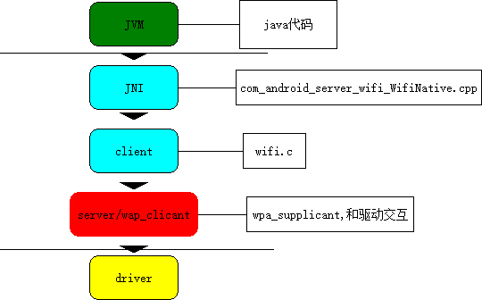

Android wifi探究一：初步认识wpa_supplicant与wifi框架梳理_阳光玻璃杯-CSDN博客_android wpa_supplicant

平时和wifi打交道还算比较多吧，wifi出了问题就只能找大神解决，这是件很令人伤感的事情。所以就想自己分析下android源码中wifi的框架，以后wifi出了问题，自己也能尝试的解一解。分析过程必定会有很多理解不到位或者错误的地方，欢迎大家不吝啬恶毒之词，使劲拍砖。

wpa_supplicant是Android平台使用的用来管理wifi的应用程序，它可以支持WEP，WPA/WPA2和WAPI无线协议和加密认证。wpa_supplicant会操作驱动程序和wifi网卡交互，它同时是一个服务器，通过socket,我们可以和它建立连接，然后就可以通过命令和它交互，让它帮我们实现wifi连接断开等操作。  
为了更好的认识和理解wpa_supplicant的功能，我们可以先尝试使用命令来连接wifi，感受下wpa_supplicant的作用。  
在android系统中，当我们打开wifi后，wpa_supplicant就启动了，  
我们不需要手动来启动。这点可以通过ps | grep wpa_supplicant来查看，结果如下：  
wifi 2955 2947 4932 2596 poll_sched b6e22138 S wpa_supplicant  
与wpa_supplicant同时存在的是wpl_cli,它是一个客户端，它实现了和wap_supplicant连接等功能，我们可以通过它和wap_supplicant交互。  
要使用wpa_cli，首先得过得root权限，没有root权限的话连接会失败。  
使用wap_cli的第一步就是启动wpa_cli:  
wpa_cli -i wlan0 -p /data/misc/wifi/sockets/

-i指的是网卡接口  
-p值得是wap_supplicant.conf所在的路径，具体的平台会有不同。

启动以后进入交互模式，我们可以使用如下命令完成wifi的连接：

## 1.scan

扫描附近的热点 
```
> scan  
OK
```

## 2.scan_results

获取扫描的结果  
```
> scan_results  
bssid / frequency / signal level / flags / ssid  
20:f4:1b:83:40:e4 2462 -63 [WPA-PSK-CCMP+TKIP][WPA2-PSK-CCMP+TKIP][ESS] ROC  
80:89:17:a1:a8:ee 2437 -64 [WPA-PSK-CCMP][WPA2-PSK-CCMP][ESS] samuel  
80:89:17:a1:a8:e4 2437 -67 [WPA-PSK-CCMP][WPA2-PSK-CCMP][ESS] TV-WIFI  
80:89:17:9f:d3:ba 2412 -73 [WPA-PSK-CCMP][WPA2-PSK-CCMP][ESS] xrr  
f4:ec:38:7b:2c:96 2437 -75 [WPA-PSK-CCMP][WPA2-PSK-CCMP][WPS][ESS] TP-LINK_7B2C96  
1c:fa:68:50:8a:76 2462 -71 [WPA-PSK-CCMP+TKIP][WPA2-PSK-CCMP+TKIP][WPS][ESS] RDSPEED100M  
d0:c7:c0:fd:86:64 2437 -73 [WPA-PSK-CCMP][WPA2-PSK-CCMP][ESS] yingyunguanli-huiyishi  
4e:e0:10:c2:44:57 2462 -59 [WPA2-PSK-CCMP][ESS] hellowifi  
4e:e0:10:c2:48:5d 2462 -70 [WPA2-PSK-CCMP][ESS] ADESKTOP-93DNJ6F  
ac:e0:10:c2:63:bc 2412 -66 [WPA-PSK-CCMP+TKIP][WPA2-PSK-CCMP+TKIP][WPS][ESS] wifi  
cc:34:29:2c:7f:e8 2412 -76 [WPA-PSK-TKIP][WPA2-PSK-TKIP][ESS] dlink
```
## 3.add_network

添加网络  
通过查看扫描的结果，我们选择一个要连接的wifi，比如hellowifi  
这个时候，我们首先要添加一个网络。  
```
> add_network  
2  
```
这个2是wpa_supplicant给我们返回的一个值，代表了这个网络，以后我们需要操作这个网络就要使用这个值。

## 4.设置ssid和密码

ssid就是热点的名字，这里就是hellowifi.  
```
> set_network 2 ssid “hellowifi”  
OK  
> set_network 2 psk “11223344”  
OK 
```
psk是WPA2-PSK模式下标示wifi密码的名字。如果是没有加密：  
```
>set_network 2 key_mgmt NONE  
```
如果是WEP安全模式：  
```
>set_network 2 wep_key0 “your ap passwork”
```

## 5.enable_network

使能wifi
```
> select_network 2  
OK 
```
选择网络是可选的，如果当前已经连接了一个wifi，你应该重新选择一个网络。  
```
> enable_network 2  
OK
```

## 6.切换wifi

如果我们当前有多个网络，我们可以切换：  
```
> select_network 0  
OK  
> enable_network 0  
OK 
```
网络0中的wifi将会被连接

尝试了使用命令行连接和断开wifi后，我们可以开始思考android源码中是怎么和wpa_supplicant交互的?Android系统中wifi框架是怎样的?  
下面我根据自己的理解绘制的一张简单的示意图：  
  
从中可以看出，wifi.c是和wpa_supplicant直接交互的文件。client通过套接字和wap_supplicant交互，向wpa_supplicant发送命令并接受wpa_supplicant反馈的信息。wifi.c是C代码，必须通过jni和JVM交互。wifi的整体框架非常好理解。

## wifi.c

wifi.c在\hardware\libhardware_legacy\wifi目录下。  
在wifi.c中，声明了如下和wpa_supplicant交互的函数：

```
void wpa_ctrl_cleanup(void) {}
struct wpa_ctrl *wpa_ctrl_open(const char *ctrl_path) { return NULL; }
void wpa_ctrl_close(struct wpa_ctrl *ctrl) {}
int wpa_ctrl_request(struct wpa_ctrl *ctrl, const char *cmd, size_t cmd_len,
    char *reply, size_t *reply_len, void (*msg_cb)(char *msg, size_t len))
    { return 0; }
int wpa_ctrl_attach(struct wpa_ctrl *ctrl) { return 0; }
int wpa_ctrl_detach(struct wpa_ctrl *ctrl) { return 0; }
int wpa_ctrl_recv(struct wpa_ctrl *ctrl, char *reply, size_t *reply_len)
    { return 0; }
int wpa_ctrl_get_fd(struct wpa_ctrl *ctrl) { return 0; }

```

这几个函数的作用如下：  
wpa_ctrl_open接口用来打开wpa_supplicant的控制接口，在UNIX系统里使用UNIX domain sockets，而在Windows里则是使用UDP sockets，当然接口的路径并不是固定的，可以根据配置文件内的路径设置来改变。

wpa_ctrl_close接口自然是用于关闭控制接口。

wpa_ctrl_request接口是用来发送控制命令至wpa_supplicant，并且会接受命令成功执行与否的反馈消息。这是一个堵塞的动作，一般会至少等待2秒钟用来接受反馈的回复消息。如果有未经主动请求的消息接受，堵塞的时间则会更长。

wpa_ctrl_attach接口是为控制接口注册一个事件监视，但注册成功后就可以开始接口事件消息。

wpa_ctrl_detach接口则是取消控制接口的事件监视。

wpa_ctrl_recv接口是在控制接口的事件监视注册成功后，用来接受事件消息，这是一个堵塞的操作，当没有可用的消息时，就会一直堵塞。

wpa_ctrl_pending接口是用来检测是否有即将到来的事件消息。

wpa_ctrl_get_fd接口则是来获得控制接口的文件描述符号。

因此，通过如上函数，我们就可以和wpa_supplicant进行交互，从而实现wifi的管理了。  
wifi.c使用如上函数，对wifi的操作做了进一步的封装，比如，我们要扫描附近的热点，需要发送scan命令，而发送命令的函数在wifi.c中为：

```
int wifi_send_command(const char *cmd, char *reply, size_t *reply_len)
{
    int ret;
    if (ctrl_conn == NULL) {
        ALOGV("Not connected to wpa_supplicant - "%s" command dropped.\n", cmd);
        return -1;
    }
    ret = wpa_ctrl_request(ctrl_conn, cmd, strlen(cmd), reply, reply_len, NULL);
    if (ret == -2) {
        ALOGD("'%s' command timed out.\n", cmd);
        /* unblocks the monitor receive socket for termination */
        TEMP_FAILURE_RETRY(write(exit_sockets[0], "T", 1));
        return -2;
    } else if (ret < 0 || strncmp(reply, "FAIL", 4) == 0) {
        return -1;
    }
    if (strncmp(cmd, "PING", 4) == 0) {
        reply[*reply_len] = '\0';
    }
    return 0;
}

```

可以看到它内部就是使用wpa_ctrl_request实现的。

## com_android_server_wifi_WifiNative.cpp

wifi.c是native code，它不能被java虚拟机直接使用，必须通过jni来与java虚拟机交互,jni自然就是在com_android_server_wifi_WifiNative.cpp文件中实现的了，该文件在frameworks\opt\net\wifi\service\jni目录下。  
这个文件这里也不展开，我们知道jni动态注册的时候需要一个函数映射表，从表中我们可以看到java层使用的方法和本地的函数之间的对应关系：

```

static JNINativeMethod gWifiMethods[] = {
    

    { "loadDriver", "()Z",  (void *)android_net_wifi_loadDriver },
    { "isDriverLoaded", "()Z",  (void *)android_net_wifi_isDriverLoaded },
    { "unloadDriver", "()Z",  (void *)android_net_wifi_unloadDriver },
    { "startSupplicant", "(Z)Z",  (void *)android_net_wifi_startSupplicant },
    { "killSupplicant", "(Z)Z",  (void *)android_net_wifi_killSupplicant },
    { "connectToSupplicantNative", "()Z", (void *)android_net_wifi_connectToSupplicant },
    { "closeSupplicantConnectionNative", "()V",
            (void *)android_net_wifi_closeSupplicantConnection },
    { "waitForEventNative", "()Ljava/lang/String;", 
    。。。

```

比如说，java中想要启动wpa_supplicant的时候，会调用startSupplicant方法，对应的jni方法就是android_net_wifi_startSupplicant ，然后android_net_wifi_startSupplicant 会被调用，这个方法定义如下：

```
static jboolean android_net_wifi_startSupplicant(JNIEnv* env, jobject, jboolean p2pSupported)
{
    return (::wifi_start_supplicant(p2pSupported) == 0);
}
```

结果是wifi.c中的wifi_start_supplicant被调用，定义如下：

```
int wifi_start_supplicant(int p2p_supported)
{
    
    ALOGD("enter func %s p2p_supported = %d\n",__func__,p2p_supported);
    char wlan_driver[PROPERTY_VALUE_MAX] = {'\0'};
    property_get(WLAN_DRIVER,wlan_driver, NULL);
    char daemon_cmd[PROPERTY_VALUE_MAX * 2];
    char supp_status[PROPERTY_VALUE_MAX] = {'\0'};
    int count = 200; 
    const prop_info *pi;
    unsigned serial = 0, i;

。。。

    
    wpa_ctrl_cleanup();

    
    exit_sockets[0] = exit_sockets[1] = -1;

    
    pi = __system_property_find(supplicant_prop_name);
    if (pi != NULL) {
        serial = __system_property_serial(pi);
    }
    property_get("wifi.interface", primary_iface, WIFI_TEST_INTERFACE);
    
    snprintf(daemon_cmd,sizeof(daemon_cmd),"%s:%s",supplicant_name,wlan_driver);
    property_set("ctl.start", daemon_cmd);
    
    sched_yield();

    while (count-- > 0) {
        if (pi == NULL) {
            pi = __system_property_find(supplicant_prop_name);
        }
        if (pi != NULL) {
            
            if (__system_property_serial(pi) != serial) {
                __system_property_read(pi, NULL, supp_status);
                if (strcmp(supp_status, "running") == 0) {
                    return 0;
                } else if (strcmp(supp_status, "stopped") == 0) {
                    return -1;
                }
            }
        }
        
        ALOGD("func %s count = %d ",__func__,count);
        
        usleep(100000);
    }
    return -1;
}

```

这里启动wpa_supplicant使用的是property_set(“ctl.start”, daemon_cmd);设置ctl.start属性会导致这个属性所对应的值的同名服务被启动，这项服务启动的结果会被放在init.svc.&lt;服务名&gt;“属性中，后面的while循环就是不断查询给向服务的启动结果，来判断它是否成功启动。

## java层

java层直接和jni交互的类是WifiNative.java,从名字也可以看出来，它里面声明了很多native方法：

```
    private static native int registerNatives();

    public native static boolean loadDriver();

    public native static boolean isDriverLoaded();

    public native static boolean unloadDriver();

    public native static boolean startSupplicant(boolean p2pSupported);

    
    public native static boolean killSupplicant(boolean p2pSupported);
。。。
```

java层就比较复杂了，暂时点到为止。下一节将着手分析java层对wifi的管理。