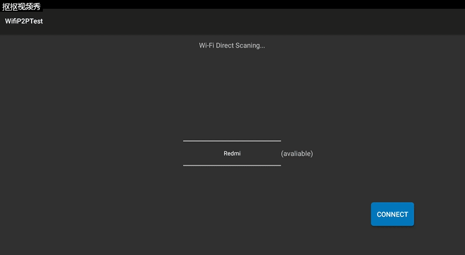

Android wifi探究三：Wifi P2P 连接附近设备_阳光玻璃杯-CSDN博客

Wi-Fi Direct APIs允许应用连接周围的设备，而不用通过网络或者热点，点对点直接连接。应用可以快速的发现周围设备并与之交互，而有效作用距离大于蓝牙。这篇博客对如何实现Wi-Fi P2P设备间的连接做一个总结，如有不对之处，欢迎拍砖。下图是这篇博客所要展示的内容：  
  
打开应用后，应用程序开始查找附近的可连接设备，并把结果显示在一个NumberPicker中，我们可以选择一个设备，然后点击CONNECT按钮，就可以连接到附近的设备。

## <a id="t1"></a><a id="t1"></a>1.权限

首先我们需要这三个权限。

```
<uses-permission
        android:required="true"
        android:name="android.permission.ACCESS_WIFI_STATE"/>
    <uses-permission
        android:required="true"
        android:name="android.permission.CHANGE_WIFI_STATE"/>
    <uses-permission
        android:required="true"
        android:name="android.permission.INTERNET"/>
```

## <a id="t2"></a><a id="t2"></a>2.注册广播接收器

我们需要如下四个广播：  
WIFI\_P2P\_STATE\_CHANGED\_ACTION  
Indicates whether Wi-Fi P2P is enabled  
—\- 表明Wi-Fi P2P有没有使能  
WIFI\_P2P\_PEERS\_CHANGED\_ACTION  
Indicates that the available peer list has changed.  
—\- 表明可用的peer list发生了改变  
WIFI\_P2P\_CONNECTION\_CHANGED\_ACTION  
Indicates the state of Wi-Fi P2P connectivity has changed.  
—\- 表明Wi-Fi P2P连接状态发生了改变  
WIFI\_P2P\_THIS\_DEVICE\_CHANGED_ACTION  
Indicates this device’s configuration details have changed.  
—-表明这个设备的配置信息发生了改变

## <a id="t3"></a><a id="t3"></a>3.初始化

```
    mManager = (WifiP2pManager) getSystemService(Context.WIFI_P2P_SERVICE);
    mChannel = mManager.initialize(this, getMainLooper(), null);
```

initialize方法返回一个WifiP2pManager.Channel的实例，标示一个 通道，以后我们就要使用这个通道来查找和连接Wi-Fi P2P设备。

## <a id="t4"></a><a id="t4"></a>4.开始查找附近设备

```
 mManager.discoverPeers(mChannel, new WifiP2pManager.ActionListener() {

            @Override
            public void onSuccess() {
                Log.d(TAG,"onSuccess");
            }

            @Override
            public void onFailure(int reasonCode) {
                Log.d(TAG,"onFailure");
            }
        });
```

discoverPeers方法发起查找，这个查找是异步的，查找结束后回调方法会被调用，从而使我们可以得知查找成功还是失败。

## <a id="t5"></a><a id="t5"></a>5.获取设备列表

discoverPeers发起查找以后，一旦查找到附近设备，WIFI\_P2P\_PEERS\_CHANGED\_ACTION广播就会触发，我们可以在该广播中调用requestPeers方法来请求过去设备列表。  
requestPeers需要两个参数，第一个就是我们的通道，由mManager.initialize方法返回，第二个参数是一个监听器。发送获取设备列表请求后，监听器中的方法onPeersAvailable就会被调用，我们可以在其中获取到附近的设备。  
下面为请求获取设备列表的代码：

```
        if (mManager != null) {
            mManager.requestPeers(mChannel, peerListListener);
        }
```

下面为监听器中获取附近设备的代码：

```
    private PeerListListener peerListListener = new PeerListListener() {
        @Override
        public void onPeersAvailable(WifiP2pDeviceList peerList) {

            // Out with the old, in with the new.
            peers.clear();
            peers.addAll(peerList.getDeviceList());

            // If an AdapterView is backed by this data, notify it
            // of the change.  For instance, if you have a ListView of available
            // peers, trigger an update.
            ((WiFiPeerListAdapter) getListAdapter()).notifyDataSetChanged();
            if (peers.size() == 0) {
                Log.d(WiFiDirectActivity.TAG, "No devices found");
                return;
            }
        }
    }
```

## <a id="t6"></a><a id="t6"></a>6.连接到设备

```
 @Override
    public void connect() {
        
        WifiP2pDevice device = peers.get(0);

        WifiP2pConfig config = new WifiP2pConfig();
        config.deviceAddress = device.deviceAddress;
        config.wps.setup = WpsInfo.PBC;

        mManager.connect(mChannel, config, new ActionListener() {
            @Override
            public void onSuccess() {
                
            }
            @Override
            public void onFailure(int reason) {

            }
        });
    }
```

连接成功后，我们就会收到WIFI\_P2P\_CONNECTION\_CHANGED\_ACTION广播，我们可以在广播中请求过去更加详细的信息，使用的方法是：mManager.requestConnectionInfo(mChannel, connectionListener);

```
if (WifiP2pManager.WIFI_P2P_CONNECTION_CHANGED_ACTION.equals(action)) {

            if (mManager == null) {
                return;
            }

            NetworkInfo networkInfo = (NetworkInfo) intent
                    .getParcelableExtra(WifiP2pManager.EXTRA_NETWORK_INFO);

            if (networkInfo.isConnected()) {

                
                

                mManager.requestConnectionInfo(mChannel, connectionListener);
            }
```

requestConnectionInfo方法的第二个参数也是一个监听器，请求过去详细信息以后，这个监听器的onConnectionInfoAvailable方法就会被调用，我们可以在其中获取谁是“群主”等信息。

以上为连接一个Wi-Fi P2P设备的步骤，下面博客一开始展示的应用程序的代码，供大家参考：

## <a id="t8"></a><a id="t8"></a>MainActivity.java

```
package com.jinwei.wifip2ptest;

import android.app.Activity;
import android.content.BroadcastReceiver;
import android.content.Context;
import android.content.Intent;
import android.content.IntentFilter;
import android.net.NetworkInfo;
import android.net.wifi.WpsInfo;
import android.net.wifi.p2p.WifiP2pConfig;
import android.net.wifi.p2p.WifiP2pDevice;
import android.net.wifi.p2p.WifiP2pDeviceList;
import android.net.wifi.p2p.WifiP2pInfo;
import android.net.wifi.p2p.WifiP2pManager;
import android.support.v7.app.AppCompatActivity;
import android.os.Bundle;
import android.util.Log;
import android.view.View;
import android.view.ViewGroup;
import android.widget.Button;
import android.widget.LinearLayout;
import android.widget.NumberPicker;
import android.widget.TextView;
import android.widget.Toast;

import java.net.InetAddress;
import java.util.ArrayList;
import java.util.List;

public class MainActivity extends Activity implements  WifiP2pManager.PeerListListener,WifiP2pManager.ConnectionInfoListener{
    private final IntentFilter intentFilter = new IntentFilter();
    WifiP2pManager.Channel mChannel;
    WifiP2pManager mManager;
    NumberPicker picker;
    Button button;
    TextView textView;
    private final String TAG = "MainActivity";
    private final BroadcastReceiver mReceiver = new BroadcastReceiver() {
        @Override
        public void onReceive(Context context, Intent intent) {
            String action = intent.getAction();
            if (WifiP2pManager.WIFI_P2P_STATE_CHANGED_ACTION.equals(action)) {
                Log.d(TAG,"WIFI_P2P_STATE_CHANGED_ACTION");
            } else if (WifiP2pManager.WIFI_P2P_PEERS_CHANGED_ACTION.equals(action)) {
                Log.d(TAG,"WIFI_P2P_PEERS_CHANGED_ACTION");
                if (mManager != null) {
                    mManager.requestPeers(mChannel, MainActivity.this);
                }
                Log.d(TAG, "P2P peers changed");
            } else if (WifiP2pManager.WIFI_P2P_CONNECTION_CHANGED_ACTION.equals(action)) {
                Log.d(TAG,"WIFI_P2P_CONNECTION_CHANGED_ACTION");
                if (mManager == null) {
                    return;
                }
                NetworkInfo networkInfo = (NetworkInfo) intent
                        .getParcelableExtra(WifiP2pManager.EXTRA_NETWORK_INFO);

                if (networkInfo.isConnected()) {
                    mManager.requestConnectionInfo(mChannel, MainActivity.this);
                }
            } else if (WifiP2pManager.WIFI_P2P_THIS_DEVICE_CHANGED_ACTION.equals(action)) {
                Log.d(TAG,"WIFI_P2P_THIS_DEVICE_CHANGED_ACTION");
            }
        }
    };

    @Override
    protected void onCreate(Bundle savedInstanceState) {
        super.onCreate(savedInstanceState);
        setContentView(R.layout.activity_main);
        intentFilter.addAction(WifiP2pManager.WIFI_P2P_STATE_CHANGED_ACTION);
        intentFilter.addAction(WifiP2pManager.WIFI_P2P_PEERS_CHANGED_ACTION);
        intentFilter.addAction(WifiP2pManager.WIFI_P2P_CONNECTION_CHANGED_ACTION);
        intentFilter.addAction(WifiP2pManager.WIFI_P2P_THIS_DEVICE_CHANGED_ACTION);
        mManager = (WifiP2pManager) getSystemService(Context.WIFI_P2P_SERVICE);
        mChannel = mManager.initialize(this, getMainLooper(), null);
        picker = (NumberPicker) findViewById(R.id.pick);
        picker.setDescendantFocusability(NumberPicker.FOCUS_BLOCK_DESCENDANTS);
        peersName = new String[1];
        peersName[0]="No Devices";
        picker.setDisplayedValues(peersName);

        button = (Button) findViewById(R.id.button);
        button.setOnClickListener(new View.OnClickListener() {
            @Override
            public void onClick(View v) {
                int num = picker.getValue();
                connect(num);
            }
        });
        textView = (TextView) findViewById(R.id.text);
    }

    @Override
    protected void onResume() {
        super.onResume();
        registerReceiver(mReceiver, intentFilter);
        mManager.discoverPeers(mChannel, new WifiP2pManager.ActionListener() {

            @Override
            public void onSuccess() {
                Log.d(TAG,"onSuccess");
            }

            @Override
            public void onFailure(int reasonCode) {
                Log.d(TAG,"onFailure");
            }
        });
    }

    @Override
    protected void onPause() {
        super.onPause();
        unregisterReceiver(mReceiver);
    }
    private List<WifiP2pDevice> peers = new ArrayList<>();
    private String[] peersName;
    @Override
    public void onPeersAvailable(WifiP2pDeviceList peerList) {
        peers.clear();
        peers.addAll(peerList.getDeviceList());
        if (peers.size() == 0) {
            Log.d(TAG, "No devices found");
            textView.setVisibility(View.INVISIBLE);
            if (peersName.length>0){
                peersName[0]="No Devices";
            }else {
                peersName = new String[1];
                peersName[0]="No Devices";
            }
            return;
        }else{
            peersName = new String[peers.size()];
            int i=0;
            for(WifiP2pDevice device: peers){
                peersName[i++]=device.deviceName;
            }
            textView.setVisibility(View.VISIBLE);
            textView.setText("(avaliable)");
        }
        picker.setDisplayedValues(peersName);
    }
    public void connect(final int num) {
        
        WifiP2pDevice device = peers.get(num);

        WifiP2pConfig config = new WifiP2pConfig();
        config.deviceAddress = device.deviceAddress;
        config.wps.setup = WpsInfo.PBC;

        mManager.connect(mChannel, config, new WifiP2pManager.ActionListener() {
            @Override
            public void onSuccess() {
                Log.d(TAG,"connect sucess");
            }

            @Override
            public void onFailure(int reason) {
                Log.d(TAG,"connect fail");
            }
        });
    }

    @Override
    public void onConnectionInfoAvailable(WifiP2pInfo info) {
        textView.setVisibility(View.VISIBLE);
        textView.setText("(connected)");
        
        InetAddress groupOwnerAddress = info.groupOwnerAddress;
        Log.d(TAG,"onConnectionInfoAvailable");
        Log.d(TAG,info.toString());
        if (info.groupFormed && info.isGroupOwner) {

        } else if (info.groupFormed) {

        }
    }
}

```

## <a id="t9"></a><a id="t9"></a>布局文件activity_main.xml

```
<?xml version="1.0" encoding="utf-8"?>
<RelativeLayout xmlns:android="http://schemas.android.com/apk/res/android"
    xmlns:tools="http://schemas.android.com/tools"
    android:layout_width="match_parent"
    android:layout_height="match_parent"
    android:paddingBottom="@dimen/activity_vertical_margin"
    android:paddingLeft="@dimen/activity_horizontal_margin"
    android:paddingRight="@dimen/activity_horizontal_margin"
    android:paddingTop="@dimen/activity_vertical_margin"
    tools:context="com.jinwei.wifip2ptest.MainActivity">
    <TextView
        android:text="Wi-Fi Direct Scaning..."
        android:layout_centerHorizontal="true"
        android:layout_width="wrap_content"
        android:layout_height="wrap_content" />
    <NumberPicker
        android:layout_centerInParent="true"
        android:id="@+id/pick"
        android:focusableInTouchMode="true"
        android:focusable="true"
        android:layout_width="200dp"
        android:layout_height="200dp">
    </NumberPicker>
    <TextView
        android:text="helllo"
        android:layout_toRightOf="@+id/pick"
        android:id="@+id/text"
        android:visibility="invisible"
        android:layout_centerVertical="true"
        android:layout_width="wrap_content"
        android:layout_height="wrap_content" />
    <Button
        android:id="@+id/button"
        android:text="connect"
        android:background="@drawable/button_bg"
        android:layout_below="@+id/pick"
        android:layout_marginStart="700dp"
        android:layout_width="wrap_content"
        android:layout_height="wrap_content" />
</RelativeLayout>

```

## <a id="t10"></a><a id="t10"></a>按钮的背景文件button_bg.xml

```
<?xml version="1.0" encoding="utf-8"?>
<selector xmlns:android="http://schemas.android.com/apk/res/android" >

    <item  android:state_focused="true">
        <shape android:shape="rectangle">
            <corners android:bottomLeftRadius="5dip" 
                     android:bottomRightRadius="5dip" 
                     android:topLeftRadius="5dip" 
                     android:topRightRadius="5dip" />
            <solid android:color="@color/button_focus"/>
        </shape>
    </item>
    <item android:state_focused="false">
        <shape android:shape="rectangle">
            <corners android:bottomLeftRadius="5dip" 
                     android:bottomRightRadius="5dip" 
                     android:topLeftRadius="5dip" 
                     android:topRightRadius="5dip" />
            <solid android:color="@color/button_color"/>
        </shape>
    </item>
    <item android:state_selected="true">
        <shape android:shape="rectangle">
            <corners android:bottomLeftRadius="5dip" 
                     android:bottomRightRadius="5dip" 
                     android:topLeftRadius="5dip" 
                     android:topRightRadius="5dip" />
            <solid android:color="@color/button_focus"/>
        </shape>
    </item>
    <item  android:state_selected="false">
        <shape android:shape="rectangle">
            <corners android:bottomLeftRadius="5dip" 
                     android:bottomRightRadius="5dip" 
                     android:topLeftRadius="5dip" 
                     android:topRightRadius="5dip" />
            <solid android:color="@color/button_color"/>
        </shape>
    </item>   

</selector>

```

## <a id="t11"></a><a id="t11"></a>AndroidManifest.xml文件

```
<?xml version="1.0" encoding="utf-8"?>
<manifest xmlns:android="http://schemas.android.com/apk/res/android"
    package="com.jinwei.wifip2ptest">
    <uses-permission
        android:required="true"
        android:name="android.permission.ACCESS_WIFI_STATE"/>
    <uses-permission
        android:required="true"
        android:name="android.permission.CHANGE_WIFI_STATE"/>
    <uses-permission
        android:required="true"
        android:name="android.permission.INTERNET"/>
    <application
        android:allowBackup="true"
        android:icon="@mipmap/ic_launcher"
        android:label="@string/app_name"
        android:supportsRtl="true">
        <activity android:name=".MainActivity">
            <intent-filter>
                <action android:name="android.intent.action.MAIN" />

                <category android:name="android.intent.category.LAUNCHER" />
            </intent-filter>
        </activity>
    </application>

</manifest>
```

## <a id="t12"></a><a id="t12"></a>Color.xml文件

```
<?xml version="1.0" encoding="utf-8"?>
<resources>
    <color name="colorPrimary">#3F51B5</color>
    <color name="colorPrimaryDark">#303F9F</color>
    <color name="colorAccent">#FF4081</color>
    <color name="button_color">#ff546f7a</color>
    <color name="button_focus">#ff0277bd</color>
</resources>
```