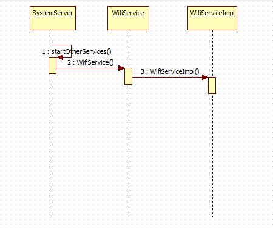
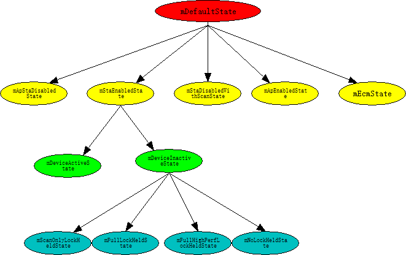
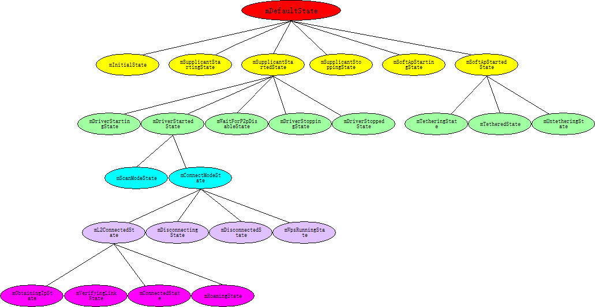
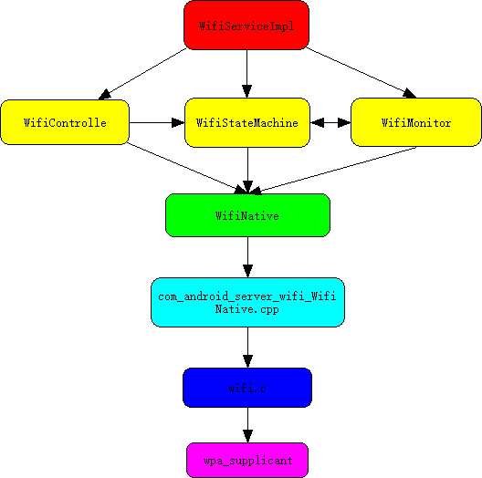
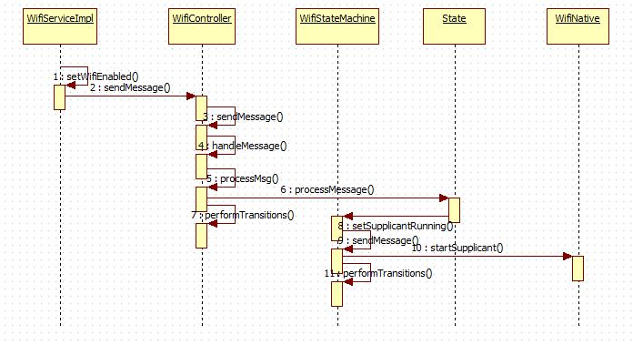

Android wifi探究二：Wifi framework层源码分析_阳光玻璃杯-CSDN博客

上一篇博客初步认识了wpa_supplicant的作用和使用方法，并且尝试着梳理了wifi的大框架，不过，java层的框架我们忽略了，没有分析，也就是说上一篇博客简单的指出了wifi代码的大框架，那么这篇博客，将尝试梳理wifi的java层框架。  
声明：本人使用的Android源码是6.0版本。

WifiService的启动可用如下简单时序图表示：  

启动过程的图示画的比较简单，下面就顺着这个思路理一下代码的实现。  
在SystemServer.java的 startOtherServices() 方法中，启动了WifiService，代码如下：

```
                mSystemServiceManager.startService(WIFI_P2P_SERVICE_CLASS)
                mSystemServiceManager.startService(WIFI_SERVICE_CLASS)
                mSystemServiceManager.startService(
                            "com.android.server.wifi.WifiScanningService")

                mSystemServiceManager.startService("com.android.server.wifi.RttService")
```

其中用到的WIFI\_P2P\_SERVICE\_CLASS，WIFI\_SERVICE_CLASS两个变量的值如下：

```
    private static final String WIFI_SERVICE_CLASS =
            "com.android.server.wifi.WifiService";
    private static final String WIFI_P2P_SERVICE_CLASS =
            "com.android.server.wifi.p2p.WifiP2pService";
```

以上代码可以看到，SystemServier中启动的Wifi相关的服务有四个，从上往下依次是P2P wifi服务,普通wifi，wifi扫描附近热点的服务以及以太网服务。

- p2p wifi服务主要为Wi-Fi Direct提供相应的服务，Wi-Fi Direct是一种全新的技术，即使在没有传统的Wi-Fi网络或Wi-Fi接入点的环境中，仍然能够在诸如智能手机和数码相机等设备间实现点对点Wi-Fi连接。
- wifi 服务这是我们关注的重点。  
    下面我们看下wifi服务的启动过程。

```
    @SuppressWarnings("unchecked")
    public SystemService startService(String className) {
        final Class<SystemService> serviceClass;
        try {
            serviceClass = (Class<SystemService>)Class.forName(className);
        } catch (ClassNotFoundException ex) {
            Slog.i(TAG, "Starting " + className);
            throw new RuntimeException("Failed to create service " + className
                    + ": service class not found, usually indicates that the caller should "
                    + "have called PackageManager.hasSystemFeature() to check whether the "
                    + "feature is available on this device before trying to start the "
                    + "services that implement it", ex);
        }
        return startService(serviceClass);
    }
```

startService方法中通过Class.forName获得一个Class实例，但是这还不是WifiService的实例，然后调用startService进一步处理。这两个startService方法是重载方法，他们的参数类型不同。

```
   public <T extends SystemService> T startService(Class<T> serviceClass) {
        final String name = serviceClass.getName();
        Slog.i(TAG, "Starting " + name);

        
        if (!SystemService.class.isAssignableFrom(serviceClass)) {
            throw new RuntimeException("Failed to create " + name
                    + ": service must extend " + SystemService.class.getName());
        }
        final T service;
        try {
            Constructor<T> constructor = serviceClass.getConstructor(Context.class);
            service = constructor.newInstance(mContext);
        } catch (InstantiationException ex) {
            throw new RuntimeException("Failed to create service " + name
                    + ": service could not be instantiated", ex);
        } catch (IllegalAccessException ex) {
            throw new RuntimeException("Failed to create service " + name
                    + ": service must have a public constructor with a Context argument", ex);
        } catch (NoSuchMethodException ex) {
            throw new RuntimeException("Failed to create service " + name
                    + ": service must have a public constructor with a Context argument", ex);
        } catch (InvocationTargetException ex) {
            throw new RuntimeException("Failed to create service " + name
                    + ": service constructor threw an exception", ex);
        }

        
        mServices.add(service);

        
        try {
            service.onStart();
        } catch (RuntimeException ex) {
            throw new RuntimeException("Failed to start service " + name
                    + ": onStart threw an exception", ex);
        }
        return service;
    }
```

在这个startService方法中，使用 Constructor constructor = serviceClass.getConstructor(Context.class);  
service = constructor.newInstance(mContext);构建了一个WifiService的实例，然后使用mServices.add(service);向系统注册WifiService,并调用WifiService的onStart方法。构造WifiService会调用WifiService的构造方法，它的构造方法如下：

```
    public WifiService(Context context) {
        super(context);
        mImpl = new WifiServiceImpl(context);
    }
```

wifiService构造函数有新建了一个WifiServiceImpl实例，它才是Wifi管理服务真正的实现者，构造函数调用后不是调用了WifiService的onStart方法吗？

```
    @Override
    public void onStart() {
        Log.i(TAG, "Registering " + Context.WIFI_SERVICE);
        publishBinderService(Context.WIFI_SERVICE, mImpl);
    }
```

在onStart方法中发布了Wifi服务，发布的WifiServiceImpl的实例。发布的过程如下：  
1.

```
    protected final void publishBinderService(String name, IBinder service) {
        publishBinderService(name, service, false);
    }
```

2.

```
    protected final void publishBinderService(String name, IBinder service,
            boolean allowIsolated) {
        ServiceManager.addService(name, service, allowIsolated);
    }
```

也就是说还是调用了ServiceManager的addService方法，这里就不再深入了，再深入就有点跑偏了。  
通过以上分析，我们知道了真的wifi服务是WifiServiceImpl，它的构造方法如下：

```
    public WifiServiceImpl(Context context) {
        mContext = context;

        mInterfaceName =  SystemProperties.get("wifi.interface", "wlan0");

        mTrafficPoller = new WifiTrafficPoller(mContext, mInterfaceName);
        mWifiStateMachine = new WifiStateMachine(mContext, mInterfaceName, mTrafficPoller);
        mWifiStateMachine.enableRssiPolling(true);
        mBatteryStats = BatteryStatsService.getService();
        mPowerManager = context.getSystemService(PowerManager.class);
        mAppOps = (AppOpsManager)context.getSystemService(Context.APP_OPS_SERVICE);
        mUserManager = UserManager.get(mContext);

        mNotificationController = new WifiNotificationController(mContext, mWifiStateMachine);
        mSettingsStore = new WifiSettingsStore(mContext);

        HandlerThread wifiThread = new HandlerThread("WifiService");
        wifiThread.start();
        mClientHandler = new ClientHandler(wifiThread.getLooper());
        mWifiStateMachineHandler = new WifiStateMachineHandler(wifiThread.getLooper());
        mWifiController = new WifiController(mContext, this, wifiThread.getLooper());
    }
```

这里面做的事情还是很多的，主要有以下几点：  
1.mInterfaceName 是从系统属性中获取的，它的值一般就是wlan0;  
2.mTrafficPoller 这个实例的作用从其类的简介（Polls for traffic stats and notifies the clients ）上可以看出他是用来查询流量统计信息比通知给客户端的。  
3.mWifiStateMachine 这个实例代表着一个Wifi状态机，它定义了wifi的很多状态，通过消息驱动状态的转变。  
4.mBatteryStats ,mPowerManager 用于wifi的电源管理，  
5.mNotificationController 处理打开“打开wifi并且可以使用“的通知。  
6.wifiThread 它是一个HandlerThread 的实例，HandlerThread 是一个内部有Looper的线程，wifiThread会一直监听消息，消息到来以后，通过mClientHandler 的handleMessage来处理消息。  
7.WifiStateMachineHandler 用于发送和处理wifi状态机相关的消息。  
8.mWifiController 是另一个状态机，它和mWifiStateMachine 不同，mWifiStateMachine 表述wifi具体的状态，比如supplicant启动/关闭状态，driver启动/关闭状态等，mWifiController 则更高一级的控制wifi设备的开关状态，wifi热点的开关状态等。  
理解mWifiController 和mWifiStateMachine 对于理解Android wifi框架至关重要。所以接下来，我们就着重分析wifi状态机的工作原理。

我们说mWifiController 是高级别的wifi状态机，因为它管理的状态是wifi开关，wifi热点开关等状态，只有在wifi开关等具体状态下，判断wifi处于启动扫描附近热点状态等才是有意义的。  
状态机无非就是一个定义了很多状态的机器，它收到消息后，会根据消息来切换这个机器的状态。mWifiController 的状态构造在它的构造方法中：

```
        addState(mDefaultState);
            addState(mApStaDisabledState, mDefaultState);
            addState(mStaEnabledState, mDefaultState);
                addState(mDeviceActiveState, mStaEnabledState);
                addState(mDeviceInactiveState, mStaEnabledState);
                    addState(mScanOnlyLockHeldState, mDeviceInactiveState);
                    addState(mFullLockHeldState, mDeviceInactiveState);
                    addState(mFullHighPerfLockHeldState, mDeviceInactiveState);
                    addState(mNoLockHeldState, mDeviceInactiveState);
            addState(mStaDisabledWithScanState, mDefaultState);
            addState(mApEnabledState, mDefaultState);
            addState(mEcmState, mDefaultState);
```

结构图如下：  
  
每一个状态机都有一个初始状态：

```
        if (isScanningAlwaysAvailable) {
            setInitialState(mStaDisabledWithScanState);
        } else {
            setInitialState(mApStaDisabledState);
        }
```

mWifiStateMachine 则表述wifi更加细致的状态，它的状态构建也是在构造函数中：

```
        addState(mDefaultState);
            addState(mInitialState, mDefaultState);
            addState(mSupplicantStartingState, mDefaultState);
            addState(mSupplicantStartedState, mDefaultState);
                addState(mDriverStartingState, mSupplicantStartedState);
                addState(mDriverStartedState, mSupplicantStartedState);
                    addState(mScanModeState, mDriverStartedState);
                    addState(mConnectModeState, mDriverStartedState);
                        addState(mL2ConnectedState, mConnectModeState);
                            addState(mObtainingIpState, mL2ConnectedState);
                            addState(mVerifyingLinkState, mL2ConnectedState);
                            addState(mConnectedState, mL2ConnectedState);
                            addState(mRoamingState, mL2ConnectedState);
                        addState(mDisconnectingState, mConnectModeState);
                        addState(mDisconnectedState, mConnectModeState);
                        addState(mWpsRunningState, mConnectModeState);
                addState(mWaitForP2pDisableState, mSupplicantStartedState);
                addState(mDriverStoppingState, mSupplicantStartedState);
                addState(mDriverStoppedState, mSupplicantStartedState);
            addState(mSupplicantStoppingState, mDefaultState);
            addState(mSoftApStartingState, mDefaultState);
            addState(mSoftApStartedState, mDefaultState);
                addState(mTetheringState, mSoftApStartedState);
                addState(mTetheredState, mSoftApStartedState);
                addState(mUntetheringState, mSoftApStartedState);

        setInitialState(mInitialState);
```

结构图如下：  
  
并且初始化状态为mInitialState。  
以上Android wifi框架中两个重要的状态机，那么状态机的工作机制是怎么样的呢？  
以下是状态机工作原理简介：  
状态机中的一个状态由State类的实例表示，State实例必须实现processMessage方法用来处理消息。并且可选的实现enter/exit/getName三个方法，enter/exit 等价于类的构造方法和销毁方法，本别用于初始化和清理一个状态。getName方法返回State的名字，默认的实现是返回类名。  
当我们创建一个状态机时，需要使用addState方法给状态机添加状态，正如前面所展示的那样。setInitialState用于初始化一个状态机的初始状态。构建好一个状态机以后，我们需要调用start方法启动这个状态机，它就像一个机器，造好以后，加油或者充电，然后发动它，它就进入工作状态了。这个过程会调用初始化状态的enter方法初始化初始状态，如果初始状态由父状态，就会递归调用父状态，知道所有父状态的enter方法被调用。这样才算是完全初始化好了一个状态机，start方法还会时状态机进入已经构造结束阶段，这个时候，当有消息到来时，状态机就可以处理消息了。  
处理消息的过程和初始化类似。当消息到来以后，当前状态就会调用processMessage来处理消息，如果当前消息能够处理消息，那么消息处理过程就结束了，此时会根据具体情况选择切换或者不切换状态机的状态。如果当前State不能处理消息，那么就会递交父State的processMessage来处理，父状态如果还不能处理就继续往上递交。如果一个消息从未被处理，unhandledMessage方法会被调用，这是最后处理这个消息的机会了。  
如果我们期望停止状态机，可以调用quitNow或者quit方法。  
当我们切换状态时，旧State的exit方法会被调用而新State的enter方法会被调用，同时他们父State也会做相同的事情。但是如果两个状态由相同的父状态，那么这个时候他们父状态就没有必要做任何操作了，因为它的状态其实并没有变。  
以上就是一个状态机的工作原理的简要概述。我们可以想象，当应用程序需要扫描附近的热点时，如果wifi状态机正处于开启状态，那么上层的操作会导致wifi状态机接收到一个消息，开启的状态对它处理后，发现需要把wifi状态机切换到scan状态，于是开启状态的exit方法被调用，scan状态的enter方法被调用。切换不应该只是wifi状态机状态的切换，这个过程应该会调用底层的代码真正的把wifi的状态切换到对应的状态。切换过去以后wpa_supplicant会返回响应的事件，这又会导致响应的消息被wifi状态机接受，从而又促使wifi状态机状态的切换。

再分析wifi框架之前，我先把我理解的wifi框架以图的形式展示出来：  
  
android6.0的wifi框架中有两个非常重要的状态机：WifiController和WifiStateMachine,它们一起管理着wifi的各个状态以及状态之间的切换。WifiMonitor负责从wpa\_supplicant接收事件，并且和WifiStateMachine交互。它们最终都会调用wifiNative,最终和wpa\_supplicant交互。  
拍砖要趁早，如果理解的不对，希望指出来。  
下面我将会从给wap\_supplicant发送命令与接收wpa\_supplicant发出来的事件两方面梳理wifi框架的具体实现。

## <a id="t3"></a><a id="t3"></a>向wpa_supplicant发送命令

想象一下在应用程序我们怎么连接wifi:  
1打开和关闭wifi  
WifiManager wifi = (WifiManager) getSystemService(Context.WIFI_SERVICE);  
wifi.setWifiEnabled(true);  
2扫描附近热点  
startScan();之后，接受WifiManager.SCAN\_RESULTS\_AVAILABLE_ACTION的广播会触发，在这个广播中调用getScanResults()方法可以获得一个List，它里面的每一个条目就是一个可连接的热点。  
wifi.startScan();  
results = wifi.getScanResults();  
一般我们可能都需要做这两步吧，那么这两步会导致wifi状态机做怎么样的改变呢？  
首先，用一张图来概括这个过程，然后大家可以顺着这个图的思路分析代码：  
  
代码的分析过程如下：  
首先从setWifiEnabled开始，wifi是一个WifiServiceImpl的客户端，它会通过binder和WifiServiceImpl的实例交互，也就是我么在WifiService中通过addService方法向系统注册的mImpl对象，忘记的可以回头看看前面。

```
    public boolean setWifiEnabled(boolean enabled) {
        try {
            return mService.setWifiEnabled(enabled);
        } catch (RemoteException e) {
            return false;
        }
    }
```

最终调用的的是WifiServiceImpl中的setWifiEnabled方法：

```
    public synchronized boolean setWifiEnabled(boolean enable) {
        enforceChangePermission();
        Slog.d(TAG, "setWifiEnabled: " + enable + " pid=" + Binder.getCallingPid()
                    + ", uid=" + Binder.getCallingUid());
        if (DBG) {
            Slog.e(TAG, "Invoking mWifiStateMachine.setWifiEnabled\n");
        }

        

        long ident = Binder.clearCallingIdentity();
        try {
            if (! mSettingsStore.handleWifiToggled(enable)) {
                
                return true;
            }
        } finally {
            Binder.restoreCallingIdentity(ident);
        }

        mWifiController.sendMessage(CMD_WIFI_TOGGLED);
        return true;
    }
```

这个方法首先要使用mSettingsStore.handleWifiToggled(enable)来判断wifi状态是否可以切换，不能切换就直接返回。如果wifi状态可以切换，那么接下来会使用mWifiController.sendMessage(CMD\_WIFI\_TOGGLED);来给mWifiController状态佳发送一条消息，我们说过mWifiController状态机控制wifi设备的开关灯状态，由此开来这句话是对的哈。WifiController的sendMessage方法定义如下：

```
    /**
     * Enqueue a message to this state machine.
     *
     * Message is ignored if state machine has quit.
     */
    public final void sendMessage(int what) {
        
        SmHandler smh = mSmHandler;
        if (smh == null) return;

        smh.sendMessage(obtainMessage(what));
    }
```

这里有使用了smh.sendMessage真正的向WifiController状态机的消息队列中发送消息。这时候，因为是使用mSmHandler来发送的消息，所以mSmHandler的handlerMessage方法会被调用：

```
    @Override
        public final void handleMessage(Message msg) {
            if (!mHasQuit) {
                if (mDbg) mSm.log("handleMessage: E msg.what=" + msg.what);

                /** Save the current message */
                mMsg = msg;

                /** State that processed the message */
                State msgProcessedState = null;
                if (mIsConstructionCompleted) {
                    /** Normal path */
                    msgProcessedState = processMsg(msg);
                } else if (!mIsConstructionCompleted && (mMsg.what == SM_INIT_CMD)
                        && (mMsg.obj == mSmHandlerObj)) {
                    /** Initial one time path. */
                    mIsConstructionCompleted = true;
                    invokeEnterMethods(0);
                } else {
                    throw new RuntimeException("StateMachine.handleMessage: "
                            + "The start method not called, received msg: " + msg);
                }
                performTransitions(msgProcessedState, msg);

                
                if (mDbg && mSm != null) mSm.log("handleMessage: X");
            }
        }

```

这个方法首先判断状态机是否退出，如果没有退出，就进一步判断状态机是否构建完成，如果构建完成的话，就调用processMsg来处理消息。  
下面看看处理消息的过程：

```
        private final State processMsg(Message msg) {
            StateInfo curStateInfo = mStateStack[mStateStackTopIndex];
            if (mDbg) {
                mSm.log("processMsg: " + curStateInfo.state.getName());
            }

            if (isQuit(msg)) {
                transitionTo(mQuittingState);
            } else {
                while (!curStateInfo.state.processMessage(msg)) {
                    /**
                     * Not processed
                     */
                    curStateInfo = curStateInfo.parentStateInfo;
                    if (curStateInfo == null) {
                        /**
                         * No parents left so it's not handled
                         */
                        mSm.unhandledMessage(msg);
                        break;
                    }
                    if (mDbg) {
                        mSm.log("processMsg: " + curStateInfo.state.getName());
                    }
                }
            }
            return (curStateInfo != null) ? curStateInfo.state : null;
        }

```

1.首先获得当前的状态。‘  
/*\* Stack used to manage the current hierarchy of states* /  
private StateInfo mStateStack\[\];  
就是说mStateStack就是保存着当前的状态链。mStateStackTopIndex指向的状当前状态链最顶层的状态，比如说有如下状态链：  
m  
/\  
a b  
/\  
c d  
加入当前状态链是mdb,mStateStackTopIndex指向的就是d状态了。  
2.判断是不是退出消息，如果是，就把状态机的状态置为退出状态。  
3.调用当前状态的processMessage方法处理消息，如果当前状态没有处理消息，就调用其父状态的processMessage处理消息，依次往上。如果所有状态都没有处理消息，最终unhandledMessage方法就会被调用，这正如我们之前在wifi状态机原理中所说的那样。  
4.如果消息被处理了，就返回curStateInfo，否则返回null。  
curStateInfo是StateInfo的实例，StateInfo封装了State的状态信息类，这个类用于维护状态机中状态的层次关系。  
这个时候，假如我们的状态机的状态为StaEnabledState状态，那么它的processMessage方法就会被调用：

```
    public boolean processMessage(Message msg) {
            switch (msg.what) {
                case CMD_WIFI_TOGGLED:
                    if (mWifiStateMachine.syncGetWifiState() == 1) {
                        log("wifi start fail before, now start it again");
                        mWifiStateMachine.setSupplicantRunning(true);
                    }
                    if (! mSettingsStore.isWifiToggleEnabled() || msg.arg1 == WifiManager.WIFI_STATE_DISABLED) {
                        if (mSettingsStore.isScanAlwaysAvailable()) {
                            transitionTo(mStaDisabledWithScanState);
                        } else {
                            transitionTo(mApStaDisabledState);
                        }
                    }
                    break;
                    ...
```

1.当消息为CMD\_AIRPLANE\_TOGGLED的时候，在这种状态下，会使用mWifiStateMachine.setSupplicantRunning(true);来启动wpa\_supplicant服务，这就是为什么上一篇博客 《Android wifi框架分析一：初步认识wpa\_supplicant与wifi框架梳理》我们说打开wifi后wpa_supplicant就会启动的原因。然后把状态机切换到响应的状态。  
2.WifiStateMachine.setSupplicantRunning方法如下：

```
    public void setSupplicantRunning(boolean enable) {
        if (enable) {
            sendMessage(CMD_START_SUPPLICANT);
        } else {
            sendMessage(CMD_STOP_SUPPLICANT);
        }
    }
```

我们看到这个时候逻辑就转到WifiStateMachine中了，这是一个新的状态机，工作原理都是一样的，这里就是发送对应的消息，这会促使WifiStateMachine做相应的操作。  
3.transitionTo只是把简单的给mDestState变量赋值：

```
        private final void transitionTo(IState destState) {
            mDestState = (State) destState;
            if (mDbg) mSm.log("transitionTo: destState=" + mDestState.getName());
        }
```

我们说过状态机的切换要调用旧状态的exit方法，新状态的enter方法，那么回到handleMessage方法，在processMsg方法调用结束后，performTransitions方法就会被调用：

```
       private void performTransitions(State msgProcessedState, Message msg) {
            /**
             * If transitionTo has been called, exit and then enter
             * the appropriate states. We loop on this to allow
             * enter and exit methods to use transitionTo.
             */
            State orgState = mStateStack[mStateStackTopIndex].state;

            /**
             * Record whether message needs to be logged before we transition and
             * and we won't log special messages SM_INIT_CMD or SM_QUIT_CMD which
             * always set msg.obj to the handler.
             */
            boolean recordLogMsg = mSm.recordLogRec(mMsg) && (msg.obj != mSmHandlerObj);

            if (mLogRecords.logOnlyTransitions()) {
                /** Record only if there is a transition */
                if (mDestState != null) {
                    mLogRecords.add(mSm, mMsg, mSm.getLogRecString(mMsg), msgProcessedState,
                            orgState, mDestState);
                }
            } else if (recordLogMsg) {
                /** Record message */
                mLogRecords.add(mSm, mMsg, mSm.getLogRecString(mMsg), msgProcessedState, orgState,
                        mDestState);
            }

            State destState = mDestState;
            if (destState != null) {
                /**
                 * Process the transitions including transitions in the enter/exit methods
                 */
                while (true) {
                    if (mDbg) mSm.log("handleMessage: new destination call exit/enter");

                    /**
                     * Determine the states to exit and enter and return the
                     * common ancestor state of the enter/exit states. Then
                     * invoke the exit methods then the enter methods.
                     */
                    StateInfo commonStateInfo = setupTempStateStackWithStatesToEnter(destState);
                    invokeExitMethods(commonStateInfo);
                    int stateStackEnteringIndex = moveTempStateStackToStateStack();
                    invokeEnterMethods(stateStackEnteringIndex);

                    /**
                     * Since we have transitioned to a new state we need to have
                     * any deferred messages moved to the front of the message queue
                     * so they will be processed before any other messages in the
                     * message queue.
                     */
                    moveDeferredMessageAtFrontOfQueue();

                    if (destState != mDestState) {
                        
                        destState = mDestState;
                    } else {
                        
                        break;
                    }
                }
                mDestState = null;
            }
```

1.首先从mStateStack\[mStateStackTopIndex\].state获取当前的状态  
2.State destState = mDestState;从mDestState中获取目标状态。mDestState不就是我们在transitionTo中设置的目标状态吗？这里就用到了。  
3.这里面invokeExitMethods和invokeEnterMethods方法就是调用对应状态的额exit和enter方法的。

至此状态机的操作结束，setWifiEnabled造成的影响终于结束了。

wifi.startScan()  
那么 wifi.startScan(); 又做了什么事情呢？  
因为我们已经详细分析过setWifiEnabled，这里简单分析：  
WifiServiceImpl中的startScan方法被调用：

```
  public void startScan(ScanSettings settings, WorkSource workSource) {
 ...
        mWifiStateMachine.startScan(Binder.getCallingUid(), scanRequestCounter++,
                settings, workSource);
    }
```

WifiStateMachine.startScan方法被调用：

```
    public void startScan(int callingUid, int scanCounter,
                          ScanSettings settings, WorkSource workSource) {
        Bundle bundle = new Bundle();
        bundle.putParcelable(CUSTOMIZED_SCAN_SETTING, settings);
        bundle.putParcelable(CUSTOMIZED_SCAN_WORKSOURCE, workSource);
        bundle.putLong(SCAN_REQUEST_TIME, System.currentTimeMillis());
        sendMessage(CMD_START_SCAN, callingUid, scanCounter, bundle);
    }
```

都是一样的套路，给状态机发消息。  
handleMessage方法被调用，和之前一模一样。  
然后当前状态的processMessage被调用来处理消息，不能处理就调用其父状态的processMessage来处理，以此类推。  
假设我们处于DriverStartedState状态，其processMessage方法如下：

```
    @Override
        public boolean processMessage(Message message) {
            logStateAndMessage(message, getClass().getSimpleName());

            switch(message.what) {
                case CMD_START_SCAN:
                    handleScanRequest(WifiNative.SCAN_WITHOUT_CONNECTION_SETUP, message);
                    break;
```

调用handleScanRequest进一步处理：

```
    private void handleScanRequest(int type, Message message) {
        ...

        // call wifi native to start the scan
        if (startScanNative(type, freqs)) {
            // only count battery consumption if scan request is accepted
            noteScanStart(message.arg1, workSource);
            // a full scan covers everything, clearing scan request buffer
            if (freqs == null)
                mBufferedScanMsg.clear();
            messageHandlingStatus = MESSAGE_HANDLING_STATUS_OK;
            if (workSource != null) {
                // External worksource was passed along the scan request,
                // hence always send a broadcast
                mSendScanResultsBroadcast = true;
            }
            return;
        }
        ...
    }

```

可以看到调用startScanNative进一步处理：

```
    private boolean startScanNative(int type, String freqs) {
        if (mWifiNative.scan(type, freqs)) {
            mIsScanOngoing = true;
            mIsFullScanOngoing = (freqs == null);
            lastScanFreqs = freqs;
            return true;
        }
        return false;
    }
```

调用到mWifiNative.scan，看过上一篇博客的就会知道WifiNative会直接调用jni方法，进一步调用wifi.c中的方法和wpa_supplicant交互。整个wifi的框架就走了一遍。  
执行完以后wpa_supplicant还要有事件返回呀，这个事件谁来接收？

## <a id="t4"></a><a id="t4"></a>从wpa_supplicant接收事件-WifiMonitor

WifiStateMachine的构造函数中创建了一个WifiMonitor的实例：

```
    public WifiStateMachine(Context context, String wlanInterface,
                            WifiTrafficPoller trafficPoller) {
        super("WifiStateMachine")
        mContext = context
        mSetCountryCode = Settings.Global.getString(
                mContext.getContentResolver(), Settings.Global.WIFI_COUNTRY_CODE)
        mInterfaceName = wlanInterface
        mNetworkInfo = new NetworkInfo(ConnectivityManager.TYPE_WIFI, 0, NETWORKTYPE, "")
        mBatteryStats = IBatteryStats.Stub.asInterface(ServiceManager.getService(
                BatteryStats.SERVICE_NAME))

        IBinder b = ServiceManager.getService(Context.NETWORKMANAGEMENT_SERVICE)
        mNwService = INetworkManagementService.Stub.asInterface(b)

        mP2pSupported = mContext.getPackageManager().hasSystemFeature(
                PackageManager.FEATURE_WIFI_DIRECT)

        mWifiNative = new WifiNative(mInterfaceName)
        mWifiConfigStore = new WifiConfigStore(context,this,  mWifiNative)
        mWifiAutoJoinController = new WifiAutoJoinController(context, this,
                mWifiConfigStore, mWifiConnectionStatistics, mWifiNative)
        mWifiMonitor = new WifiMonitor(this, mWifiNative)
```

然后在InitialState的processMessage中调用mWifiMonitor.startMonitoring();启动监听。

```
       @Override
        public boolean processMessage(Message message) {
            logStateAndMessage(message, getClass().getSimpleName());
            switch (message.what) {
                case CMD_START_SUPPLICANT:
                     ...
                    if (mWifiNative.loadDriver()) {
                        try {
                            mNwService.wifiFirmwareReload(mInterfaceName, "STA");
                        } catch (Exception e) {
                            loge("Failed to reload STA firmware " + e);
                            // Continue
                        }

                       ...

                        if (mWifiNative.startSupplicant(mP2pSupported)) {
                            setWifiState(WIFI_STATE_ENABLING);
                            // MStar Android Patch Begin
                            mUnwantedNetwork = false;
                            // MStar Android Patch End
                            if (DBG) log("Supplicant start successful");
                            mWifiMonitor.startMonitoring();
                            transitionTo(mSupplicantStartingState);
                        } else {
                            loge("Failed to start supplicant!");
                        }

```

startMonitoring方法定义如下：

```
    public void startMonitoring() {
        WifiMonitorSingleton.sInstance.startMonitoring(mInterfaceName);
    }
```

调用它内部类WifiMonitorSingleton中的startMonitoring做进一步处理：

```
       public synchronized void startMonitoring(String iface) {
            WifiMonitor m = mIfaceMap.get(iface);
            if (m == null) {
                Log.e(TAG, "startMonitor called with unknown iface=" + iface);
                return;
            }

            Log.d(TAG, "startMonitoring(" + iface + ") with mConnected = " + mConnected);

            if (mConnected) {
                m.mMonitoring = true;
                m.mStateMachine.sendMessage(SUP_CONNECTION_EVENT);
            } else {
                if (DBG) Log.d(TAG, "connecting to supplicant");
                int connectTries = 0;
                while (true) {
                    if (false == m.mPlugFlag) {
                        m.mStateMachine.sendMessage(SUP_DISCONNECTION_EVENT);
                        Log.e(TAG, "startMonitoring(" + iface + ") failed! Wifi device unplug!");
                        break;
                    }
                    if (mWifiNative.connectToSupplicant()) {
                        m.mMonitoring = true;
                        m.mStateMachine.sendMessage(SUP_CONNECTION_EVENT);
                        mConnected = true;
                        new MonitorThread(mWifiNative, this).start();
                        break;
                    }
                    if (connectTries++ < 5) {
                        try {
                            Thread.sleep(1000);
                        } catch (InterruptedException ignore) {
                        }
                    } else {
                        m.mStateMachine.sendMessage(SUP_DISCONNECTION_EVENT);
                        Log.e(TAG, "startMonitoring(" + iface + ") failed!");
                        break;
                    }
                }
            }
        }

```

1.首先要判断是够和wpa\_supplicant建立连接，如果建立连接了，就一个wifi状态机发送一个SUP\_CONNECTION_EVENT消息。如果没有建立连接就尝试建立连接。  
2.使用mWifiNative.connectToSupplicant()和wpa_supplicant建立连接。  
3.创建MonitorThread监听线程。  
这个线程工作非常简单，定义如下：

```
    private static class MonitorThread extends Thread {
        private final WifiNative mWifiNative;
        private final WifiMonitorSingleton mWifiMonitorSingleton;
        private final LocalLog mLocalLog = WifiNative.getLocalLog();

        public MonitorThread(WifiNative wifiNative, WifiMonitorSingleton wifiMonitorSingleton) {
            super("WifiMonitor");
            mWifiNative = wifiNative;
            mWifiMonitorSingleton = wifiMonitorSingleton;
        }

        public void run() {
            if (DBG) {
                Log.d(TAG, "MonitorThread start with mConnected=" +
                     mWifiMonitorSingleton.mConnected);
            }
            
            for (;;) {
                if (!mWifiMonitorSingleton.mConnected) {
                    if (DBG) Log.d(TAG, "MonitorThread exit because mConnected is false");
                    break;
                }
                String eventStr = mWifiNative.waitForEvent();

                
                if (eventStr.indexOf(BSS_ADDED_STR) == -1
                        && eventStr.indexOf(BSS_REMOVED_STR) == -1) {
                    if (DBG) Log.d(TAG, "Event [" + eventStr + "]");
                    mLocalLog.log("Event [" + eventStr + "]");
                }

                if (mWifiMonitorSingleton.dispatchEvent(eventStr)) {
                    if (DBG) Log.d(TAG, "Disconnecting from the supplicant, no more events");
                    break;
                }
            }
        }
    }
```

1.使用mWifiNative.waitForEvent();监听wpa_supplicant发送上来的事件。  
2.使用mWifiMonitorSingleton.dispatchEvent(eventStr)分发事件。  
时间分发过程如下：

```
        private synchronized boolean dispatchEvent(String eventStr) {
            String iface;
            
            if (eventStr.startsWith("IFNAME=")) {
                int space = eventStr.indexOf(' ');
                if (space != -1) {
                    iface = eventStr.substring(7, space);
                    if (!mIfaceMap.containsKey(iface) && iface.startsWith("p2p-")) {
                        
                        
                        
                        iface = "p2p0";
                    }
                    eventStr = eventStr.substring(space + 1);
                } else {
                    
                    
                    
                    Log.e(TAG, "Dropping malformed event (unparsable iface): " + eventStr);
                    return false;
                }
            } else {
                
                iface = "p2p0";
            }

            if (VDBG) Log.d(TAG, "Dispatching event to interface: " + iface);

            WifiMonitor m = mIfaceMap.get(iface);
            if (m != null) {
                if (m.mMonitoring) {
                    if (m.dispatchEvent(eventStr, iface)) {
                        mConnected = false;
                        return true;
                    }

                    return false;
                } else {
                    if (DBG) Log.d(TAG, "Dropping event because (" + iface + ") is stopped");
                    return false;
                }
            } else {
                if (DBG) Log.d(TAG, "Sending to all monitors because there's no matching iface");
                boolean done = false;
                boolean isMonitoring = false;
                boolean isTerminating = false;
                if (eventStr.startsWith(EVENT_PREFIX_STR)
                        && eventStr.contains(TERMINATING_STR)) {
                    isTerminating = true;
                }
                for (WifiMonitor monitor : mIfaceMap.values()) {
                    if (monitor.mMonitoring) {
                        isMonitoring = true;
                        if (monitor.dispatchEvent(eventStr, iface)) {
                            done = true;
                        }
                    }
                }

                if (!isMonitoring && isTerminating) {
                    done = true;
                }

                if (done) {
                    mConnected = false;
                }

                return done;
            }
        }
    }
```

1.wpa_supplicant发送上来的时间是一个字符串，这里需要对这个字符串做一个解析，找到对应接口的WifiMontor.  
2.调用对应WifiMontor的事件分发方法：monitor.dispatchEvent(eventStr, iface)。  
wifi的接口一般为wlan0，此时下面的方法会被调用：

```
    
    private boolean dispatchEvent(String eventStr, String iface) {

        if (DBG) {
            
            if (eventStr != null && !eventStr.contains("CTRL-EVENT-BSS-ADDED")) {
                logDbg("WifiMonitor:" + iface + " cnt=" + Integer.toString(eventLogCounter)
                        + " dispatchEvent: " + eventStr);
            }
        }

        if (!eventStr.startsWith(EVENT_PREFIX_STR)) {
            if (eventStr.startsWith(WPA_EVENT_PREFIX_STR) &&
                    0 < eventStr.indexOf(PASSWORD_MAY_BE_INCORRECT_STR)) {
               mStateMachine.sendMessage(AUTHENTICATION_FAILURE_EVENT, eventLogCounter);
            } else if (eventStr.startsWith(WPS_SUCCESS_STR)) {
                mStateMachine.sendMessage(WPS_SUCCESS_EVENT);
            } else if (eventStr.startsWith(WPS_FAIL_STR)) {
                handleWpsFailEvent(eventStr);
            } else if (eventStr.startsWith(WPS_OVERLAP_STR)) {
                mStateMachine.sendMessage(WPS_OVERLAP_EVENT);
            } else if (eventStr.startsWith(WPS_TIMEOUT_STR)) {
                mStateMachine.sendMessage(WPS_TIMEOUT_EVENT);
            } else if (eventStr.startsWith(P2P_EVENT_PREFIX_STR)) {
                handleP2pEvents(eventStr);
            } else if (eventStr.startsWith(HOST_AP_EVENT_PREFIX_STR)) {
                handleHostApEvents(eventStr);
            } else if (eventStr.startsWith(ANQP_DONE_STR)) {
                try {
                    handleAnqpResult(eventStr);
                }
                catch (IllegalArgumentException iae) {
                    Log.e(TAG, "Bad ANQP event string: '" + eventStr + "': " + iae);
                }
            } else if (eventStr.startsWith(GAS_QUERY_PREFIX_STR)) {        
                handleGasQueryEvents(eventStr);
            } else if (eventStr.startsWith(RX_HS20_ANQP_ICON_STR)) {
                if (mStateMachine2 != null)
                    mStateMachine2.sendMessage(RX_HS20_ANQP_ICON_EVENT,
                            eventStr.substring(RX_HS20_ANQP_ICON_STR_LEN + 1));
            } else if (eventStr.startsWith(HS20_PREFIX_STR)) {                  
                handleHs20Events(eventStr);
            } else if (eventStr.startsWith(REQUEST_PREFIX_STR)) {
                handleRequests(eventStr);
            } else if (eventStr.startsWith(TARGET_BSSID_STR)) {
                handleTargetBSSIDEvent(eventStr);
            } else if (eventStr.startsWith(ASSOCIATED_WITH_STR)) {
                handleAssociatedBSSIDEvent(eventStr);
            } else if (eventStr.startsWith(AUTH_EVENT_PREFIX_STR) &&
                    eventStr.endsWith(AUTH_TIMEOUT_STR)) {
                mStateMachine.sendMessage(AUTHENTICATION_FAILURE_EVENT);
            } else {
                if (DBG) Log.w(TAG, "couldn't identify event type - " + eventStr);
            }
            eventLogCounter++;
            return false;
        }

        String eventName = eventStr.substring(EVENT_PREFIX_LEN_STR);
        int nameEnd = eventName.indexOf(' ');
        if (nameEnd != -1)
            eventName = eventName.substring(0, nameEnd);
        if (eventName.length() == 0) {
            if (DBG) Log.i(TAG, "Received wpa_supplicant event with empty event name");
            eventLogCounter++;
            return false;
        }
        
        int event;
        if (eventName.equals(CONNECTED_STR))
            event = CONNECTED;
        else if (eventName.equals(DISCONNECTED_STR))
            event = DISCONNECTED;
        else if (eventName.equals(STATE_CHANGE_STR))
            event = STATE_CHANGE;
        else if (eventName.equals(SCAN_RESULTS_STR))
            event = SCAN_RESULTS;
        else if (eventName.equals(SCAN_FAILED_STR))
            event = SCAN_FAILED;
        else if (eventName.equals(LINK_SPEED_STR))
            event = LINK_SPEED;
        else if (eventName.equals(TERMINATING_STR))
            event = TERMINATING;
        else if (eventName.equals(DRIVER_STATE_STR))
            event = DRIVER_STATE;
        else if (eventName.equals(EAP_FAILURE_STR))
            event = EAP_FAILURE;
        else if (eventName.equals(ASSOC_REJECT_STR))
            event = ASSOC_REJECT;
        else if (eventName.equals(TEMP_DISABLED_STR)) {
            event = SSID_TEMP_DISABLE;
        } else if (eventName.equals(REENABLED_STR)) {
            event = SSID_REENABLE;
        } else if (eventName.equals(BSS_ADDED_STR)) {
            event = BSS_ADDED;
        } else if (eventName.equals(BSS_REMOVED_STR)) {
            event = BSS_REMOVED;
        } else
            event = UNKNOWN;

        String eventData = eventStr;
        if (event == DRIVER_STATE || event == LINK_SPEED)
            eventData = eventData.split(" ")[1];
        else if (event == STATE_CHANGE || event == EAP_FAILURE) {
            int ind = eventStr.indexOf(" ");
            if (ind != -1) {
                eventData = eventStr.substring(ind + 1);
            }
        } else {
            int ind = eventStr.indexOf(" - ");
            if (ind != -1) {
                eventData = eventStr.substring(ind + 3);
            }
        }

        if ((event == SSID_TEMP_DISABLE)||(event == SSID_REENABLE)) {
            String substr = null;
            int netId = -1;
            int ind = eventStr.indexOf(" ");
            if (ind != -1) {
                substr = eventStr.substring(ind + 1);
            }
            if (substr != null) {
                String status[] = substr.split(" ");
                for (String key : status) {
                    if (key.regionMatches(0, "id=", 0, 3)) {
                        int idx = 3;
                        netId = 0;
                        while (idx < key.length()) {
                            char c = key.charAt(idx);
                            if ((c >= 0x30) && (c <= 0x39)) {
                                netId *= 10;
                                netId += c - 0x30;
                                idx++;
                            } else {
                                break;
                            }
                        }
                    }
                }
            }
            mStateMachine.sendMessage((event == SSID_TEMP_DISABLE)?
                    SSID_TEMP_DISABLED:SSID_REENABLED, netId, 0, substr);
        } else if (event == STATE_CHANGE) {
            handleSupplicantStateChange(eventData);
        } else if (event == DRIVER_STATE) {
            handleDriverEvent(eventData);
        } else if (event == TERMINATING) {
            
            if (eventData.startsWith(WPA_RECV_ERROR_STR)) {
                if (++sRecvErrors > MAX_RECV_ERRORS) {
                    if (DBG) {
                        Log.d(TAG, "too many recv errors, closing connection");
                    }
                } else {
                    eventLogCounter++;
                    return false;
                }
            }

            
            mStateMachine.sendMessage(SUP_DISCONNECTION_EVENT, eventLogCounter);
            return true;
        } else if (event == EAP_FAILURE) {
            if (eventData.startsWith(EAP_AUTH_FAILURE_STR)) {
                logDbg("WifiMonitor send auth failure (EAP_AUTH_FAILURE) ");
                mStateMachine.sendMessage(AUTHENTICATION_FAILURE_EVENT, eventLogCounter);
            }
        } else if (event == ASSOC_REJECT) {
            Matcher match = mAssocRejectEventPattern.matcher(eventData);
            String BSSID = "";
            int status = -1;
            if (!match.find()) {
                if (DBG) Log.d(TAG, "Assoc Reject: Could not parse assoc reject string");
            } else {
                BSSID = match.group(1);
                try {
                    status = Integer.parseInt(match.group(2));
                } catch (NumberFormatException e) {
                    status = -1;
                }
            }
            mStateMachine.sendMessage(ASSOCIATION_REJECTION_EVENT, eventLogCounter, status, BSSID);
        } else if (event == BSS_ADDED && !VDBG) {
            
        } else if (event == BSS_REMOVED && !VDBG) {
            
        }  else {
                handleEvent(event, eventData);
        }
        sRecvErrors = 0;
        eventLogCounter++;
        return false;
    }
```

部分时间会调用handleEvent(event, eventData);进一步处理：

```
   void handleEvent(int event, String remainder) {
        if (DBG) {
            logDbg("handleEvent " + Integer.toString(event) + "  " + remainder);
        }
        switch (event) {
            case DISCONNECTED:
                handleNetworkStateChange(NetworkInfo.DetailedState.DISCONNECTED, remainder);
                break;

            case CONNECTED:
                handleNetworkStateChange(NetworkInfo.DetailedState.CONNECTED, remainder);
                break;

            case SCAN_RESULTS:
                mStateMachine.sendMessage(SCAN_RESULTS_EVENT);
                break;

            case SCAN_FAILED:
                mStateMachine.sendMessage(SCAN_FAILED_EVENT);
                break;

            case UNKNOWN:
                if (DBG) {
                    logDbg("handleEvent unknown: " + Integer.toString(event) + "  " + remainder);
                }
                break;
            default:
                break;
        }
    }

```

这样我们之前的操作：  
2扫描附近热点  
startScan();之后，接受WifiManager.SCAN\_RESULTS\_AVAILABLE_ACTION的广播会触发，在这个广播中调用getScanResults()方法可以获得一个List，它里面的每一个条目就是一个可连接的热点。  
wifi.startScan();  
results = wifi.getScanResults();  
为什么会有广播通知扫描结果已经可用了就有答案了。  
我们startScan以后，wpa\_supplicant扫描结束后会发送SCAN\_RESULTS事件上来，在handleEvent方法中，检测到事件为SCAN\_RESULTS后就向wifi状态机发送一个消息:mStateMachine.sendMessage(SCAN\_RESULTS_EVENT);在wifi状态机中处理过程如下所示：

```
               case WifiMonitor.SCAN_FAILED_EVENT:
                    maybeRegisterNetworkFactory(); // Make sure our NetworkFactory is registered
                    closeRadioScanStats();
                    noteScanEnd();
                    setScanResults();
                    // when wpa_supplicant start, it will execute scan, lead to WifiStateMachine's scan command
                    // operate failed, because wpa_supplicant's scan is ongoing, mIsFullScanOngoing still false,
                    // it can not send ScanResultsBroadcast, app can not receive ScanResultsBroadcast, so that
                    // sometime app refresh the ap list is slow in first open wifi, so now, when it receive
                    // SCAN_RESULTS_EVENT, send ScanResultsBroadcast directly, to refresh ap list
                    //if (mIsFullScanOngoing || mSendScanResultsBroadcast) {
                    /* Just updated results from full scan, let apps know about this */
                    boolean scanSucceeded = message.what == WifiMonitor.SCAN_RESULTS_EVENT;
                    sendScanResultsAvailableBroadcast(scanSucceeded);
                    //}

                    mSendScanResultsBroadcast = false;
                    mIsScanOngoing = false;
                    mIsFullScanOngoing = false;
                    if (mBufferedScanMsg.size() > 0)
                        sendMessage(mBufferedScanMsg.remove());
                    break;
```

1.使用setScanResults设置扫描的结果。  
2.使用sendScanResultsAvailableBroadcast(scanSucceeded);发送扫描结果可用的广播。

综上，整个Android系统的wifi框架我们通过对源码的追踪，梳理了一遍。wifi框架中有两个非常重要的状态机：mWifiController 和mWifiStateMachine，他们相互配合，维护这wifi的各个状态。mWifiStateMachine内部使用WifiNative向wpa\_supplicant发送各种命令。WifiStateMachine中还有一个WifiMonitor，它负责接收wpa\_supplicant发送上来的事件。这样，结合事件的发送和接收，我们就理清了应用程序和wpa_supplicant交互的过程。