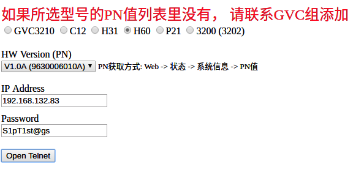
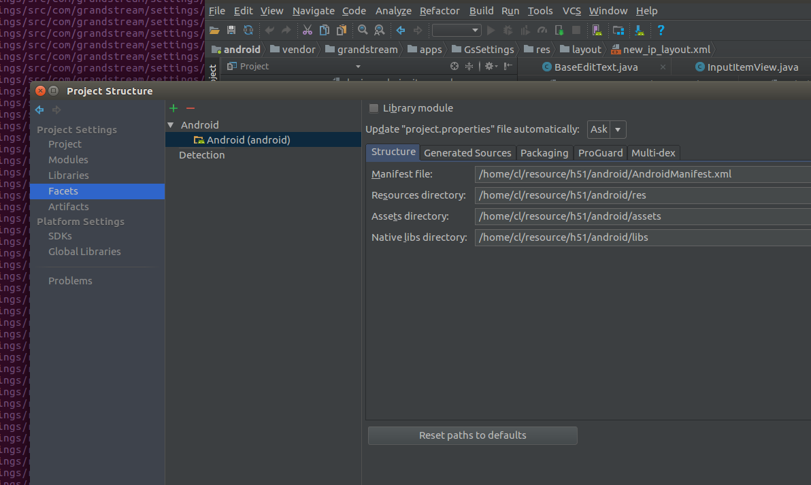
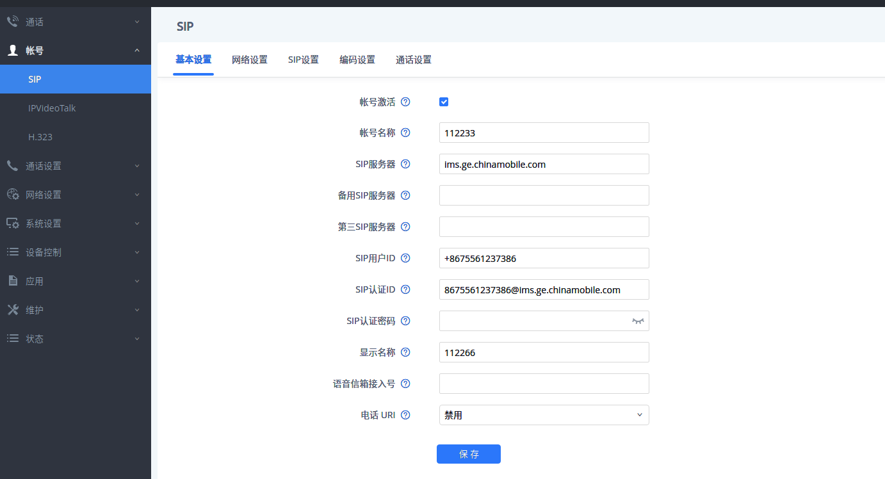
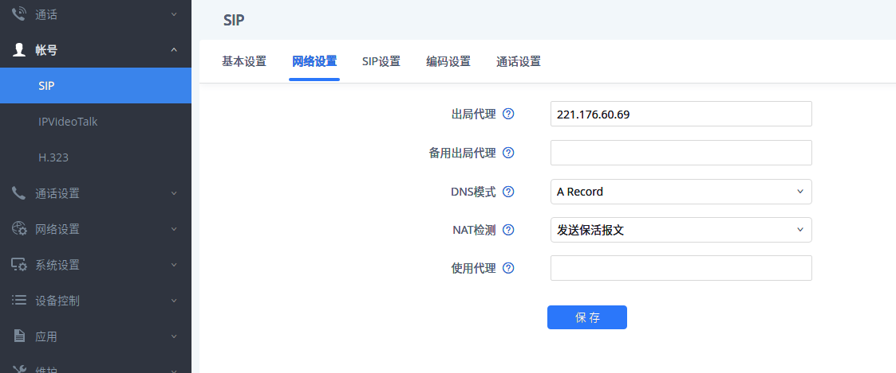
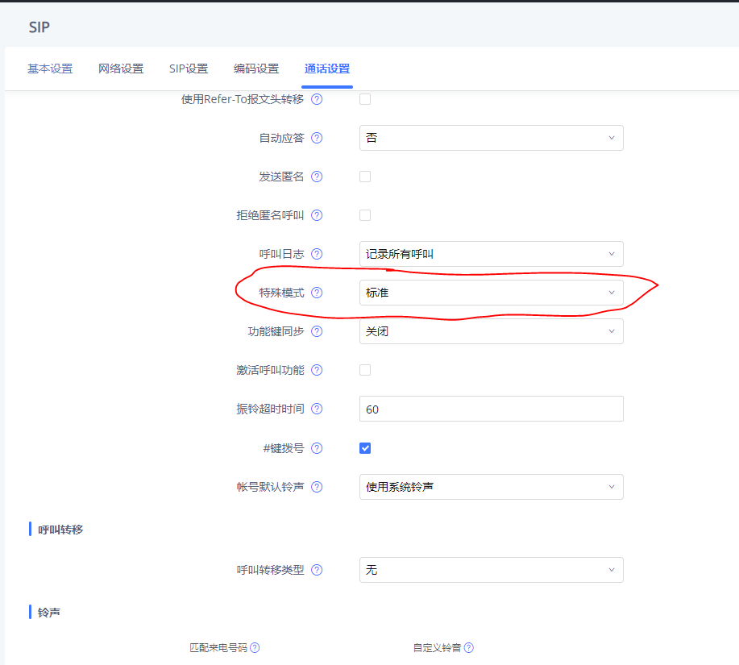
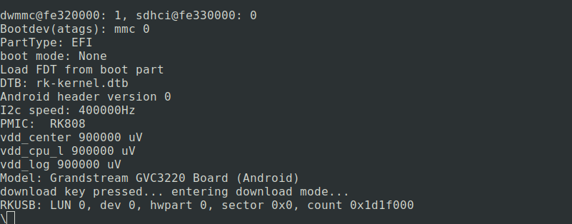
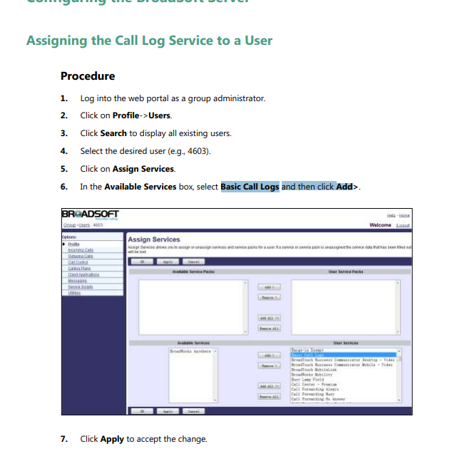
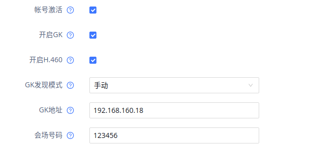
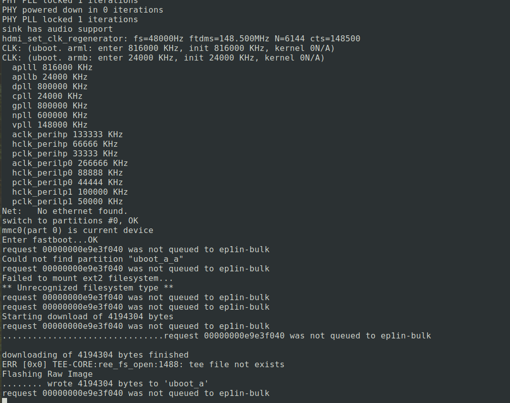

工作技巧

[TOC

## 1. 提交review

```
git add
//commit 不加-m，这样会使用模板编写
git commit
repo upload --re="zhxxiao"
```

## 2. 追加提交

`git commit --amend`ma

## 3. 撤销某次提交

`git reset ${你想要撤销的那次从committ的上一次的commit id}`

## 4. commitTemplate

1.  [NBF] 新增某些内容
2.  [INTERNAL] 功能优化，没有添加新功能
3.  [BUG bugid] bug

## 5. repo upload权限问题([http://192.168.120.246/:](http://192.168.120.246/:) &lt;urlopen error [SSL: CERTIFICATE_VERIFY_FAILED] certificate verify failed (_ssl.c:590)&gt;)

1.  export PYTHONHTTPSVERIFY=0
2.  repo upload --re="xiangsun" --no-verify

- 永久修改  
    修改`~/.bashrc`  
    文件最后增加`export PYTHONHTTPSVERIFY=0`

## 6. 下载文档

`repo init -u ssh://${UserName}@192.168.120.246:29418/GVC3210/manifests -m app.xml -b ${branch}&& repo sync -c && repo start ${branch} --all`  
各个设备的URL：  
H60:  
`repo init -u ssh://xiangsun@192.168.120.246:29418/GVC3210/manifests -m app.xml --repo-url=ssh://xiangsun@192.168.120.246:29418/GVC3210/git-repo  -b H51&& repo sync -c && repo start H51 --all`

P21：  
`repo init -u ssh://${user}@192.168.120.246:29418/A31HomeLetMirror/manifest -m app.xml && repo sync && repo start GVC32XX --all`

## 7. 修改了frameowork层的公有方法，需要修改api文件夹中的current.txt

`make update-api`

## 8. 刷机：

1.  下载zip  
    [http://192.168.120.240/html/hz/firmware/GVC3220/](http://192.168.120.240/html/hz/firmware/GVC3220/) + 日期
2.  解压至U盘根目录
3.  启动板子，按F7进入bios
4.  Internal EDK shell

## 9. 刷机后烧写CFG

1.  修改系统上的Ip为静态IP，方便连接  
    `adb connect ip`
2.  获取cfg  
    在 `/home/Sun/文档/工作/项目/GVC3220/gvc3220_9630004010A.cfg`  
    新的cfg文件  
    `http://192.168.120.240/html/hz/firmware/gvc3220_box/cfg/`
3.  push到板子  
    `adb push gvc3220_9630007111A.cfg /data/`
4.  在板子中执行，烧入cfg文件  
    `dd if=gvc3220_9630004010A.cfg of=/dev/block/by-name/factcfg`  
    新的GVC3220 用下面的命令：  
    `dd if=/data/gvc3220_9630007111A.cfg of=/dev/block/by-name/cfg`
5.  重启  
    `sync && reboot`
6.  烧入MAC

```
#3220:
echo "00:0B:82:A4:6F:C9" > /proc/gsboard/dev_info/dev_mac

#H60:
echo 00:0B:82:E2:EA:AC > /proc/gxvboard/dev_info/dev_mac
```

## 10. 查看某次提交详情：

`git show COMMIT_ID`

## 11. 关于编译的命令

```
Invoke ". build/envsetup.sh" from your shell to add the following functions to your environment:

- lunch: lunch <product_name>-<build_variant>

- tapas: tapas [<App1> <App2> ...] [arm|x86|mips|armv5|arm64|x86_64|mips64] [eng|userdebug|user]

- croot: Changes directory to the top of the tree.

- m: Makes from the top of the tree.

- mm: Builds all of the modules in the current directory, but not their dependencies.

- mmm: Builds all of the modules in the supplied directories, but not their dependencies.

To limit the modules being built use the syntax: mmm dir/:target1,target2.

- mma: Builds all of the modules in the current directory, and their dependencies.

- mmma: Builds all of the modules in the supplied directories, and their dependencies.

- mmp: Builds all of the modules in the current directory and pushes them to the device.

- mmap: Builds all of the modules in the current directory, and its dependencies, then pushes the package to the device.

- mmmp: Builds all of the modules in the supplied directories and pushes them to the device.

- provision: Flash device with all required partitions. Options will be passed on to fastboot.

- cgrep: Greps on all local C/C++ files.

- ggrep: Greps on all local Gradle files.

- jgrep: Greps on all local Java files.

- resgrep: Greps on all local res/*.xml files.

- mangrep: Greps on all local AndroidManifest.xml files.

- mgrep: Greps on all local Makefiles files.

- sepgrep: Greps on all local sepolicy files.

- sgrep: Greps on all local source files.

- godir: Go to the directory containing a file.

Environment options:

- SANITIZE_HOST: Set to 'true' to use ASAN for all host modules. Note that

ASAN_OPTIONS=detect_leaks=0 will be set by default until the

build is leak-check clean.

Look at the source to view more functions. The complete list is:
```

## 12. 出现不能在板子上创建什么的权限问题

在串口下执行`getAccess.sh`

## 13. 再次使用已用过的命令

`crtl + r`

## 14. 网页端卡死：

```
killall lighttpd
/system/lighttpd/sbin/lighttpd -f /system/lighttpd/etc/lighttpd.conf &
```

## 15. 权限问题：`adb: error: failed to get feature set: insufficient permissions for device: user in plugdev group; are your udev rules wrong?`

1.  `adb kill-server`
2.  `sudo adb start-server`

## 16. git add 错误文件

`git status` 先看一下add 中的文件  
`git reset HEAD` 如果后面什么都不跟的话 就是上一次add 里面的全部撤销了  
`git reset HEAD XXX/XXX/XXX.java` 就是对某个文件进行撤销了

## 17. git commit 错误文件

`git reset commit_id`

## 18. 每次要进入一个新工程做修改时，一定要拉取代码

`git pull --rebase`

## 19. lunch 数值

```
H60：32
GVC3220：9
```

## 20. 对每一个project 执行git 命令

`repo forall -c 'git pull'`

## 21. 尝试某个service

```
dumpsys | grep service 或者service list
dumpsys timezone_service
后面service的name,可以查看android/frameworks/base/core/java/android/app/SystemServiceRegistry.java$registerService方法的调用。
```

## 22. 恢复出厂设置网页端无法访问

设置里面开启网页访问。

## 22. 查看当前activity信息：

`dumpsys activity top`

## 23. 打开某个应用或者activity

`am start -n com.android.settings/.Settings`

## 24. 安装应用、 查看应用，在adb shell里面：

```
pm install -r /system/priv-app/Settings/Settings.apk
pm list packages
```

## 25. H60 opentelnet:



## 26. 设置SIP帐号：


*设备上的左上角人物头像变蓝 代表成功。*  
*如果没有成功：*  
*去网页的SIP->网络设置清除出局代理*

## 27. 添加语言

`android/vendor/grandstream/patch/language/addLang.sh`

## 28. dbus 监听：

`dbus-monitor --system`

GVC3220:  
`gs-dbus-monitor --system`

## 29. 更换java版本:

`sudo update-alternatives --config java`

## 30. 命令行恢复出厂设置：

```
fixed_factory_reset 7
fixed_factory_reset 15
reboot
```

## 31. git reset 错误

`git reflog`  
`git reset id`

## 32. 帐号激活

1.  nvram 修改  
    78 130 => 0  
    48 => null
    
2.  去网页重新激活：  
    帐号 -> SIP -> 保存 -> 应用
    

## 33. 查看类结构

1.  底部窗口：  
    Windows,ubuntu：`Alt+7`  
    Mac: `cmd +7`
2.  弹窗形式  
    Windows,ubuntu: `Ctrl + F12`  
    Mac: `cmd + F12`

## 33. 查看类继承关系

Windows：`Ctrl + H`  
Mac：`Control + H`

## 34. 想要某个app接受广播的优先级高于原生app

在Android.mk中加入：

LOCAL_PRIVILEGED_MODULE := true

## 33. 查看某人的提交

git log --author="xiangsun"

## 34. DBus监听

dbus-monitor --system

## 35. 修改了android/vendor/grandstream/frameworks/里面的代码需要##

android/frameworks/base/services 执行mmp，然后看情况是否需要重启让其生效

## 36. 查看系统版本

adb shell getprop ro.build.version.release

## 37. 临时启动一个Activity

adb shell am start -n com.android.contacts/com.grandstream.contacts.abatch.ImportActivity

## 38. 删除文件中的某一行##

sed -i -e '/>>>>/d'  zh-tw.txt

删除多行：

sed -i -e '/>>>>>>|======|<<<<<</d' *.txt

## 39. 不能在设备上安装app##

先看一下

nvram get :oem_id

nvram set  :oem_id=0

记得改回来  
nvram set  :oem_id=72（GVC3220）

## 40. android studio导入源码过程：

[AndroidStudio源码开发环境搭建](../../Android/Android_Frameworks/AndroidStudio源码开发环境搭建.md)
或者查看  
android/development/tools/idegen/README

## 41. 查看android版本

获取系统版本：adb shell getprop ro.build.version.release

获取系统api版本：adb shell getprop ro.build.version.sdk

## 42. 想要去除某个应用

去AndroidManifest.xml中去除下面这句话

## 43. H60刷机：

1.  插入U盘后一直按reset键，然后再接入电源 ，等显示器上有打印了再松开reset键  
    
    
2.  拔电重启
    

## 44. 打开串口

GVC3200系列和3210系列产品串口已经默认禁用，想要使用的开发人员可以按照下列方式开启：  
        3200系列：  
            1.先设置静态IP，telnet进入终端页面，如果需要root权限执行下su命令，  
            2.刷入一个u-boot.fex文件，附件可以下载。  
                    flash_boot u-boot.fex 0  
            3.等刷入完成，重启便可。

3210系列：  
            1.想办法telnet进入设备，打开终端页面，  
            2.在终端执行：gsconsole yes  
            3.执行完重启设备即可。

## 45. Device /dev/ttyS0 is locked.

开了两个minicom

## 46. 导入源码没有logcat：

在projectStructure 中添加一个Android  


## 47. 输入框光标问题，统一解法：

```
mInput.setCursorVisible(false);
mInput.setCursorVisibleWhenInput(true);
mInput.setOnFocusChangeListener(new OnFocusChangeListener() {
 @Override
 public void onFocusChange(View v, boolean hasFocus) {
 if (hasFocus) {
 if(mInput.getText().toString().length() > 0) {
 mInput.setCursorVisible(true);
 }else {
 mInput.setCursorVisible(false);
 }
} else {
 mInput.setCursorVisible(false);
 }
}
});
```

## 48. stash 之后，不小心删除了stash

从android studio里面右键项目，选择local history。找到你的修改，再revert

## 49. 查看当前的屏幕分辨率

cat /cache/hwc.reg

nvram get 25104  
nvram get 25104tmp

## 50. telnet 什么的打不开

重新录入mac  
h60:/proc/gxvboard/dev_info/dev_mac

## 51. 创建本地server

sudo ln -s target_directory /var/www/html/any_directory_name  
sudo service apache2 start

## 52. 更新API（更新current.txt）

make update-api

## 53. H60云课堂登陆：

移动账号1：  
    服务器：[ims.ge.chinamobile.com](http://ims.ge.chinamobile.com)  
    用户ID：+8675561237386  
    认证ID：8675561237386@ims.ge.chinamobile.com  
    认证密码：1901021088512993  
    出局代理：221.176.60.69  
    web端密码: 8V3y8E4c  
移动账号2：  
    服务器：[ims.ge.chinamobile.com](http://ims.ge.chinamobile.com)  
    用户ID：+8675561237387  
    认证ID：8675561237387@ims.ge.chinamobile.com  
    认证密码：1901021088522485  
    出局代理：221.176.60.69  
    web端密码: 8H2u3V8t  
  


## 54. android studio中的java文件图标显示为J，而不是C

右键src，Mard Directory as Source Root

## 55. adb 安装及卸载apk

adb install apk_path  
adb shell rm data/app/...apk

## 56. android studio 在某个类中快速定位方法

ctrl+F12

## 57. IP呼叫的被叫方设置



## 58. 打开日志：

`setprop log.r on`  
`setprop log.tag.GVCLauncher debug`

## 59. 板子上广播模拟发送

```
// android api < 26
am broadcast -a "action" --es state on打开/off关闭
//android api >= 26
am broadcast -a "com.base.module.xsicalls.AUTHORIZE_CHANGED" --es visible 0 --receiver-include-background
<INTENT> specifications include these flags and arguments:
    [-a <ACTION>] [-d <DATA_URI>] [-t <MIME_TYPE>]
    [-c <CATEGORY> [-c <CATEGORY>] ...]
    [-e|--es <EXTRA_KEY> <EXTRA_STRING_VALUE> ...]
    [--esn <EXTRA_KEY> ...]
    [--ez <EXTRA_KEY> <EXTRA_BOOLEAN_VALUE> ...]
    [--ei <EXTRA_KEY> <EXTRA_INT_VALUE> ...]
    [--el <EXTRA_KEY> <EXTRA_LONG_VALUE> ...]
    [--ef <EXTRA_KEY> <EXTRA_FLOAT_VALUE> ...]
    [--eu <EXTRA_KEY> <EXTRA_URI_VALUE> ...]
    [--ecn <EXTRA_KEY> <EXTRA_COMPONENT_NAME_VALUE>]
    [--eia <EXTRA_KEY> <EXTRA_INT_VALUE>[,<EXTRA_INT_VALUE...]]
        (mutiple extras passed as Integer[])
    [--eial <EXTRA_KEY> <EXTRA_INT_VALUE>[,<EXTRA_INT_VALUE...]]
        (mutiple extras passed as List<Integer>)
    [--ela <EXTRA_KEY> <EXTRA_LONG_VALUE>[,<EXTRA_LONG_VALUE...]]
        (mutiple extras passed as Long[])
    [--elal <EXTRA_KEY> <EXTRA_LONG_VALUE>[,<EXTRA_LONG_VALUE...]]
        (mutiple extras passed as List<Long>)
    [--efa <EXTRA_KEY> <EXTRA_FLOAT_VALUE>[,<EXTRA_FLOAT_VALUE...]]
        (mutiple extras passed as Float[])
    [--efal <EXTRA_KEY> <EXTRA_FLOAT_VALUE>[,<EXTRA_FLOAT_VALUE...]]
        (mutiple extras passed as List<Float>)
    [--esa <EXTRA_KEY> <EXTRA_STRING_VALUE>[,<EXTRA_STRING_VALUE...]]
        (mutiple extras passed as String[]; to embed a comma into a string,
         escape it using "\,")
    [--esal <EXTRA_KEY> <EXTRA_STRING_VALUE>[,<EXTRA_STRING_VALUE...]]
        (mutiple extras passed as List<String>; to embed a comma into a string,
         escape it using "\,")
    [--grant-read-uri-permission] [--grant-write-uri-permission]
    [--grant-persistable-uri-permission] [--grant-prefix-uri-permission]
    [--debug-log-resolution] [--exclude-stopped-packages]
    [--include-stopped-packages]
    [--activity-brought-to-front] [--activity-clear-top]
    [--activity-clear-when-task-reset] [--activity-exclude-from-recents]
    [--activity-launched-from-history] [--activity-multiple-task]
    [--activity-no-animation] [--activity-no-history]
    [--activity-no-user-action] [--activity-previous-is-top]
    [--activity-reorder-to-front] [--activity-reset-task-if-needed]
    [--activity-single-top] [--activity-clear-task]
    [--activity-task-on-home]
    [--receiver-registered-only] [--receiver-replace-pending]
    [--selector]
    [<URI> | <PACKAGE> | <COMPONENT>]
```

## 60. 打开apache共享本地文档

sudo ln -s /home/Sun/directory_you_want_to_access /var/www/html/myweb  
sudo service apache2 start 或者sudo service apache2 restart

## 61. 某个文件回退道某个版本

git checkout ${commit_id} /path/to/file

## 62. java 1.6的安装：

1.  下载jdk1.6

[https://www.oracle.com/technetwork/java/javase/downloads/java-archive-downloads-javase6-419409.html](https://www.oracle.com/technetwork/java/javase/downloads/java-archive-downloads-javase6-419409.html)

2.  安装  
    chmod a+x file  
    sudo ./file
3.  加入配置：

sudo update-alternatives --install /usr/bin/java java /usr/local/java/jdk1.6.0_23/bin/java 300

sudo update-alternatives --install /usr/bin/javac javac /usr/local/java/jdk1.6.0_23/bin/javac 300

## 63. LDAP联系人填写


```
192.168.120.254
dc=pbx,dc=com
CallerIDName
AccountNumber
(CallerIDName=%)
(AccountNumber=%)
CallerIDName

或者

服务器地址 
192.168.160.123
端口号 
389
根节点 
dc=pbx,dc=com
用户名（绑定节点） 
cn=admin,dc=pbx,dc=com
密码 
admin123
LDAP号码属性 
AccountNumber MobileNumber HomeNumber Fax
LDAP邮件属性 
Email
LDAP名字筛选规则 
(CallerIDName=%)
LDAP号码筛选规则 
(AccountNumber=%)
LDAP显示名属性 
CallerIDName AccountNumber
最大返回条数 
50
搜索超时 (秒) 
30

```

## 64. 更改java版本：

sudo update-alternatives --install /usr/bin/javac javac /usr/local/java/jdk1.6.0_45/bin/javac 300

sudo update-alternatives --install /usr/bin/java java /usr/local/java/jdk1.6.0_45/bin/java 300

sudo update-alternatives --config java  
sudo update-alternatives --config javac  
update-alternatives --help

## 65. Android studio 导入源码 Scanning files to index 提高速度


## 66. no branches ready for upload

很可能分支错误

## 67. android studio 每次都要indexing问题：

（1）将代码目录调为project，然后右键根目录，选择Open Modules Settings，

（2）如果勾选了 Generated source  Automatically ,去掉勾选项，然后点击apply

（3）如果提示错误信息，选择Android ，然后选中Structure,手动选择需要的Manifest. Resoureces. Assets. Native lib，

对应的目录分别为：

Manifest File >> /android/frameworks/base/core/res/

Resources directory >> /android/frameworks/base/core/res

Assets directory >> /android/frameworks/base/core/res/assets

Native libs directory >> /android/ frameworks/base/libs

完成设置后，点击apply，点击OK，这个提示就会慢慢消失

## 68. 导入源码：

（1）初始化命令工具  
soruce build/envsetup.sh  
lunch

（2）编译 idegen 模块，生成idegen.jar  
mmm development/tools/idegen/

（3）生成针对 Android 开发工具的配置文件  
sudo ./development/tools/idegen/idegen.sh

（4）加权限：  
sudo chmod a+w android.iml  
sudo chmod a+w android.ipr

参考：[AndroidStudio源码开发环境搭建](../../Android/Android%20Framework/AndroidStudio源码开发环境搭建.md)

## 69. 新版子刷系统：

至于如何链接设备, 需要一根usb线, 烧写的时候可以使用usb线连接电脑和设备, 设备连接usb3.0的口(蓝色的),然后在设备串口下按住ctrl+D 拔电上电重启就会进入烧写模式, 然后就可以使用上述命令了.  烧写完update.img 会自动重启,  但是其他的img 需要手动在设备的串口下ctlr + c 终止烧写模式, 设备会继续重启, 如果重启失败, 请重新上电

USB 连上了，但执行第三个语句还是没有设备，reboot bootloader  
     进入android目录  
（1）烧写update.img：

sudo ./RKTools/linux/Linux_Upgrade_Tool_v1.43/upgrade_tool uf rockdev/Image-gvc3220/update.img

（2）然后等待系统起来后, 再用烧写附件中的boot.img  
sudo ./RKTools/linux/Linux_Upgrade_Tool_v1.43/upgrade_tool di -b boot.好的img

（3）如果大家有框架或者app的修改, 可以直接使用make -j4 编译, 然后使用下面的命令就可以了

sudo ./RKTools/linux/Linux_Upgrade_Tool_v1.43/upgrade_tool di -s out/target/product/gvc3220/system.img

## 70. minicom 关闭.、打开日志（log）

关闭：dmesg -n 1  
打开：dmesg -n 8

## 71. packages/apps/Contacts/Android.mk: error: Contacts: Must specify LOCAL_SDK_VERSION or LOCAL_PRIVATE_PLATFORM_APIS,

Android.mk中加入

ifeq ($(PLATFORM_VERSION), 9)  
LOCAL_PRIVATE_PLATFORM_APIS := true  
endif

## 72. 重新烧写update.img

1.  插上蓝色USB线，接入蓝色插口处
    
2.  在minicom中按住`crtl + D`，插入电源，minicom会有下面的状态  
    
    
3.  执行`sudo ./RKTools/linux/Linux_Upgrade_Tool_v1.43/upgrade_tool uf ~/Downloads/update.img`
    

## 73. Download Firmware Fail

缺少文件：~/workspace/work_workspace_android/GVC3220_new/android/RKTools/linux/Linux_Upgrade_Tool_v1.43/config.ini

重新解压：~/workspace/work_workspace_android/GVC3220_new/android/RKTools/linux/Linux_Upgrade_Tool_v1.43.zip

## 74. GVC3220 当前拨打电话：

nvram set :avslive=true

## 75. 没有权限kill某个应用

1.  将该应用退到后台，按home  
    2. adb shell am kill com.example.android.codelabs.lifecycle

## 76. 锁屏相关操作

（1）命令行查看锁屏时间

settings list system | grep timeout

（2）命令行设置锁屏时间

settings put system screen_off_timeout 12

## 77. 查看文件占用

fuser filename

## 78. 语言发生了改变，如果生效

直接将文件push到/system/language/下  
`adb push *.txt /system/language/ && adb shell killall system_server`

## 79. 语言添加不进去

android/vendor/grandstream/language/insertLang.sh  
输入key,数字:2423  
输入alue,2423对应的文字.  
再android/vendor/grandstream/language/addLang.sh  
增加文字

## 80. 增加lifeCycle，需要再Android.mk中添加 LOCAL_STATIC_ANDROID_LIBRARIES += androidx.lifecycle_lifecycle-extensions

## 81. 快速编译解决办法

MiniOut介绍：  
**加粗文本**  
为了节约磁盘空间，避免Android源码整体编译。给出了一个Mini Out的方案。开发需要先下载基础的 out，并在开发过程遇到问题可以进一步下载增量的 out，以解决 mm 单模块编译。

使用方法：

1.  下载base out，并解压到android目录下，本地将不再需要整体编译。该out已经包含了编译所需要的基础产物。  
    [http://192.168.130.33/hz/firmware/WP850/WP_HIPDA/DailyBuild/base-out.tar.gz](http://192.168.130.33/hz/firmware/WP850/WP_HIPDA/DailyBuild/base-out.tar.gz)
    
2.  特殊依赖模块下载，下载增量的 out。mm编译时，如果第一步满足不了编译所需的所有模块，可以自行判断所需的模块，并从下面的网页勾选，下载增量的 out。  
    [http://192.168.120.239/html/miniout/miniout.html](http://192.168.120.239/html/miniout/miniout.html)
    

## 82. 应用程序中某个程序的显示与隐藏

隐藏：pm disable com.base.module.statedetection  
显示：pm enable com.base.module.statedetection

## 83. BroadSoft nvram 值：

```
    public static final String AUTH_METHOD = "22054";
    public static final String AUTH_SIP = "0";
    public static final String AUTH_LOGIN = "1";
    public static final String SERVER = "1591";
    public static final String PORT = "1592";
    public static final String SIP_ID = "1593";
    public static final String SIP_PWD = "1594";
    public static final String USER_NAME = "22034";
    public static final String USER_PWD = "22103";
     bs_need_re_login
```

## 84. BroadSoft 联系人测试相关操作：

**先开通所有权限**



1.  BS联系人（以账号2764为例，账号2764在GrandstreamHZAdmin1下）

（1）个人目录：登陆BS服务器->进入profile->user下，找到账号2764并点击，进入2764账号页面->outgoing calls->personal phone list，可以导入. 添加、 编辑删除号码

（2）群组目录：登陆BS服务器->utilities->Group directory，可以查看所有群组和群组常用号码。群组目录实际是由GrandstreamHZAdmin1账号下的所有users及call centers组成，可以通过修改users和callcenters信息进行修改群组信息。

（3）群组常用：登陆BS服务器->utilities->Common phone list，可以导入、 添加、 编辑删除号码

（4）企业目录&&企业常用：联系美国tingzhang，表示没有权限设置企业层级的目录

BS登陆网址登陆，直接账号2674@as.iop1.broadworks.net ,welcome1,登陆后，在页面右上角下拉框选择call center，可进入callcenter，在contact栏可以查看该账号下出企业目录外的所有目录

2.  BS通话记录  
    登陆BS服务服务器->进入profile->user下，找到账号2764并点击，进入2764账号页面->Utilities->Basic call logs，可以查看. 删除未接来电记录. 拨打记录、 接听记录。
    
3.  创建BS通话记录
    
    1.  按照下面的在设备上激活帐号
    
    ```
    sip账号登录：
    账号名称：u9736722381
    服务器：broadsoftlab.com
    sip用户id:9736722381
    sip认证id:u9736722381
    密码填上
    显示名称：u9736722381
    出局代理：64.103.37.43:5683
    DNS模式：SRV
    ```
    2.  创建联系人  
        可以是后四位，例如你的帐号是9736722381，联系人可以是2382
        
    3.  拨打该联系人
        
4.  BroadSoft 界面填写：
    
    1.  服务器地址：[http://broadsoftsandboxxsp.cisco.com/CommPilot](http://broadsoftsandboxxsp.cisco.com/CommPilot)
    2.  用户名：u9736722111@broadsoftlab.com
    3.  密码：。。。

## 85. 正则表达式，不包含某个字符串（AudioHardwareTiny ）：

^((?!AudioHardwareTiny).)*$

## 86. 自己更新img

./build.sh -U -K -u -o -G -A -v userdebug

## 87. 动态设置Style

动态设置Style一般不起作用。

## 88. [可用build.sh](http://xn--build-tv8hp89q.sh)

~/workspace/work_workspace_android/GVC3220_new/android/device/rockchip/rk3399/build.sh  
**注意：** 把他copy到~/workspace/work_workspace_android/GVC3220_new/android下面。

## 89. 写完代码查看有没有内存泄漏：

`dumpsys meminfo <package>`  
看自己打开了几个Activity界面，退出应用或者Activity时ViewRootImpl或者Activities引用是否相应减少，如果退出页面几秒钟对应的引用数没有减少，肯定是泄漏了。

## 90. 设置网卡为混杂模式：

`sudo ifconfig enp1s0 promisc`  
取消  
`sudo ifconfig enp1s0 -promisc`

## 91. adb shell 内锁屏时间控制：

```
# 获取锁屏时间
settings get system screen_off_timeout
# 设置锁屏时间，最大即为永不锁屏
settings put system screen_off_timeout 2147483647
```

## 92. 省电模式

省电模式  
可以使用多个命令测试您的应用在低电量条件下的行为。  
注：您还可以使用设备的 Settings > Battery saver 界面将设备置于省电模式。  
要模拟拔下设备电源时的情形，请使用以下命令：  
`$ adb shell dumpsys battery unplug`

要测试设备在低电量条件下的行为，请使用以下命令：  
`$ adb shell settings put global low_power 1`

完成测试后，您可以使用以下命令撤消设备的手动设置：  
`$ adb shell dumpsys battery reset`

## 93. 查看电源情况：

`dumpsys battery`

## 94. 省电模式

可以使用多个命令测试您的应用在低电量条件下的行为。  
注：您还可以使用设备的 Settings > Battery saver 界面将设备置于省电模式。  
要模拟拔下设备电源时的情形，请使用以下命令：  
`$ adb shell dumpsys battery unplug`

要测试设备在低电量条件下的行为，请使用以下命令：  
`$ adb shell settings put global low_power 1`

完成测试后，您可以使用以下命令撤消设备的手动设置：  
`$ adb shell dumpsys battery reset`

强制系统进入低电耗模式  
`adb shell dumpsys deviceidle force-idle`

[参考](https://developer.android.com/training/monitoring-device-state/doze-standby.html#testing_doze)

## 95. 修改`frameworks/support/`内部代码，应用

1.  修改`frameworks/supportbuildSrc/build.gradle`,如下：  
    

```
buildscript {
    def supportRootFolder = project.projectDir.getParentFile()
    apply from: "unbundled_check.gradle"
    repositories {
    mavenCentral() // <-- add this at top
        google()
        jcenter()
        maven {
            url "${supportRootFolder}/../../prebuilts/tools/common/m2/repository"
        }
        maven {
            url "${supportRootFolder}/../../prebuilts/gradle-plugin"
        }
        if (isUnbundledBuild(supportRootFolder)) {
            jcenter()
        }

    }

    apply from: "build_dependencies.gradle"

    dependencies {
        classpath build_libs.kotlin.gradle_plugin
        classpath 'com.android.tools.build:gradle:3.2.0'
        //他说是什么版本就写什么版本
        classpath 'com.google.gms:google-services:3.2.0-alpha16'    
    }

    configurations.classpath.resolutionStrategy {
        eachDependency { details ->
            if (details.requested.group == 'org.jetbrains.kotlin') {
                details.useVersion build_versions.kotlin
            }
        }
    }
}
def runningInBuildServer = System.env.DIST_DIR != null && System.env.OUT_DIR != null
if (runningInBuildServer) {
    System.setProperty("kotlin.compiler.execution.strategy", "in-process")
}

ext.supportRootFolder = project.projectDir.getParentFile()
apply from: 'repos.gradle'
apply from: "build_dependencies.gradle"
apply plugin: "kotlin"
apply from: "kotlin-dsl-dependency.gradle.kts"

repos.addMavenRepositories(repositories)

dependencies {
    compile build_libs.gradle
    compile build_libs.jacoco
    compile build_libs.error_prone_gradle
    compile build_libs.jarjar_gradle
    compile gradleApi()
    testCompile "junit:junit:4.12"

}
```

## 96. gradlew 编译操作

`./gradlew createArchive` 全编

## 97. 截屏

1.  第一种方式

```
//（保存到SDCard）
adb shell /system/bin/screencap -p /sdcard/screenshot.png
// 从SD卡导出到电脑，注意 F:\\mvp 为电脑路径，必须存在
adb pull /sdcard/screenshot.png F:\\mvp（保存到电脑）
```

2.  第二种方式

```
adb shell screencap -p | sed 's/
$//' > screen.png
```

## 98. 系统升级

打开web -> 维护 -> 升级 -> 固件服务器路径（类似于'[http://192.168.120.240/html/hz/firmware/gvc3220_box/20.20.03.19/](http://192.168.120.240/html/hz/firmware/gvc3220_box/20.20.03.19/)'）

## 99. 模拟遥控器

`input keyevent 4(keycode)`

## 100. 所有account的帐号

`android/vendor/grandstream/frameworks/GsCoreService/src/main/java/com/gs/core/service/nvram/NvramManagerService.java`

```
config.putAccount(0, GsConstants.AccountType.SIP);
config.putAccount(1, GsConstants.AccountType.IPVT);
config.putAccount(2, GsConstants.AccountType.BLUE_JEANS);
config.putAccount(5, GsConstants.AccountType.ZOOM);
config.putAccount(8, GsConstants.AccountType.H323);
```

## 101. 联系人数据库各字段涵义

> data11: 帐号信息  
> data12: mimetype=name时 是否是web创建的联系人，是为1，不是为空  
> mimetype=phone时 标准number,只有在对号码修改之后才存进去

## 102. 快速打开目录

`nautilus .`

## 103. 网页密码nvram值

2

## 104. GVC3220 新板子mmp，不成功

```
gsavbctl disable-verity
reboot
getAccess.sh
gsavbctl get-verity //检查状态
```

## 105. 权限白名单

```
android/packages/apps/PackageInstaller/src/com/android/packageinstaller/permission/service/PermissionWhiteListService.java
```

`android/vendor/grandstream/patch/etc/app_permission_policy.xml`

## 106. 冲突解决之后，提交不上去

先将本地版本回退到冲突之前的版本，不光是本文件夹的（git log . 是整个git文件夹的），然后再重新commit。

## 107. web端查看p值方式：

GVC3220, GAC2570,WP850 web页面添加了查看p值的便捷方式：  
登录后，同时按下：Ctrl + Alt + P, 页面刷新后 鼠标移动至 配置项名称处可显示该配置项的p值。  
（或者可以在URL栏输入#showp 后缀后，刷新页面，可以达到同样的效果）

## 108. 修改某一次提交

参考Git笔记本

## 109. nvram 监听

```
    DbusApi.addCallback(mDbusCallback.callback, DbusSignal.SIGNAL_AUDIO_DEV + "," + DbusSignal.SIGNAL_NVRAM_CHANGE);
    
    public void onCallback(int sigId, String sigName, int argNum, List<DbusObj> argList) {
             if(parent.get() == null) {
                return;
             }
             if(DbusSignal.SIGNAL_NVRAM_CHANGE.equals(sigName)) {
                 Log.d(TAG, "onCallback: arglist:" + argList);
                 if(NVRAM_USB_PORT_0.equals(argList.get(1).getStringValue()) ||
                        NVRAM_USB_PORT_1.equals(argList.get(1).getStringValue())) {
                     parent.get().mUSBStatus = parent.get().getUSBStatus();
                     parent.get().mSPKRStatus = parent.get().getSPKRStatus();
                     parent.get().mHandler.sendEmptyMessage(USB_CHAGE);
                 }
             }
        }
    』
```

## 110. java.lang.UnsatisfiedLinkError: dlopen failed: library is not accessible for the namespace "classloader-namespace"

解决：system/etc/public.libraries.txt中添加该so的全名，再重启

## 111. NAS 帐号和密码：

地址：`192.168.200.3`  
`/volume1/dev1_zhxxiao/`  
用户名和密码：`zhxxiao/JDnYNm`

- 自己的  
    开启：`sudo /etc/init.d/nfs-kernel-server start`  
    地址：`192.168.125.25`  
    文件路径：`/mnt/nfs_server_dir/`
    
- 路径存储：  
    `/data/system/users/0/settings_system.xml`
    

## 112. sqlite3 数据库日常使用

```
sqlite> .mode column
sqlite> .header on
```

## 113. 所有的app列表(ProductGVC3220)：

`/home/Sun/workspace/work_workspace_android/GVC3220_new/android/device/rockchip/rk3399/gvc3220_box/ProductGVC3220.mk`  
新增加app，需要再这个mk中增加你app的mk文件中的`LOCAL_PACKAGE_NAME`的值

## 114. 查看wifiDisplay状态

`dumpsys wifip2p`

## 115. 获取settings值：

`settings get system 'volume_music'`  
`settings list system`

## 116. 设置中存的值：

`/data/system/users/0/settings_system.xml`

## 117. 升级P值：

```
gvc3220_box:/ # nvram get 192
192.168.120.240/html/hz/firmware/gvc3220_box/20.20.05.06/
```

## 118. web代码修改

```
adb push android/vendor/grandstream/service/webserver/lighttpd/sbin/lighttpd  /system/lighttpd/sbin/lighttpd
stop lighttpd && start lighttpd 
```

## 119. 设置多个按键控制：

/home/Sun/workspace/work_workspace_android/GVC3220_new/android/frameworks/base/services/core/java/com/android/server/policy/PhoneWindowManager.java

## 120. StatusBar的样式设计：

/home/Sun/workspace/work_workspace_android/GVC3220_new/android/frameworks/base/packages/SystemUI/src/com/android/systemui/statusbar/phone/StatusBar.java

## 121. logcat 使用：

```
logcat -s *:W   #打印warning 以上的日志
logcat -s WifiScanningService:E #打印Tag为WifiScanningService的Error日志
logcat -s system.err,AndroidRuntime
```

## 122. H323注册：

  
地址: `192.168.160.18`

## 123. Audio 相关信息

`dumpsys audio`

## 124. 设置丢包率

```
# 设置
    sudo tc qdisc add dev enp1s0 root netem loss 60%
# 清除
    sudo tc qdisc del dev enp1s0 root
```

## 125. 开启telnet:

1.  `vi /system/xbin/onBootCompleted.sh`
2.  倒数第三行，在`echo "onboot end " >> $LOGF`上面一行，加入`busybox telnetd -l /system/bin/sh`
3.  `reboot`

## 126. 各种数据库路径:

```
/data/data/com.android.providers.contacts/databases/calllog.db
/data/data/com.android.providers.contacts/databases/contacts2.db
/data/data/com.base.module.recording/databases/recording.db
/data/data/com.android.providers.media/databases/external.db
/data/data/com.android.providers.media/databases/internal.db


lock password:
/data/system/gatekeeper.password.key
/data/system/locksettings.db

/data/data/com.base.module.preset/databases/preset.db
/data/data/com.base.module.providers.sms/databases/mmssms.db
/data/data/com.base.module.recording/databases/recording.db
/data/data/com.android.providers.calendar/databases/calendar.db
/data/data/com.android.providers.media/databases/external.db
/data/data/com.android.providers.media/databases/internal.db
/data/data/com.android.providers.downloads/databases/downloads.db
/data/data/com.android.providers.tv/databases/tv.db
/data/data/com.base.module.ipvideotalkpro/databases/message.db
/data/data/com.base.module.schedule/databases/conference.db
/data/data/com.base.module.pack/databases/pack.db
/data/data/com.android.providers.contacts/databases/contacts2.db
/data/data/com.android.providers.contacts/databases/calllog.db
/data/data/com.android.providers.contacts/databases/profile.db
/data/system/watchlist_report.db
/data/system/locksettings.db
/data/system/notification_log.db
/data/system_de/0/accounts_de.db
/data/system_ce/0/accounts_ce.db
/data/user_de/0/com.android.providers.settings/databases/gs_settings.db
/data/user_de/0/com.android.settings/databases/battery_settings.db
/data/user_de/0/com.android.bluetooth/databases/btopp.db
/data/user_de/0/com.android.providers.contacts/databases/calllog_shadow.db
/system/etc/timezone.db
```

锁屏密码为空时，数据库中`lockscreen.password_type`为0，`/data/systemgatekeeper.password.key`为空。

凭据：  
用户凭据：/data/misc/keystore/user_0/  
受信任的用户凭据：/data/misc/user/0/cacerts-added

## 127. debuggerd 使用：

`debuggerd -b pid` 查看进程详细情况，包括所有线程

## 128. tftp下载联系人cmd：

`tftp -g -l /storage/emulated/0/phonebook.xml -r phonebook.xml 192.168.160.78`

## 129. 查看某个service是否在运行：

`dumpsys activity services | grep recording`

## 130. git查看stash中的详细改变

`git stash show -p stash@{0}`

## 131. 修改框架代码不生效(包括android/vendor/grandstream/frameworks)

必须使用eng版本  
`getprop|grep build` 查看版本

## 132. 出现这个错误`error: Resource at colorPrimary appears in overlay but not in the base package; use <add-resource> to add.`

在Android.mk中添加：

```
LOCAL_AAPT_FLAGS := \
    --auto-add-overlay \
    --extra-packages com.grandstream.basemodule
```

## 132. 遥控器升级能运行要修改的nvram

```
nvram set 25027=19300 && nvram set 25028=1.3

```

此处的version:20，需要大于 `nvram get 25026`

```
vi sdcard/remotefirmware/version

1.0.1.20
1.0.0.1
```

## 133. 查看系统是否包含提交：

`git tag | grep "the version you want to query"` git checkout GVC3220_1.0.0.32_Beta`  
查看是否已经修改了。

## 134. 更改log 级别：

`setprop log.tag.WifiScanningService I`

## 135. find 去掉所有不存在文件的打印：

`find /home/alvin 2>/dev/null`

## 136. 日期格式修改不成功：

修改 `/home/Sun/workspace/work_workspace_android/GVC3220_new/android/vendor/grandstream/external/nvramExchangeProperty/etc/nvramregistry.xml`


1 修改为0
`<!-- type 0 means nvram exchange property, 1 means nvram to property, 2 means property to nvram -->`

## 137. 查看没有使用的资源

`lint --check UnusedResources .`

## 138. P值不能修改，设置了范围。

原本的

```
<Pvalue>
<name>4507</name>
<min>1</min>
<max>4294967295</max>
<mandatory>1</mandatory>
</Pvalue>
```

要做范围，长度，大小等限制得配category

```
<Pvalue>
<name>4507</name>
<category>number</category>
<min>1</min>
<max>10000000</max>
<mandatory>1</mandatory>
</Pvalue>
```

## 139. 接收新的Dbus注意点：

1.  `android/vendor/grandstream/frameworks/GsCommon/src/main/java/com/gs/dbus/DbusSignal.java` 加上对应Dbus名称。

```
public static final String SIGNAL_ECHODELAY_STATUS    = "echodelay_status";
public static final int SIGNAL_ID_ECHODELAY_STATUS = 1004;
//添加case，对参数进行校验
 public static boolean checkDbusParams(int sigId, Object[] objArray) {
        int objLen = objArray.length;

        switch (sigId) {
         case SIGNAL_ID_ECHODELAY_STATUS:
                if(objLen == 2
                        && (objArray[0] instanceof Boolean)
                        && (objArray[1] instanceof Integer)) {
                    return true;
                }
                break;
        }
}

```

2.  增加信号枚举：  
    `android/vendor/grandstream/serviceapp/GsService/impl.dbus/src/main/java/com/gs/impl/dbus/DbusSignalEnum.java`

```
SIGNAL_ECHODELAY_STATUS(DbusSignal.SIGNAL_ECHODELAY_STATUS, DbusSignal.SIGNAL_ID_ECHODELAY_STATUS);
```

## 140. GMD相关日志信息

`logcat | grep -E "GMD-|HidHost|Nrf"`

## 141、avs调试信息打印与关闭

打开：  
minicom中执行  
`avsterm`

关闭：  
`ctrl + D`

## 141. 回声延迟（AEC）数值记录：

`nvram get 22280`  
avs中应用的数值是通过:`avsterm`

## 142. 获取settings 全局数据

1.  java 中：

```
android.provider.Settings.System.putInt(mService.getContentResolver(),
                android.provider.Settings.System.SCREEN_OFF_TIMEOUT, value * 1000);
```

shell中  
`settings get system screen_off_timeout`

2.  java 中

```
Settings.Global.getInt(mResolver,
                Settings.Global.SYS_STORAGE_THRESHOLD_PERCENTAGE, DEFAULT_THRESHOLD_PERCENTAGE);
```

shell 中  
`settings get system sys_storage_threshold_percentage`

## 143. android/frameworks/base/services/core 所属进程

`system_process`

## 144. 使自己的应用具有系统权限：

> 只能在源码mk编译的情况。

1.  AndroidManifest.xml中的manifest节点中加入"android:sharedUserId="android.uid.system"这个属性

```
<manifest xmlns:android="http://schemas.android.com/apk/res/android"
    package="com.base.module.ldap"
    android:sharedUserId="android.uid.system"
    android:versionCode="1"
    android:versionName="1.0" >
```

2.  Android.mk中增加这一行  
    `LOCAL_CERTIFICATE := platform`

## 145. airplay 打开

```
nvram show | grep air
:airplay_state=0    => com.gs.intent.AIRPLAY_STATE_CHANGED
22382=1     => com.gs.intent.AIRPLAY_SET_SYNC
```

## 145. 没有通过的patch怎么下载

去这个patch的CodeReview，右上角Download,复制pull。直接去命令行粘贴就行。  


## 146. 进入出厂程序

拨号界面输入`***3424*`

## 147. 获取cpu内核型号（arm，x86等等）：

`getprop ro.product.cpu.abi`

## 148. Chrome android 源码编译：

[参考](https://chromium.googlesource.com/chromium/src/+/master/docs/android_build_instructions.md)

1.  `git clone https://chromium.googlesource.com/chromium/tools/depot_tools.git`
    
2.  `export PATH=$PATH:/path/to/depot_tools`
    
3.  `mkdir chromium`
    
4.  `fetch --nohooks android` 或者 `fetch --nohooks --no-history android`  
    fetch 使用```  
    usage: [fetch.py](http://fetch.py) [options] <config>[--property=value [--property2=value2 ...]]</config>
    
    This script can be used to download the Chromium sources. See  
    [http://www.chromium.org/developers/how-tos/get-the-code](http://www.chromium.org/developers/how-tos/get-the-code)  
    for full usage instructions.
    
    Valid options:  
    -h, --help, help Print this message.  
    --nohooks Don't run hooks after checkout.  
    --force (dangerous) Don't look for existing .gclient file.  
    -n, --dry-run Don't run commands, only print them.  
    --no-history Perform shallow clones, don't fetch the full git history.
    
    Valid fetch configs:  
    android  
    android_internal  
    breakpad  
    chromium  
    config_util  
    crashpad  
    dart  
    depot_tools  
    devtools-frontend  
    goma_client  
    gyp  
    infra  
    infra_internal  
    inspector_protocol  
    ios  
    ios_internal  
    nacl  
    naclports  
    node-ci  
    pdfium  
    skia  
    skia_buildbot  
    syzygy  
    v8  
    webrtc  
    webrtc_android  
    webrtc_ios
    
5.  `vim build/install-build-deps.sh`去掉 228 行中的`lib32gcc-s1`
    
6.  `cd src`
    
7.  `echo "target_os = [ 'android' ]" >> ../.gclient`
    
8.  `gclient sync`
    
9.  `build/install-build-deps-android.sh`
    
10. `gclient runhooks`
    

## 149. 恢复第一次进入设置向导的方法

`vi /data/system/users/0/package-restrictions.xml`

去掉以下代码：

```xml
<pkg name="com.grandstream.provision" ceDataInode="884">               
        <disabled-components>                                              
            <item name="com.grandstream.provision.activity.MainActivity" />
        </disabled-components>                                   
</pkg>
```

## 150. 升级弹框

监听广播  
`am broadcast -a "com.base.module.systemmanager.UPGRADE_OR_REBOOT" --es type upgrade`

## 160. dbus shell发送

```shell
# 实现如此一个dbus
#signal sender=:1.29 -> dest=(null destination) serial=2 path=/com/grandstream/dbus/app; interface=com.grandstream.dbus.signal.to.web; member=ui_sync
#string "firmware_install"
#int32 1

Usage: gs-dbus-send [--help] [--system | --session | --address=ADDRESS] [--dest=NAME] [--type=TYPE] [--print-reply[=literal]] [--reply-timeout=MSEC] <destination object path> <message 
name> [contents ...]

gs-dbus-send --system --type=signal /com/grandstream/dbus/app com.grandstream.dbus.signal.to.web.ui_sync string:firmware_install int32:1 
```

## 170. 新img下载完成的dbus

`gs-dbus-send --system --type=signal /com/grandstream/dbus/gui com.grandstream.dbus.signal.upgrade string:status int32:0`

## 171. avs 重启

`stop gs_avs && start gs_avs`

## 172. `repo sync`某个项目出错

报错如下：

```shell
error: Cannot fetch rk3399/rk/kernel
error: Exited sync due to fetch errors
```

`vim /项目文件夹/.repo/manifests/default.xml`

去除上文提到的的那一行

## 173. 执行指定activity的某个方法

**先进入该activity**  
`dumpsys activity com.base.module.diagnostic.activity.LineInAndOutTestActivity 0 -d 1`  
后面`0 -d 1`具体的参数及作用，查看activity 的dump()方法上面的命令参考这个方法：

```
    @Override
    public void dump(String prefix, FileDescriptor fd, PrintWriter writer, String[] args) {
        writer.println("dump : args "+ Arrays.toString(args));
        if (args.length > 0){
            if (args.length == 3){
                String arg0 = args[1];
                if ("-d".equals(arg0) || "-debug".equals(arg0)){
                    String arg1 = args[2];
                    if ("1".equals(arg1)||"true".equals(arg1)){
                        DEBUG = true;
                    }else if("0".equals(arg1)||"false".equals(arg1)){
                        DEBUG = false;
                    }
                }
            }
            writer.println("DBG : "+ DEBUG);
        }
    }
```

## 174. 确认完全下载完源码，开始编译

`make update-api && make`

## 175. AirPlay视频验证

### WireShark 提前做好准备：

1.  下载mpeg2ts脚本, 可以从https://wiki.wireshark.org/mpeg_dump.lua?action=AttachFile&do=view&target=mpeg_packets_dump.lua 中下载,或者见附件.
2.  将mpeg_packets_dump.lua 复制到wireshark的脚本路径, 在Ubuntu上是/usr/lib/x86_64-linux-gnu/wireshark/plugins/
3.  重启wireshark, 在wireshark的tools菜单中就能找到"Dump MPEG TS Packts" 菜单.

### 获取视频

1.  设备抓包  
    `tcpdump -s 2000 -C 1024 -W 1 -n -i any -w /data/debuginfo/20210223174449.pcap`
2.  拉到本地  
    `adb pull /tmp/tcpdump.pcap /tmp/.`
3.  WireShark打开tcpdump.pcap
4.  选择wireshark的tools菜单中的"Dump MPEG TS Packts" 菜单
5.  保存到本地`/tmp/airplay.ts`
6.  打开 `ffplay /tmp/airplay.ts`

## 176. AirPlay、Wifidisplay 进程

Airplay : `com.gs.airplay.service`

WifiDisplay: `com.gs.sink.service`

## 177. 使用系统的adb

在 `build/envsetup.sh`中  
``方法的最后  
添加 `export PATH=/usr/bin:$PATH`

## 178. 源码导入Android Studio前的处理

1.  `sed -i '/test/d' android.iml`
2.  `sed -i '/samples/d' android.iml`
3.  `sed -i '/build/d' android.iml`
4.  `sed -i '/androidTest/d' android.iml`
5.  `sed -i '/out/d' android.iml`

## 179. 刷avbkey

### 步骤：

AvbKey的烧录

1.  烧了以前的版本（8.22）
    
2.  reboot fastboot
    
3.  ~/workspace/work_workspace_android/GVC3220_new/android/out/host/linux-x86/bin/fastboot stage /home/Sun/Documents/work/burning_mirror_image/permanent_attributes.bin
    
4.  ~/workspace/work_workspace_android/GVC3220_new/android/out/host/linux-x86/bin/fastboot oem fuse at-perm-attr
    
5.  ~/workspace/work_workspace_android/GVC3220_new/android/out/host/linux-x86/bin/fastboot stage /home/Sun/Documents/work/burning_mirror_image/permanent_attributes_cer.bin
    
6.  ~/workspace/work_workspace_android/GVC3220_new/android/out/host/linux-x86/bin/fastboot oem fuse at-rsa-perm-attr
    
7.  ~/workspace/work_workspace_android/GVC3220_new/android/out/host/linux-x86/bin/fastboot oem at-lock-vboot // 开发不用
    
8.  ~/workspace/work_workspace_android/GVC3220_new/android/out/host/linux-x86/bin/fastboot reboot
    
9.  ~/workspace/work_workspace_android/GVC3220_new/android/out/host/linux-x86/bin/fastboot flash uboot_a /home/Sun/Documents/work/burning_mirror_image/unlock_uboot.img 或者
    
    ~/workspace/work_workspace_android/GVC3220_new/android/out/host/linux-x86/bin/fastboot flash uboot_a /home/Sun/Documents/work/burning_mirror_image/uboot.img （User或者UserDebug版本）
    
10. ctrl + c
    

```shell
~/workspace/work_workspace_android/3220/android/out/host/linux-x86/bin/fastboot stage /home/Sun/Documents/work/burning_mirror_image/permanent_attributes.bin
~/workspace/work_workspace_android/3220/android/out/host/linux-x86/bin/fastboot oem fuse at-perm-attr
~/workspace/work_workspace_android/3220/android/out/host/linux-x86/bin/fastboot stage /home/Sun/Documents/work/burning_mirror_image/permanent_attributes_cer.bin
~/workspace/work_workspace_android/3220/android/out/host/linux-x86/bin/fastboot oem fuse at-rsa-perm-attr
~/workspace/work_workspace_android/3220/android/out/host/linux-x86/bin/fastboot reboot
~/workspace/work_workspace_android/3220/android/out/host/linux-x86/bin/fastboot flash uboot_a /home/Sun/Documents/work/burning_mirror_image/uboot.img
```

### 疑难解答

- 最后一步执行出现下面问题：



解决办法：

    1. ~/workspace/work_workspace_android/GVC3220_new/android/out/host/linux-x86/bin/fastboot reboot
    2. 按 `crtl + C`
    3. 如果进入到fastboot的命令行模式，可以用reset


- 如果出现disable-verity出错的问题，解决办法如下：

     1.  肯定是上面第7步执行了（下面的方式好像不成功，还是先刷老版本，再按照上面的方式从头来）
          - 设备重启后输入：dd if=/dev/zero of=/dev/block/by-name/security 重启设备
          - 输入gsavbctl disable-verity后重启设备

     2. 启动后需要执行 gsavbctl disable-verity，如果提示设备已经lock，请执行 gsavbctl --force disable-verity，提示 “verity is already disabled on slot with suffix”，重启，执行getAccess.sh。


- 进入fastboot 和\旋转界面的循环情况
  1. minicom中进入fastboot，reset，在进入到`\`之前按`ctrl+c`,再输入`fastboot usb 0` 进入fastboot 模式，这样清空了原镜像，可以重新烧写了。


## 180. 查看当前的音频相关设备情况

`dumpsys gs_service_audio`

`nvram get audio_route`


## 181. 启动GSAirplayService

` am start-service -n com.gs.airplay.service/.GsAirPlayService`


## 182. 手动上传bin文件，升级

```shell
prov_u_disk_upgrade -d /mnt/media_rw/FEAC-0B69/am3x00fw.bin
provinstall.sh
```

## 183. AirMedia 编译

`build.sh -A -u`

## 184. dbug C++文件

[参考](https://www.jianshu.com/p/4ab864caefb2)

1.  运行左侧的按钮  
    


## 185. GDB调试

1.  更改gdbclient  
    路径是：`android/development/scripts/gdbclient`  
    更改`function adb_get_product_device` 为

```
function adb_get_product_device() {
#  local candidate=`adb shell getprop ro.build.product | tr -d '
'`
 # if [[ "$candidate" =~ ^(goldfish|ranchu)$ ]]; then
    # Emulator builds use product.device for OUT folder
   local candidate=`adb shell getprop ro.product.device | tr -d '
'`
  #fi
  echo $candidate
}
```

2.  更改`OUT_ROOT`为

```
local OUT_ROOT="$ANDROID_BUILD_TOP/${SYS_OUT_ROOT:-${OUT_DIR:-$ROOT/out}}/target/product/$DEVICE"
```

3.  `gdbclient + 进程号`
4.  进入调试界面后


5.  输入`b 文件名:行号` 如上图所示
6.  输入`c` 开始监听
7.  gdb命令参考[GDB教程](../../Android/Android%20NDK/GDB教程.md))

## 186. lldb调试

> 参考 [lldb调试](http://weishu.me/2017/01/14/how-to-debug-android-native-framework-source/index.html)

1.  安装lldb
    
    `sudo apt-get install lldb`
    
2.  导入lldb-server  
    `adb push /home/Sun/Software/android-studio/bin/lldb/android/arm64-v8a/lldb-server /bin/`
    
3.  设备运行lldb
    
    `chmod 777 /bin/lldb-server`
    
    `lldb-server platform --server --listen unix-abstract:///data/local/tmp/debug.sock`
    
4.  本机执行`lldb`
    
5.  选择使用Android调试插件。执行如下命令：
    

`platform select remote-android`

```
如果提示没有Android，那么你可能需要升级一下，只有新版本的lldb才支持Android插件。

```

5.  连接到lldb-server
    
    `platform connect unix-abstract-connect:///data/local/tmp/debug.sock`
    
    
    
6.  attach到调试进程。首先你需要查出你要调试的那个进程的pid，直接用ps即可；打开一个新的终端执行：
    
    ```
    > # adb shell ps | grep lldbtest
    > u0_a53 2242 724 787496 33084 ffffffff b6e0c474 S com.example.weishu.lldbtest
    ```
    
    我要调试的那个进程pid是 `2242`，接下来回到lldb的那个交互式窗口执行：
    
    `process attach -p 2242`
    
    如果你的设备没有root，那么这一步就会失败——没有权限去调试一个别的进程；非root设备的调试方法见下文。
    
    至此，调试环境就建立起来了。不需要像gdb那样设置端口转发，lldb的Android调试插件自动帮我们处理好了这些问题。虽然说了这么多，但是你熟练之后真正的步骤只有两步，灰常简单。
    
7.  断点调试
    
    调试环境建立之后自然就可以进行调试了，如果进行需要学习lldb的使用方法；我这里先演示一下，不关心的可以略过。
    
    1.  首先下一个断点：
        
        ```shell
        > (lldb) br s -n CollectGarbageInternal
        > Breakpoint 1: where = libart.so`art::gc::Heap::CollectGarbageInternal(art::gc::collector::GcType, art::gc::GcCause, bool), address = 0xb4648c20
        ```
    2.  触发断点之后，查看当前堆栈：
        
        ```shell
        (lldb) bt
        * thread #8: tid = 2254, 0xb4648c20 libart.so`art::gc::Heap::CollectGarbageInternal(art::gc::collector::GcType, art::gc::GcCause, bool), name = 'GCDaemon', stop reason = breakpoint 1.1
        * frame #0: 0xb4648c20 libart.so`art::gc::Heap::CollectGarbageInternal(art::gc::collector::GcType, art::gc::GcCause, bool)
        frame #1: 0xb464a550 libart.so`art::gc::Heap::ConcurrentGC(art::Thread*) + 52
        frame #2: 0x72b17161 com.example.weishu.lldbtest
        ```
    3.  查看寄存器的值
        
        ```shell
        (lldb) reg read
        General Purpose Registers:
        r0 = 0xb4889600
        r1 = 0x00000001
        r2 = 0x00000001
        r3 = 0x00000000
        r4 = 0xb4889600
        r5 = 0xb4835000
        r6 = 0xb47fcfe4  libart.so`art::Runtime::instance_
        r7 = 0xa6714380
        r8 = 0xa6714398
        r9 = 0xb4835000
        r10 = 0x00000000
        r11 = 0xa6714360
        r12 = 0xb47fbb28  libart.so`art::Locks::logging_lock_
        sp = 0xa6714310
        lr = 0xb464a551  libart.so`art::gc::Heap::ConcurrentGC(art::Thread*) + 53
        pc = 0xb4648c20  libart.so`art::gc::Heap::CollectGarbageInternal(art::gc::collector::GcType, art::gc::GcCause, bool)
        cpsr = 0x20000030
        ```
        
        我们可以看到寄存器 `r0`的值为 `0xb4889600`，这个值就是 `CollectGarbageInternal  
        函数的第一个参数，this指针，也就是当前Heap对象的地址。在ARM下，r0~r4存放函数的参数，超过四个的参数放在栈上，具体如何利用这些寄存器的信息需要了解一些ARM汇编知识
        
    4.  查看运行的汇编代码
        
        ```shell
        (lldb) di -p
        libart.so`art::gc::Heap::CollectGarbageInternal:
        ->  0xb4648c20 <+0>:  push.w {r4, r5, r6, r7, r8, r9, r10, r11, lr}
        0xb4648c24 <+4>:  subw   sp, sp, #0x52c
        0xb4648c28 <+8>:  ldr.w  r9, [pc, #0xa9c]
        0xb4648c2c <+12>: add    r4, sp, #0x84
        ```
    5.  [LLDB使用](../../Android/Android%20NDK/LLDB使用.md)
        

## android 中 C++ 打印调用栈

```
//头文件
#include <utils/CallStack.h>
//加入代码
    android::CallStack dumpstack;
    dumpstack.update();
    const char* tag = "xiangsun_test";
    dumpstack.log(tag);
```

## 187. 下载repo命令

1.  python2  
    `https://storage.googleapis.com/git-repo-downloads/repo-1`
2.  python3(不太对)  
    `https://storage.googleapis.com/git-repo-downloads/repo`

## 188. 更改python版本

为了彻底改变系统中默认使用的 python 版本，可以用 update-alternatives 命令。  
首先查看一下目前系统中是否已经设置了 python 的 alternatives，用如下命令：  
`update-alternatives --list python`  
如果报错  
`update-alternatives: error: no alternatives for python`  
说明之前没有设置过。可以用如下方法设置

```
sudo update-alternatives --install /usr/bin/python python /usr/bin/python2.7 1
sudo update-alternatives --install /usr/bin/python python /usr/bin/python3.5 2
```

注意上述命令中最后的数值 1 和 2. 数值越大，优先级越高。  
上述命令中 --install 后边的四个参数依次对应 <name><path><priority>。通过这两个命令，就将 python 与两个可执行文件 （/usr/bin/python2.7 和 /usr/bin/python3.5）对应了起来，而且默认使用 /usr/bin/python3.5。</priority></path></name>

此时，再通过命令查看一下  
`update-alternatives --list python`  
会看到 python 的两个 alternatives

```
/usr/bin/python2.7
/usr/bin/python3.5
```

要设置 python 的版本，可以用命令

sudo update-alternatives --config python  
会显示如下列表  
  
这里就可以选择系统默认使用的 python 版本了。默认是优先级较高的 python3.5，如果选择 1， 则会切换到 python 2.7.

### 189. minicom 无法输入

在使用minicom打开串口，出现无法回车进入到命令行模式输入命令，问题就在串口的配置中有个Serial port setup-->Hardware Flow Contorl选项被改成了Yes，这样就造成了键盘没有用了，接受不了任何输入，把他改成No就好了。具体修改操作如下：

```
sudo minicom -s
+-----[configuration]------+
| Filenames and paths |
| File transfer protocols |
| Serial port setup |
| Modem and dialing |
| Screen and keyboard |
| Save setup as dfl |
| Save setup as.. |
| Exit |
| Exit from Minicom |

+--------------------------+
```

进入Serial port setup界面

```
+-----------------------------------------------------------------------+
| A - Serial Device : /dev/ttyS1 |
| B - Lockfile Location : /var/lock |
| C - Callin Program : |
| D - Callout Program : |
| E - Bps/Par/Bits : 115200 8NLinux_Upgrade_Tool_v1.431 |
| F - Hardware Flow Control : No |
| G - Software Flow Control : No |
| |
| Change which setting? |

+-----------------------------------------------------------------------+
```

此时F - Hardware Flow Contorl项为Yes，按下F键就修改为No，即关闭硬件流控，回车回到上级菜单

```
+-----[configuration]------+
| Filenames and paths |
| File transfer protocols |
| Serial port setup |
| Modem and dialing |
| Screen and keyboard |
| Save setup as dfl |
| Save setup as.. |
| Exit |
| Exit from Minicom |

+--------------------------+
```

选择| Save setup as dfl |，然后选择 Exit from Minicom 重启minicom 这样就可以输入命令了。

## 190. minicom: cannot open /dev/modem: No such file or directory

`ln -s /dev/ttyS0 /dev/modem`

## 191. frameworks中的有些配置文件会被覆盖，可以查看这个文件中是否有相关字段

`~/workspace/work_workspace_android/3220/android/device/rockchip/rk3399/gvc3220_box/overlay`  
例如，屏保默认值：  
原文件：`/home/Sun/workspace/work_workspace_android/3220/android/frameworks/base/packages/SettingsProvider/res/values/defaults.xml`

覆盖文件：  
`~/workspace/work_workspace_android/3220/android/device/rockchip/rk3399/gvc3220_box/overlay/frameworks/base/packages/SettingsProvider/res/values/defaults.xml`

修改完对应的文件后，先去`frameworks/base`下面对应的文件编译，编译好了再去`frameworks/base`编译。上面的这个就是先去`/home/Sun/workspace/work_workspace_android/3220/android/frameworks/base/packages/SettingsProvider`编译成功后，再去`/home/Sun/workspace/work_workspace_android/3220/android/frameworks/base`编译

## 192. 要编译external中的so库，和以来这个so库的jni库。
需要`android/device/rockchip/rk3399/am3x00_box/ProductAM3X00.mk`加入以下内容
```shell
# ir lib
PRODUCT_PACKAGES += libgs_ir \  #external 的so库
		    libjni_gs_ir  #jni库
```
1. libgs_ir,定义在
`android/vendor/grandstream/external/ir/Android.bp`
内容如下：
```
cc_library_headers {
    name: "libgs_ir_headers",
    export_include_dirs: ["include"],
}

cc_library_shared {
    name: "libgs_ir",

    srcs: ["ir.c"],

    compile_multilib: "both",

    local_include_dirs: [ "include" ],

    shared_libs: [
        "liblog",
        "libutils",
        "libcutils"
        ],
    cflags: [
        "-Wno-unused-parameter",
        "-Wno-implicit-function-declaration",
        "-Wno-int-conversion",
    ],
    header_libs: ["libgs_ir_headers"],
    export_header_lib_headers: ["libgs_ir_headers"],
}
```
libjni_gs_ir,定义在
`android/vendor/grandstream/frameworks/GsJni/src/main/jni/ir/Android.mk`
内容如下：
```
LOCAL_PATH := $(call my-dir)

include $(CLEAR_VARS)

LOCAL_MODULE_TAGS := optional
LOCAL_MODULE := libjni_gs_ir

LOCAL_SRC_FILES := IR.cpp


LOCAL_C_INCLUDES :=  vendor/grandstream/external/ir/include \
	$(JNI_H_INCLUDE) \

LOCAL_SHARED_LIBRARIES := \
        libcutils \
        libutils \
        liblog \
        libnativehelper \
        libgs_ir

LOCAL_CFLAGS += -Wall -Werror -Wno-unused-parameter

LOCAL_PRELINK_MODULE := false
include $(BUILD_SHARED_LIBRARY)
```
3. 另外调用JNI的service位置
`android/vendor/grandstream/frameworks/GsCore/src/main/aidl/com/gs/core/ir/IGsIRService.aidl`

4. 实现这个aidl的service
`android/vendor/grandstream/frameworks/GsCoreService/src/main/java/com/gs/core/service/ir/GsIRService.java`

5. 控制这个service的manager
`android/vendor/grandstream/frameworks/GsCore/src/main/java/com/gs/core/ir/GsIRManager.java`

## 193. 编译`/home/sun/workspace/work_workspace_android/AirMedia/android/vendor/grandstream/frameworks/GsCore/src/main/aidl`
在`android/vendor/grandstream/frameworks/GsCore/src/main` 下面编译gsmmp
再在`android/frameworks/base/services`下面编译

## 194. 默认nvram值
`android/vendor/grandstream/patch/etc/default_values`

## 195. 缺少文件：
```shell
1|gvc3220:/ # getAccess.sh                                                   
130|gvc3220:/ # mkdir /mnt/media_rw/0                                       
gvc3220:/ # mount /dev/block/sda /mnt/media_rw/0 
```
下面拷进去,并修改权限，重启
```shell
gvc3220:/ # cp /mnt/media_rw/0/gs-common.jar /system/framework/gs-common.jar 
gvc3220:/ # chmod a+r /system/framework/gs-common.jar
```

## 196. 开机初始化文件：
init.rc init.gs.rc init.am3x00.rc

## 197. adb shell 设置log级别
 `adb shell setprop log.tag.<YOUR_LOG_TAG> <LEVEL>`

## 198. addr2line使用
`addr2line -f -i -C -p -e system/lib64/libcamera_client.so 00000000000567c8`

## 199. power信息
`dumpsys power`

## 200. Camera信息
`dumpsys media.camera`

## 201. wpa_cli
```shell
am3x00:/ # wpa_cli                                                             
wpa_cli v2.7-devel-9
Copyright (c) 2004-2017, Jouni Malinen <j@w1.fi> and contributors

This software may be distributed under the terms of the BSD license.
See README for more details.


Using interface 'wlan0'

Interactive mode

> 
> 
> list_networks 
network id / ssid / bssid / flags
0       GSHZGWN any     [CURRENT]
> 
> 
p2p_asp_provision p2p_asp_provision_resp p2p_cancel p2p_connect p2p_ext_listen p2p_find p2p_flush p2p_get_passphrase p2p_group_add p2p_group_member p2p_group_remove p2p_invite p2p_list
en p2p_lo_start p2p_lo_stop p2p_peer p2p_peers p2p_presence_req p2p_prov_disc p2p_reject p2p_remove_client p2p_serv_disc_cancel_req p2p_serv_disc_external p2p_serv_disc_req p2p_serv_di
sc_resp p2p_service_add p2p_service_del p2p_service_flush p2p_service_rep p2p_service_update p2p_set p2p_stop_find p2p_unauthorize
[ht40] = add a new P2P group (local end as GO)
> p2p_group_add persistent
OK
```


## 202. Android.mk 技巧
`LOCAL_PRIVILEGED_MODULE` 表示apk push到`/system/priv-app/`目录下，否则push到`/system/app/`

## 203. AirMedia app 提交
git push `git remote` AirMedia

## 204. AM编译jar包
```shell
cd ~/workspace/work_workspace_android/AirMedia/android/vendor/grandstream/serviceapp/GsApiClient/apidoc
./am3x00Api
./am3x00SdkBuildJar
```

## 205. 802.1x
用户证书位置：/data/misc/user/0,
证书生成脚本位置：/system/xbin/supplicant.sh（待研究，/system/xbin/generate_cert.sh）
密钥位置（machine和web server证书）：/data/misc/keystore/user_0
内置的证书：/system/etc/security/
代码目录：~/workspace/work_workspace_android/AirMedia/android/system/ca-certificates

## 206. wifidiplay 


## 207. nvram chage dbus

/home/sun/workspace/work_workspace_android/3220/android/vendor/grandstream/tools/nvram/msg_server.sh
/home/sun/workspace/work_workspace_android/3220/android/vendor/grandstream/tools/nvram/nvtool/msg_server.c

## 208. 恢复出厂设置
```shell
setprop persist.sys.factory_reset_cmd "fixed_factory_reset 15"
setprop ctl.start do_factory_reset
```

## 209. JIRA修改问题提交的格式。
```
Root Cause of Problem:
Impacted Areas: 
Regression Areas: 
Code path：
```

## 210. 具有系统权限的app目录
`/home/sun/workspace/work_workspace_android/AirMedia/android/vendor/grandstream/patch/etc/app_permission_policy.xml`
`/etc/app_permission_policy.xml`

## 211. 查看hdmi状态
```
cat /d/dw-hdmi/status
adb disconnect && adb connect 192.168.125.154 && adb install /home/sun/Downloads/com.alibaba.android.rimet.apk && scrcpy.adb disconnect && scrcpy.adb connect 192.168.125.154 && scrcpy
```

## 212. supplicatn.sh文件
`/system/xbin/supplicant.sh`

## 213. 判断是否是eng版本
`mLazyDexOpt = "eng".equals(SystemProperties.get("ro.build.type"));
`

## 214. 只拉取某个branch
```shell
sun@Sun:~$ git remote
exdroid
sun@Sun:~$ git pull `git remote` branch_name --no-tags
```

## 215. p值的限制配置文件
`android/vendor/grandstream/patch/etc/pvalues.xml`

## 216. 查询系统函数用法
`man write` 或者
`man 2 write`中间的2代表什么，还不清楚

## 217. JIRA修改格式
```
[JIRA xxxx] 问题的标题
Root Cause of Problem:
Impacted Areas: 
Regression Areas: 
Code path：
```

## 218. 修改了JNI代码后如何生效
增加`android/vendor/grandstream/frameworks/GsJni`这个里面的接口后，先编译GsCore再编译GsCoreService，/frameworks/base/services,**一定要进入到这两个文件夹下面，不能去`vendor/grandstream/framework`下面**，最后编译GsJni对应的代码