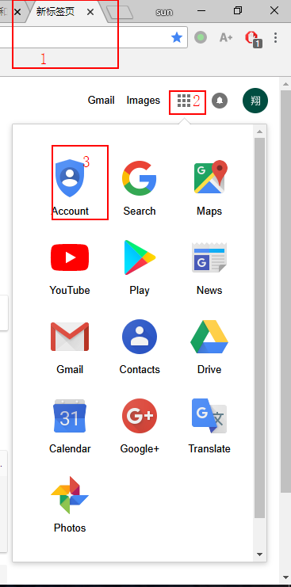
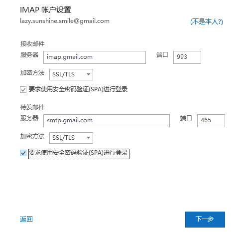

GMail与Outlook

GMail与Outlook

准备：GMail设置参考：https://support.google.com/mail/answer/7126229?hl=zh-Hans
1、在Gmail中获取密码

2、

3、

4、复制Windows计算机的应用专用密码

5、打开outlook，然后点击文件>>添加账户

6、输入Gmail账户，打开高级选项，勾选让我手动设置我的账户

7、选择Google，密码输入4中生成的密码，点击连接。等待完成。

8、如果不行，点击更改账户设置，勾选两个多选框（连接的时候注意开VPN）

9、再不行，走下面的方法：

安装 Fiddler：
1、Shadowsocks设为全局或PAC模式
2、下载安装Fiddler
3、打开Tools —— Win8 Lookback Exemptions
4、如果懒，可以Exemption All —— Save Changes，但是这样安全性会差点
可以选择需要的 App 走Loopback，如果只考虑邮件和日历，开启以下3个 App 的 Lookback 流量代理就可以正常访问谷歌账号了：
* microsoft.windows.authhost.a_8wekyb3d8bbwe
* 电子邮件和账户
* 邮件和日历

10、再不行，我也没办法了