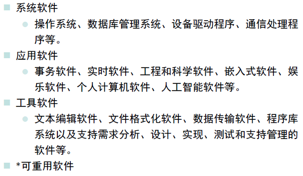
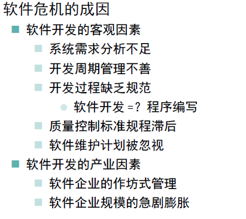

概念 | 必知的软件工程核心概念

## 软件概念

软件 = 程序 \+ 数据 \+ 文档 \+ （服务）

程序 = 数据结构 \+ 算法

1. 软件是能够完成预定功能和性能的、可执行的计算机指令；  
2. 软件是使得程序能够适当地处理信息的数据结构；  
3. 软件是描述程序的操作和使用的文档。

## 软件的逻辑抽象性

软件是一种逻辑实体，具备知识性的产品集合，是对物理世界的一种抽象化，同时又是一种人脑智力的成果，开发成本昂贵但可以复制。

而软件问题都是在软件开发和修改过程中引入的，开发工作仍未完全摆脱手工作坊式的低效开发方式。软件测试则是为了最小化软件问题和风险。

## 软件分类

## 软件产品的组成

## 软件危机

## 软件开发基本过程

1.  软件计划，确定产品定位和目标人群。
2.  软件需求分析：根据客户需求，制定客户需求的产品功能，特性，性能，界面和具体规格。
3.  根据需求进行设计：概要设计和详细设计。
4.  编程实现并运行。
5.  软件测试：确认用户需求，对设计和实现结果进行验证。
6.  维护：维持软件运行，修改软件缺陷，增强完善功能，不断迭代软件版本。

## 软件开发成本

## 软件工程要点

## 软件工程原则

## 软件工程目标

## 软件开发方法

## 软件生命周期

### 可行性分析与计划阶段

- 确定软件开发的总体目标，给出功能，性能，可靠性以及接口方面的要求，完成可行性分析。
- 估计软件开发所需要利用的各种资源，效益，成本，开发进度，制定开发计划
- 提交可行性分析报告，开发计划文档。

### 需求分析阶段

- 分析用户提出的要求，给出需求详细定义，确定软件系统的各项功能，性能需求和设计约束，确定对文档编制的要求。
- 提交软件需求说明，软件规格说明，数据要求说明等文档和初步用户手册。

### 设计阶段

- 概要设计：把各项需求转换成软件的体系结构，结构中的每一部分都是意义明确的模块，每个模块与某些需求对应/
- 详细设计：对每个模块所完成的工作进行具体的描述，提供源程序编写的直接依据。
- 提交结构设计说明，详细设计说明和测试计划初稿等文档。

### 实现阶段

- 完成源代码的编码实现。保证程序结构良好，清晰易读，与设计一致。
- 编写进度日报，周报和月报（取决于项目的重要性和规模）
- 提交用户手册，操作手册等面向用户的文档编写工作
- 提交测试计划

### 测试阶段

- 全面测试目标软件系统，检查审阅与编制的文档，提交测试分析报告。逐项评价所生产的程序，文档以及开发工作本身，提交项目开发总结报告。
- 开发过程中（前5阶段），开发集体需要按月编写开发进度月报。

### 运行与维护阶段

- 软件提交给用户后，在运行使用过程中得到持续维护，根据用户的新需求进行必要的软件修改和升级。
- 软件维护包括正性维护（发现错误），适应性维护（适应运行环境变化）和完善性维护（增强功能）

## 软件生命周期模型SDM

### 常见模型

### 瀑布模型

瀑布模型中的每一个开发活动具有下列特征：

- 本阶段活动的工作对象来自于上一项活动的输出，这些输出一般是代表本阶段活动结束的里程碑式的文档

- 根据本阶段的活动规程执行相应的任务
    
- 本阶段活动产出相关的软件工件，作为下一阶段活动的输入。
    
- 对本阶段活动执行情况进行评审
    
    ​
    

瀑布模型的优点：

- 降低软件开发的复杂程度，提高软件开发过程的透明性，提高软件开发过程的可管理性
- 推迟软件实现，强调在软件实现前必须进行分析和设计工作
- 以项目的阶段评审和文档控制为手段有效地对整个开发过程进行指导，保证了阶段之间的正确衔接，能够及时发现并纠正开发过程中存在的缺陷，使产品达到预期的质量要求

瀑布模型的缺点：

- 强调过程活动的线性顺序
- 缺乏灵活性，特别是无法解决软件需求不明确或不准确的问题
- 风险控制能力较弱
- 瀑布模型中的软件活动是文档驱动的，当阶段之间规定过多的文档时，会极大地增加系统的工作量
- 管理人员如果仅仅以文档的完成情况来评估项目完成进度，往往会产生错误的结论

### V-W模型

W 模型是V 模型的演进

- 在V 模型中增加软件各开发阶段对应同步进行的测试。
- W 模型中开发是一个“V”型，测试是与此并行的另一个“V”型。基于“尽早地和不断地进行软件测试”的原则，在软件的需求和设计阶段的测试活动遵循IEEE1012-1998《软件验证与确认(V&V)》。
- W 模型强调测试伴随着整个软件开发周期，而且测试的对象不仅仅是程序，需求、功能和设计同样要测试。测试与开发是同步进行的，从而有利于尽早地发现问题。

### 快速应用开发模型

（前端应用常用）

**以上都为线性开发模型**

### 原型模型（重点）

问题产生 → 用户痛点 → 产生需求 ↓

—– 设计原型 —— 实现并实现模型：

if 原型 exist problems， then 修改加强 （伴随新的需求）

else 转为可用于生产环境的软件发行版本

所有的新技术，需要使用原型法来试验。

**原型与原型方法**

- 原型指模拟某种最终产品的原始模型
- 原型方法指在获得一组基本需求后，通过快速分析构造出一个小型的软件系统原型，满足用户的基本要求
- 用户通过使用原型系统，提出修改意见，从而减少用户与开发人员对系统需求的误解，使需求尽可能准确
- 原型方法主要用于明确需求，但也可以用于软件开发的其他阶段

**原型方法的三种作用类型**

- 探索型
    - 澄清用户对目标系统的要求，确定用户期望的特性；探讨多种实现方案的可行性。主要针对需求模糊、用户和开发者对目标项目开发都缺乏经验的情况。
- 实验型
    - 用于大规模开发和实现之前，考核技术实现方案是否合适、分析和设计的规格说明是否可靠。
- 进化型
    - 在构造系统的过程中适应需求的变化，通过不断改进原型，逐步将原型进化成最终的系统。它将原型方法的思想扩展到软件开发的全过程，适用于需求经常变动的软件项目。

**原型策略**

**原型方法与软件生命周期的联系！！**

> Last updated: 2019-03-08 14:30:22  
> Thanks for your reading :) | URL [https://joshuaqyh.github.io/2019/03/01/软件工程-核心概念/](https://joshuaqyh.github.io/2019/03/01/%E8%BD%AF%E4%BB%B6%E5%B7%A5%E7%A8%8B-%E6%A0%B8%E5%BF%83%E6%A6%82%E5%BF%B5/)