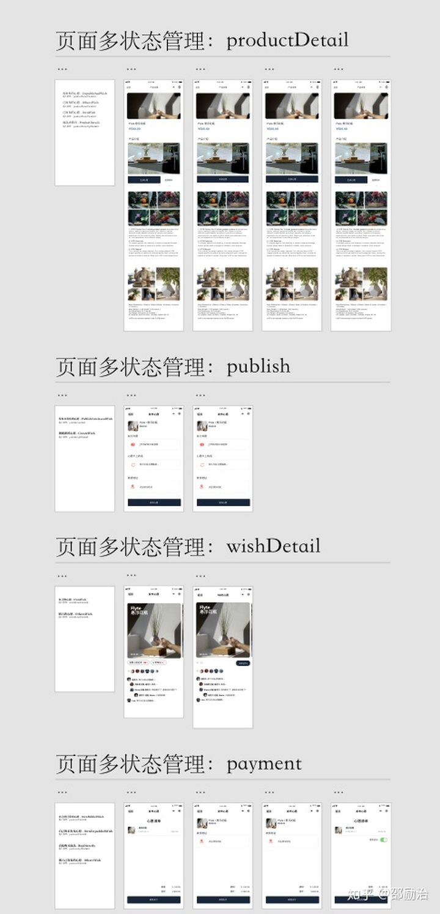

面试前的准备......一些编程外的软技能

## 前言：面试要求

我们的技术面试会涉及到算法、数据结构和系统设计，面试前需要你做的准备具体如下：

- 结合实际项目经验回顾软件工程的知识，例如：如何从需求推导出系统设计，如何衡量两个不同设计的优劣，如何在各种限制下（人员、时间、资源等）选择其中更合适的设计，以及提升该设计的可拓展性等。
- 在白板上练习算法题目，写出清晰、简洁、bug free的代码, 并衡量时间和空间复杂度以及可能存在的副作用。
- 尝试用不同的方法, 思路或数据结构去解决同一个问题，并且衡量不同解法之间的优劣。
- 我们需要你掌握面试岗位对应的技术领域相关知识，还需要对简历上所罗列的知识有深入的理解。

## 一、如何从需求推导出系统设计

### 一般我的工作流程是这样子的：

1.  需求采集
2.  功能细化，根据需求制作功能思维导图
3.  根据功能思维导图，制作 feature list
4.  根据 feature list、人员 确定排期（与报价）
5.  根据排期进行敏捷开发，一周一次会。
6.  持续集成、持续部署

### 软件工程上我一般喜欢使用一个思想去理解软件：三层架构模型

- 数据层
- 视图层
- 逻辑层

### 如果用 MVVM 来描述的话：

- Model 层
- View 层
- ViewModel 层

### 简单的说这三层是解藕的，也就是说，每一层是可以单独进行单元测试的：

- 数据层：解决 fetchData 的问题 - 网络请求、IO 操作等
- 视图层：解决 UI 显示问题 - 交互、动画、逻辑控制
- 逻辑层：解决逻辑问题 \- 初始化、响应用户操作

### 为什么要这么做呢？我认为理论指导是关注点分离（SoC）：

[应用架构指南 | Android Developers​developer.android.google.cn](https://link.zhihu.com/?target=https%3A//developer.android.google.cn/jetpack/docs/guide)

我比较推崇看上面这篇文章，是 Google 的应用架构指南，我当年做 Android 工程师的时候拜读过，受益匪浅。

### 然后基本上设计流程就是：

1.  实现视图层
2.  设计后端数据库
3.  实现数据层
4.  实现逻辑层
5.  review 下当前页面的状态机，检查逻辑层是否写全

### 状态机（Finite State Machine）是什么？

状态机有三个属性：输入、状态、输出

**我很喜欢把状态机对应为视图层的一个页面**，如：

1.  Android 研发的一个 Fragment
2.  Vue 研发的一个 Component
3.  小程序研发的一个 Page

然后把输入视作该页面的传入参数。

把输出视作该页面的表现形式，如：

- 点击事件后的视图层
- 初始化之后的视图层

等等....

### 只要状态机是完整的，逻辑层就是完整的，如图：（我绘制的「状态机」）

## 二、如何写算法题目

..........详见下一篇文章————《JavaScript 基础知识与算法》

## 三、用不同方法解决同一个问题，并衡量利弊

大人才看利弊，小孩子只分好坏！

我衡量问题的就两点：

1、代码可读性

2、时间复杂度与空间复杂度

也就是说，首先你的代码得能让人读懂了。

**别又臭又长，你的同事和你自己都是人，别把他们当成词法分析器。**

第二你的代码别卡死了用户的手机，占满了用户的空间。

**你是写程序呢，不是写病毒呢。**

## 四、简历上罗列的内容有深入的了解

我的简历上包括了如下我只是简单涉猎过的知识：

1.  人工智能：拿过一次人工智能比赛冠军。
2.  electron：压根没编过，但是我觉得这都是一回事儿，一会儿可以跑个demo
3.  flutter：跑过demo
4.  android：这倒是随便考，在下 Android 起家
5.  后端：ServerLess 一把梭！甭管什么需求，先定是什么数据表，1:N、N:N、1:1 都是 OJBK 的。
6.  ios：跑过 demo
7.  vue：写过项目
8.  小程序：写了很多项目
9.  设计、产品：这个倒是随便考，老子创业圈混这么多年（2年），产品好坏还是分的清的（就是止不住自己做出大sb产品）。